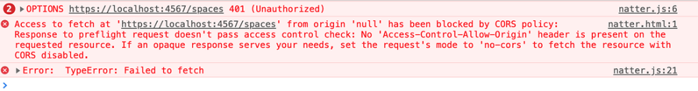
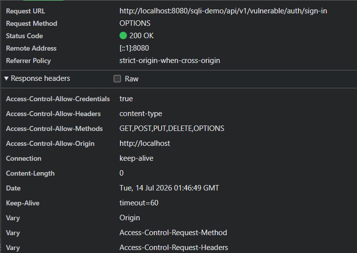

# SOP và CORS

## Tài liệu tham khảo
[Chuongcd: SOP và CORS](https://hackmd.io/@chuongcd/cors)

[Quochung.cyou: SOP à CORS](https://quochung.cyou/same-origin-policy-sop-va-cross-origin-re-source-sharing-cors/#Same-origin_policy_SOP_va_Cross-Origin_Re-source_Sharing_CORS)

[Cleargate.com: SOP and CORS](https://www.clear-gate.com/blog/sop-vs-cors/)

[MDN Web Docs: CORS](https://developer.mozilla.org/en-US/docs/Web/HTTP/CORS)


## Bố cục nội dung

```
CƠ CHẾ BẢO MẬT TRÌNH DUYỆT (SOP & CORS)

├── 1. MÔ HÌNH BẢO MẬT TRÌNH DUYỆT (BROWSER SECURITY MODEL)
│   ├── 1.1. Khái niệm Sandbox
│   ├── 1.2. Cơ chế cô lập 
│   └── 1.3. Ranh giới bảo mật 
├── 2. CHÍNH SÁCH ĐỒNG NGUỒN (SAME-ORIGIN POLICY - SOP)
│   ├── 2.1. Định nghĩa cấu trúc Origin
│   ├── 2.2. Phân biệt Đồng nguồn và Khác nguồn (Same/Cross Origin)
│   ├── 2.3. Cơ chế bảo vệ của SOP
│   └── 2.4. Giới hạn của SOP 
├── 3. CƠ CHẾ CHIA SẺ TÀI NGUYÊN KHÁC NGUỒN (CORS)
│   ├── 3.1. Mục đích ra đời 
│   ├── 3.2. Luồng xử lý dữ liệu 
│   ├── 3.3. Simple Request
│   ├── 3.4. Yêu cầu kiểm tra trước (Preflight Request)
│   └── 3.5. Ý nghĩa chi tiết các HTTP Headers
├── 4. CÁC LỖI CẤU HÌNH CORS PHỔ BIẾN
│   ├── 4.1. Origin Reflection
│   ├── 4.2. Lạm dụng Wildcard
│   ├── 4.3. Kết hợp Origin Reflection và Credentials
│   ├── 4.4. Null Origin
│   └── 4.5. Tin tưởng Subdomain sai lầm
└── 5. PHÂN TÍCH AN NINH MẠNG (SECURITY ANALYSIS)
    ├── 5.1. Khi nào CORS Misconfiguration trở thành lỗ hổng
    ├── 5.2. Điều kiện khai thác thành công
    └── 5.3. Tác động của lỗ hổng
```

##  Mô hình bảo mật trình duyệt

### Sandbox
- Trình duyệt web là môi trường thực thi các đoạn mã không đáng tin cậy từ internet. Để bảo vệ máy tính của người dùng, trình duyệt sử dụng cơ chế Sandbox.
- Sandbox có một số chức năng sau:
    - Giới hạn quyền hạn của mã Javascript (đọc tùy ý trên máy, truy cập process khác, đọc DOM của origin khác).
    - Cô lập toàn bộ môi trường web (giới hạn quyền truy cập của website với tài nguyên ngoài phạm vi được cấp phép: hệ thống file, phần cứng, API, các process khác).
- Khi dùng sandbox, mã nguồn chạy trong tab trình duyệt không thể tự ý truy cập hệ thống tệp tin cục bộ, không thể tương tác trực tiếp với phần cứng hoặc can thiệp vào các tiến trình khác đang chạy trên hệ điều hành.

### Cơ chế cô lập
- Trình duyệt hiện đại sử dụng cơ chế Process Isolation và Site Isolation để cô lập các website khác nhau.
- Mỗi website có thể được thực thi trong môi trường bộ nhớ riêng biệt nhằm hạn chế việc một website truy cập hoặc ảnh hưởng tới dữ liệu của website khác.
- Trình duyệt cô lập bộ nhớ của từng trang web nhằm đảm bảo trang web này không thể đọc hoặc ghi đè lên dữ liệu bộ nhớ của trang web khác.

### Ranh giới bảo mật
- Ranh giới bảo mật được thiết lập để phân định quyền hạn giữa người dùng, trình duyệt và máy chủ. 
- Khi một trang web cố gắng vượt qua ranh giới này để truy cập tài nguyên không được phép, trình duyệt sẽ ngay lập tức ngăn chặn hành vi đó để bảo vệ tính toàn vẹn của dữ liệu người dùng.

## Origin

### Định nghĩa cấu trúc Origin
- Origin dùng để xác định nguồn gốc của một tài nguyên web.
- Trình duyệt dùng origin để quyết định hai website có được phép tương tác với nhau hay không.
- Một Origin được định nghĩa bằng sự kết hợp bắt buộc của ba yếu tố cấu thành bao gồm: Giao thức, Tên miền và Cổng dịch vụ.
- Ví dụ xét URL gốc: https://ptit.edu.vn:443/index.html
    - Giao thức là https
    - Tên miền là ptit.edu.vn
    - Cổng dịch vụ là 443
    - index.html không thuộc origin

### Origin và URL
Origin khác URL
- Ví dụ: https://example.com:443/account?id=10

- Origin là: https://example.com:443

- URL là: https://example.com:443/account?id=10 (URL chứa cả origin, path và query params)

### Origin và Cookie

Cookie và Origin là hai cơ chế định danh khác nhau. Cookie quyết định phạm vi gửi dữ liệu xác thực, trong khi Origin được Browser sử dụng để kiểm soát quyền truy cập giữa các website.

Cho ví dụ sau:

Cookie: Domain=.example.com có thể được gửi tới các trang:
```
www.example.com
api.example.com
admin.example.com
```
Nhưng đối với JavaScript: https://www.example.com và https://api.example.com vẫn là khác Origin. Đây là lý do có các vấn đề như:
- CORS Misconfiguration
- Subdomain Trust
- Cookie Scope Issue

### Origin Header trong HTTP Request

Trình duyệt thường thêm header Origin trong các request có khả năng gây ảnh hưởng đến dữ liệu cross-origin, đặc biệt là các request được tạo bởi Fetch API, XMLHttpRequest và các request thay đổi trạng thái như POST, PUT, DELETE.

Ví dụ với request sau:
```
fetch("https://api.example.com/profile", {
    credentials:"include"
})
```
Browser tự thêm:
```
GET /profile HTTP/1.1
Host: api.example.com
Origin: https://attacker.com
```
Server có thể kiểm tra Origin được gửi lên và quyết định có trả về CORS Header hay không.

Sau khi nhận Response, Browser sẽ kiểm tra Access-Control-Allow-Origin.
```
Access-Control-Allow-Origin: https://attacker.com
```
- Nếu giá trị hợp lệ, Browser cho phép JavaScript đọc Response.

- Nếu không hợp lệ, Browser chặn quyền truy cập Response từ JavaScript.

## Chính sách đồng nguồn (Same-Origin Policy - SOP)

Đôi khi, khi thực hiện các lệnh trong Javascript trên trình duyệt, có thể gặp lỗi dưới đây


```
“Access to fetch at xxx from origin null has been blocked by CORS policy: Response to preflight request doesn’t pass access control check: No ‘Access-Control-Allow-Origin’ header is present on the requested resource. If an opaque response serves your needs, set the request’s mode to ‘no-cors’ to fetch the resource with CORS disabled.
```

 trình duyệt mặc định chỉ cho phép JavaScript gửi các HTTP request về phía server ở cùng một nguồn với chỗ mà script được load. Điều này được quy định bởi same-origin policy

### Phân biệt đồng nguồn và khác nguồn (Same/Cross Origin)
- Hai URL được coi là đồng nguồn khi và chỉ khi tất cả ba thành phần nêu trên trùng khớp hoàn toàn. Nếu có bất kỳ một thành phần nào thay đổi, trình duyệt sẽ phân loại chúng thành khác nguồn.
- Ví dụ so sánh với URL gốc http://example.com:80:
    - http://example.com/api là đồng nguồn vì cổng mặc định của http là 80.

    - https://example.com là khác nguồn do khác biệt về giao thức.

    - http://api.example.com là khác nguồn do khác biệt về tên miền.

    - http://example.com:8080 là khác nguồn do khác biệt về cổng dịch vụ.

### Cơ chế bảo vệ của SOP
SOP kiểm soát quyền truy cập giữa các nguồn theo các quy tắc nghiêm ngặt:
- Cho phép một số loại request hoặc tài nguyên được gửi/tải từ nguồn khác: có thể chèn hình ảnh bằng thẻ img hoặc gửi biểu mẫu bằng thẻ form sang một trang web khác nguồn.
    - Lưu ý rằng thẻ form (HTML Form) có thể gửi đi nhưng JS không đọc được kết quả phản hồi. Đây chính là lỗ hổng có thể dẫn đến cuộc tấn công CSRF (sẽ được tìm hiểu sau).
- Ngăn chặn đọc dữ liệu khác nguồn: mã JavaScript sử dụng Fetch API ở một trang web khác nguồn không thể đọc được nội dung phản hồi từ máy chủ nếu không có sự cho phép đặc biệt.

### Giới hạn của SOP
- SOP chỉ là cơ chế bảo vệ ở phía trình duyệt dựa trên mã kịch bản client-side. 
- SOP không ngăn chặn việc máy chủ tiếp nhận và xử lý yêu cầu, mà chỉ ngăn chặn mã JavaScript đọc kết quả trả về. Do đó, SOP hoàn toàn bất lực trước các cuộc tấn công không cần đọc dữ liệu phản hồi từ máy chủ.

## Chia sẻ tài nguyên khác nguồn (CORS)

### Mục đích ra đời
- Trong kiến trúc phần mềm hiện đại, ứng dụng Frontend thường chạy ở một nguồn riêng biệt với Backend API. 
- Để cho phép các ứng dụng khác nguồn có thể trao đổi dữ liệu một cách hợp pháp mà không bị SOP chặn lại, cơ chế CORS được sinh ra.
- CORS là cơ chế cho phép server khai báo các Origin được phép truy cập dữ liệu thông qua Browser.
- CORS không ngăn request được gửi tới server. Nó chỉ quyết định Browser có cho phép JavaScript đọc nội dung response hay không.

### Luồng CORS
- Khi có một yêu cầu khác nguồn, Browser kiểm tra đặc điểm của request để xác định request có cần Preflight hay không.
- Sau khi nhận response từ server, Browser sử dụng các CORS Header để quyết định JavaScript có được phép đọc dữ liệu hay không.
- Các yếu tố của request được sử dụng để browser xác định có gửi Preflight requests hay không: 
    ```
    Method
    Headers
    Content-Type
    ```
- Ngoài ra Browser quản lý Credentials mode để xác định có gửi thông tin xác thực cross-origin hay không.

### Simple Request
- Một yêu cầu được coi là đơn giản khi thỏa mãn các điều kiện sau:
    - Sử dụng giao thức: GET, POST, HEAD
    - Header chỉ được phép sử dụng các CORS-safelisted headers:
        ```
        Accept
        Accept-Language
        Content-Language
        Content-Type
        Connection (header tự set)
        User-Agent (header tự set)
        ```
    - Content-Type chỉ sử dụng (thuộc nhóm MIME type cho phép):
        ```
        application/x-www-form-urlencoded
        multipart/form-data
        text/plain
        ```
- Trình duyệt sẽ gửi thẳng yêu cầu này đến máy chủ. 
- Khi nhận được phản hồi, trình duyệt sẽ đọc tiêu đề cấu hình bảo mật để quyết định cho phép mã JavaScript tiếp cận dữ liệu hay không.

### Yêu cầu kiểm tra trước (Preflight Request)

- Khi yêu cầu chứa các phương thức như PUT, DELETE hoặc định dạng dữ liệu phức tạp như JSON, trình duyệt sẽ tự động gửi một gói tin kiểm tra bằng phương thức OPTIONS trước khi gửi dữ liệu thật. 
- Nếu máy chủ phản hồi cho phép, trình duyệt mới tiếp tục gửi yêu cầu chính thức. => Đảm bảo tính bảo mật và an toàn khi giao tiếp giữa các tài nguyên khác nhau.

### Ví dụ
Client gửi request:
```
fetch("https://api.example.com/user", {
    method:"POST",
    headers:{ "Content-Type":"application/json" }
})
```
Browser thấy: POST + application/json => Không phải Simple Request => Gửi Preflight.

### Ý nghĩa chi tiết các HTTP Headers
| CORS Header | Response | Description |
|---|---|---|
| Access-Control-Allow-Origin | Both | Chỉ ra Origin (nguồn) được phép truy cập tài nguyên. Giá trị `*` cho phép mọi nguồn truy cập (thường chỉ phù hợp với dữ liệu công khai). |
| Access-Control-Allow-Headers | Preflight | Xác định các HTTP header tùy chỉnh được phép xuất hiện trong request thật. Giá trị `*` cho phép mọi header (không áp dụng trong mọi trường hợp với credentials). |
| Access-Control-Allow-Methods | Preflight | Xác định các HTTP method được phép sử dụng trong request thật. Giá trị `*` cho phép mọi method. |
| Access-Control-Allow-Credentials | Both | Xác định Browser có được phép gửi thông tin xác thực trong cross-origin request hay không. Các thông tin này có thể bao gồm Cookie, HTTP Authentication hoặc TLS client certificate. Nếu giá trị là `true`, `Access-Control-Allow-Origin` không được phép sử dụng giá trị `*`. |
| Access-Control-Max-Age | Preflight | Xác định thời gian (tính bằng giây) Browser được phép cache kết quả của Preflight request. Cache này áp dụng cho các header và HTTP method đã được server cho phép. |

- Both tức là header này có thể tồn tại ở các phản hồi từ server khi nhận request thực sự (actual) và cả request preflight. 
- Nếu là actual tức là header chỉ tồn tại ở phản hồi từ server khi nhận actual request (request thật)
- Preflight nghĩa là header chỉ tồn tại ở phản hồi từ server khi nhận preflight request.

## Các lỗi cấu hình CORS phổ biến (CORS Misconfiguration)
### Origin Reflection
Lỗi xảy ra khi server phản chiếu giá trị Origin từ request vào Access-Control-Allow-Origin mà không thực hiện kiểm tra whitelist.

Nếu kết hợp với Credentials và các API chứa dữ liệu nhạy cảm, website độc hại có thể đọc được dữ liệu của người dùng đang đăng nhập.

### Lạm dụng Wildcard (dấu *)

```
Access-Control-Allow-Origin: * 

không thể sử dụng đồng thời với:

Access-Control-Allow-Credentials: true

Nếu cố chèn, Browser sẽ không cho phép JavaScript đọc response.
```
Cấu hình sử dụng wildcard nhằm cho phép tất cả các nguồn truy cập dữ liệu công cộng công khai. 

Tuy nhiên lỗi nghiêm trọng xảy ra khi hệ thống cần bảo mật dữ liệu người dùng nhưng lại cấu hình lạm dụng ký tự này.

### Kết hợp Origin Reflection và Credentials
Theo đặc tả kỹ thuật, trình duyệt sẽ chặn đứng việc sử dụng đồng thời dấu sao kết hợp với giá trị true của định danh. 

Lập trình viên thường vượt qua cơ chế chặn này bằng cách kết hợp giải pháp Origin Reflection với định danh credentials, tạo ra lỗ hổng bảo mật nghiêm trọng cho phép website bên thứ ba đọc dữ liệu nhạy cảm của người dùng đang đăng nhập.

### Null Origin
Attacker có thể lợi dụng các context khiến Browser sinh ra Origin: null, sau đó khai thác nếu server tin tưởng Origin này.

### Tin tưởng Subdomain sai lầm 
Hệ thống máy chủ sử dụng các biểu thức chính quy viết sai cấu trúc để kiểm tra nguồn, ví dụ như chỉ kiểm tra chuỗi ký tự có chứa tên miền chính hay không. 

Điều này dẫn đến việc máy chủ chấp nhận các nguồn độc hại hoặc các tên miền con đã bị chiếm quyền điều khiển.

Ví dụ: với domain https://dev.example.com

Nếu dev.example.com bị takeover, server tin tưởng *.example.com thì attacker có thể lợi dụng.

## Phân tích an ninh mạng

### Khi nào CORS Misconfiguration nguy hiểm?

CORS lỗi không phải lúc nào cũng là vulnerability. Nó trở nên nguy hiểm trong các trường hợp sau:

1. API chứa dữ liệu nhạy cảm

    Ví dụ:
    - /profile
    - /account
    - /payment
    - /settings

2. Có sử dụng Cookie hoặc Authentication
3. Browser cho phép JavaScript đọc response
4. Không có cơ chế bảo vệ bổ sung:
   - CSRF Token
   - SameSite Cookie
   - Origin validation

### Điều kiện khai thác thành công
Quá trình khai thác lỗ hổng cấu hình sai CORS đòi hỏi phải đáp ứng các điều kiện thực tế sau:

- Nạn nhân đã thực hiện đăng nhập thành công vào hệ thống mục tiêu và vẫn đang duy trì một phiên làm việc (Session) hợp lệ trên trình duyệt.
- Kẻ tấn công lừa được nạn nhân truy cập vào một liên kết hoặc một trang web độc hại do kẻ tấn công hoàn toàn kiểm soát mã nguồn trong khi phiên làm việc trên vẫn còn hiệu lực.

### Ảnh hưởng của CORS Misconfiguration:
- Data leakage
- Exposure of user information
- Account information disclosure

## Kiểm tra CORS bằng Burp Suite

1. Gửi request bình thường
    ```
    GET /api/profile
    ```
    Quan sát:
    ```
    Access-Control-Allow-Origin
    ```
2. Thay đổi Origin:
    ```
    Origin: https://evil.com
    ```
3. Kiểm tra response: Orign reflection không?
4. Kiểm tra Credentials: Access-Control-Allow-Credentials: true
5. Kiểm tra endpoint nhạy cảm:
    ```
    /profile
    /account
    /payment
    /settings
    ```