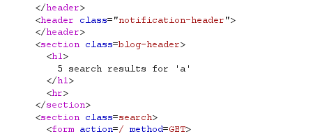
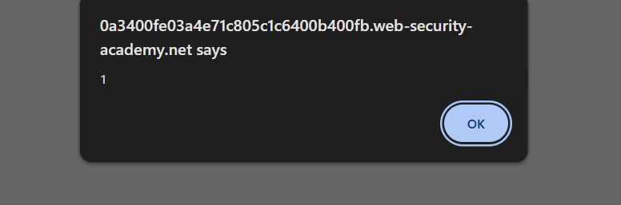
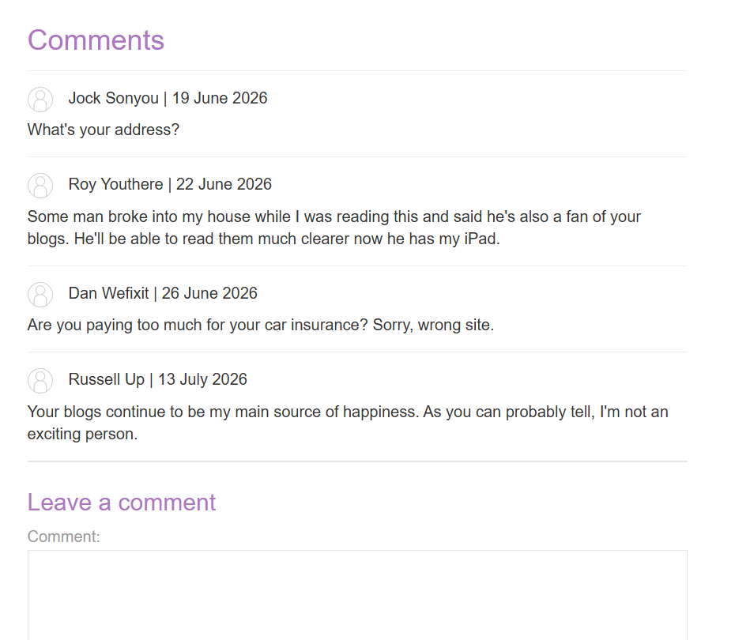
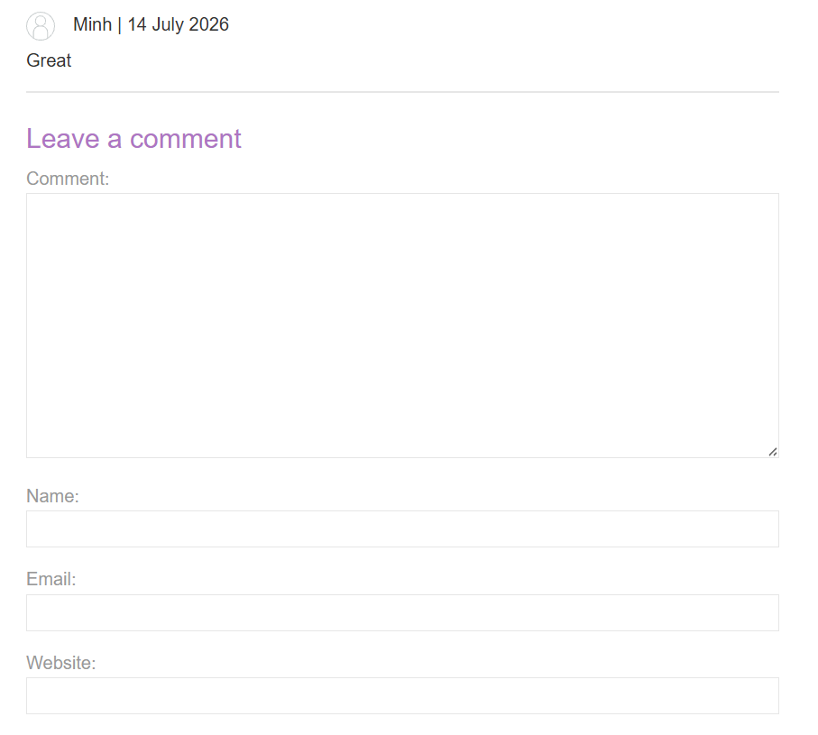
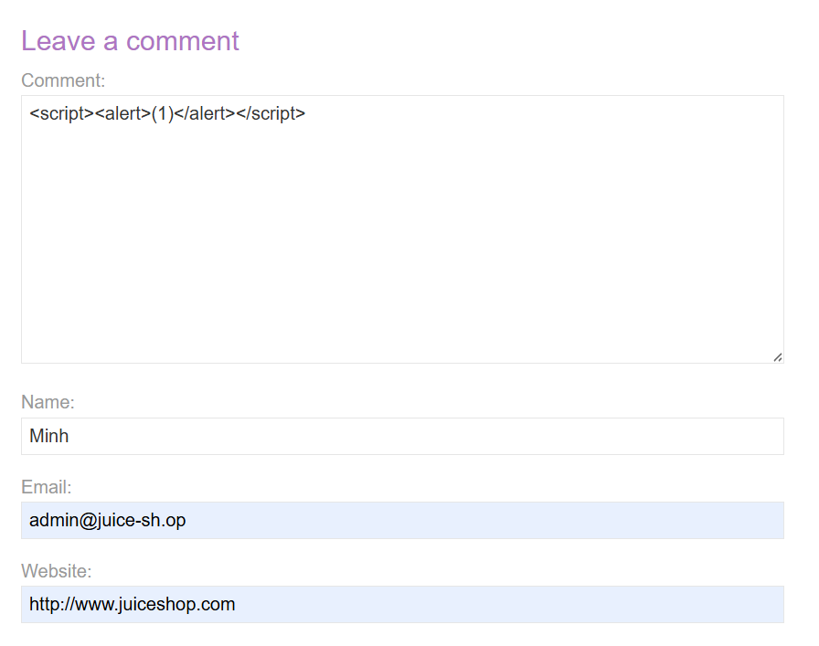
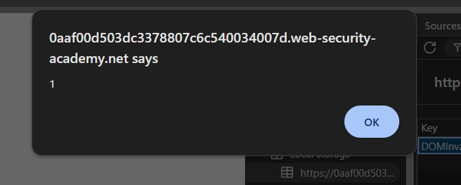
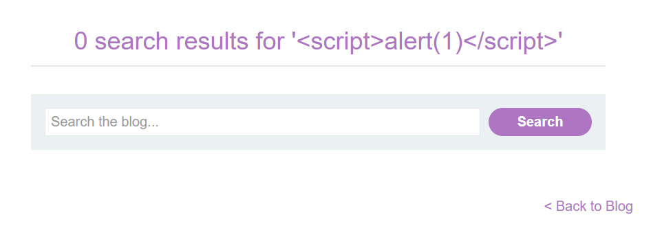
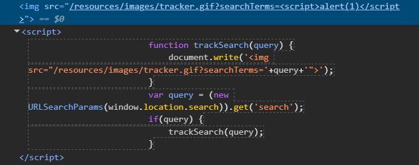
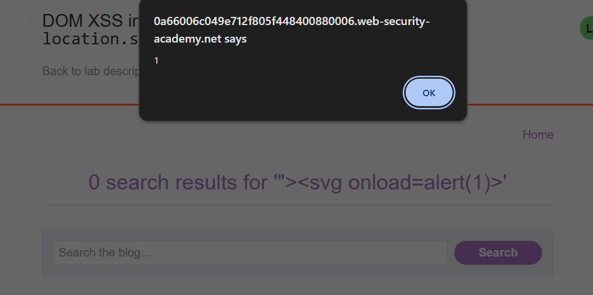

# Thực hành tấn công XSS với Port Swigger

## Nhóm bài tập mở đầu

### Bài tập 1: Reflected XSS vào HTML context không mã hóa

Điểm tấn công là một trang blog. Trang này có một ô tìm kiếm.


1. Xác định điểm nhập dữ liệu -> Ở đây là ô tìm kiếm
2. Kiểm tra điểm dữ liệu có được dùng lại ở đâu đó hay không.

   Nhập một chuỗi đơn giản. Ví dụ: a, rồi quan sát kết quả

   

   Nhận thấy 'a' được hiển thị lại trong dòng đếm kết quả ngay sau khi tra cứu

   Xác định được đây có khả nẵng là điểm tấn công XSS (cụ thể là Reflected XSS, vì từ tìm kiếm được xuất hiện lại trong trang khác.)
3. Xác định context của dữ liệu được render (làm thế nào để nhận biết, có thể xem Task 3.2)

   Dùng Burp Suite gửi request tìm kiếm blog chứa từ 'a'.

   Response cho thấy ký tự 'a' được render vào thẻ h1 => Context là HTML Context (dữ liệu nằm giữa 2 cặp thẻ)

   
4. Kiểm tra khả năng thực thi XSS

   Thực hiện chèn scrip vào input

   ```JavaScript
   <script><alert>(1)</alert></script>
   ```

   Kết quả thu được -> alert hiện ra -> đã chèn script tấn công XSS thành công

   

### Bài tập 2: Stored XSS vào HTML context không mã hóa

Điểm tấn công là một trang blog, chưa danh sách các bài post. Mỗi bài post có một nút xem chi tiết


1. Chọn một bài post bất kỳ, nhấn view post để xem chi tiết bài post. Sau đó, trang chi tiết bài post xuất hiện, cuối trang có các review của người đọc và một số ô input

   
2. Thực hiện viết 1 mẩu review bình thường, sau đó gửi đi. Ngay sau đó, thông báo cảm ơn hiển thị, chọn quay lại bài post. Review vừa nhập sẽ xuất hiện.

   

   => Xác nhận các input có khả năng là điểm tấn công XSS
3. Thực hiện chèn lệnh tấn công vào ô comment, các input còn lại vẫn nhập đầy đủ, sau đó gửi đi.

   

   ```JavaScript
   <script><alert>(1)</alert></script>
   ```

   Sau khi gửi review, website chuyển hướng sang trang cảm ơn. Thực hiện bấm quay lại trang post. Ngay sau đó, alert sẽ hiển thị ra -> Đã chèn script tấn công XSS thành công

   

### Bài tập 3: DOM XSS trong document.write sink dùng source location.search

Điểm tấn công là một trang blog, có ô tìm kiếm bài blog theo từ khóa


1. Xác định điểm nhập dữ liệu -> Ở đây là ô tìm kiếm
2. Kiểm tra điểm dữ liệu có được dùng lại ở đâu đó hay không.

   Nhập một chuỗi đơn giản. Ví dụ: a, rồi quan sát kết quả

   

   Nhận thấy 'a' được hiển thị lại trong dòng đếm kết quả ngay sau khi tra cứu
3. Thực hiện tấn công

   Thử thực hiện chèn script trực tiếp vào input

   

   Kết quả trả về như trên (script không chạy)=> Không thể chèn qua HTML context => Cần inspect file HTML.

   Khi inspect file HTML, tìm thấy đoạn mã sau

   

   ```HTML
   alert(1)</script>">
   ```

   ```Javascript
   function trackSearch(query) {
       document.write('');
   }
   var query = (new URLSearchParams(window.location.search)).get('search');
   if(query) {
       trackSearch(query);
   }
   ```

   - Source

     ```
     var query = (new URLSearchParams(window.location.search)).get('search')
     ```

     Query lấy dữ liệu từ: ?search=... Đây là source.
   - Sink

     ```HTML
     document.write(
         ''
     );
     ```

     Khi search=`test`, trình duyệt nhận được:

     ```HTML
     
     ```
   - Xác định Context: query đang nằm trong src="..." => Double-quoted HTML attribute context. (thuộc tính bọc trong dấu ngoặc kép)
   - Vì sao `<script>` không chạy?

     Nếu nhập ?search=`<script>alert(1)</script>`, HTML trở thành

     ```HTML
     alert(1)</script>">
     ```

     Trình duyệt hiểu đây chỉ là

     ```
     src = "/resources/images/tracker.gif?searchTerms=<script>alert(1)</script>"
     ```

     Toàn bộ `<script>` chỉ là chuỗi trong giá trị của src. Không có thẻ `<script>` nào được tạo.

     Nên, muốn XSS thì phải breakout khỏi attribute
4. Thực hiện tấn công XSS

   Ví dụ payload: `"><svg onload=alert(1)>` , HTML sẽ thành

   ```HTML
   
   <svg onload=alert(1)>
   ```

   Lúc này mới tạo được thẻ `<svg>` và chạy script trong thẻ (Lưu ý: parser sẽ tự đóng thẻ).

   

### Bài tập 4: DOM XSS trong innerHTML sink dùng location.search

- `element.innerHTML = "<h1>Hello</h1>"`
- innerHTML nhận 1 string
- Trình duyệt sẽ parse chuỗi này thành 1 component theo trình tự

```
"<h1>Hello</h1>"
        |
        v
   HTML Parser
        |
        v
DOM Node
        |
        v
<h1>Hello</h1>
```

- Kết quả DOM => h1 được chèn vào => nguy cơ XSS

```HTML
<div id="box">
    <h1>Hello</h1>
</div>
```

### Bài tập 5: DOM XSS trong HTML attribute bằng cách thay đổi thuộc tính DOM thông qua jQuery

- Không cần script thì XSS vẫn có thể xảy ra
- Thẻ <a></a>`<a>` có thuộc tính href. Href có thể nhận URL hoặc là đoạn lệnh javascript
- jQuery không phải nguyên nhân trực tiếp gây ra XSS. Nó chỉ là công cụ mà ứng dụng dùng để thao tác DOM.

  - Trong bài này, jQuery liên quan ở chỗ nó cung cấp hàm: `$(selector).attr(attributeName, value)` để thay đổi thuộc tính của phần tử HTML.
- Ví dụ code thuần JavaScript (không dùng jQuery): `document.getElementById("backLink").href = userInput;` hoặc: `document.querySelector("#backLink").setAttribute("href", userInput);` thì vẫn bị lỗi tương tự.
- Ví dụ:

```JavaScript
const userInput = "javascript:alert(document.cookie)";

document.getElementById("backLink").href = userInput;
```

DOM trở thành như dưới đây => có XSS

```JavaScript
<a id="backLink" href="javascript:alert(document.cookie)">
    Back
</a>
```

### Bài tập 6: DOM XSS in document.write sink using source location.search inside a select element

```HTML
<form id="stockCheckForm" action="/product/stock" method="POST">
  
      <input required="" type="hidden" name="productId" value="1">
  
      <script>
          var stores = ["London","Paris","Milan"];
  
          var store = (new URLSearchParams(window.location.search)).get('storeId');
          /* Lấy storeId (là queryParams) trực tiếp từ URL */

		  // Tạo thẻ select mới
          document.write('<select name="storeId">');
    
          // Nếu store (storeId tách được từ params) tồn tại -> thêm option có store trên query
          if(store) {
              document.write('<option selected>'+store+'</option>');
          }

		  
          for(var i=0;i<stores.length;i++) {
              if(stores[i] === store) {
                  continue;
              }
              // Các store còn lại vẫn lấy từ trong list ra
              document.write('<option>'+stores[i]+'</option>');
          }
          // Tạo thẻ select mới
          document.write('</select>');
      </script>
  
      <select name="storeId">
        <option>London</option>
        <option>Paris</option>
        <option>Milan</option>
      </select>
  
      <button type="submit" class="button">Check stock</button>
  
</form>
```
