# DVWA: File upload

## Bố cục nội dung

```
DVWA - File Upload

1. Giới thiệu Lab
   ├── Mục tiêu của lab
   ├── Vai trò của DVWA trong bài học
   └── Mối liên hệ với multipart/form-data

2. Upload file bình thường
   ├── Upload một ảnh
   ├── Quan sát phản hồi
   └── Xác định nơi file được lưu

3. Bắt request upload bằng Burp Suite
   ├── Bật Proxy / Intercept
   ├── Chặn request upload
   └── Quan sát request trong Burp

4. Phân tích request multipart
   ├── Request line
   ├── Header
   ├── Boundary
   ├── Text part
   ├── File part
   └── Binary data

5. Mapping request sang PHP
   ├── Multipart parser
   ├── $_POST
   ├── $_FILES
   ├── tmp_name
   └── move_uploaded_file()

6. Thí nghiệm sửa request và quan sát response
   ├── Đổi filename
   ├── Đổi Content-Type
   ├── Xóa Content-Type
   ├── Thay đổi binary data
   ├── Xóa filename
   └── Xóa user-token

7. Tổng kết pipeline upload file PHP
```

## Giới thiệu về lab file upload

Lab file upload trong DVWA là một bài thực hành giúp hiểu rõ cách web ứng dụng xử lý file từ client gửi lên server.

Trong mô hình này, người dùng sẽ upload một file qua form, sau đó server sẽ kiểm tra loại file, kích thước, MIME type và lưu trữ file vào thư mục nhất định. 

Đây là một ví dụ rất phù hợp để học về multipart/form-data, cách PHP nhận file thông qua `$_FILES`, cũng như cách attacker có thể thử thay đổi request để bypass kiểm tra.

## Upload file bình thường

### Quy trình thực hiện

Tại trang bài tập File Upload, thực hiện tải lên một file và bấm Upload

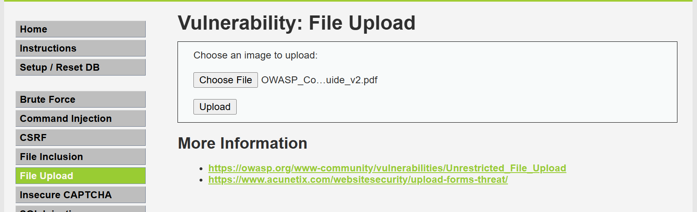

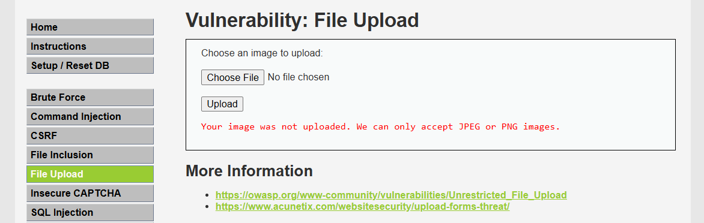

Nếu như upload file trống, hoặc upload file không phải ảnh, thông báo lỗi được hiển thị ra: `Chỉ chấp nhận JPEG hoặc PNG`

Sau khi upload một file ảnh, thông báo upload thành công hiển thị

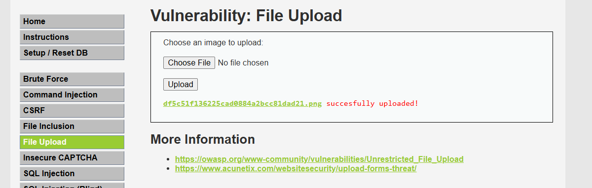

### Kiểm tra file upload xong được lưu ở đâu?

Xem tại Docker DVWA, mở thẻ Files. File ảnh được lưu tại: /var/www/html/hackables/upload/

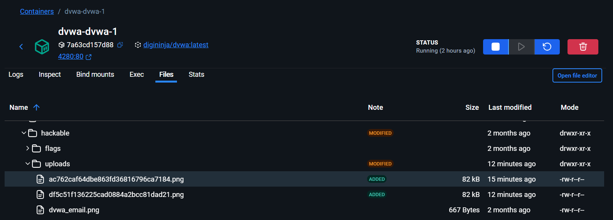

## Bắt request file upload

### Quy trình bắt request

Tại bài tập file upload, thực hiện tải một file lên và bấm Upload (lưu ý trước khi bấm upload, hãy bật chế độ Intercept ON trong Burp Suite)

Quan sát request nhận được trong Burp Suite như sau:

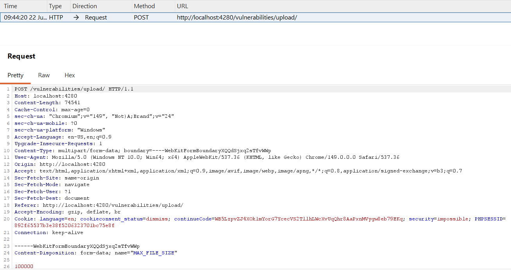

Request nhận được khá dài, người viết chỉ trích xuất 1 phần của nó

```HTTP
POST /vulnerabilities/upload/ HTTP/1.1
Host: localhost:4280
Content-Length: 74541
Cache-Control: max-age=0
sec-ch-ua: "Chromium";v="149", "Not)A;Brand";v="24"
sec-ch-ua-mobile: ?0
sec-ch-ua-platform: "Windows"
Accept-Language: en-US,en;q=0.9
Upgrade-Insecure-Requests: 1
Content-Type: multipart/form-data; boundary=----WebKitFormBoundaryXQQdSjxq2sTfvWWp
User-Agent: Mozilla/5.0 (Windows NT 10.0; Win64; x64) AppleWebKit/537.36 (KHTML, like Gecko) Chrome/149.0.0.0 Safari/537.36
Origin: http://localhost:4280
Accept: text/html,application/xhtml+xml,application/xml;q=0.9,image/avif,image/webp,image/apng,*/*;q=0.8,application/signed-exchange;v=b3;q=0.7
Sec-Fetch-Site: same-origin
Sec-Fetch-Mode: navigate
Sec-Fetch-User: ?1
Sec-Fetch-Dest: document
Referer: http://localhost:4280/vulnerabilities/upload/
Accept-Encoding: gzip, deflate, br
Cookie: language=en; cookieconsent_status=dismiss; continueCode=WB5LzpvZJ4XOk1mYorG7YcecVS2TllhLWcXvUqQhr8AaPxnMVygw8eb79EKq; security=impossible; PHPSESSID=892f65537b3e38f5206323701bc75e8f
Connection: keep-alive

------WebKitFormBoundaryXQQdSjxq2sTfvWWp
Content-Disposition: form-data; name="MAX_FILE_SIZE"

100000
------WebKitFormBoundaryXQQdSjxq2sTfvWWp
Content-Disposition: form-data; name="uploaded"; filename="2026-01-05.png"
Content-Type: image/png

PNG
// Binary data

------WebKitFormBoundaryXQQdSjxq2sTfvWWp
Content-Disposition: form-data; name="Upload"

Upload
------WebKitFormBoundaryXQQdSjxq2sTfvWWp
Content-Disposition: form-data; name="user_token"

88d1f0400a945d61379a5aedf0f29ead
------WebKitFormBoundaryXQQdSjxq2sTfvWWp--
```

### Phân tích request bắt được

#### Request line

Request Line: `POST /vulnerabilities/upload/ HTTP/1.1`

Cho biết:

* Method: POST
* URL: /vulnerabilities/upload/
* Phiên bản: HTTP/1.1

Upload file gần như luôn dùng POST vì cần gửi body chứa dữ liệu.

#### Header quan trọng

* `Content-Type: multipart/form-data;` => body là multipart (vì upload file)
* `boundary=----WebKitFormBoundaryXQQdSjxq2sTfvWWp` => parser dùng boundary `----WebKitFormBoundaryXQQdSjxq2sTfvWWp` để chia body thành nhiều part.

#### Body

Body gồm 4 part.

```
Body
│
├── Part 1
│      MAX_FILE_SIZE
│
├── Part 2
│      uploaded
│
├── Part 3
│      Upload
│
└── Part 4
       user_token
```

##### Part 1

```
Content-Disposition: form-data; name="MAX_FILE_SIZE"

100000
```

PHP sẽ đưa vào `$_POST["MAX_FILE_SIZE"]`

##### Part 2

```
Content-Disposition: form-data; name="uploaded"; filename="2026-01-05.png"

Content-Type: image/png

(binary data)
```

* Tên field: `name="uploaded"` => `<input type="file" name="uploaded">` => PHP sẽ biết đây là field `uploaded`
* Tên file client khai báo: `filename="2026-01-05.png"`
* Content-Type : `image/png`
* Binary Data: là nội dung thật của file.

```
PNG
...(binary)
```

* Parser đọc xong từng field trên sẽ tạo `$_FILES["uploaded"]`

##### Part 3

`Content-Disposition: form-data; name="Upload"`

* Upload là nút Submit.
* PHP: $_POST["Upload"]

##### Part 4

```
Content-Disposition: form-data; name="user_token"

88d1f040...
```

Part 4 chứa CSRF Token.

PHP: `$_POST["user_token"]`

## Luồng của request

### Từ HTTP Request đến PHP

Trước khi đoạn code PHP bắt đầu chạy, PHP đã tự động parse request multipart.

```
HTTP Request
        │
        ▼
Multipart Parser
        │
        ├──────────────┐
        ▼              ▼
$_POST            $_FILES
```

Sau bước này, chương trình PHP mới bắt đầu thực thi.

### Request được ánh xạ thành gì?

Từ request vừa bắt được

Part 1

```
Part 1
name="MAX_FILE_SIZE"

100000
```

được ánh xạ thành

```
$_POST["MAX_FILE_SIZE"]
```

Part 2

```
Part 2
name="uploaded"
filename="2026-01-05.png"
Content-Type: image/png
(binary)
```

được ánh xạ thành

```
$_FILES["uploaded"]
```

PHP tạo ra

```
$_FILES["uploaded"] = [
    "name" => "2026-01-05.png",
    "type" => "image/png",
    "tmp_name" => "/tmp/phpxxxxx",
    "error" => 0,
    "size" => 74541
]
```

Part 3

```
Part 3
name="Upload"

Upload
```

được ánh xạ thành

```
$_POST["Upload"]
```

Part 4

```
Part 4
name="user_token"

88d1f040...
```

được ánh xạ thành

```
$_POST["user_token"]
```

Sau đó code PHP mới chạy

### Chương trình thực thi code sau khi parse 

Lúc này chương trình mới thực thi đoạn code sau.

#### Mức bảo mật: Low

```PHP
<?php

if( isset( $_POST[ 'Upload' ] ) ) {
	// Where are we going to be writing to?
	$target_path  = DVWA_WEB_PAGE_TO_ROOT . "hackable/uploads/";
	$target_path .= basename( $_FILES[ 'uploaded' ][ 'name' ] );

	// Can we move the file to the upload folder?
	if( !move_uploaded_file( $_FILES[ 'uploaded' ][ 'tmp_name' ], $target_path ) ) {
		// No
		$html .= '<pre>Your image was not uploaded.</pre>';
	}
	else {
		// Yes!
		$html .= "<pre>{$target_path} succesfully uploaded!</pre>";
	}
}

?>
```

#### Mức bảo mật: Medium

```PHP
<?php

if( isset( $_POST[ 'Upload' ] ) ) {
	// Where are we going to be writing to?
	$target_path  = DVWA_WEB_PAGE_TO_ROOT . "hackable/uploads/";
	$target_path .= basename( $_FILES[ 'uploaded' ][ 'name' ] );

	// File information
	$uploaded_name = $_FILES[ 'uploaded' ][ 'name' ];
	$uploaded_type = $_FILES[ 'uploaded' ][ 'type' ];
	$uploaded_size = $_FILES[ 'uploaded' ][ 'size' ];

	// Is it an image?
	if( ( $uploaded_type == "image/jpeg" || $uploaded_type == "image/png" ) &&
		( $uploaded_size < 100000 ) ) {

		// Can we move the file to the upload folder?
		if( !move_uploaded_file( $_FILES[ 'uploaded' ][ 'tmp_name' ], $target_path ) ) {
			// No
			$html .= '<pre>Your image was not uploaded.</pre>';
		}
		else {
			// Yes!
			$html .= "<pre>{$target_path} succesfully uploaded!</pre>";
		}
	}
	else {
		// Invalid file
		$html .= '<pre>Your image was not uploaded. We can only accept JPEG or PNG images.</pre>';
	}
}

?>
```

#### Mức bảo mật: High

```PHP
<?php

if( isset( $_POST[ 'Upload' ] ) ) {
	// Where are we going to be writing to?
	$target_path  = DVWA_WEB_PAGE_TO_ROOT . "hackable/uploads/";
	$target_path .= basename( $_FILES[ 'uploaded' ][ 'name' ] );

	// File information
	$uploaded_name = $_FILES[ 'uploaded' ][ 'name' ];
	$uploaded_ext  = substr( $uploaded_name, strrpos( $uploaded_name, '.' ) + 1);
	$uploaded_size = $_FILES[ 'uploaded' ][ 'size' ];
	$uploaded_tmp  = $_FILES[ 'uploaded' ][ 'tmp_name' ];

	// Is it an image?
	if( ( strtolower( $uploaded_ext ) == "jpg" || strtolower( $uploaded_ext ) == "jpeg" || strtolower( $uploaded_ext ) == "png" ) &&
		( $uploaded_size < 100000 ) &&
		getimagesize( $uploaded_tmp ) ) {

		// Can we move the file to the upload folder?
		if( !move_uploaded_file( $uploaded_tmp, $target_path ) ) {
			// No
			$html .= '<pre>Your image was not uploaded.</pre>';
		}
		else {
			// Yes!
			$html .= "<pre>{$target_path} succesfully uploaded!</pre>";
		}
	}
	else {
		// Invalid file
		$html .= '<pre>Your image was not uploaded. We can only accept JPEG or PNG images.</pre>';
	}
}

?>
```

#### Mức bảo mật: Impossible

```PHP
<?php

if( isset( $_POST[ 'Upload' ] ) ) {
	// Check Anti-CSRF token
	checkToken( $_REQUEST[ 'user_token' ], $_SESSION[ 'session_token' ], 'index.php' );

	// File information
	$uploaded_name = $_FILES[ 'uploaded' ][ 'name' ];
	$uploaded_ext  = substr( $uploaded_name, strrpos( $uploaded_name, '.' ) + 1);
	$uploaded_size = $_FILES[ 'uploaded' ][ 'size' ];
	$uploaded_type = $_FILES[ 'uploaded' ][ 'type' ];
	$uploaded_tmp  = $_FILES[ 'uploaded' ][ 'tmp_name' ];

	// Where are we going to be writing to?
	$target_path   = DVWA_WEB_PAGE_TO_ROOT . 'hackable/uploads/';
	//$target_file   = basename( $uploaded_name, '.' . $uploaded_ext ) . '-';

	// Generate a single random name
	$random_name   =  bin2hex( random_bytes(16) ) . '.' . $uploaded_ext;

	$target_file   =  $random_name;
	$temp_file     = ( ( ini_get( 'upload_tmp_dir' ) == '' ) ? ( sys_get_temp_dir() ) : ( ini_get( 'upload_tmp_dir' ) ) );
	$temp_file    .= DIRECTORY_SEPARATOR . $random_name;

	// Is it an image?
	if( ( strtolower( $uploaded_ext ) == 'jpg' || strtolower( $uploaded_ext ) == 'jpeg' || strtolower( $uploaded_ext ) == 'png' ) &&
		( $uploaded_size < 100000 ) &&
		( $uploaded_type == 'image/jpeg' || $uploaded_type == 'image/png' ) &&
		getimagesize( $uploaded_tmp ) ) {

		// Strip any metadata, by re-encoding image (Note, using php-Imagick is recommended over php-GD)
		if( $uploaded_type == 'image/jpeg' ) {
			$img = imagecreatefromjpeg( $uploaded_tmp );
			imagejpeg( $img, $temp_file, 100);
		}
		else {
			$img = imagecreatefrompng( $uploaded_tmp );
			imagepng( $img, $temp_file, 9);
		}
		imagedestroy( $img );

		// Can we move the file to the web root from the temp folder?
		if( rename( $temp_file, ( getcwd() . DIRECTORY_SEPARATOR . $target_path . $target_file ) ) ) {
			// Yes!
			$html .= "<pre><a href='{$target_path}{$target_file}'>{$target_file}</a> succesfully uploaded!</pre>";
		}
		else {
			// No
			$html .= '<pre>Your image was not uploaded.</pre>';
		}

		// Delete any temp files
		if( file_exists( $temp_file ) )
			unlink( $temp_file );
	}
	else {
		// Invalid file
		$html .= '<pre>Your image was not uploaded. We can only accept JPEG or PNG images.</pre>';
	}
}

// Generate Anti-CSRF token
generateSessionToken();

?>
```

`if(isset($_POST['Upload']))` cho thấy chương trình chỉ bắt đầu xử lý upload khi form đã được submit. Đây chính là phần tương ứng với field `Upload` trong request multipart.

Sau đó, code sẽ đọc thông tin của file từ `$_FILES['uploaded']`:

- `$uploaded_name = $_FILES['uploaded']['name'];` → lấy tên file do client gửi, ví dụ `2026-01-05.png`
- `$uploaded_type = $_FILES['uploaded']['type'];` → lấy MIME type, ví dụ `image/png`
- `$uploaded_size = $_FILES['uploaded']['size'];` → lấy kích thước file
- `$uploaded_tmp = $_FILES['uploaded']['tmp_name'];` → lấy đường dẫn file tạm trên server mà PHP đã tạo sau khi nhận upload

Lưu ý rằng `tmp_name` không phải là dữ liệu do client gửi trực tiếp. Đây là đường dẫn file tạm do PHP tự sinh trên server sau khi lưu binary data vào thư mục tạm.

Tiếp theo, chương trình sẽ kiểm tra các điều kiện trước khi cho phép lưu file:

- extension phải là `jpg`, `jpeg` hoặc `png`
- kích thước phải nhỏ hơn `100000` bytes
- MIME type phải là `image/jpeg` hoặc `image/png`
- file phải thật sự là ảnh hợp lệ, được xác nhận bằng `getimagesize($uploaded_tmp)`

Nếu mọi điều kiện đều đúng, PHP sẽ:

1. đọc file từ đường dẫn tạm
2. tái mã hóa ảnh
3. sinh ra một tên ngẫu nhiên
4. lưu ảnh vào thư mục `hackable/uploads/`

Như vậy, toàn bộ pipeline có thể hiểu đơn giản như sau:

```text
HTTP Request
   │
   ▼
Multipart Parser
   │
   ├── $_POST
   └── $_FILES["uploaded"]
            │
            ▼
     tmp_name = /tmp/phpxxxx
            │
            ▼
   PHP chạy logic xử lý upload
            │
            ▼
   Kiểm tra extension, size, MIME type, ảnh hợp lệ
            │
            ▼
   Lưu file vào thư mục uploads
```

## Thí nghiệm sửa request upload file và quan sát response

Phần này dùng để kiểm tra xem ứng dụng có thực sự tin tưởng vào dữ liệu gửi lên hay không. Khi thay đổi một số trường trong request multipart, ta có thể quan sát xem server có còn chấp nhận file hay không, và từ đó hiểu được logic kiểm tra ở phía backend.

### Đổi filename (độ bảo mật: LOW)

Mục đích của thí nghiệm là xem server có dựa vào tên file do client gửi hay không.

Trước:

```HTTP
------WebKitFormBoundaryXQQdSjxq2sTfvWWp
Content-Disposition: form-data; name="uploaded"; filename="2026-01-05.png"
Content-Type: image/png
```

Sau:

```HTTP
------WebKitFormBoundaryXQQdSjxq2sTfvWWp
Content-Disposition: form-data; name="uploaded"; filename="AAAAA.png"
Content-Type: image/png
```

Kết quả: file vẫn được upload thành công. Điều này cho thấy ở mức Low, ứng dụng chưa thật sự kiểm tra nghiêm ngặt tên file và vẫn chấp nhận dữ liệu từ client.

```HTTP
HTTP/1.1 302 Found
Location: index.php
```

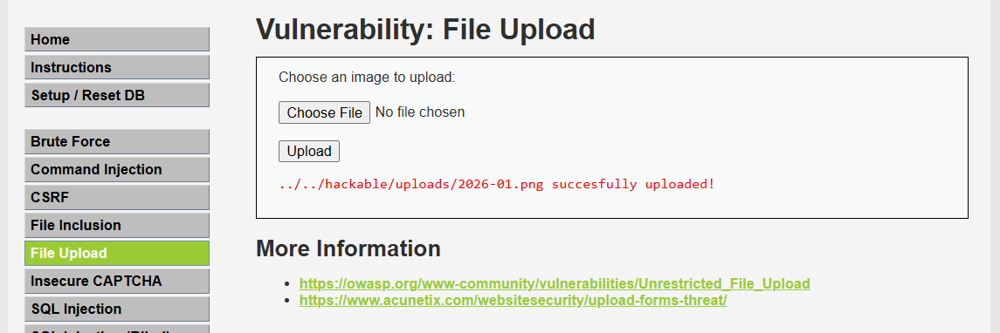

### Đổi Content-Type (độ bảo mật: LOW)

Thử thay đổi `Content-Type` từ `image/png` sang `text/plain` để xem server có kiểm tra MIME type thật hay không.

Trước:

```HTTP
------WebKitFormBoundaryiDdWUEyOnYAQqU1T
Content-Disposition: form-data; name="uploaded"; filename="2026-01-05.png"
Content-Type: image/png
```

Sau:

```HTTP
------WebKitFormBoundaryiDdWUEyOnYAQqU1T
Content-Disposition: form-data; name="uploaded"; filename="2026-01-05.png"
Content-Type: text/plain
```

Kết quả: upload vẫn thành công. Đây là dấu hiệu cho thấy ở mức Low, kiểm tra MIME type chưa đủ mạnh và có thể bị bypass đơn giản.


### Xóa Content-Type (độ bảo mật: LOW)

Tiếp tục thử bỏ hẳn header `Content-Type` của phần file. Nếu server vẫn chấp nhận, chứng tỏ việc kiểm tra kiểu file không thật sự nghiêm ngặt.

Trước:

```HTTP
------WebKitFormBoundaryiDdWUEyOnYAQqU1T
Content-Disposition: form-data; name="uploaded"; filename="2026-01-05.png"
Content-Type: image/png
```

Sau:

```HTTP
------WebKitFormBoundaryiDdWUEyOnYAQqU1T
Content-Disposition: form-data; name="uploaded"; filename="2026-01-05.png"
```

Kết quả: request vẫn được chấp nhận. Điều này cho thấy backend không hoàn toàn dựa vào header này để quyết định file có hợp lệ hay không.

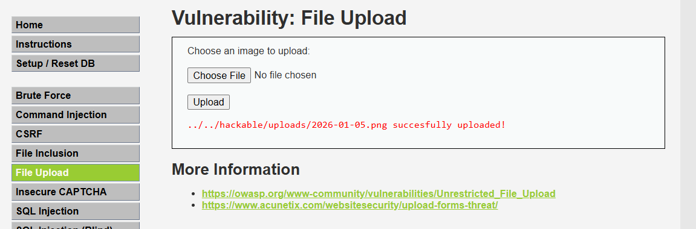

### Thay đổi binary data (độ bảo mật: LOW → HIGH)

Đây là thí nghiệm quan trọng nhất vì nó cho thấy server có kiểm tra nội dung thật của file hay chỉ dựa vào thông tin header.

#### Mức bảo mật Low

Khi bỏ trống phần dữ liệu binary, upload vẫn thành công. Đây cho thấy ở mức Low, ứng dụng không thực sự kiểm tra nội dung file một cách nghiêm ngặt.

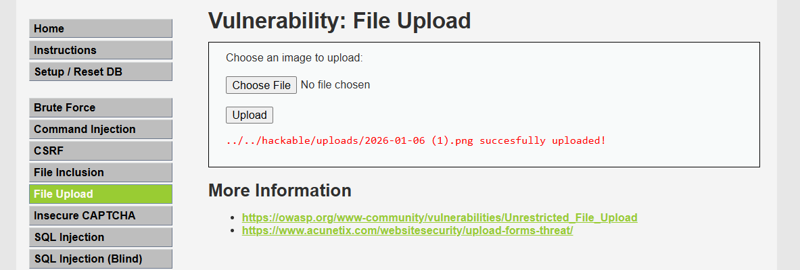

#### Mức bảo mật Medium

Khi thay phần binary bằng các nội dung như `Hello world` hoặc thẻ HTML, upload vẫn thành công. Điều này chứng minh rằng ở mức Medium, hệ thống vẫn chưa đủ chặt chẽ để phân biệt giữa file ảnh thật và nội dung giả.

TH1: binary là `Hello world` → file vẫn được lưu.

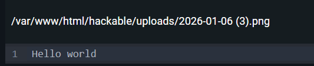

TH2: binary là thẻ HTML → file vẫn được lưu.

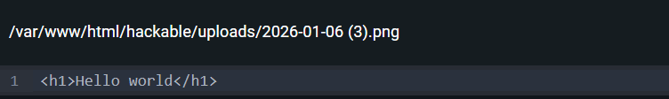


Đặc biệt, nếu đổi tên file thành `shell.php` và thay binary bằng đoạn PHP như `<?php phpinfo(); ?>`, file vẫn được lưu thành công. Khi truy cập file này trên server, PHP đã thực thi nội dung, cho thấy hệ thống bị bypass thành công.

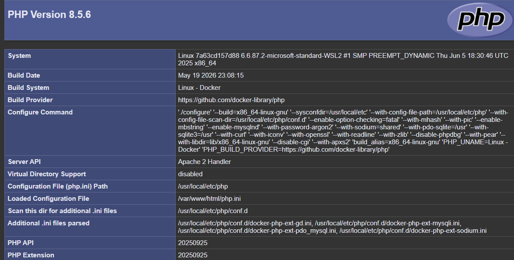

#### Mức bảo mật High

Khi chuyển sang mức High, hệ thống bắt đầu chặn một số trường hợp không hợp lệ hơn. Nếu binary rỗng hoặc nội dung không phải ảnh hợp lệ, server sẽ trả về thông báo lỗi.

#### Mức bảo mật Impossible

Ở mức Impossible, kiểm tra được chặt chẽ hơn, nên các payload không hợp lệ thường bị từ chối.

### Xóa filename (độ bảo mật: LOW)

Trong multipart, tham số `filename` đóng vai trò rất quan trọng để parser nhận diện một phần dữ liệu là file hay chỉ là plain text.

Trước:

```HTTP
------WebKitFormBoundaryk3BBhcwvtAhHy3u2
Content-Disposition: form-data; name="uploaded"; filename="2026-01-05.png"
Content-Type: image/png
```

Sau:

```HTTP
------WebKitFormBoundaryk3BBhcwvtAhHy3u2
Content-Disposition: form-data; name="uploaded";
Content-Type: image/png
```

Kết quả: server trả về lỗi `Undefined array key "uploaded"`. Điều này chứng minh rằng PHP chỉ xem phần này là file upload khi `Content-Disposition` chứa `filename`, còn nếu bỏ đi thì phần dữ liệu sẽ không được ánh xạ đúng vào `$_FILES`.

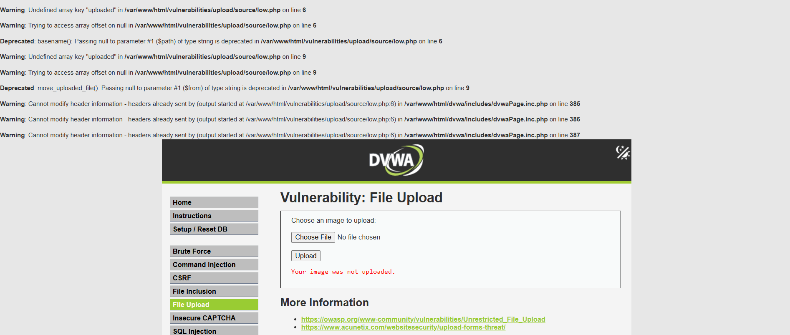

### Xóa user-token (độ bảo mật: IMPOSSIBLE)

Trong môi trường có kiểm tra CSRF, token là một phần bắt buộc để request được chấp nhận.

- Nếu chỉ xóa `user_token`, server sẽ báo lỗi về CSRF token không đúng.
- Nếu xóa toàn bộ phần chứa token, server có thể báo lỗi `undefined array` hoặc reject request.

Những thí nghiệm này cho thấy: dù file upload có thể được gửi thành công, server vẫn phải kiểm tra token, logic backend và nội dung file để đảm bảo an toàn.

## Tổng kết pipeline upload file PHP

### Pipeline upload file

Qua các phần trên, có thể thấy việc upload một file không đơn giản là gửi tên file lên server, mà trải qua nhiều bước xử lý liên tiếp.

Toàn bộ quá trình có thể mô tả như sau:

```
Người dùng chọn file
        │
        ▼
Browser đọc file từ ổ đĩa
        │
        ▼
Sinh HTTP Request (Content-Type: multipart/form-data)
        │
        ▼
Multipart Body
├── Text Part
├── File Part
└── Binary Data
        │
        ▼
Web Server nhận Request
        │
        ▼
PHP Multipart Parser
        │
        ├─────────────┐
        ▼             ▼
      $_POST       $_FILES
                      │
                      ▼
        PHP tạo file tạm (tmp_name)
                      │
                      ▼
        Code PHP bắt đầu thực thi
                      │
                      ▼
Đọc $_FILES['uploaded'] (name, type, size, tmp_name...)
                      │
                      ▼
Kiểm tra điều kiện (extension, MIME type, kích thước, nội dung...)
                      │
          ┌───────────┴───────────┐
          ▼                       ▼
      Hợp lệ                  Không hợp lệ
          │                       │
          ▼                       ▼
Lưu file vào uploads        Trả về lỗi
          │
          ▼
Response gửi về Browser
```

### Mapping giữa các tầng

Trong quá trình upload, cùng một dữ liệu sẽ được biểu diễn dưới nhiều dạng khác nhau.

| Tầng            | Dữ liệu                                                           |
| ---------------- | ------------------------------------------------------------------- |
| HTML             | `<input type="file" name="uploaded">`                             |
| HTTP Multipart   | Content-Disposition: form-data; name="uploaded"; filename="cat.png" |
| Multipart Parser | nhận biết đây là một file upload                              |
| PHP              | $_FILES["uploaded"]                                                 |
| PHP Code         | $_FILES["uploaded"]["tmp_name"]                                     |
| File System      | /tmp/phpxxxxxx                                                      |
| Upload Folder    | hackable/uploads/...                                                |

### Góc nhìn của Pentester

Một pentester không chỉ quan tâm đến việc "upload thành công", mà còn quan sát xem dữ liệu thay đổi như thế nào qua từng bước của pipeline.

Những vị trí thường được kiểm thử gồm:

* Request Line (API upload)
  Header (Content-Type, Content-Length, ...)
  Boundary
  Content-Disposition
  filename
  Content-Type của từng part
  Binary Data
  Các field khác (user_token, MAX_FILE_SIZE, ...)
  Response từ server

Mỗi thành phần đều có thể trở thành điểm kiểm tra hoặc khai thác nếu ứng dụng xử lý không đúng.

### Những gì đã quan sát được trong DVWA

Qua các thí nghiệm với Burp Suite, có thể rút ra một số nhận xét:

* Đổi filename có thể không ảnh hưởng nếu ứng dụng không kiểm tra tên file.
* Content-Type do client khai báo nên có thể bị sửa hoặc xóa.
* filename quyết định parser có coi part đó là file hay không.
* Binary Data mới là nội dung thực sự của file.
* Ở các mức bảo mật thấp, server có thể chỉ kiểm tra extension hoặc MIME type, dẫn đến việc upload dữ liệu tùy ý.
* Ở mức bảo mật cao hơn, ứng dụng bắt đầu kiểm tra nội dung file (ví dụ getimagesize() hoặc tái mã hóa ảnh) nên việc giả mạo trở nên khó hơn.
