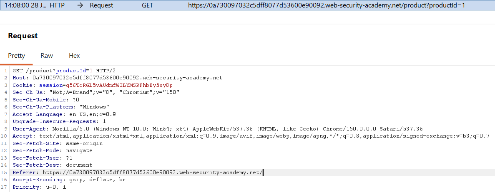
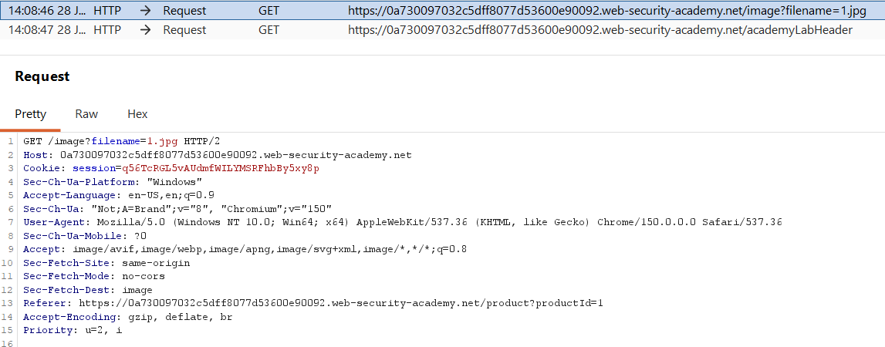
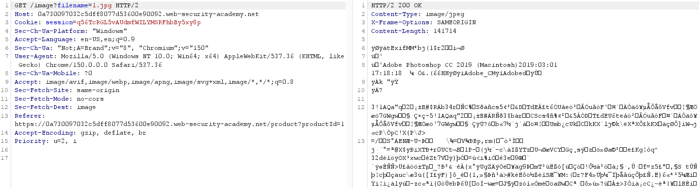
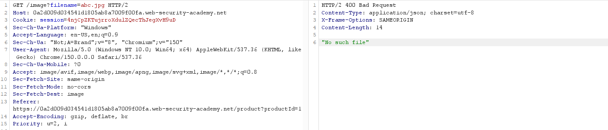
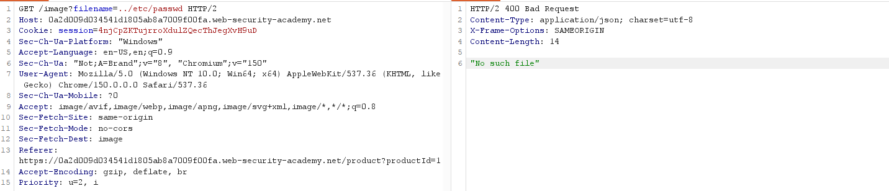
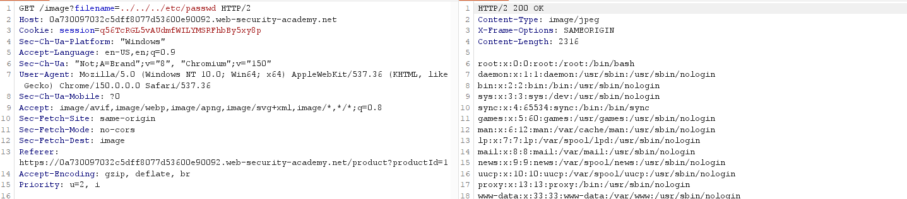
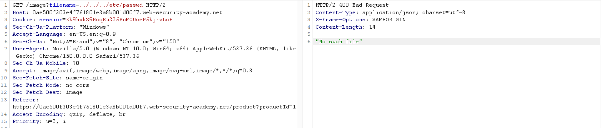
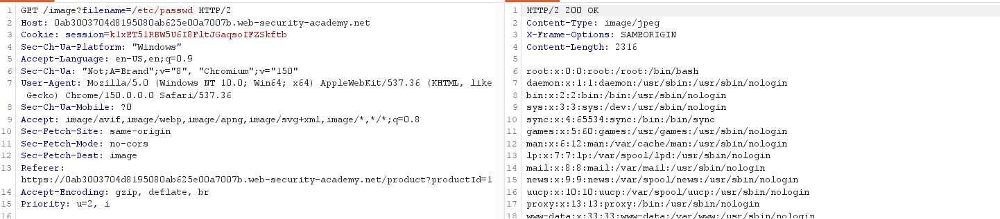
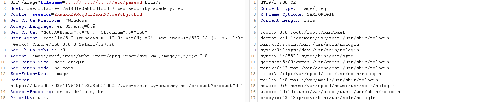
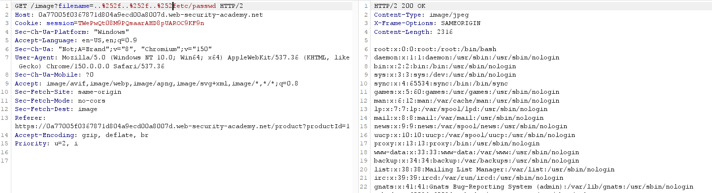

# PortSwigger: Path Traversal

## Giới thiệu

### Vị trí lỗ hổng và mục tiêu

Trong các bài lab tấn công path traversal, lỗ hổng xuất hiện ở việc hiển thị hình ảnh của sản phẩm ngay tại trang chủ.


Mục tiêu cuối của các bài tập này là truy xuất được nội dung của file `/etc/passwd`

### Hướng dẫn chung

1. Sau khi trang chủ hiển thị, bật Interceptor của Burp Suite để chuẩn bị bắt các request.
2. Tại trang chủ, chọn một bài post bất kỳ, và quan sát Interceptor của Burp Suite có request `GET` để lấy các thông tin của sản phẩm.



3. Thực hiện forward request lất sản phẩm, request `GET` mới xuất hiện để lấy ảnh hiển thị lên giao diện.



4. Thực hiện chuyển request này vào repeater để thực hiện tấn công.
5. Thực hiện tấn công theo yêu cầu của bài lab. Phần giải thích của từng bài lab trong bước này sẽ được trình bày tại section riêng của các bài tập.
6. Sau khi truy xuất được nội dung của file `/etc/passwd` load lại trang lần nữa, thông báo giải bài thành công sẽ xuất hiện.


## Bài tập 1: Làm quen với tấn công Path Traversal

### Vấn đề của bài tập

Bài tập không có vấn đề gì đặc biệt, hệ thống không chặn bất cứ thứ gì, chỉ cần tấn công đơn giản là được

### Quy trình thực hiện

Bước 1: Sau khi đưa request vào Repeater, thực hiện gửi request để xem nội dung của ảnh, response trả về dữ liệu ảnh đọc được.



***Điều gì khiến cho request này có khả nảng bị tấn công Path Traversal?***

Là tham số tên file,  ví dụ: như`filename=cat.jpg` hoặc xuất hiện tên file tại các url param như dưới đây thì có thể tạm xác định là nơi có thể tấn công path traversal

```
file=...
image=...
path=...
download=...
template=...
```

Bước 2: Thử thay đổi filename để chứng minh url có lỗ hổng Path Traversal

Trong request, thử thay đổi tên file từ `1.jpg` thành `abc.jpg`, sau đó gửi request để kiểm tra



Server trả response `No such file` => Điều này cho thấy ứng dụng đang cố gắng mở một file thật trên hệ thống thay vì chỉ tra cứu dữ liệu trong cơ sở dữ liệu hoặc sử dụng một giá trị cố định.

Bước 3: Thực hiện tấn công path traversal.

Sửa filename từ `1.jpg`thành dạng `../etc/passwd` sau đó gửi request. Quan sát response báo lỗi không tìm thấy file.



Thực hiện lùi path thêm một cấp bằng cách thêm `../` vào trước tên file và gửi lại request. Thực hiện hành động này cho đến khi không còn response lỗi nữa.

Cho đến khi lùi file đến mức 3 (`../../../etc/passwd`) thì response trả về nội dung hệ thống. Đây là nội dung của `etc/passwd`.



***Vì sao có thể đọc được file `/etc/passwd`?***

Khi người dùng gửi request với tham số `filename=../../../etc/passwd`, ứng dụng không kiểm tra xem đường dẫn có vượt ra ngoài thư mục chứa ảnh hay không.

Hệ điều hành chuẩn hóa đường dẫn bằng cách xử lý các chuỗi `../`, đưa đường dẫn từ thư mục chứa ảnh quay ngược lên các thư mục cha.

Sau khi đi lên đủ số cấp, đường dẫn cuối cùng trỏ tới tệp `/etc/passwd`. Do tiến trình web server có quyền đọc tệp này, ứng dụng đã mở và trả về nội dung của nó trong response.

Backend PHP có thể được cài đặt như sau:

```
$filename = $_GET['filename'];
readfile("/var/www/images/" . $filename);
```

Khi gửi: `filename=../../../etc/passwd`, đường dẫn mà hệ điều hành nhận được là: `/var/www/images/../../../etc/passwd`

Hệ điều hành sẽ chuẩn hóa (normalize/canonicalize) đường dẫn:

```
/var/www/images/../../../etc/passwd
↓
/etc/passwd
```

Sau đó `readfile()` thực chất thực hiện: `readfile("/etc/passwd");` nên toàn bộ nội dung của file được trả về cho người dùng.

***Một cách thử khác***

Thay vì phải thêm `../` sau đó gửi và kiểm tra từng bước, có thể thực hiện thêm rất nhiều `../` ngay từ ban đầu. Ví dụ như: `../../../../../../../../` (8 lần `../`)

Vì cứ tiếp tục đưa lên thư mục cha thì cũng chỉ có thể đưa đến thư mục cao nhất là `/`, có đưa lên thư mục cao hơn cũng không được nữa => Thay vì phải dò từng cấp, có thể lùi thẳng lên `/` bằng cách thêm hàng loạt `../`.

## Bài tập 2: Tấn công Path Traversal khi chuỗi `../` bị chặn bằng cách sử dụng đường dẫn tuyệt đối

### Vấn đề của bài tập

Trong bài tập này, ứng dụng chặn các chuỗi Path Traversal (../), nhưng vẫn sử dụng trực tiếp giá trị của tham số filename để truy cập file trên hệ thống.

Do không kiểm tra đường dẫn tuyệt đối (absolute path), kẻ tấn công có thể chỉ định trực tiếp đường dẫn tuyệt đối để đọc file ngoài thư mục chứa ảnh.

### Quy trình thực hiện

Bước 1: Xác nhận path traversal đã bị chặn

Sau khi đưa request vào repeater, thực hiện tấn công path traversal như bài số 1, bằng cách sửa filename thành `../../../etc/passwd`



Response trả về lỗi `No such file`, cho thấy payload sử dụng chuỗi `../` không còn hoạt động như ở bài trước. Đúng với mô tả của lab, ứng dụng đã chặn các chuỗi Path Traversal (`../`), khiến đường dẫn không thể trỏ tới tệp `/etc/passwd`

Tuy nhiên, tham số `filename` vẫn được sử dụng để xác định file cần đọc. Điều này cho thấy nếu có thể chỉ định đường dẫn theo một cách khác mà không sử dụng chuỗi `../`, vẫn có khả năng truy cập được các file ngoài thư mục chứa ảnh.

Bước 2: Thực hiện tấn công Path Traversal

Theo dữ kiện đề bài, hệ thống coi tên file do người dùng cung cấp la đường dẫn tương đối so với thư mục mặc định của hệ thống

Do vậy, tại request, thực hiện sửa filename thành `/etc/passwd`, sau đó gửi request di



Kết quả trả về nội dung hệ thống. Đây là nội dung của file `/etc/passwd`

***Vì sao /etc/password hoạt động trong trường hợp này?***

Ứng dụng chỉ chặn các chuỗi Path Traversal như ../, nhưng không kiểm tra xem giá trị của tham số filename có phải là đường dẫn tuyệt đối (absolute path) hay không.

Khi gửi: `filename=/etc/passwd` hệ điều hành nhận đây là một đường dẫn tuyệt đối, nên sẽ mở trực tiếp tệp /etc/passwd mà không ghép với thư mục làm việc mặc định của ứng dụng.

Ví dụ, backend có thể được cài đặt như sau:

```
$filename = $_GET['filename'];
readfile($filename);
```

Nếu người dùng nhập: `filename=images/1.jpg` thì hệ điều hành sẽ hiểu đây là đường dẫn tương đối, ví dụ: `/var/www/html/images/1.jpg`

Ngược lại, khi người dùng nhập: `filename=/etc/passwd` thì đây là đường dẫn tuyệt đối, vì vậy hệ điều hành sẽ mở trực tiếp: `/etc/passwd`

Do ứng dụng chỉ chặn chuỗi ../ mà không chặn đường dẫn tuyệt đối, nên kẻ tấn công vẫn có thể đọc được nội dung của tệp `/etc/passwd`.

## Bài tập 3: Tấn công Path Traversal khi ứng dụng xóa chuỗi `../` nhưng chỉ xử lý một lần (Non-recursive)

### Vấn đề của bài tập

The application strips path traversal sequences from the user-supplied filename before using it.

Trong bài tập này, ứng dụng xóa các chuỗi path traversal (`../`) khỏi tên file do người dùng cung cấp trước khi sử dụng.

### Quy trình thực hiện

Bước 1: Xác nhận path traversal bình thường đã bị chặn

Sau khi đưa request vào repeater, thực hiện tấn công path traversal như bài số 1, bằng cách sửa filename thành `../../../etc/passwd`


Response trả về lỗi `No such file`, cho thấy payload sử dụng chuỗi `../` không còn hoạt động như ở bài số 1. Đúng với mô tả của lab, ứng dụng đã xóa các chuỗi  `../`, khiến đường dẫn không thể trỏ tới tệp `/etc/passwd`

Tuy nhiên, tham số `filename` vẫn được sử dụng để xác định file cần đọc. Điều này cho thấy nếu có thể chỉ định đường dẫn theo một cách khác mà không sử dụng chuỗi `../`, vẫn có khả năng truy cập được các file ngoài thư mục chứa ảnh.

Bước 2: Thực hiện tấn công

Theo dữ kiện của đề bài, hệ thống sẽ xóa đi các chuỗi `../` tồn tại trong filename trước khi sử , nhưng chỉ xóa một lần duy nhất.

Do vậy, có thể sử dụng trick để vượt rào sau lần đầu tiên bằng cách đổi filename như sau: `....//....//....//etc/passwd`



Kết quả trả về nội dung hệ thống. Đây là nội dung của file /etc/passwd.

***Vì sao `....//....//....//etc/passwd` hoạt động?***

Ứng dụng thực hiện việc lọc chuỗi Path Traversal bằng cách xóa các chuỗi ../ khỏi giá trị filename. Tuy nhiên, việc xử lý này chỉ diễn ra một lần duy nhất (non-recursive).

Giả sử backend có logic lọc đơn giản như:

```
$filename = str_replace("../", "", $_GET['filename']);
readfile($filename);
```

Khi gửi payload: `....//....//....//etc/passwd`, ứng dụng sẽ tìm và xóa các chuỗi `../` xuất hiện trong input.

Quá trình xử lý có thể hình dung như sau:

```
....//....//....//etc/passwd

        ↓ filter "../"

../../etc/passwd
```

Sau lần lọc đầu tiên, chuỗi `../` mới được tạo ra nhưng ứng dụng không tiếp tục kiểm tra lại lần nữa.

Do bộ lọc không thực hiện đệ quy, giá trị sau khi xử lý vẫn chứa các chuỗi Path Traversal: `../../../etc/passwd`

Khi ứng dụng sử dụng giá trị này để đọc file, hệ điều hành sẽ chuẩn hóa đường dẫn:

```
/var/www/images/../../../etc/passwd

↓

/etc/passwd
```

Sau đó ứng dụng đọc và trả về nội dung của file `/etc/passwd`.

## Bài tập 4: Tấn công Path Traversal khi ứng dụng lọc chuỗi `../` trước nhưng URL-decode thêm một lần sau đó

### Vấn đề của bài tập

Ứng dụng nhận input từ người dùng, thực hiện kiểm tra và chặn các chuỗi traversal `../`, sau đó mới thực hiện URL decode. Cuối cùng, dùng kết quả sau decode để đọc file.

### Quy trình thực hiện

Bước 1: Xác nhận path traversal bình thường đã bị chặn

Sau khi đưa request vào repeater, thực hiện tấn công path traversal như bài số 1, bằng cách sửa filename thành `../../../etc/passwd`


Response trả về lỗi `No such file`, cho thấy payload sử dụng chuỗi `../` không còn hoạt động như ở bài số 1. Đúng với mô tả của lab, ứng dụng đã chặn các chuỗi  `../`, khiến đường dẫn không thể trỏ tới tệp `/etc/passwd`

Tuy nhiên, tham số `filename` vẫn được sử dụng để xác định file cần đọc. Điều này cho thấy nếu có thể chỉ định đường dẫn theo một cách khác mà không sử dụng chuỗi `../`, vẫn có khả năng truy cập được các file ngoài thư mục chứa ảnh.

Bước 2: Thực hiện tấn công

Theo dữ kiện đề bài, ứng dụng chặn chuỗi traversal, nhưng lại dùng kết quả sau khi decode để đọc file.

Do vậy, có thể dùng trick để tấn công => chuyển các kỹ thự thành dạng encode rồi gửi đi.

Thực hiện sửa filename thành chuỗi: `..%252f..%252f..%252fetc/passwd`, sau đó gửi request đi.



Kết quả trả về nội dung hệ thống. Đây là nội dung của file /etc/passwd.


***Vì sao `..%252f..%252f..%252fetc/passwd` hoạt động?***

Bước 1: Ứng dụng kiểm tra input

Giá trị nhận được: `..%252f..%252f..%252fetc/passwd`

Lúc này chưa tồn tại chuỗi: `../` nên vượt qua bước filter.

Bước 2: Ứng dụng thực hiện URL decode

Sau khi decode: 

```
..%252f..%252f..%252fetc/passwd
↓
..%2f..%2f..%2fetc/passwd
```

Nếu tiếp tục được decode: 

```
..%2f..%2f..%2fetc/passwd
↓
../../../etc/passwd
```

Bước 3: Ứng dụng đọc file

Sau khi decode hoàn tất, giá trị sử dụng để đọc file trở thành: `../../../etc/passwd`

Hệ điều hành chuẩn hóa đường dẫn: 

```
/var/www/images/../../../etc/passwd
↓
/etc/passwd
```

Ứng dụng sau đó trả về nội dung của file `/etc/passwd`.

Lỗ hổng xảy ra do ứng dụng thực hiện kiểm tra dữ liệu trước khi giải mã URL. Dữ liệu có thể vượt qua bộ lọc ở dạng encoded, nhưng sau quá trình decode lại trở thành một chuỗi Path Traversal hợp lệ.

---

## Bài tập 5: Tấn công Path Traversal khi ứng dụng kiểm tra tính hợp lệ của thư mục bắt đầu (Validation of start of path)

### Vấn đề của bài tập

Ứng dụng yêu cầu tham số đường dẫn tệp tin cung cấp phải bắt đầu bằng một thư mục tĩnh chỉ định trước (ví dụ: `/var/www/images/`). Nếu không bắt đầu bằng chuỗi này, ứng dụng sẽ chặn yêu cầu ngay lập tức.

### Quy trình thực hiện

**Bước 1: Xác nhận cơ chế kiểm tra thư mục bắt đầu**

Sau khi bắt request hiển thị ảnh sản phẩm trong Burp Suite, thử thay đổi tham số `filename` thành:
`../../../etc/passwd`

Response trả về lỗi (hoặc mã trạng thái lỗi) do đường dẫn không bắt đầu bằng thư mục quy định `/var/www/images/`.

**Bước 2: Thực hiện tấn công sử dụng bypass kiểm tra start path**

Giữ nguyên phần thư mục bắt đầu hợp lệ ở đầu tham số, sau đó sử dụng các ký tự điều hướng lùi thư mục `../` ngay phía sau:

Sửa `filename` thành: `/var/www/images/../../../etc/passwd`

Gửi request và quan sát response trả về nội dung file `/etc/passwd`.

***Vì sao `/var/www/images/../../../etc/passwd` hoạt động?***

Bộ lọc của backend kiểm tra dữ liệu đầu vào sử dụng logic dạng:
```php
$filename = $_GET['filename'];
if (str_starts_with($filename, "/var/www/images/")) {
    readfile($filename);
} else {
    die("Đường dẫn không hợp lệ!");
}
```

Do chuỗi đầu vào bắt đầu chính xác bằng `/var/www/images/`, nó vượt qua được câu lệnh kiểm tra điều kiện. Khi hàm `readfile` tiếp nhận đường dẫn đầy đủ, hệ điều hành xử lý và chuẩn hóa chuỗi điều hướng lùi:
```
/var/www/images/../../../etc/passwd
↓ chuẩn hóa
/etc/passwd
```
Tệp tin nhạy cảm `/etc/passwd` được đọc thành công và gửi về cho người dùng.

---

## Bài tập 6: Tấn công Path Traversal khi ứng dụng kiểm tra đuôi file và sử dụng Null Byte để bypass

### Vấn đề của bài tập

Ứng dụng kiểm tra nghiêm ngặt phần mở rộng của tệp tin ở cuối đường dẫn (ví dụ: yêu cầu phải kết thúc bằng `.jpg` hoặc `.png`). Nếu không thỏa mãn, ứng dụng sẽ báo lỗi và từ chối xử lý.

### Quy trình thực hiện

**Bước 1: Xác nhận cơ chế kiểm tra đuôi file**

Thử thay đổi tham số `filename` thành:
`../../../etc/passwd`

Hệ thống báo lỗi do file không kết thúc bằng phần mở rộng ảnh hợp lệ.

**Bước 2: Thực hiện tấn công sử dụng kỹ thuật Null Byte `%00`**

Để vượt qua bộ lọc kiểm tra đuôi file nhưng vẫn đọc được tệp tin mong muốn, chúng ta chèn ký tự Null Byte `%00` (được mã hóa URL) trước phần mở rộng ảnh.

Sửa `filename` thành: `../../../etc/passwd%00.jpg`

Gửi request và kiểm tra response trả về nội dung file `/etc/passwd`.

***Vì sao `../../../etc/passwd%00.jpg` hoạt động?***

Ứng dụng web kiểm tra chuỗi đầu vào bằng cách xác minh xem chuỗi có kết thúc bằng đuôi `.jpg` hay không (ví dụ dùng hàm `str_ends_with()` hoặc Regex). Do chuỗi `../../../etc/passwd%00.jpg` kết thúc bằng `.jpg`, bộ lọc cho phép tiếp tục xử lý.

Tuy nhiên, ở mức độ hệ thống thấp hơn, các hàm mở tệp tin của hệ điều hành được viết bằng ngôn ngữ C sử dụng cơ chế kết thúc chuỗi bằng ký tự Null Byte (byte `0x00`). Khi hệ thống nhận đường dẫn chứa ký tự `%00` (được máy chủ web giải mã thành byte `0x00`), nó sẽ hiểu đây là điểm kết thúc chuỗi đường dẫn và bỏ qua toàn bộ phần đuôi phía sau (`.jpg`).

Logic xử lý thực tế của hệ thống:
```
Mở file: /var/www/images/../../../etc/passwd\x00.jpg
↓ Cắt bỏ sau ký tự Null-terminator (\x00)
Mở file thực tế: /var/www/images/../../../etc/passwd
↓ Hệ điều hành chuẩn hóa
Mở file thực tế: /etc/passwd
```

> [!WARNING]
> Kỹ thuật Null Byte này chỉ hoạt động trên các hệ thống sử dụng phiên bản PHP cũ (dưới 5.3.4) hoặc các ứng dụng chạy trên nền tảng cũ. Trong PHP 5.3.4 trở đi, lỗ hổng Null Byte Injection đã được vá hoàn toàn ở tầng nhân của PHP. Tuy nhiên, nó vẫn là một kiến thức quan trọng thường gặp trong các bài thi bảo mật.