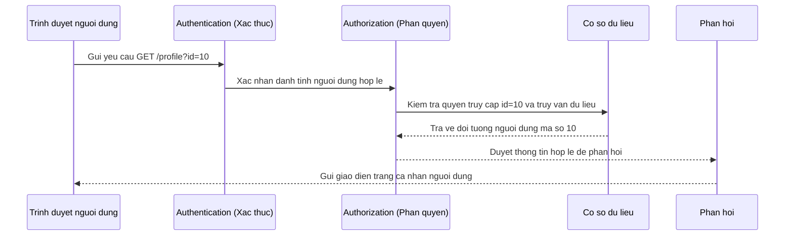
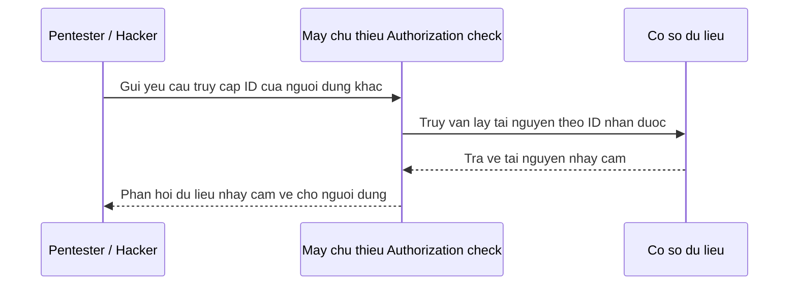

# Insecure Direct Object Reference IDOR

> **Tình huống thực tế:**
> Người dùng A đang xem hóa đơn của bản thân tại liên kết: `https://example.com/invoice?id=121`.
> Người dùng A thay đổi giá trị của tham số `id` từ `121` thành `122` (hóa đơn của người dùng B).
> Nếu máy chủ xử lý thành công yêu cầu và trả về toàn bộ nội dung hóa đơn của người dùng B cho người dùng A, hệ thống đã mắc lỗ hổng **IDOR**.

## Tài liệu tham khảo

* [portswigger.net/web-security/access-control/idor](https://portswigger.net/web-security/access-control/idor)
* [cheatsheetseries.owasp.org/cheatsheets/Insecure_Direct_Object_Reference_Prevention_Cheat_Sheet.html](https://cheatsheetseries.owasp.org/cheatsheets/Insecure_Direct_Object_Reference_Prevention_Cheat_Sheet.html)
* [viblo.asia/p/idor-la-gi-va-ung-dung-ban-code-co-bi-loi-idor-khong-gAm5yrJqKdb](https://viblo.asia/p/idor-la-gi-va-ung-dung-ban-code-co-bi-loi-idor-khong-gAm5yrJqKdb)
* [owasp.org/www-project-web-security-testing-guide/latest/4-Web_Application_Security_Testing/05-Authorization_Testing/04-Testing_for_Insecure_Direct_Object_References](https://owasp.org/www-project-web-security-testing-guide/latest/4-Web_Application_Security_Testing/05-Authorization_Testing/04-Testing_for_Insecure_Direct_Object_References)

## Bố cục nội dung

```text
IDOR Insecure Direct Object Reference (BOLA)

* Kiến thức nền
    * Object đối tượng là gì
    * Identifier ID định danh là gì
    * Direct Object Reference tham chiếu đối tượng trực tiếp là gì
    * Phân biệt Authentication xác thực và Authorization phân quyền
    * Object Mapping cách máy chủ liên kết ID đến đối tượng
* Tổng quan về lỗ hổng IDOR
    * IDOR là gì
    * Nguyên nhân cốt lõi phát sinh lỗ hổng
    * Bản chất lỗi phân quyền khác biệt với việc đoán ID
    * Điều kiện và dấu hiệu thường gặp
    * Luồng dữ liệu lỗi từ yêu cầu đến phản hồi
* Dấu hiệu nhận biết IDOR
* Những hiểu lầm phổ biến
* Những vị trí thường xuất hiện lỗ hổng
    * URL Parameter tham số đường dẫn và REST API endpoints
    * JSON và XML Body trong yêu cầu HTTP
    * Cookie hoặc JWT chứa định danh đối tượng
    * GraphQL Variables và GraphQL queries
    * Multipart Form và các tham số ẩn
* Phân loại các dạng IDOR
    * Horizontal IDOR chiếm quyền theo chiều ngang
    * Vertical IDOR chiếm quyền theo chiều dọc
    * Context dependent IDOR phân quyền phụ thuộc vào ngữ cảnh
    * Multi step IDOR khai thác qua nhiều bước giao dịch
* Quy trình kiểm thử IDOR
    * Thiết lập ma trận vai trò Role Matrix trong kiểm thử
    * Workflow quy trình pentest chuẩn
    * Quy trình kiểm thử thủ công sử dụng Burp Repeater và Burp Intruder
    * Phân tích và so sánh phản hồi giữa các tài khoản có quyền hạn khác nhau
* Các kỹ thuật làm sai lệch quá trình Authorization (Nội dung nâng cao)
    * Thay đổi từ định danh tuần tự sang định danh ngẫu nhiên
    * UUID có thật sự ngăn chặn được IDOR
    * Kỹ thuật Parameter Pollution truyền nhiều tham số cùng tên
    * Nhúng ID vào các cấu trúc mảng hoặc tham số lồng nhau Nested Parameter
    * Method Override thay đổi phương thức yêu cầu HTTP
    * Chuỗi tấn công kết hợp Chaining IDOR và Mass Assignment
* Biện pháp phòng chống hiệu quả
    * Thiết lập kiểm tra quyền hạn mức đối tượng Object level Authorization
    * Cơ chế tham chiếu đối tượng gián tiếp Indirect Object Reference
    * Nguyên tắc trao quyền tối thiểu Principle of Least Privilege
* Case Study thực tế ngoài đời
    * Lỗ hổng IDOR xem Album ảnh riêng tư trên Facebook
    * Lỗ hổng IDOR rò rỉ dữ liệu chuyến đi của khách hàng trên Uber
    * Lab 1: Tải tệp tin tĩnh của người dùng khác
    * Lab 2: Tải xuống hóa đơn giao dịch trái phép (Invoice Download)
    * Lab 3: Khai thác IDOR trên hệ thống REST API
    * Lab 4: Khai thác IDOR qua GraphQL API
    * Lab 5: Khai thác IDOR trên giao diện Mobile API
* Danh sách kiểm tra Pentest Checklist và Cheat Sheet nhanh
    * Mô hình kiểm soát truy cập Access Control Model và mối liên hệ với IDOR
    * Các loại tham chiếu đối tượng Object Reference phổ biến
    * Danh sách tham số có nguy cơ cao chứa IDOR
    * Các bước kiểm thử nhanh cho pentester
```

## Kiến thức nền

### Object đối tượng là gì

Trong lập trình web, Object đối tượng đại diện cho bất kỳ tài nguyên dữ liệu nào mà ứng dụng quản lý và cung cấp cho người dùng.

* Ví dụ về đối tượng bao gồm: tệp tin hóa đơn, thông tin tài khoản người dùng, email cá nhân, đơn đặt hàng, hoặc các tài liệu lưu trữ.

### Identifier ID định danh là gì

Identifier là một chuỗi ký tự hoặc chữ số dùng để xác định duy nhất một đối tượng cụ thể trong cơ sở dữ liệu. Máy chủ sử dụng định danh này để truy xuất đúng tài nguyên khi nhận được yêu cầu.

* Ví dụ: Số thứ tự `10` định danh cho một tài khoản, chuỗi `INV2025` định danh cho một hóa đơn thanh toán.

### Direct Object Reference tham chiếu đối tượng trực tiếp là gì

Đây là cơ chế ứng dụng web cho phép người dùng chỉ định trực tiếp giá trị định danh của tài nguyên cần truy cập thông qua các tham số đầu vào.

* Ví dụ: Đường dẫn truy cập hồ sơ cá nhân có dạng `https://example.com/profile?id=10`. Ở đây định danh đối tượng `id=10` được truyền trực tiếp từ trình duyệt của người dùng lên máy chủ.

### Phân biệt Authentication xác thực và Authorization phân quyền

* **Authentication (Xác thực):** Quá trình xác minh danh tính của một thực thể truy cập hệ thống. Quá trình này trả lời cho câu hỏi đối tượng đang truy cập là ai. Ví dụ: nhập đúng mật khẩu để đăng nhập vào tài khoản cá nhân.
* **Authorization (Phân quyền):** Quá trình xác minh xem danh tính đã được xác thực đó có quyền hạn thực hiện một hành động cụ thể hoặc truy cập một tài nguyên cụ thể hay không. Quá trình này trả lời cho câu hỏi đối tượng được phép làm gì. Lỗ hổng IDOR xảy ra hoàn toàn do lỗi của quá trình Authorization này.

### Object Mapping cách máy chủ liên kết ID đến đối tượng

Object Mapping là quy trình máy chủ tiếp nhận định danh từ phía người dùng gửi lên, thực hiện ánh xạ định danh đó vào cơ sở dữ liệu để tìm kiếm tài nguyên và trả về dữ liệu tương ứng.

Ví dụ luồng xử lý chuẩn:



## Tổng quan về lỗ hổng IDOR

### IDOR là gì

IDOR Insecure Direct Object Reference là lỗ hổng bảo mật xảy ra khi một ứng dụng sử dụng cơ chế tham chiếu đối tượng trực tiếp từ phía người dùng gửi lên để truy xuất dữ liệu, nhưng máy chủ lại bỏ qua bước kiểm tra quyền hạn Authorization của người dùng đối với đối tượng đó.

IDOR là tên gọi truyền thống. Trong các tài liệu hiện đại (đặc biệt OWASP API Security Top 10), lỗ hổng này thường được gọi là Broken Object Level Authorization (BOLA).

### Nguyên nhân cốt lõi phát sinh lỗ hổng

Nguyên nhân gốc rễ của IDOR là **thiếu sót trong việc kiểm tra phân quyền mức đối tượng ở phía máy chủ**. Máy chủ tin tưởng hoàn toàn vào giá trị định danh do trình duyệt gửi lên và tự động truy xuất dữ liệu mà không xác minh xem người dùng hiện tại có thực sự là chủ sở hữu hoặc có quyền xem tài nguyên đó hay không.

### Bản chất lỗi phân quyền khác biệt với việc đoán ID

> [!IMPORTANT]
> Lỗ hổng IDOR không phải là lỗi liên quan đến việc định danh đối tượng có dễ đoán hay không.

Một hiểu lầm rất phổ biến là cho rằng nếu sử dụng các chuỗi định danh khó đoán như mã ngẫu nhiên hoặc UUID thì sẽ không bị lỗi IDOR.

* Việc sử dụng các đường dẫn tuần tự như `/user/100` và `/user/101` không tự động tạo ra lỗ hổng nếu máy chủ thực hiện kiểm tra quyền hạn đầy đủ.
* Lỗ hổng IDOR thực sự xuất hiện khi người dùng A thực hiện yêu cầu truy cập tài nguyên của người dùng B (ví dụ: `/user/101`) và máy chủ xử lý thành công yêu cầu đó mà không chặn lại, bất kể định danh đó là số thứ tự đơn giản hay chuỗi mã hóa phức tạp.

### Điều kiện và dấu hiệu thường gặp để xảy ra IDOR

Lỗ hổng Broken Object Level Authorization (BOLA) không chỉ giới hạn đối với các định danh số tuần tự (Numeric ID) hay tham số trên thanh địa chỉ (URL). Lỗ hổng thường xuất hiện khi hội tụ các điều kiện sau:

* Ứng dụng sử dụng tham chiếu đối tượng trực tiếp để truy vấn dữ liệu.
* Giá trị định danh nằm ở vị trí người dùng có thể tự ý chỉnh sửa được trên giao diện web, API hoặc phần thân yêu cầu.
* Máy chủ bỏ qua hoặc thực hiện không đầy đủ việc xác thực quyền sở hữu của tài khoản hiện tại đối với tài nguyên được yêu cầu.

### Luồng dữ liệu lỗi từ yêu cầu đến phản hồi

Sơ đồ mô tả luồng dữ liệu lỗi:



## Dấu hiệu nhận biết IDOR

Người kiểm thử có thể nhận diện khả năng tồn tại lỗ hổng IDOR khi hệ thống xuất hiện các yếu tố sau:

* Ứng dụng truyền các giá trị định danh cụ thể (như mã số, tên tệp tin, chuỗi mã hóa) trong các yêu cầu HTTP.
* Hệ thống quản lý và xử lý các đối tượng dữ liệu riêng tư (như hóa đơn, thông tin cá nhân, tài liệu nội bộ).
* Hệ thống hỗ trợ nhiều tài khoản người dùng khác nhau hoạt động trên cùng một nền tảng.
* Ứng dụng có triển khai các cơ chế phân quyền (Authorization) nhưng không đồng đều giữa các chức năng.

Ví dụ các mẫu đường dẫn có nguy cơ cao chứa IDOR:

* `/user/15`
* `/order/20`
* `/invoice/55`
* `/download?id=file123.pdf`

## Những hiểu lầm phổ biến

Người mới học thường mắc phải một số hiểu lầm cơ bản sau về lỗ hổng IDOR:

* **UUID chống được IDOR (Sai):** UUID chỉ làm cho định danh trở nên khó đoán hơn để ngăn chặn việc dò quét tự động (Enumeration). Nếu không kiểm tra phân quyền, người kiểm thử vẫn có thể đọc dữ liệu của người khác khi thu thập được chuỗi UUID thông qua các lỗi rò rỉ thông tin hoặc từ mã nguồn công khai.
* **ID tăng dần mới có IDOR (Sai):** ID tăng dần chỉ giúp việc khai thác trở nên dễ dàng hơn. Lỗ hổng IDOR nằm ở việc thiếu kiểm tra phân quyền, không liên quan đến cấu trúc của ID.
* **Chỉ GET mới có IDOR (Sai):** Lỗ hổng có thể xuất hiện ở tất cả các phương thức yêu cầu HTTP bao gồm POST, PUT, DELETE, PATCH (ví dụ: gửi yêu cầu POST hoặc PUT để sửa đổi thông tin đơn hàng của người khác).
* **Chỉ Web mới có IDOR (Sai):** Các ứng dụng di động (Mobile App), ứng dụng máy tính (Desktop App) giao tiếp với máy chủ thông qua API đều có thể bị khai thác IDOR nếu máy chủ API thiếu kiểm tra phân quyền.
* **Chỉ URL mới có IDOR (Sai):** Tham chiếu đối tượng có thể nằm trong phần thân yêu cầu (Request Body) định dạng JSON, XML hoặc nằm trong các tiêu đề (Headers) của yêu cầu.

## Những vị trí thường xuất hiện lỗ hổng

Người kiểm thử cần quan sát kỹ các vị trí mà định danh đối tượng được truyền từ máy khách lên máy chủ:

* **URL Parameter tham số đường dẫn và REST API endpoints:**
  Các tham số nằm trực tiếp trên thanh địa chỉ hoặc đường dẫn API.
  * Ví dụ: `/api/v1/orders/1005` hoặc `/download.php?file=contract1.pdf`
* **JSON và XML Body trong yêu cầu HTTP:**
  Các tham số nằm trong phần thân của yêu cầu POST, PUT, hoặc PATCH.
  * Ví dụ: `{"user_id": 15, "role": "user"}`
* **Cookie hoặc JWT chứa định danh đối tượng:**
  Cookie hoặc chuỗi JWT có chứa định danh đối tượng mà máy chủ sử dụng trực tiếp để truy xuất tài nguyên mà không xác thực lại quyền sở hữu.
  * Ví dụ: Máy chủ tin cậy hoàn toàn vào ID người dùng được đọc ra từ cookie hoặc JWT mà không đối chiếu xem người dùng hiện tại có quyền đọc tài nguyên liên quan đến ID đó hay không.
* **GraphQL Variables và GraphQL queries:**
  Định danh được truyền dưới dạng biến số trong các truy vấn GraphQL gửi đến máy chủ.
  * Ví dụ: `query { getInvoice(invoiceId: 200) { amount status } }`
* **Multipart Form và các tham số ẩn:**
  Các trường nhập liệu ẩn (Hidden fields) in trong các biểu mẫu đăng ký hoặc cập nhật thông tin.
  * Ví dụ: `<input type="hidden" name="accountId" value="99">`

## Phân loại các dạng IDOR

* **Horizontal IDOR chiếm quyền theo chiều ngang:**
  Người kiểm thử truy cập trái phép vào tài nguyên của một người dùng khác có cùng mức phân quyền trong hệ thống.
  * Ví dụ: Người dùng A sửa đổi ID trong yêu cầu để xem hóa đơn của người dùng B.
* **Vertical IDOR chiếm quyền theo chiều dọc:**
  Người kiểm thử có mức phân quyền thấp thực hiện thay đổi ID để truy cập vào các tài nguyên của đối tượng có mức phân quyền cao hơn (như quản trị viên).
  * Ví dụ: Tài khoản người dùng thường đổi ID của tệp tin cấu hình hệ thống vốn chỉ dành cho quyền Admin.
* **Context dependent IDOR phân quyền phụ thuộc vào ngữ cảnh:**
  Quyền truy cập đối tượng thay đổi dựa trên trạng thái hoặc ngữ cảnh làm việc hiện tại của người dùng, nhưng hệ thống không cập nhật trạng thái kiểm tra quyền tương ứng.
  * Ví dụ cụ thể: Một đơn hàng trên hệ thống có hai trạng thái là Đang xử lý (Pending) và Hoàn thành (Completed). Quy định nghiệp vụ cho phép người dùng sửa đổi địa chỉ đơn hàng khi ở trạng thái Pending, nhưng cấm sửa đổi khi đã chuyển sang Completed. Nếu máy chủ chỉ kiểm tra quyền sở hữu đơn hàng (người dùng hiện tại là chủ đơn hàng) mà quên kiểm tra trạng thái đơn hàng (order.status), người dùng có thể thay đổi thông tin của đơn hàng đã hoàn thành. Đây chính là lỗi phân quyền phụ thuộc vào ngữ cảnh.
* **Multi step IDOR khai thác qua nhiều bước giao dịch:**
  Hệ thống thực hiện kiểm tra quyền hạn rất chặt chẽ ở bước đầu tiên, nhưng lại bỏ qua việc xác thực quyền sở hữu ở các bước xác nhận hoặc thực thi cuối cùng của một chuỗi thao tác.

## Quy trình kiểm thử IDOR

### Thiết lập ma trận vai trò Role Matrix trong kiểm thử

Để kiểm thử lỗ hổng phân quyền một cách khoa học, người kiểm thử cần lập một ma trận vai trò ghi rõ các quyền hạn được phép truy cập đối với từng đối tượng dữ liệu trong hệ thống.

Ví dụ bảng ma trận vai trò:

| Vai trò người dùng | Tài nguyên được phép truy cập        | Hành động được phép |
| :--------------------- | :------------------------------------------ | :------------------------- |
| Admin                  | Tất cả hồ sơ người dùng              | Đọc, ghi, xóa           |
| Teacher                | Danh sách lớp học và điểm số         | Đọc, ghi                 |
| Student                | Chỉ hồ sơ cá nhân và điểm cá nhân | Chỉ đọc                 |
| Guest                  | Chỉ trang giới thiệu công khai          | Chỉ đọc                 |

Tư duy kiểm thử là sử dụng tài khoản của vai trò thấp hơn để thực hiện gửi các yêu cầu truy cập tài nguyên của vai trò cao hơn, hoặc dùng tài khoản cùng vai trò để truy cập chéo dữ liệu của nhau, sau đó so sánh kết quả.

### Workflow quy trình pentest chuẩn

Quá trình kiểm thử lỗ hổng IDOR trên thực tế được triển khai tuần tự theo các bước sau:

```text
1. Xác định Object (Dữ liệu/Tệp tin/Tài nguyên nhạy cảm)
   ↓
2. Xác định Owner (Chủ sở hữu thực tế của đối tượng dữ liệu đó)
   ↓
3. Đăng nhập bằng một tài khoản khác (Tài khoản không có quyền sở hữu)
   ↓
4. Replay request (Gửi lại yêu cầu lấy đối tượng dữ liệu)
   ↓
5. Thay đổi ID (Sửa ID của tài khoản hiện tại thành ID của đối tượng khác)
   ↓
6. So sánh phản hồi (Response) để đánh giá kết quả
```

### Quy trình kiểm thử thủ công sử dụng Burp Repeater và Burp Intruder

1. Thực hiện đăng nhập bằng tài khoản A và thực hiện một hành động (ví dụ: xem hóa đơn). Ghi lại yêu cầu HTTP trong tab History của Burp Suite.
2. Gửi yêu cầu đó sang tab Repeater.
3. Thay thế giá trị định danh của tài khoản A bằng định danh của tài khoản B.
4. Gửi yêu cầu đi và quan sát kết quả phản hồi. Nếu máy chủ trả về thông tin chi tiết của tài khoản B thay vì báo lỗi quyền truy cập, hệ thống tồn tại lỗ hổng IDOR.
5. Sử dụng Intruder nếu muốn dò quét tự động một dải ID tuần tự để xác định quy mô ảnh hưởng.

### Phân tích và so sánh phản hồi giữa các tài khoản có quyền hạn khác nhau

* Phản hồi thành công (mã trạng thái 200 OK) chứa dữ liệu của tài khoản khác chỉ ra sự hiện diện của lỗ hổng.
* Phản hồi trả về mã lỗi 401 Unauthorized thường cho biết yêu cầu chưa hoặc không được xác thực danh tính hợp lệ.
* Phản hồi trả về mã lỗi 403 Forbidden cho thấy hệ thống đã xác thực danh tính nhưng từ chối thực thi yêu cầu do không đủ quyền hạn.
* Trường hợp phản hồi trả về mã lỗi 404 Not Found có thể là phương pháp được ứng dụng thiết kế để ẩn giấu sự tồn tại của đối tượng mà tài khoản hiện tại không có quyền truy cập, tuy nhiên tự nó không chứng minh hệ thống đã an toàn. Người kiểm thử cần thực hiện so sánh chi tiết cả nội dung phản hồi (Response Body) và độ dài phản hồi (Response Length) để đánh giá chính xác tác động thực tế của yêu cầu.

## Biện pháp phòng chống hiệu quả

### Thiết lập kiểm tra quyền hạn mức đối tượng Object level Authorization

Đây là nguyên tắc an toàn quan trọng nhất được OWASP khuyến nghị. Trước khi thực hiện bất kỳ truy vấn cơ sở dữ liệu nào, máy chủ phải xác minh xem định danh người dùng trong phiên làm việc hiện tại có quyền thực hiện hành động yêu cầu đối với đối tượng đích hay không.

Ví dụ cấu hình kiểm tra quyền sở hữu an toàn trong mã nguồn:

```python
# Lay thong tin user hien tai tu phien lam viec
current_user = get_session_user()

# Truy van thong tin hoa doc tu database
invoice = db.query_invoice(invoice_id)

# Kiem tra quyen so huu truoc khi tra ve du lieu
if invoice.owner_id != current_user.id:
    return raise_error("Access Denied", status_code=403)

return render_invoice_page(invoice)
```

### Cơ chế tham chiếu đối tượng gián tiếp Indirect Object Reference

Thay vì gửi trực tiếp ID thực tế của cơ sở dữ liệu về trình duyệt, máy chủ có thể tạo ra một bản đồ ánh xạ tạm thời lưu trữ trong phiên làm việc của người dùng:

* Ví dụ: Hóa đơn có ID thực tế là `999` trong database sẽ được hiển thị trên trình duyệt dưới dạng một mã số tạm thời ngẫu nhiên được liên kết riêng với tài khoản hiện tại (ví dụ: `key_1`).
* Khi người dùng gửi yêu cầu với `key_1`, máy chủ giải mã ngược lại thành `999` để truy vấn. Nếu người dùng khác gửi yêu cầu chứa `key_1`, máy chủ sẽ báo lỗi vì bản đồ phiên làm việc của họ không chứa khóa ánh xạ này.

### Nguyên tắc trao quyền tối thiểu Principle of Least Privilege

Tất cả các tài khoản mặc định chỉ được cấp quyền truy cập tối thiểu cần thiết để hoàn thành công việc. Mọi hành động truy xuất tài nguyên hệ thống phải được ghi nhận lịch sử truy cập đầy đủ để phục vụ quá trình giám sát an ninh thông tin.

## Case Study thực tế ngoài đời

### Lỗ hổng IDOR xem Album ảnh riêng tư trên Facebook

Một nhà nghiên cứu bảo mật phát hiện ra lỗ hổng IDOR trên API di động của Facebook. Bằng cách gửi yêu cầu truy vấn đến endpoint API lấy thông tin album ảnh và thay đổi tham số album_id thành mã số album của người dùng khác, nhà nghiên cứu đã có thể xem được toàn bộ album ảnh riêng tư của bất kỳ người dùng nào trên Facebook mà không cần có quyền kết bạn hay truy cập.

### Lỗ hổng IDOR rò rỉ dữ liệu chuyến đi của khách hàng trên Uber

Một lỗ hổng BOLA được báo cáo trên hệ thống API của Uber. Bằng cách thay đổi tham số định danh chuyến đi trip_id trong yêu cầu API di động gửi đến backend, người kiểm thử có thể lấy được toàn bộ dữ liệu lịch sử chuyến đi của bất kỳ khách hàng nào, bao gồm cả vị trí GPS đón/trả, thông tin tài xế và số tiền thanh toán mà không cần quyền sở hữu chuyến đi đó.

### Lab 1: Tải tệp tin tĩnh của người dùng khác

Hệ thống lưu trữ lịch sử cuộc hội thoại trò chuyện của khách hàng dưới dạng tệp tin văn bản tĩnh được đánh số tuần tự trong một thư mục dùng chung trên hệ thống tệp tin máy chủ. Khi người dùng bấm nút tải tệp tin, ứng dụng gọi đường dẫn:

```http
GET /download-transcript/121.txt HTTP/1.1
```

Do hệ thống không thực hiện kiểm tra quyền truy cập đối với các tệp tin tĩnh này, người kiểm thử có thể thay đổi số thứ tự của tên tệp tin thành `122.txt` để tải về và đọc nội dung cuộc trò chuyện của tài khoản khác.

### Lab 2: Tải xuống hóa đơn giao dịch trái phép (Invoice Download)

Ứng dụng mua sắm trực tuyến cho phép xuất hóa đơn thanh toán thông qua yêu cầu chứa mã số hóa đơn:

```http
GET /api/v1/invoice/download?id=INV2025009 HTTP/1.1
```

Do máy chủ không kiểm tra quyền sở hữu đơn hàng của phiên đăng nhập hiện tại, người kiểm thử thay đổi giá trị `id` thành `INV2025008` và tải thành công hóa đơn giao dịch của khách hàng khác chứa thông tin địa chỉ nhà riêng và thẻ thanh toán.

### Lab 3: Khai thác IDOR trên hệ thống REST API

Ứng dụng web cho phép người dùng cập nhật thông tin cá nhân thông qua yêu cầu REST API:

```http
PUT /api/v1/users/15 HTTP/1.1
Content-Type: application/json

{"email": "user15@example.com"}
```

Do hàm xử lý API cập nhật thông tin ở máy chủ thiếu kiểm tra quyền sở hữu đối với ID của người dùng, người kiểm thử thay đổi ID trên đường dẫn thành `/api/v1/users/14` và sửa đổi thành công email của tài khoản khác.

### Lab 4: Khai thác IDOR qua GraphQL API

Ứng dụng sử dụng GraphQL để truy vấn thông tin hóa đơn. Yêu cầu gửi đi chứa thông tin định danh:

```graphql
query {
  getInvoice(invoiceId: 88) {
    amount
    billingAddress
    status
  }
}
```

Do hàm xử lý truy vấn dữ liệu `getInvoice` trên máy chủ chỉ xác thực xem người dùng đã đăng nhập hay chưa mà không kiểm tra xem hóa đơn có mã số `88` có thuộc sở hữu của người dùng hiện tại hay không, người kiểm thử thay đổi giá trị `invoiceId` thành `89` để đọc trộm dữ liệu thanh toán của người dùng khác.

### Lab 5: Khai thác IDOR trên giao diện Mobile API

Một số ứng dụng triển khai kiểm tra quyền hạn chặt chẽ trên giao diện web máy tính nhưng lại bỏ quên việc kiểm tra phân quyền đối với các cổng API được thiết kế riêng cho các ứng dụng di động hoạt động. Người kiểm thử bắt lưu lượng mạng truyền đi từ thiết bị di động, phát hiện các yêu cầu PUT, PATCH có truyền kèm định danh tài khoản để sửa đổi thông tin người dùng và khai thác thành công dữ liệu nhạy cảm trên máy chủ API di động.

## Các kỹ thuật làm sai lệch quá trình Authorization (Nội dung nâng cao)

Các kỹ thuật nâng cao dưới đây thường được áp dụng nhằm vượt qua các bộ lọc xác thực định dạng đầu vào (validation), bộ phân tích cú pháp (parser) hoặc các lớp trung gian (middleware) để làm sai lệch kết quả kiểm tra quyền hạn của máy chủ:

### Thay đổi từ định danh tuần tự sang định danh ngẫu nhiên

Khi hệ thống chuyển sang sử dụng các định danh ngẫu nhiên khó đoán để ngăn chặn việc dò quét dữ liệu, người kiểm thử có thể tìm kiếm các vị trí rò rỉ định danh này trên ứng dụng như các tệp tin log công khai, các API tìm kiếm người dùng công khai hoặc phần thông tin tác giả của bài viết.

### UUID có thật sự ngăn chặn được IDOR

UUID Universally Unique Identifier chỉ cung cấp tính năng ngẫu nhiên hóa định danh để ngăn chặn việc đoán mò ID. UUID không phải là giải pháp phân quyền.

```text
Numeric ID (Tuần tự)
1, 2, 3, 4 ...
↓
Dễ đoán, dễ dò quét (Enumeration)
   
---------------------------------------------
   
UUID (Ngẫu nhiên)
8c8ef2db-424a-4a25-8b83-b78971f11a4b
↓
Khó đoán, khó dò quét
↓
Tuy nhiên, nếu thu thập được UUID từ các vị trí rò rỉ thông tin công khai
↓
Máy chủ vẫn phải thực hiện kiểm tra quyền sở hữu (Authorization)
```

Nếu người kiểm thử thu thập được UUID của đối tượng khác qua các kênh rò rỉ thông tin và gửi yêu cầu thành công, hệ thống vẫn bị xác định là mắc lỗi IDOR do thiếu kiểm tra quyền sở hữu đối với UUID đó.

### Kỹ thuật Parameter Pollution truyền nhiều tham số cùng tên

Đây là kỹ thuật bypass lớp validation đầu vào. Nếu hệ thống sử dụng bộ lọc WAF hoặc mã nguồn chỉ kiểm tra quyền hạn của tham số đầu tiên, người kiểm thử có thể truyền nhiều tham số cùng tên để vượt qua:

* Ví dụ yêu cầu gửi đi: `GET /view?id=123&id=456`
* Trong một số cấu hình, hệ thống phân quyền sẽ kiểm tra ID `123` (hợp lệ), nhưng ứng dụng phía sau lại xử lý ID `456` (truy cập trái phép).

### Nhúng ID vào các cấu trúc mảng hoặc tham số lồng nhau Nested Parameter

Đây là kỹ thuật bypass parser dữ liệu. Nếu hệ thống kiểm tra phân quyền dựa trên chuỗi tham số đơn giản, người kiểm thử có thể thay đổi cấu trúc dữ liệu gửi lên thành định dạng mảng hoặc đối tượng lồng nhau để làm sai lệch:

* Ví dụ yêu cầu ban đầu: `{"id": 123}`
* Ví dụ yêu cầu chỉnh sửa: `{"id": {"id": 456}}` hoặc `{"id": [456]}`

### Method Override thay đổi phương thức yêu cầu HTTP

Đây là kỹ thuật bypass các middleware hoặc các quy tắc định tuyến của máy chủ. Một số ứng dụng cấu hình bộ lọc phân quyền chặt chẽ cho phương thức POST hoặc PUT, nhưng lại bỏ quên phương thức GET hoặc PATCH.

Người kiểm thử có thể thay đổi phương thức yêu cầu hoặc sử dụng các tiêu đề ghi đè như `X-HTTP-Method-Override: PUT` để kiểm tra khả năng vượt qua bộ lọc phân quyền của middleware.

### Chuỗi tấn công kết hợp Chaining IDOR và Mass Assignment

Người kiểm thử có thể kết hợp lỗ hổng IDOR với Mass Assignment bằng cách gửi yêu cầu sửa đổi hồ sơ của tài khoản khác thông qua IDOR, đồng thời chèn thêm các trường dữ liệu nâng cao đặc quyền (ví dụ: `"is_admin": true`) vào phần thân yêu cầu.

Kỹ thuật này có thể làm tăng mức độ tác động và ảnh hưởng nghiêm trọng của lỗ hổng, tuy nhiên kết quả thực tế phụ thuộc vào việc máy chủ có cho phép liên kết (bind) các trường dữ liệu nhạy cảm đó vào mô hình đối tượng hay không.

## Danh sách kiểm tra Pentest Checklist và Cheat Sheet nhanh

### Mô hình kiểm soát truy cập Access Control Model và mối liên hệ với IDOR

Lỗ hổng IDOR thực chất là một dạng lỗi thuộc nhóm **Broken Access Control** (Lỗi kiểm soát truy cập). Hiểu được các mô hình kiểm soát truy cập dưới đây giúp định hình tư duy kiểm thử phân quyền một cách có hệ thống:

* **RBAC (Role Based Access Control):** Phân quyền dựa trên vai trò của người dùng.
* **ABAC (Attribute Based Access Control):** Phân quyền dựa trên các thuộc tính đi kèm (như thời gian, vị trí, hoặc trạng thái của đối tượng).
* **ACL (Access Control List):** Danh sách chỉ định chi tiết các quyền hạn cụ thể đối với từng tài nguyên.

Khi phát hiện hệ thống thiết lập phân quyền không đồng bộ giữa các mô hình này, nguy cơ xuất hiện lỗ hổng IDOR là rất cao.

### Các loại tham chiếu đối tượng Object Reference phổ biến

Người kiểm thử cần lưu ý rằng tham chiếu đối tượng không chỉ giới hạn ở các chữ số tuần tự mà có thể xuất hiện dưới nhiều định dạng khác nhau:

* Định danh số tuần tự (Numeric ID): `id=123`
* Chuỗi định danh ngẫu nhiên (UUID/GUID): `uuid=a1b2c3d4...`
* Đường dẫn thân thiện (Slug): `article=huong-dan-pentest`
* Tên tệp tin (Filename): `file=data.txt`
* Địa chỉ thư điện tử (Email): `user=test@gmail.com`
* Tên tài khoản (Username): `profile=admin`
* Mã số giao dịch (Order/Invoice Number): `code=INV202501`

### Danh sách tham số có nguy cơ cao chứa IDOR

Cần kiểm tra ngay khả năng xảy ra IDOR mỗi khi phát hiện các tham số có tên chứa các từ khóa sau trong yêu cầu HTTP:

* `id`, `user_id`, `account_id`, `client_id`
* `doc`, `file`, `filename`, `path`
* `order`, `order_id`, `invoice`, `bill`
* `key`, `token`, `ref`, `reference`

### Các bước kiểm thử nhanh cho pentester

* [ ] Đăng nhập bằng hai tài khoản khác nhau A và B trên hai phiên làm việc độc lập.
* [ ] Thực hiện thu thập các giá trị ID định danh tài nguyên của tài khoản B.
* [ ] Sử dụng tài khoản A để gửi yêu cầu truy cập trực tiếp các ID thu thập được của tài khoản B.
* [ ] Kiểm tra từng hành động thao tác (Action) đối với mỗi đối tượng (Object):
  * [ ] READ (Đọc/Xem)
  * [ ] UPDATE (Cập nhật/Sửa đổi)
  * [ ] DELETE (Xóa bỏ)
  * [ ] EXPORT (Xuất dữ liệu)
  * [ ] DOWNLOAD (Tải xuống)
  * [ ] SHARE (Chia sẻ)
* [ ] Kiểm tra kỹ chức năng DOWNLOAD vì đây là vị trí rất hay xảy ra lỗ hổng IDOR.
* [ ] Kiểm tra tất cả các phương thức yêu cầu HTTP bao gồm GET, POST, PUT, DELETE, PATCH đối với cùng một tài nguyên.
* [ ] Kiểm tra khả năng bypass bộ lọc bằng cách thay đổi Content Type của yêu cầu từ JSON sang XML hoặc ngược lại.
* [ ] Kiểm tra khả năng vượt qua phân quyền bằng kỹ thuật Parameter Pollution truyền lặp lại tham số.
