# PortSwigger IDOR

## Bài tập 1: Vai trò củau người dùng được kiểm soát qua tham số yêu cầu

### Yêu cầu bài tập

Bài thực hành cung cấp một trang quản trị tại địa chỉ `/admin` được bảo vệ bằng cơ chế xác định vai trò quản trị viên thông qua một tham số Cookie có thể chỉnh sửa từ phía máy khách.

Để hoàn thành bài thực hành, cần thực hiện đăng nhập vào tài khoản thông thường, thay đổi tham số vai trò để truy cập trang quản trị và thực hiện xóa tài khoản người dùng carlos. Thông tin đăng nhập được cung cấp là `wiener:peter`.

### Phân tích lỗ hổng

Lỗ hổng leo thang đặc quyền phát sinh do máy chủ tin tưởng hoàn toàn vào tham số xác định vai trò người dùng được gửi lên từ trình duyệt máy khách (ở đây là Cookie có tên Admin). Ứng dụng không thực hiện đối chiếu thông tin vai trò này với quyền hạn thực tế của tài khoản lưu trữ trong cơ sở dữ liệu trên máy chủ.

Bằng cách chỉnh sửa giá trị của Cookie Admin từ sai (false) thành đúng (true), tác nhân kiểm thử có thể giả mạo vai trò quản trị viên, vượt qua cơ chế kiểm soát truy cập và thực thi các hành động đặc quyền như xem trang quản trị hoặc xóa người dùng khác.

### Quy trình thực hiện chi tiết

Trang chủ của bài thực hành hiển thị danh sách các sản phẩm:


Thực hiện truy cập trang đăng nhập My account và điền thông tin tài khoản `wiener:peter` để đăng nhập hệ thống:

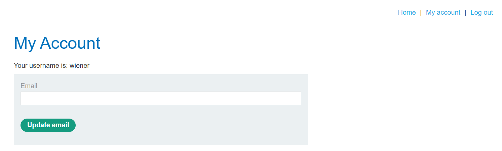

Sau khi đăng nhập thành công, sử dụng công cụ Burp Suite để kiểm tra lịch sử các yêu cầu HTTP. Quan sát yêu cầu GET lấy thông tin tài khoản sau khi đăng nhập thành công:

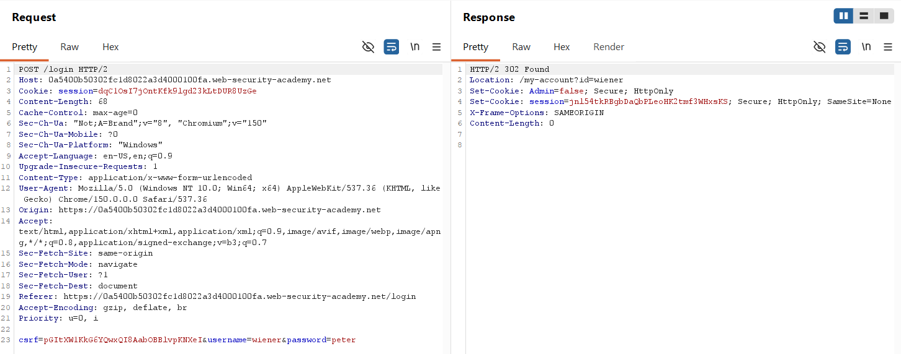

Yêu cầu HTTP GET này có đính kèm tiêu đề Cookie chứa tham số `Admin=false`:

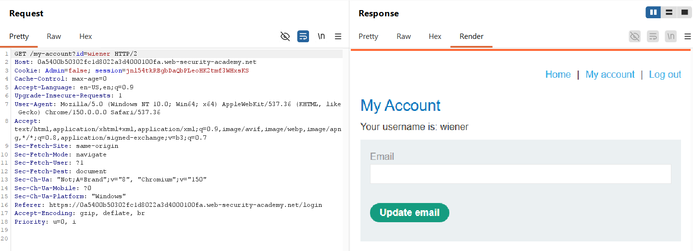

Gửi yêu cầu này sang tab Repeater, thực hiện thay đổi giá trị của Cookie này thành `Admin=true` và gửi yêu cầu đi:

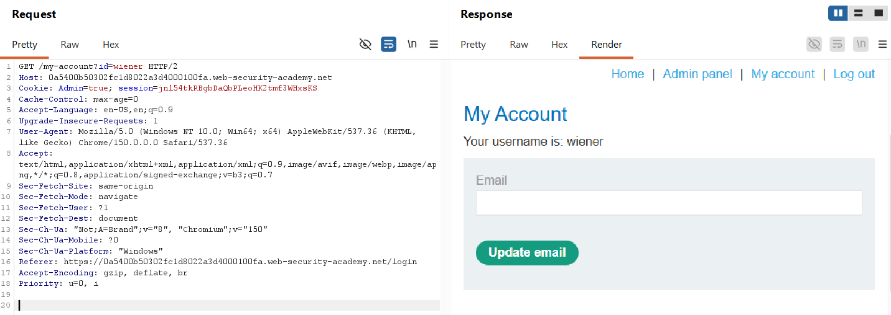

Phản hồi trả về chứa cấu trúc giao diện HTML mới hiển thị đường dẫn liên kết đến trang quản trị Admin panel tại địa chỉ `/admin`.

Thực hiện chỉnh sửa trực tiếp yêu cầu HTTP trong Repeater để truy cập trang quản trị bằng cách thay đổi dòng đầu tiên thành `GET /admin` và gửi đi:

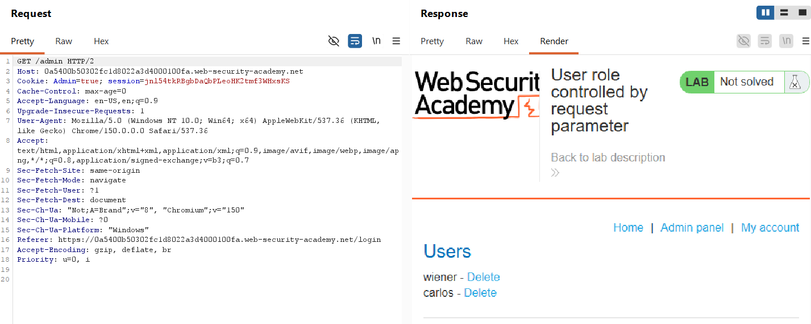

Giao diện trang quản trị hiển thị thành công danh sách người dùng bao gồm wiener và carlos cùng các liên kết thực hiện hành động xóa tài khoản.

Quan sát mã nguồn HTML phản hồi để xác định API xóa người dùng carlos. Đường dẫn API được tìm thấy là:

```http
/admin/delete?username=carlos
```

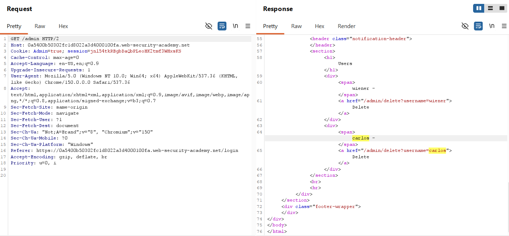

Thực hiện chỉnh sửa yêu cầu HTTP trong Repeater sang đường dẫn xóa tài khoản và gửi đi:

```http
GET /admin/delete?username=carlos HTTP/1.1
```

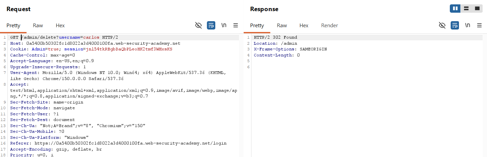

Phản hồi trả về mã trạng thái HTTP 302 Found điều hướng về trang quản trị, cho biết yêu cầu thực thi thành công.

Gửi lại yêu cầu `GET /admin` một lần nữa để tải lại giao diện quản trị:

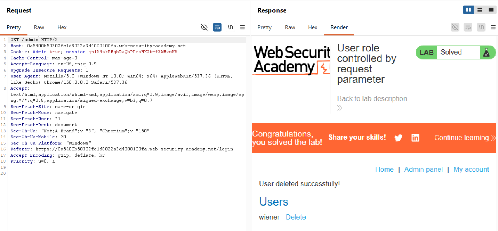

Danh sách người dùng hiển thị cho thấy tài khoản carlos đã bị xóa khỏi hệ thống, giao diện xuất hiện thông báo hoàn thành bài thực hành.

### Phân tích cơ chế hoạt động của payload

Tham số chỉnh sửa được sử dụng trong bài thực hành:

```http
Cookie: Admin=true
```

Cơ chế hoạt động của payload:

* Máy chủ ứng dụng tiếp nhận yêu cầu và đọc giá trị của Cookie Admin từ tiêu đề HTTP.
* Do thiếu cơ chế xác thực chéo vai trò thực tế của phiên làm việc từ phía máy chủ (Server side validation), logic phân quyền của ứng dụng chấp nhận giá trị `Admin=true` làm căn cứ hợp lệ để xác định vai trò quản trị viên.
* Hệ thống sau đó cấp phép cho yêu cầu được thực thi các chức năng nhạy cảm trên đường dẫn `/admin` và thực hiện hành động xóa người dùng qua API `/admin/delete`.

## Bài tập 2: Định danh người dùng được kiểm soát qua tham số yêu cầu với ID không thể dự đoán

### Yêu cầu bài tập

Bài thực hành chứa một lỗ hổng phân quyền theo chiều ngang tại trang thông tin tài khoản người dùng, trong đó hệ thống định danh tài khoản bằng các chuỗi định danh duy nhất ngẫu nhiên (GUID).

Để hoàn thành bài thực hành, cần thực hiện tìm kiếm chuỗi định danh GUID của tài khoản carlos, sử dụng GUID này để truy cập trang tài khoản của carlos nhằm thu thập API key và nộp kết quả. Thông tin đăng nhập được cung cấp là `wiener:peter`.

### Phân tích lỗ hổng

Lỗ hổng phân quyền theo chiều ngang phát sinh khi ứng dụng cho phép người dùng thay đổi tham số định danh trên đường dẫn (GUID) để truy cập thông tin tài khoản mà không kiểm tra quyền sở hữu phiên làm việc hiện tại. Mặc dù các chuỗi GUID có tính chất ngẫu nhiên và khó đoán, ứng dụng lại để lộ công khai các định danh này trên giao diện chung (như phần thông tin liên kết của tác giả viết bài đăng blog).

Tác nhân kiểm thử có thể dễ dàng thu thập GUID của các tài khoản khác từ các trang thông tin công khai, sau đó thay thế vào tham số truy vấn tài khoản để đọc dữ liệu nhạy cảm của người dùng khác.

### Quy trình thực hiện chi tiết

Trang chủ của bài thực hành hiển thị danh sách các bài viết blog:


Thực hiện truy cập trang đăng nhập My account và điền thông tin tài khoản `wiener:peter` để đăng nhập hệ thống:

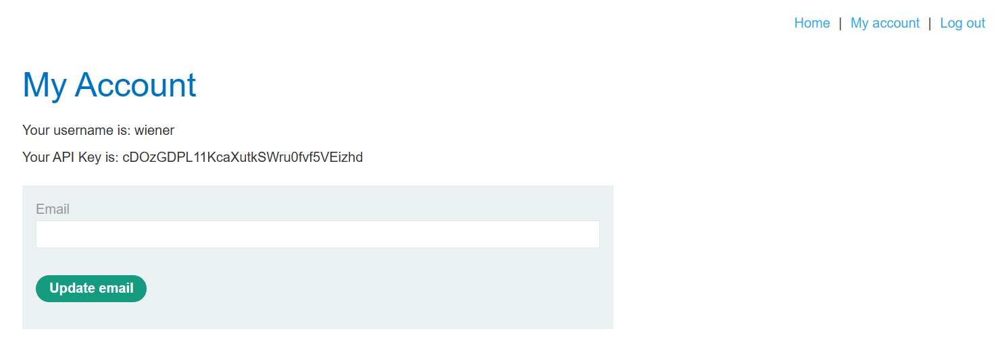

Sau khi đăng nhập thành công, quan sát yêu cầu GET lấy thông tin tài khoản trong lịch sử Burp Suite:

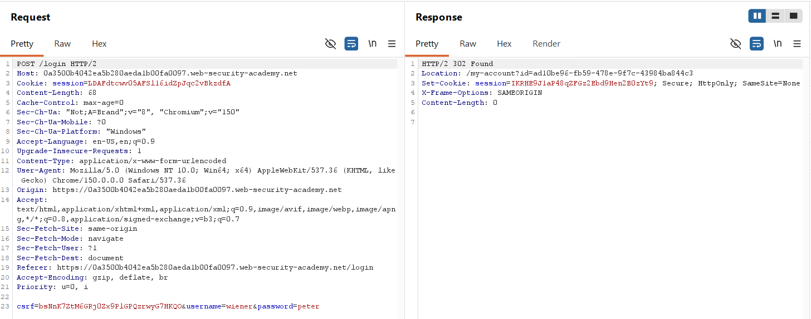

Yêu cầu sử dụng tham số query string dạng GUID để định danh tài khoản:

```http
GET /my-account?id=49c00bdf-be87-47b2-8418-5a21b3695328 HTTP/1.1
```

Do các chuỗi GUID có tính chất ngẫu nhiên, cần tìm vị trí ứng dụng để lộ các thông tin định danh này. Quay lại trang chủ và truy cập vào trang chi tiết của một bài viết blog bất kỳ:

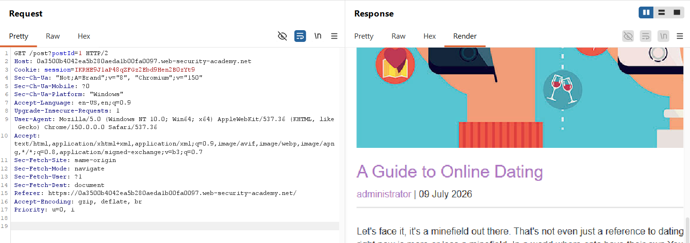

Quan sát mã nguồn HTML của trang chi tiết bài viết, nhận thấy liên kết của tên tác giả bài viết có đính kèm GUID của tài khoản đó. Thực hiện tìm kiếm bài viết do tác giả carlos đăng tải để trích xuất GUID tương ứng:

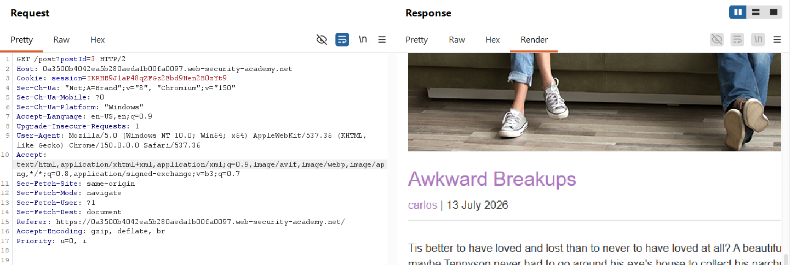

GUID của carlos được xác định là:

```text
6fec11a8-105a-4d80-8b0b-203eb489f47e
```

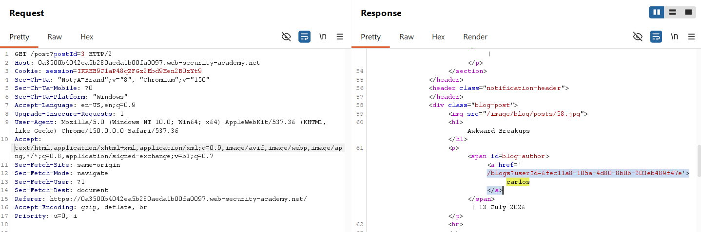

Sử dụng Burp Suite Repeater để chỉnh sửa tham số `id` trong yêu cầu truy cập tài khoản thành GUID của carlos và gửi đi:

```http
GET /my-account?id=6fec11a8-105a-4d80-8b0b-203eb489f47e HTTP/1.1
```

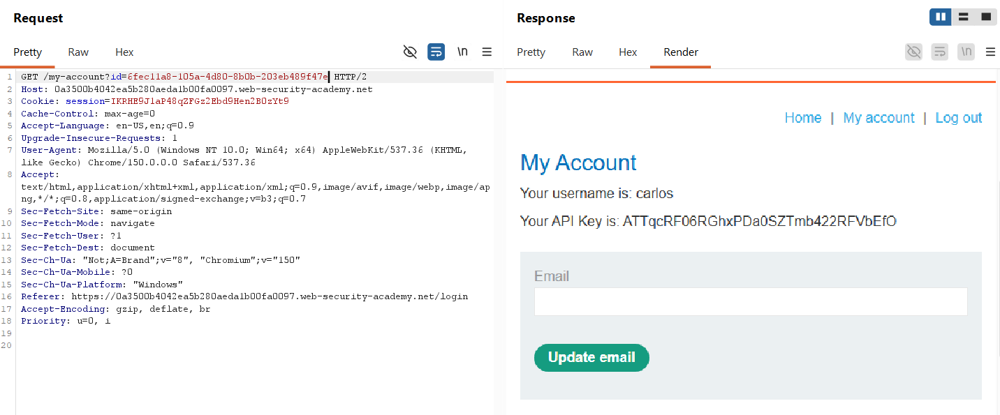

Phản hồi trả về chứa thông tin tài khoản của carlos và mã API key:

```text
ATTqcRF06RGhxPDa0SZTmb422RFVbEfO
```

Thực hiện sao chép mã API key này và nộp kết quả trên giao diện để hoàn thành bài thực hành:

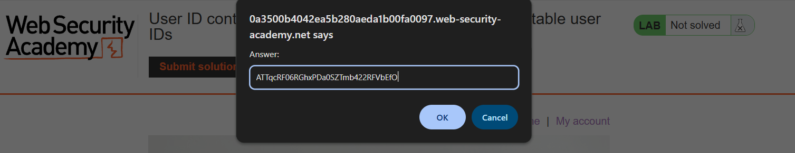

Hệ thống ghi nhận kết quả chính xác và đánh dấu hoàn thành bài thực hành:

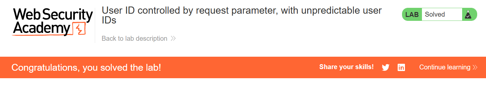

### Phân tích cơ chế hoạt động của payload

Tham số chỉnh sửa được sử dụng trong bài thực hành:

```http
?id=6fec11a8-105a-4d80-8b0b-203eb489f47e
```

Cơ chế hoạt động của payload:

* Ứng dụng tiếp nhận giá trị GUID của carlos từ tham số `id` và thực hiện truy vấn cơ sở dữ liệu để lấy thông tin tài khoản tương ứng.
* Do máy chủ không thực hiện kiểm tra phân quyền (Authorization check) để xác minh xem GUID được yêu cầu có trùng khớp với định danh của tài khoản đang đăng nhập hay không, ứng dụng tự động kết xuất thông tin nhạy cảm của carlos và trả về trực tiếp trong phản hồi HTTP.

## Bài tập 3: Định danh người dùng được kiểm soát qua tham số yêu cầu với rò rỉ dữ liệu trong phản hồi chuyển hướng

### Yêu cầu bài tập

Bài thực hành chứa một lỗ hổng kiểm soát truy cập tại trang thông tin tài khoản người dùng, trong đó thông tin nhạy cảm của tài khoản bị rò rỉ trực tiếp trong phần thân (Body) của một phản hồi chuyển hướng HTTP Redirect.

Để hoàn thành bài thực hành, cần thực hiện thu thập API key của người dùng carlos từ phản hồi bị rò rỉ này và nộp kết quả. Thông tin đăng nhập được cung cấp là `wiener:peter`.

### Phân tích lỗ hổng

Lỗ hổng phát sinh do ứng dụng thực hiện cơ chế chuyển hướng người dùng (Redirect) bằng mã trạng thái HTTP 302 Found khi phát hiện truy cập trái phép, nhưng lại không dừng quá trình thực thi và kết xuất giao diện ở phía sau máy chủ (thiếu hàm dừng chương trình như exit hoặc die sau lệnh điều hướng).

Mặc dù trình duyệt của người dùng tự động chuyển hướng sang trang đăng nhập `/login` khi nhận được mã 302, phần thân của phản hồi HTTP 302 này vẫn chứa toàn bộ mã nguồn HTML của trang tài khoản bị truy cập trái phép, dẫn tới rò rỉ thông tin nhạy cảm.

### Quy trình thực hiện chi tiết

Trang chủ của bài thực hành hiển thị danh sách các sản phẩm:


Thực hiện truy cập trang đăng nhập My account và điền thông tin tài khoản `wiener:peter` để đăng nhập hệ thống:

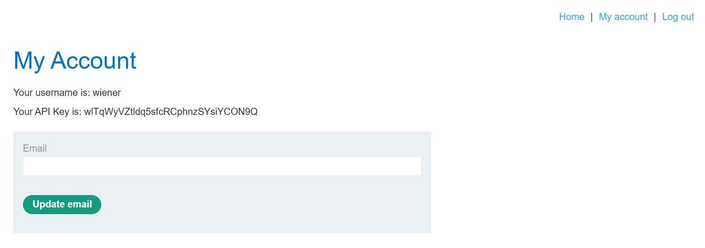

Sau khi đăng nhập thành công, sử dụng công cụ Burp Suite để kiểm tra lịch sử các yêu cầu HTTP. Quan sát yêu cầu GET lấy thông tin tài khoản:

```http
GET /my-account?id=wiener HTTP/1.1
```

Yêu cầu sử dụng tham số `id` trên URL để định danh tài khoản:

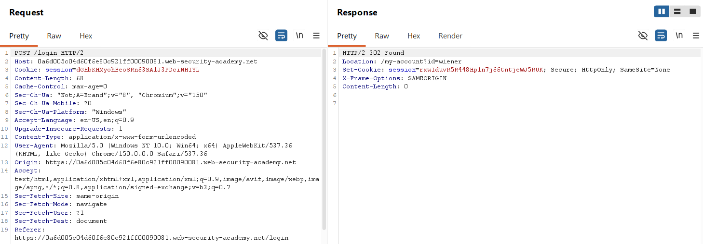

Gửi yêu cầu này sang tab Repeater, thực hiện thay đổi giá trị tham số `id` từ `wiener` thành `carlos` và gửi đi:

```http
GET /my-account?id=carlos HTTP/1.1
```

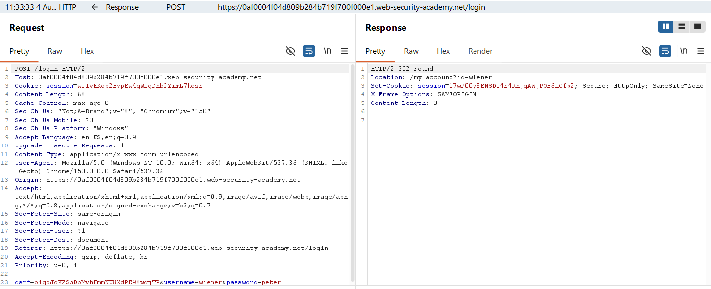

Phản hồi trả về mã trạng thái HTTP 302 Found điều hướng về đường dẫn `/login`:

```http
HTTP/2 302 Found
Location: /login
```

Thực hiện cuộn xuống dưới để kiểm tra phần thân phản hồi (Response Body) của phản hồi 302 này trong Burp Suite. Nhận thấy nội dung HTML của trang tài khoản carlos vẫn được kết xuất đầy đủ bên dưới tiêu đề chuyển hướng:

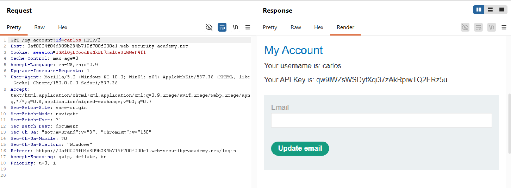

Trích xuất thành công mã API key của carlos từ nội dung HTML rò rỉ:

```text
qw9lWZsWSDyfXqi37zAkRpiwTQ2ERz5u
```

Nộp mã API key này trên giao diện ứng dụng để hoàn thành bài thực hành:

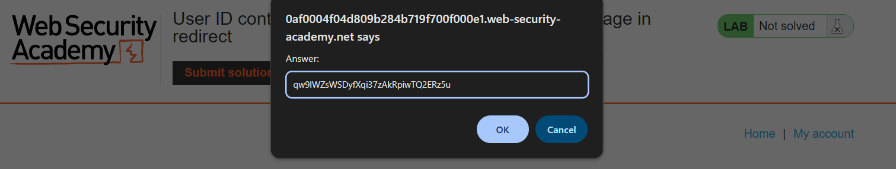

Hệ thống ghi nhận kết quả chính xác và đánh dấu hoàn thành bài thực hành:

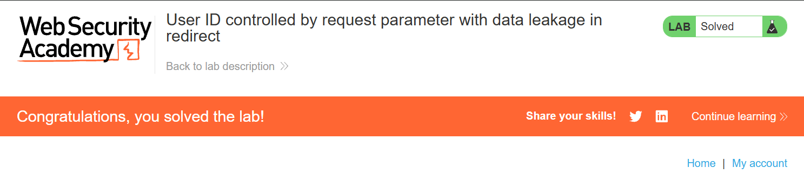

### Phân tích cơ chế hoạt động của payload

Đường dẫn yêu cầu được sử dụng trong bài thực hành:

```http
/my-account?id=carlos
```

Cơ chế hoạt động của payload:

* Máy chủ ứng dụng tiếp nhận yêu cầu và phát hiện tài khoản hiện tại không sở hữu tài nguyên của carlos, do đó thực hiện thiết lập tiêu đề điều hướng `Location: /login` cùng mã trạng thái HTTP 302.
* Do luồng xử lý mã nguồn của ứng dụng phía sau lệnh điều hướng không bị ngắt (thiếu lệnh dừng chương trình), máy chủ vẫn tiếp tục truy vấn cơ sở dữ liệu và kết xuất giao diện HTML của trang tài khoản carlos vào phần thân của phản hồi HTTP.
* Tác nhân kiểm thử sử dụng công cụ proxy để đọc dữ liệu thô trong phần thân của phản hồi 302, bỏ qua cơ chế tự động chuyển hướng của trình duyệt để thu thập thông tin nhạy cảm.

## Bài tập 4: Định danh người dùng được kiểm soát qua tham số yêu cầu dẫn đến rò rỉ mật khẩu

### Yêu cầu bài tập

Bài thực hành cung cấp tính năng hiển thị trang cá nhân của người dùng, trong đó có chứa mật khẩu hiện tại của tài khoản được điền sẵn trong một ô nhập liệu bị ẩn đi trên giao diện.

Để hoàn thành bài thực hành, cần thực hiện lấy mật khẩu của tài khoản quản trị viên administrator, sau đó sử dụng thông tin xác thực này để đăng nhập hệ thống và thực hiện hành động xóa tài khoản người dùng carlos. Thông tin đăng nhập được cung cấp là `wiener:peter`.

### Phân tích lỗ hổng

Lỗ hổng phân quyền phát sinh do máy chủ ứng dụng trả về toàn bộ dữ liệu tài khoản bao gồm cả mật khẩu dưới dạng bản rõ trong phản hồi HTTP, mặc dù dữ liệu này đã bị che dấu bằng dấu chấm trên giao diện trình duyệt.

Đồng thời, hệ thống thiếu cơ chế xác thực quyền truy cập đối với tham số định danh id được gửi từ máy khách, cho phép một tài khoản người dùng thông thường thay đổi tham số id thành administrator để truy cập trang cá nhân của quản trị viên và trích xuất mật khẩu quản trị.

### Quy trình thực hiện chi tiết

Trang chủ của bài thực hành hiển thị danh sách các sản phẩm:


Thực hiện truy cập trang đăng nhập My account và điền thông tin tài khoản `wiener:peter` để đăng nhập hệ thống:

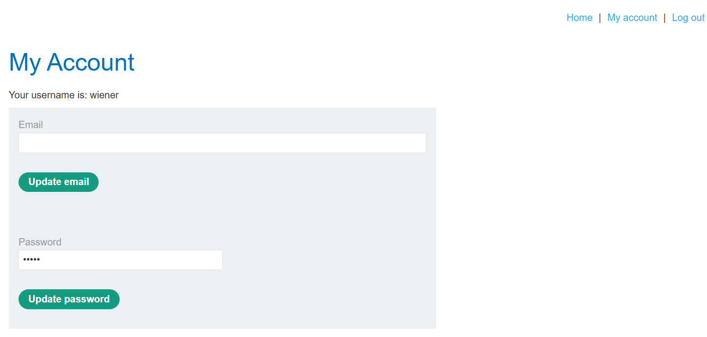

Sau khi đăng nhập thành công, sử dụng công cụ Burp Suite để tìm kiếm yêu cầu GET lấy thông tin tài khoản cá nhân:

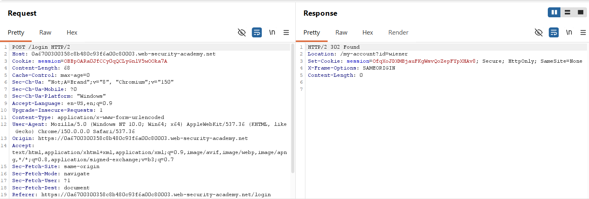

Yêu cầu HTTP GET sử dụng tham số id để xác định tài khoản:

```http
GET /my-account?id=wiener HTTP/1.1
```

Gửi yêu cầu này sang tab Repeater, thay đổi giá trị tham số id thành administrator và gửi đi:

```http
GET /my-account?id=administrator HTTP/1.1
```

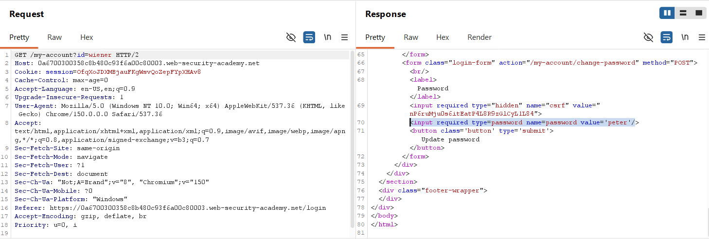

Quan sát nội dung phản hồi HTML nhận về, tìm kiếm ô nhập liệu mật khẩu và trích xuất giá trị mật khẩu bản rõ của quản trị viên:

```text
77ckjyfr6ihdejdhxaop
```

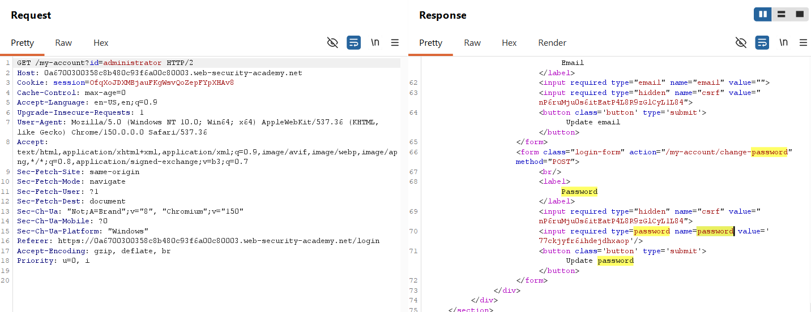

Thực hiện đăng xuất tài khoản hiện tại và tiến hành đăng nhập lại bằng tài khoản quản trị viên với thông tin `administrator:77ckjyfr6ihdejdhxaop`.

Sau khi đăng nhập thành công, truy cập vào giao diện quản trị Admin Panel hiển thị danh sách người dùng:

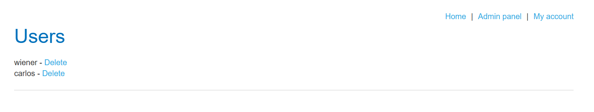

Nhấp chọn liên kết xóa tài khoản carlos. Hệ thống xác nhận tài khoản carlos đã bị xóa thành công và hoàn thành bài thực hành:

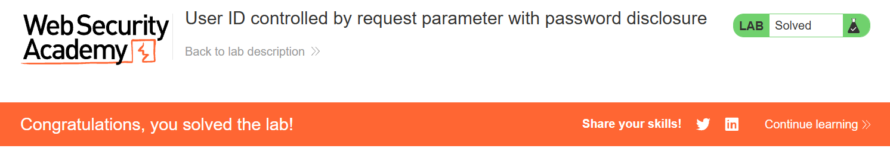

### Phân tích cơ chế hoạt động của payload

Tham số chỉnh sửa được sử dụng trong bài thực hành:

```http
?id=administrator
```

Cơ chế hoạt động của payload:

* Máy chủ tiếp nhận yêu cầu lấy thông tin tài khoản của quản trị viên từ một phiên đăng nhập thông thường mà không thực hiện xác thực chéo quyền sở hữu.
* Dữ liệu mật khẩu của tài khoản quản trị được truy vấn từ cơ sở dữ liệu và điền trực tiếp vào thuộc tính value của thẻ input trong tài liệu HTML phản hồi.
* Tác nhân kiểm thử đọc mã nguồn HTML thô để lấy mật khẩu bản rõ trước khi trình duyệt thực hiện che dấu mật khẩu trên giao diện.

## Bài tập 5: Tham chiếu đối tượng trực tiếp không an toàn truy xuất tệp tin tĩnh

### Yêu cầu bài tập

Bài thực hành thực hiện lưu trữ lịch sử cuộc hội thoại trò chuyện của người dùng trực tiếp trên hệ thống tệp tin của máy chủ và cho phép tải về thông qua các đường dẫn liên kết tĩnh.

Để hoàn thành bài thực hành, cần thực hiện tìm kiếm tệp tin chứa nội dung cuộc trò chuyện của người dùng carlos để lấy thông tin mật khẩu và đăng nhập vào hệ thống bằng tài khoản của carlos.

### Phân tích lỗ hổng

Lỗ hổng phát sinh do ứng dụng sử dụng cơ chế tham chiếu đối tượng trực tiếp không an toàn IDOR đến tên tệp tin lưu trữ trên máy chủ. Khi người dùng thực hiện tải xuống lịch sử trò chuyện, hệ thống gửi yêu cầu đến một đường dẫn tệp tin tĩnh.

Do tên tệp tin được đặt theo quy luật số thứ tự tăng dần đơn giản và máy chủ không thực hiện kiểm tra quyền truy cập đối với các tệp tin này, tác nhân kiểm thử có thể thay đổi số thứ tự của tên tệp tin để đọc nội dung cuộc trò chuyện của các phiên làm việc của người dùng khác và thu thập thông tin nhạy cảm.

### Quy trình thực hiện chi tiết

Trang chủ của bài thực hành hiển thị danh sách các sản phẩm:


Nhấp chọn chức năng Live chat trên thanh trình đơn, thực hiện gửi một vài nội dung trò chuyện thử nghiệm:

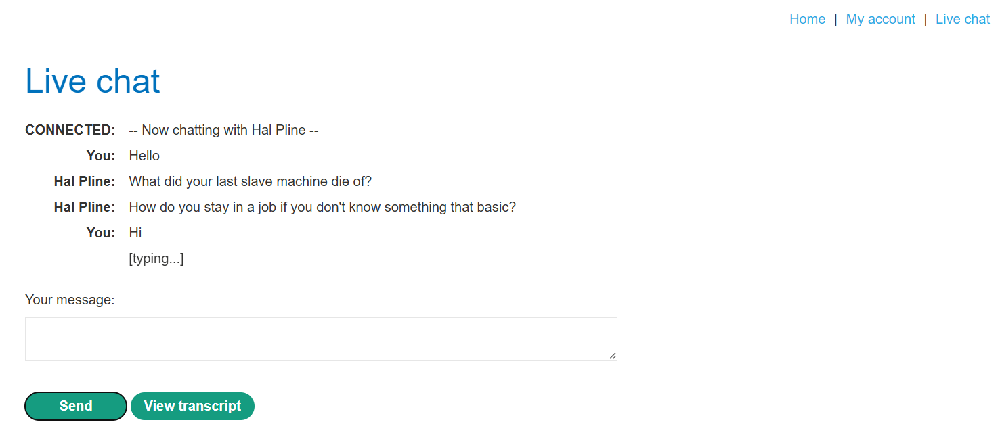

Nhấp chọn nút View Transcript để tải tệp tin lưu trữ nội dung cuộc trò chuyện về máy khách:

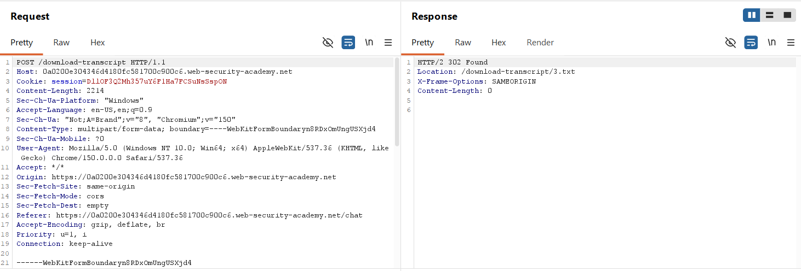

Sử dụng Burp Suite để kiểm tra yêu cầu HTTP tải tệp tin, nhận thấy hệ thống gửi yêu cầu lấy tệp tin tĩnh được đánh số thứ tự:

```http
GET /download-transcript/2.txt HTTP/1.1
```

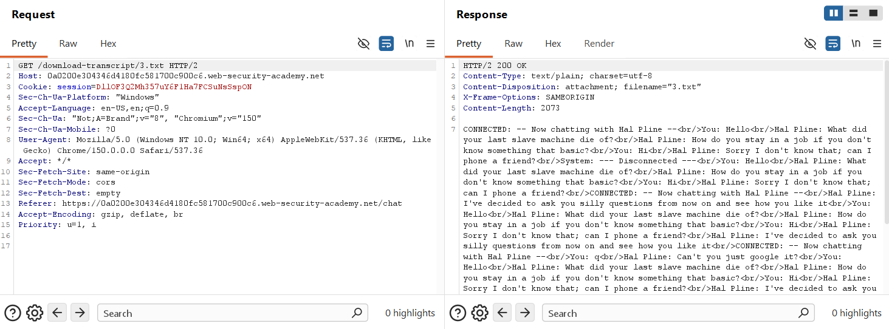

Nhận thấy tên tệp tin có tính quy luật tăng dần, thực hiện gửi yêu cầu này sang tab Repeater, thay đổi tên tệp tin thành `1.txt` và gửi đi:

```http
GET /download-transcript/1.txt HTTP/1.1
```

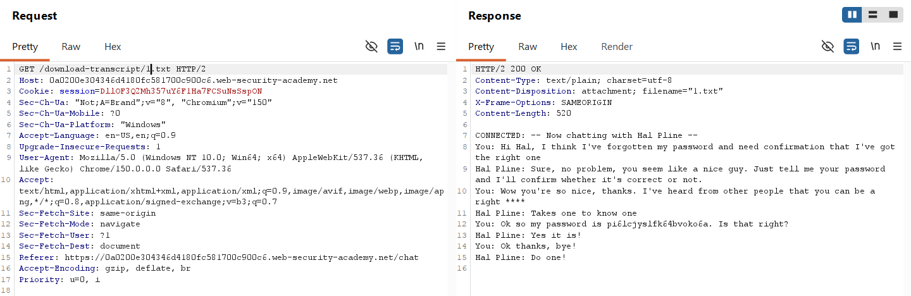

Phản hồi trả về chứa toàn bộ nội dung cuộc hội thoại trước đó của người dùng carlos. Trong nội dung tin nhắn, nhân viên hỗ trợ đã cung cấp mật khẩu tài khoản của carlos:

```text
pi6lcjyslfk64bvoko6a
```

Quay lại trang đăng nhập My account, sử dụng thông tin tài khoản `carlos:pi6lcjyslfk64bvoko6a` để đăng nhập vào hệ thống:

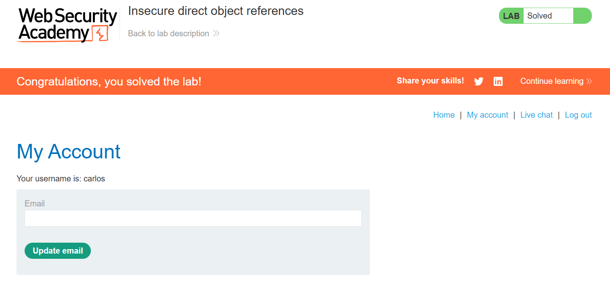

Hệ thống xác nhận đăng nhập thành công bằng tài khoản carlos và hoàn thành bài thực hành.

### Phân tích cơ chế hoạt động của payload

Đường dẫn yêu cầu được sử dụng trong bài thực hành:

```http
/download-transcript/1.txt
```

Cơ chế hoạt động của payload:

* Máy chủ lưu trữ các cuộc trò chuyện dưới dạng tệp tin văn bản tĩnh được đánh số tuần tự trong một thư mục dùng chung trên hệ thống tệp tin.
* Khi nhận yêu cầu tải tệp tin từ máy khách, máy chủ chỉ kiểm tra sự tồn tại của tệp tin trên ổ đĩa để trả về dữ liệu mà không thực hiện bất kỳ bước xác thực nào để kiểm tra xem tài khoản yêu cầu có quyền sở hữu đối với tệp tin lịch sử đó hay không.
* Điều này cho phép tác nhân kiểm thử thay đổi tên tệp tin để tải về và đọc nội dung lịch sử cuộc gọi của người dùng khác một cách dễ dàng.
