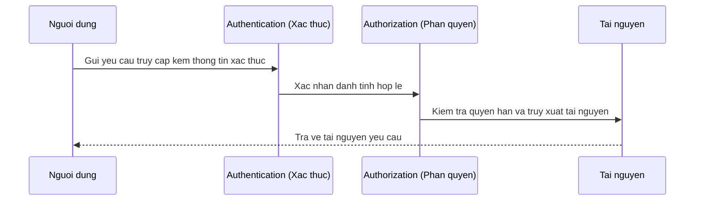
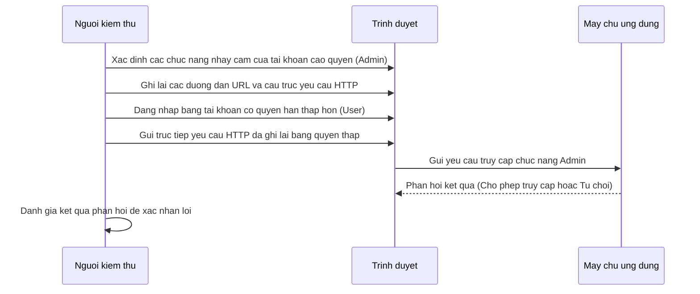

# Broken Access Control BAC

> **Tình huống thực tế:**
> Người dùng A đang xem hóa đơn của bản thân tại liên kết: `https://example.com/invoice?id=121`.
> Người dùng A thay đổi giá trị của tham số `id` từ `121` thành `122` (hóa đơn của người dùng B).
> Nếu máy chủ xử lý thành công yêu cầu và trả về toàn bộ nội dung hóa đơn của người dùng B cho người dùng A, hệ thống đã mắc lỗi phân quyền.

## Tài liệu tham khảo

* [portswigger.net/web-security/access-control](https://portswigger.net/web-security/access-control)
* [viblo.asia/p/access-control-vulnerability-lo-hong-kiem-soat-truy-cap-phan-1-3RlL5YrzLbB](https://viblo.asia/p/access-control-vulnerability-lo-hong-kiem-soat-truy-cap-phan-1-3RlL5YrzLbB)
* [owasp.org/www-community/Broken_Access_Control](https://owasp.org/www-community/Broken_Access_Control)

## Bố cục nội dung

```text
Broken Access Control (BAC)

* Kiến thức nền tảng kiểm soát truy cập
    * Khái niệm Access Control và Broken Access Control
    * Quy trình xử lý yêu cầu truy cập (Access Request Flow)
    * Phân biệt nhanh Authentication vs Authorization
    * Phân biệt Horizontal và Vertical Privilege Escalation
    * Mối liên hệ giữa IDOR và Broken Access Control
    * Kỹ thuật duyệt tệp tin bắt buộc (Force Browsing)
    * Phát hiện trang quản trị lộ đường dẫn (Unprotected Admin Pages)
    * Quy trình kiểm thử phân quyền cơ bản (Pentest Workflow)
* Kiểm thử phân quyền thực tế với Burp Suite
    * Mô hình phân quyền dựa trên vai trò (RBAC) và thuộc tính (ABAC) trong thực tế
    * Phân quyền mức API (API Authorization)
    * Thiết lập ma trận vai trò (Role Matrix) cho ứng dụng phức tạp
    * Lỗi phân quyền phụ thuộc ngữ cảnh (Context dependent Access Control)
    * Lỗi logic nghiệp vụ bỏ quên phân quyền (Business Logic Access Control)
    * Kiểm soát phân quyền dựa trên tiêu đề Referer (Referer-based Access Control)
    * Kiểm soát phân quyền dựa trên địa lý và IP (Location-based Access Control)
* Các kỹ thuật bypass cơ chế phân quyền nâng cao (Tư duy OSCP thực chiến)
    * Thay đổi phương thức yêu cầu HTTP (Method Override)
    * Sử dụng các tiêu đề HTTP tùy biến (X-Original-URL, X-Rewrite-URL)
    * Lợi dụng sự sai lệch cấu hình máy chủ Web và Proxy (Proxy/Routing misconfiguration)
    * Giả mạo IP mạng nội bộ qua tiêu đề HTTP (IP header spoofing)
    * Chuỗi tấn công kết hợp leo thang đặc quyền (Chaining vulnerabilities)
* Biện pháp phòng chống và khắc phục lỗ hổng
    * Quy tắc từ chối mặc định (Deny by default)
    * Quản lý phân quyền tập trung tại máy chủ
* Case Study thực tế ngoài đời
    * Case 1: Người dùng thường truy cập trực tiếp đường dẫn quản trị (Vertical)
    * Case 2: Ẩn nút xóa trên giao diện nhưng API xóa vẫn hoạt động (Function-level)
    * Case 3: Sửa đổi đơn hàng đã xuất bản thông qua API chỉnh sửa (Context-dependent)
* Danh sách kiểm tra Pentest Checklist và Cheat Sheet nhanh
```

## Kiến thức nền tảng kiểm soát truy cập

### Khái niệm Access Control và Broken Access Control

Kiểm soát truy cập (Access Control) là việc thiết lập các rào cản kỹ thuật nhằm hạn chế khả năng truy cập vào tài nguyên hoặc các chức năng của hệ thống đối với các chủ thể không có thẩm quyền. 

Lỗi kiểm soát truy cập bị phá vỡ (Broken Access Control - BAC) xảy ra khi các chốt chặn này bị vượt qua, cho phép người dùng thực hiện các hành động nằm ngoài phạm vi quyền hạn được cấp phép của họ.

### Quy trình xử lý yêu cầu truy cập (Access Request Flow)

Quy trình xử lý yêu cầu truy cập thông thường của một hệ thống được thực hiện tuần tự qua các bước:

```text
Người dùng (User)
      │
      ▼
Xác thực danh tính (Authentication - Người truy cập là ai?)
      │
      ▼
Kiểm tra phân quyền (Authorization - Người truy cập được phép làm gì?)
      │
      ▼
Tài nguyên / Chức năng hệ thống (Resource)
```

Hoặc qua sơ đồ trình tự:



### Phân biệt nhanh Authentication vs Authorization

Hai khái niệm này đại diện cho các chốt chặn bảo mật khác nhau:

* **Authentication (Xác thực):** Xác minh danh tính để biết người truy cập là ai. Ví dụ: Đăng nhập bằng tài khoản và mật khẩu thành công.
* **Authorization (Phân quyền):** Xác minh xem danh tính đã đăng nhập có quyền thực hiện một hành động cụ thể hay không. Ví dụ: Người dùng thường không thể truy cập giao diện quản trị Admin.

### Phân biệt Horizontal và Vertical Privilege Escalation

* **Horizontal Privilege Escalation (Leo thang đặc quyền theo chiều ngang):** Người dùng truy cập hoặc sửa đổi tài nguyên của người dùng khác có cùng mức phân quyền trong hệ thống. Ví dụ: Người dùng thường A đọc tin nhắn riêng tư của người dùng thường B.
* **Vertical Privilege Escalation (Leo thang đặc quyền theo chiều dọc):** Người dùng có mức phân quyền thấp thực hiện các chức năng dành riêng cho vai trò có quyền hạn cao hơn. Ví dụ: Người dùng thường truy cập được tính năng xóa tài khoản của Admin.

### Mối liên hệ giữa IDOR và Broken Access Control

Broken Access Control là nhóm lỗi lớn bao quát toàn bộ các vấn đề về phân quyền. 

Insecure Direct Object Reference (IDOR / BOLA) là một dạng lỗi đặc thù nằm trong nhóm Broken Access Control, tập trung vào việc thiếu phân quyền ở mức đối tượng dữ liệu cụ thể (Object-level) khi định danh đối tượng được truyền trực tiếp từ máy khách. 

BAC còn bao gồm các lỗi phân quyền mức chức năng (Function-level) như truy cập các URL quản trị ẩn hoặc thực thi các API cấu hình hệ thống.

### Kỹ thuật duyệt tệp tin bắt buộc (Force Browsing)

Force Browsing là kỹ thuật người kiểm thử cố tình truy cập trực tiếp các đường dẫn URL, tệp tin hoặc thư mục không được công bố công khai trên giao diện web nhưng tồn tại trên máy chủ (ví dụ: `/admin`, `/debug`, `/internal`, `/backup`). 

Force Browsing có thể giúp phát hiện Broken Access Control, nhưng Force Browsing không đồng nghĩa với Broken Access Control. Nếu máy chủ không ngăn chặn hành động duyệt tệp tin bắt buộc này, lỗi phân quyền mới thực sự phát sinh.

### Phát hiện trang quản trị lộ đường dẫn (Unprotected Admin Pages)

Nhiều ứng dụng chỉ ẩn liên kết đến trang quản trị trên giao diện người dùng nhưng không cấu hình phân quyền ở backend máy chủ. Người kiểm thử có thể thực hiện kiểm tra các đường dẫn quản trị, quản lý hoặc lập trình phổ biến bao gồm:
* `/admin`
* `/manage`
* `/dashboard`
* `/internal`
* `/api/admin`
* `/graphql`
* `/swagger`

Nếu máy chủ hiển thị giao diện cấu hình hoặc trả về dữ liệu mà không yêu cầu quyền Admin, lỗi phân quyền mức chức năng được xác nhận tồn tại.

### Quy trình kiểm thử phân quyền cơ bản (Pentest Workflow)

Quy trình thực hiện kiểm thử an toàn thông tin đối với lỗi kiểm soát truy cập diễn ra theo các bước sau:



## Kiểm thử phân quyền thực tế với Burp Suite

### Mô hình phân quyền dựa trên vai trò (RBAC) và thuộc tính (ABAC) trong thực tế

* **RBAC (Role Based Access Control):** Hệ thống gán quyền hạn cho các vai trò cụ thể. Người dùng được gán vào vai trò nào sẽ thừa hưởng toàn bộ quyền của vai trò đó.
* **ABAC (Attribute Based Access Control):** Hệ thống đánh giá quyền truy cập dựa trên sự kết hợp các thuộc tính bao gồm thuộc tính người dùng, thuộc tính tài nguyên và ngữ cảnh hệ thống.

Bảng so sánh nhanh giữa hai mô hình:

| Đặc điểm so sánh | Mô hình RBAC | Mô hình ABAC |
| :--- | :--- | :--- |
| Quyết định quyền truy cập | Dựa vào vai trò (Role) của tài khoản | Dựa vào thuộc tính (Attribute) đi kèm |
| Ví dụ thực tế | Quản trị viên (Admin), Người dùng (User) | Phòng ban, Thời gian truy cập, Địa điểm, Chủ sở hữu |
| Đặc tính cấu hình | Đơn giản, dễ thiết lập và quản lý | Linh hoạt, khả năng tùy biến cao, phức tạp |

### Phân quyền mức API (API Authorization)

Các ứng dụng hiện đại thường tách biệt phần giao diện (Frontend) và phần xử lý dữ liệu (Backend API). Lỗi xảy ra khi lập trình viên chỉ chặn truy cập trang giao diện Admin ở Frontend nhưng bỏ quên việc cấu hình phân quyền cho các endpoint API Backend tương ứng. Người học pentest cần tập trung quan sát và kiểm thử trực tiếp các yêu cầu HTTP gửi đến các API nhạy cảm như:
* `DELETE /api/users/15`
* `POST /api/admin/delete`
* `PATCH /api/orders/12`

### Thiết lập ma trận vai trò (Role Matrix) cho ứng dụng phức tạp

Để kiểm thử hiệu quả các hệ thống lớn có nhiều nhóm người dùng, người kiểm thử cần xây dựng một ma trận vai trò nhằm theo dõi chéo khả năng thực hiện các chức năng:

| Chức năng hệ thống | Vai trò Admin | Vai trò Quản lý | Vai trò Nhân viên | Khách |
| :--- | :--- | :--- | :--- | :--- |
| Tạo tài khoản mới | Cho phép | Từ chối | Từ chối | Từ chối |
| Xem báo cáo doanh thu | Cho phép | Cho phép | Từ chối | Từ chối |
| Cập nhật hồ sơ cá nhân | Cho phép | Cho phép | Cho phép | Từ chối |

Người kiểm thử sử dụng Burp Suite để hoán đổi Cookie hoặc Token giữa các vai trò này nhằm rà soát xem có hành động nào bị thực thi trái phép hay không.

### Lỗi phân quyền phụ thuộc ngữ cảnh (Context dependent Access Control)

Lỗi này phát sinh khi hệ thống kiểm tra quyền hạn của người dùng nhưng bỏ quên việc kiểm tra trạng thái logic của đối tượng dữ liệu tại thời điểm đó.
* Ví dụ: Một tài khoản biên tập viên chỉ được phép chỉnh sửa bài viết khi bài viết đó ở trạng thái Bản nháp (Draft). Khi bài viết đã ở trạng thái Đã xuất bản (Published), nút sửa đổi bị ẩn đi. Nếu máy chủ tiếp nhận yêu cầu sửa đổi bài viết đã xuất bản từ biên tập viên mà vẫn xử lý thành công, hệ thống đã mắc lỗi kiểm soát truy cập phụ thuộc ngữ cảnh.

### Lỗi logic nghiệp vụ bỏ quên phân quyền (Business Logic Access Control)

Lỗi logic nghiệp vụ phát sinh khi hệ thống bỏ qua bước kiểm tra quyền hạn thực tế đối với trạng thái hoạt động của tài nguyên.
* Ví dụ cụ thể: Người bán trên trang thương mại điện tử chỉ được phép sửa thông tin đơn hàng khi đơn hàng đang ở trạng thái Chờ xử lý (Pending). Khi đơn hàng chuyển sang trạng thái Đang giao (Shipping), giao diện Frontend tự động ẩn nút sửa đơn hàng đi. Tuy nhiên, nếu người bán gửi trực tiếp yêu cầu sửa đổi đến API backend, máy chủ vẫn thực hiện việc cập nhật thông tin đơn hàng mà không kiểm tra xem trạng thái đơn hàng đã bị khóa chỉnh sửa hay chưa.

### Kiểm soát phân quyền dựa trên tiêu đề Referer (Referer-based Access Control)

Một số ứng dụng cấu hình cơ chế phân quyền lỏng lẻo bằng cách kiểm tra tiêu đề `Referer` trong yêu cầu HTTP để xác định nguồn gốc của yêu cầu.
* Ví dụ: Nếu yêu cầu có tiêu đề `Referer: https://example.com/admin-panel`, máy chủ tin cậy và cho phép thực thi chức năng.
* Tiêu đề Referer và Origin đều là dữ liệu do trình duyệt máy khách gửi lên và hoàn toàn có thể bị thay đổi, do đó không được sử dụng để quyết định phân quyền tại máy chủ.

### Kiểm soát phân quyền dựa trên địa lý và IP (Location-based Access Control)

Hệ thống giới hạn quyền truy cập trang quản trị hoặc các API nhạy cảm dựa trên địa chỉ IP của máy khách. Ví dụ tiêu biểu là thiết lập quy tắc chỉ cho phép các địa chỉ IP thuộc dải mạng nội bộ của văn phòng công ty mới được phép truy cập vào các trang cấu hình nội bộ.

## Biện pháp phòng chống và khắc phục lỗ hổng

### Quy tắc từ chối mặc định (Deny by default)

Hệ thống cần thiết lập nguyên tắc cấm toàn bộ mọi truy cập vào tất cả các tài nguyên và chức năng theo mặc định. Quyền truy cập chỉ được cấp phát một cách tường minh cho từng nhóm vai trò cụ thể.

### Quản lý phân quyền tập trung tại máy chủ

* Không thực hiện phân quyền ở phía máy khách (Frontend). Mọi kiểm tra quyền hạn phải được xử lý tại máy chủ (Backend).
* Thiết lập một module hoặc thư viện kiểm tra quyền hạn tập trung trong mã nguồn để áp dụng đồng đều cho toàn bộ hệ thống, tránh việc lập trình viên tự viết các đoạn code kiểm tra quyền hạn riêng lẻ tại mỗi API.

## Case Study thực tế ngoài đời

### Case 1: Người dùng thường truy cập trực tiếp đường dẫn quản trị (Vertical)
Một ứng dụng quản lý doanh nghiệp chỉ ẩn liên kết Admin Panel trên giao diện đối với người dùng thường. Người kiểm thử không có đặc quyền quản trị thực hiện nhập trực tiếp đường dẫn `/admin` trên thanh địa chỉ của trình duyệt. Do máy chủ không kiểm tra quyền hạn của phiên làm việc hiện tại đối với đường dẫn này, ứng dụng cho phép người kiểm thử truy cập toàn bộ giao diện quản lý và thực hiện các chức năng cấu hình hệ thống của Admin.

### Case 2: Ẩn nút xóa trên giao diện nhưng API xóa vẫn hoạt động (Function-level)
Một diễn đàn trực tuyến ẩn nút Xóa bài viết đối với các thành viên thông thường. Người kiểm thử thực hiện bắt các yêu cầu HTTP bằng Burp Suite khi tài khoản quản trị thực hiện xóa một bài viết mẫu, xác định được API có dạng `DELETE /api/posts/105`. 

Người kiểm thử sau đó đăng nhập bằng tài khoản thành viên thường, gửi trực tiếp yêu cầu HTTP DELETE tới endpoint trên. Máy chủ tiếp nhận yêu cầu và thực hiện xóa bài viết mà không kiểm tra quyền hạn của tài khoản gửi yêu cầu đối với chức năng xóa.

### Case 3: Sửa đổi đơn hàng đã xuất bản thông qua API chỉnh sửa (Context-dependent)
Một hệ thống quản lý kho hàng cho phép nhân viên cập nhật thông tin sản phẩm khi đơn hàng ở trạng thái Chuẩn bị. Khi đơn hàng đã chuyển sang trạng thái Đang vận chuyển, nút chỉnh sửa trên giao diện web bị vô hiệu hóa. 

Người kiểm thử gửi trực tiếp yêu cầu cập nhật thông tin sản phẩm đến API backend. Do máy chủ chỉ kiểm tra vai trò của tài khoản (nhân viên kho) mà quên kiểm tra thuộc tính trạng thái của đơn hàng, đơn hàng đang vận chuyển vẫn bị thay đổi dữ liệu trái phép.

## Các kỹ thuật bypass cơ chế phân quyền nâng cao (Tư duy OSCP thực chiến)

Trong các môi trường thực chiến hoặc phòng thi chứng chỉ bảo mật chuyên nghiệp, các chốt chặn kiểm soát truy cập thường được thiết lập phức tạp. Người kiểm thử cần áp dụng các kỹ thuật sau để khai thác:

### Thay đổi phương thức yêu cầu HTTP (Method Override)

Một số hệ thống định tuyến (Routing) hoặc tường lửa chỉ áp dụng quy tắc cấm truy cập đối với một số phương thức cụ thể. Người kiểm thử có thể sử dụng các phương thức hoặc tiêu đề đặc biệt để ghi đè yêu cầu:
* Thay thế phương thức POST bằng GET hoặc PUT.
* Sử dụng tiêu đề ghi đè phương thức:
  ```http
  POST /api/users/15 HTTP/1.1
  X-HTTP-Method-Override: DELETE
  ```
  Yêu cầu này có thể vượt qua bộ lọc chặn phương thức DELETE của tường lửa, nhưng khi đến ứng dụng backend, nó vẫn được xử lý như một yêu cầu DELETE.

### Sử dụng các tiêu đề HTTP tùy biến (X-Original-URL, X-Rewrite-URL)

Các máy chủ Web hoặc các thiết bị Reverse Proxy đứng trước thường được cấu hình để kiểm tra quyền truy cập dựa trên đường dẫn URL. 

Nếu cấu hình không đồng bộ, người kiểm thử có thể sử dụng các tiêu đề sau để đánh lừa proxy kiểm tra đường dẫn vô hại, nhưng ứng dụng backend phía sau vẫn xử lý đường dẫn nhạy cảm:

```http
GET /public-page HTTP/1.1
Host: target.com
X-Original-URL: /admin/delete-user
```

Hoặc:

```http
GET / HTTP/1.1
Host: target.com
X-Rewrite-URL: /admin/config
```

### Lợi dụng sự sai lệch cấu hình máy chủ Web và Proxy (Proxy/Routing misconfiguration)

Khi hệ thống sử dụng Reverse Proxy đứng trước để chặn truy cập đến các đường dẫn nhạy cảm, người kiểm thử có thể tìm kiếm sự bất đồng bộ trong việc xử lý đường dẫn giữa Proxy và Backend. 

Kỹ thuật chèn ký tự đặc biệt hoặc khoảng trắng (Path Normalization):
* `/admin/`
* `/admin.`
* `/admin%2f`
* `/admin;/`
* `/public/..;/admin`

Nếu Proxy coi đây là đường dẫn hợp lệ và cho phép đi qua, nhưng máy chủ Backend lại tự động chuẩn hóa chuỗi loại bỏ các ký tự thừa để xử lý yêu cầu truy cập `/admin`, cơ chế bảo mật của Proxy sẽ bị vô hiệu hóa hoàn toàn.

### Giả mạo IP mạng nội bộ qua tiêu đề HTTP (IP header spoofing)

Khi hệ thống thực hiện kiểm soát phân quyền dựa trên địa lý và địa chỉ IP, người kiểm thử có thể thêm các tiêu đề HTTP vào yêu cầu gửi đi để đánh lừa máy chủ rằng yêu cầu xuất phát từ mạng nội bộ:
* `X-Forwarded-For: 127.0.0.1`
* `X-Client-IP: 10.0.0.1`
* `X-Real-IP: 192.168.1.100`

### Chuỗi tấn công kết hợp leo thang đặc quyền (Chaining vulnerabilities)

Người kiểm thử có thể kết hợp lỗi kiểm soát truy cập với các lỗ hổng khác để nâng cao tác động:
* Kết hợp lỗi rò rỉ thông tin (Information Disclosure) để thu thập đường dẫn API ẩn, sau đó thực hiện gọi trực tiếp API này để thực thi chức năng.
* Kết hợp lỗi Parameter Tampering với lỗi ghi nhận quyền để sửa đổi thông tin quyền hạn của bản thân.

## Danh sách kiểm tra Pentest Checklist và Cheat Sheet nhanh

* [ ] Kiểm tra xem giao diện UI và các Endpoint API có sử dụng chung cơ chế phân quyền đồng bộ hay không.
* [ ] So sánh và đối chiếu quyền hạn chi tiết giữa các vai trò khác nhau (Role comparison).
* [ ] Thử thực hiện gửi lại các yêu cầu (Replay request) bằng tài khoản có vai trò thấp hơn.
* [ ] Kiểm tra toàn bộ các Endpoint ẩn thu thập được từ mã nguồn Frontend hoặc tài liệu kỹ thuật.
* [ ] Rà soát toàn bộ các file mã nguồn tĩnh (JavaScript, HTML) ở Frontend để tìm kiếm các đường dẫn URL ẩn hoặc API ẩn.
* [ ] Kiểm tra cơ chế phân quyền đối với tất cả các phương thức HTTP (GET, POST, PUT, DELETE, PATCH).
* [ ] Thực hiện kiểm tra khả năng Force Browsing truy cập trực tiếp các trang chức năng quản trị khi chưa đăng nhập.
* [ ] Kiểm tra phân quyền dựa trên ngữ cảnh hoạt động của đối tượng (trạng thái đóng/mở, khóa/kích hoạt).
* [ ] Kiểm tra xem hệ thống có tin cậy các thông tin IP và vị trí địa lý từ tiêu đề HTTP gửi lên hay không.
* [ ] Sử dụng các tiêu đề HTTP tùy biến (X-Original-URL, X-Rewrite-URL) để kiểm tra khả năng vượt qua chốt chặn của Proxy.
* [ ] Rà soát cấu hình phân quyền của máy chủ API và đảm bảo áp dụng nguyên tắc từ chối mặc định (Deny by default).
