# PortSwigger BAC

## Bài tập 1: Unprotected admin functionality

### Yêu cầu bài tập

Bài thực hành cung cấp một trang quản trị Admin panel không được bảo vệ. Để hoàn thành bài thực hành, cần thực hiện truy cập trang quản trị này và tiến hành xóa tài khoản người dùng carlos.

### Phân tích lỗ hổng

Lỗ hổng kiểm soát truy cập bị phá vỡ (Broken Access Control) mức chức năng phát sinh khi lập trình viên thiết lập trang quản trị nhạy cảm nhưng lại không cấu hình bất kỳ cơ chế xác thực hoặc phân quyền nào ở phía máy chủ (Backend). Lập trình viên chỉ cố gắng che giấu trang này bằng cách không hiển thị liên kết trên giao diện người dùng và đưa đường dẫn vào tệp cấu hình điều hướng bot tìm kiếm `/robots.txt` để yêu cầu các công cụ tìm kiếm không lập chỉ mục trang.

Hành động này vi phạm nguyên tắc bảo mật thông qua sự che giấu (Security through obscurity). Do máy chủ hoàn toàn không kiểm tra quyền hạn của người gửi yêu cầu đối với đường dẫn quản trị này, bất kỳ người dùng nào biết được đường dẫn (thông qua việc đọc tệp `/robots.txt`) đều có thể truy cập trực tiếp và thực thi các chức năng quản trị.

### Quy trình thực hiện chi tiết

Trang chủ của bài thực hành hiển thị danh sách các sản phẩm:

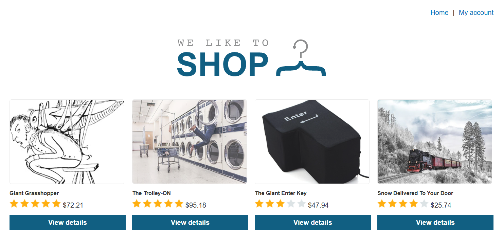

Khi tiếp cận một trang web mới để tìm kiếm các khu vực chức năng bị ẩn, quy trình kiểm thử khuyến nghị kiểm tra các tài nguyên chuẩn được cấu hình công khai trên máy chủ, phổ biến nhất là tệp tin `/robots.txt` và `/sitemap.xml`.

Tiến hành truy cập đường dẫn `/robots.txt` của ứng dụng:

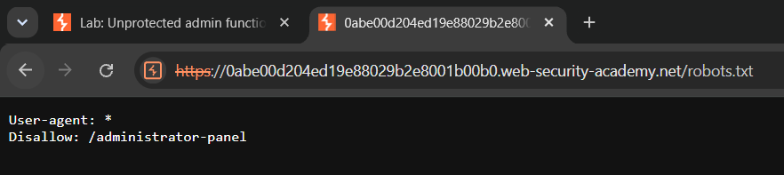

Phản hồi nhận về chứa nội dung cấu hình chỉ thị cho các bot tìm kiếm:

```text
User-agent: *
Disallow: /administrator-panel
```

Chỉ thị `Disallow: /administrator-panel` cho thấy lập trình viên muốn ngăn chặn các công cụ tìm kiếm tự động truy cập vào trang quản trị tại `/administrator-panel`. Điều này vô tình làm lộ đường dẫn nhạy cảm của trang quản trị cho người kiểm thử.

Tiến hành truy cập trực tiếp đường dẫn vừa tìm được bằng trình duyệt:

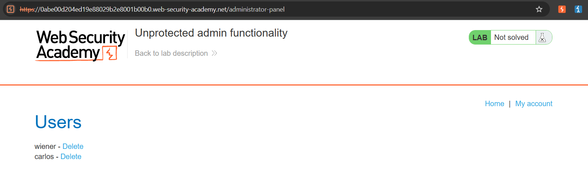

Do máy chủ không thực hiện kiểm tra quyền hạn, giao diện trang quản lý Admin panel hiển thị đầy đủ danh sách người dùng và nút xóa tài khoản.

Nhấp chọn liên kết xóa tài khoản carlos để hoàn thành bài thực hành:

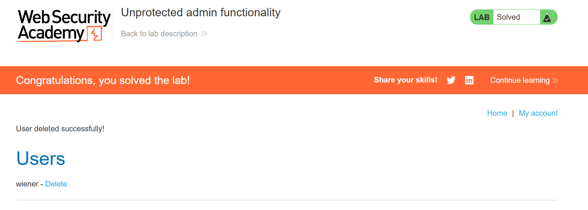

### Phân tích cơ chế hoạt động của payload

Đường dẫn truy cập được sử dụng trong bài thực hành: `/robots.txt` và `/administrator-panel`

Giải thích hoạt động chi tiết:

* Tệp `/robots.txt` là một tệp cấu hình công khai được đặt tại thư mục gốc của máy chủ web dùng để hướng dẫn các bot tìm kiếm (như Googlebot) về các đường dẫn không được phép thu thập thông tin. Tuy nhiên, tệp này hoàn toàn có thể được đọc bởi bất kỳ người dùng thông thường nào. Việc đưa các đường dẫn nhạy cảm vào chỉ thị Disallow mà không cấu hình phân quyền bảo vệ thực tế sẽ trực tiếp làm lộ các tài nguyên ẩn của hệ thống.
* Khi người dùng gửi yêu cầu truy cập đến `/administrator-panel`, máy chủ web xử lý yêu cầu và trả về giao diện quản trị mà không thực hiện kiểm tra Cookie phiên làm việc hoặc xác thực vai trò quản trị viên ở Backend.

## Bài tập 2: Unprotected admin functionality with unpredictable URL

### Yêu cầu bài tập

Bài thực hành cung cấp một trang quản trị Admin panel không được bảo vệ nằm tại một đường dẫn ngẫu nhiên không thể dự đoán trước. Tuy nhiên, đường dẫn này bị rò rỉ tại một vị trí trong ứng dụng. Để hoàn thành bài thực hành, cần thực hiện tìm kiếm đường dẫn trang quản trị, truy cập vào giao diện quản trị và thực hiện xóa tài khoản người dùng carlos.

### Phân tích lỗ hổng

Lỗ hổng kiểm soát truy cập bị phá vỡ mức chức năng kết hợp rò rỉ thông tin nhạy cảm. Lập trình viên cố gắng bảo vệ trang quản trị bằng cách sử dụng một đường dẫn ngẫu nhiên khó đoán thay vì các đường dẫn tuần tự phổ biến. Tuy nhiên, mã nguồn JavaScript gửi về phía máy khách lại chứa logic điều kiện kiểm tra vai trò người dùng (biến `isAdmin`) để tự động tạo và đính kèm đường dẫn này vào cấu trúc giao diện HTML.

Do mã nguồn JavaScript chạy hoàn toàn ở trình duyệt máy khách (Frontend), bất kỳ người dùng nào cũng có thể đọc được mã nguồn và trích xuất đường dẫn ẩn này. Khi máy chủ nhận được yêu cầu truy cập đến đường dẫn ngẫu nhiên đó, nó lại hoàn toàn không thực hiện kiểm tra quyền hạn ở phía Backend, dẫn đến việc người dùng thường có thể truy cập trái phép.

### Quy trình thực hiện chi tiết

Trang chủ của bài thực hành hiển thị danh sách các sản phẩm.

Theo yêu cầu bài tập, đường dẫn trang quản trị Admin panel có thể bị rò rỉ trong ứng dụng. Do đó, cần kiểm tra mã nguồn (Source Code) của trang chủ.

Sử dụng tính năng kiểm tra phần tử hoặc xem mã nguồn trang chủ, phát hiện đoạn mã JavaScript xử lý kiểm tra vai trò người dùng chứa đường dẫn ẩn của trang quản trị `/admin-1vmmay`:

```javascript
var isAdmin = false;
if (isAdmin) {
   var topLinksTag = document.getElementsByClassName("top-links")[0];
   var adminPanelTag = document.createElement('a');
   adminPanelTag.setAttribute('href', '/admin-1vmmay');
   adminPanelTag.innerText = 'Admin panel';
   topLinksTag.append(adminPanelTag);
   var pTag = document.createElement('p');
   pTag.innerText = '|';
   topLinksTag.appendChild(pTag);
}
```

Mặc dù biến `isAdmin` được thiết lập giá trị `false` khiến tab Admin panel bị ẩn trên giao diện trình duyệt, đường dẫn ẩn của trang quản trị `/admin-1vmmay` đã bị rò rỉ hoàn toàn trong mã nguồn JavaScript tải về máy khách.

Tiến hành truy cập trực tiếp đường dẫn tìm được bằng cách nhập lên thanh địa chỉ của trình duyệt:

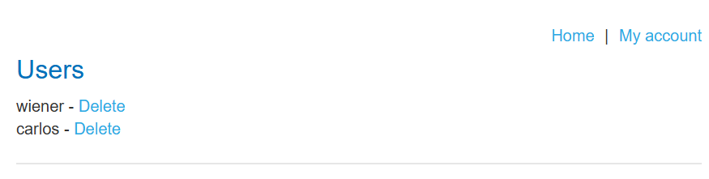

Giao diện trang quản trị hiển thị thành công danh sách người dùng. Nhấp chọn liên kết xóa tài khoản carlos để hoàn thành bài thực hành:

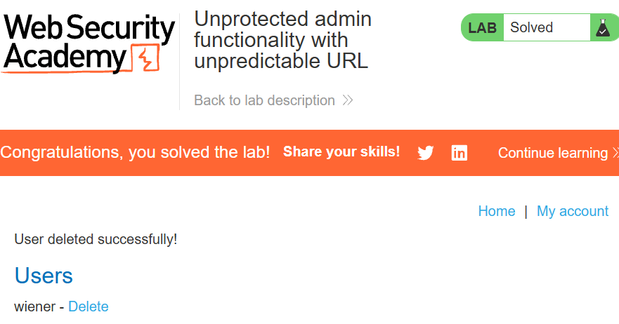

### Phân tích cơ chế hoạt động của payload

Đường dẫn truy cập sử dụng trong bài thực hành: `/admin-1vmmay`

Giải thích hoạt động chi tiết:

* Việc che giấu liên kết bằng mã JavaScript ở phía Frontend không có tác dụng bảo vệ nếu máy chủ không kiểm tra quyền hạn thực thi khi nhận yêu cầu gửi trực tiếp đến tài nguyên backend đó.
* Máy chủ xử lý yêu cầu GET đến đường dẫn ẩn ngẫu nhiên và trả về toàn bộ dữ liệu quản trị mà không xác thực xem Cookie phiên làm việc của tài khoản hiện tại có thuộc vai trò quản trị viên hay không.

## Bài tập 3: User role can be modified in user profile

### Yêu cầu bài tập

Bài thực hành cung cấp một trang quản trị tại `/admin` chỉ cho phép người dùng đã đăng nhập có thuộc tính vai trò `roleid` bằng `2` truy cập. Để hoàn thành bài thực hành, cần đăng nhập vào tài khoản thường được cấp, thực hiện thay đổi giá trị vai trò của bản thân thành `2`, truy cập trang quản trị và thực hiện xóa người dùng carlos. Tài khoản được cung cấp: `wiener:peter`.

### Phân tích lỗ hổng

Lỗ hổng phân quyền phát sinh do máy chủ tin tưởng hoàn toàn vào các thuộc tính cấu hình người dùng (tham số `roleid`) được gửi lên từ phía máy khách mà không kiểm tra tính hợp lệ hoặc chặn việc tự ý thay đổi các trường dữ liệu nhạy cảm này.

Khi người dùng thực hiện cập nhật thông tin cá nhân (như email) dưới dạng dữ liệu JSON, ứng dụng cho phép chèn thêm các trường dữ liệu khác (như trường roleid với giá trị 2). Máy chủ tự động ánh xạ dữ liệu JSON đầu vào vào đối tượng cơ sở dữ liệu (Mass Assignment / Parameter Binding), dẫn đến việc người dùng tự nâng quyền của bản thân lên vai trò quản trị viên.

### Quy trình thực hiện chi tiết

Trang chủ của bài thực hành hiển thị danh sách sản phẩm:

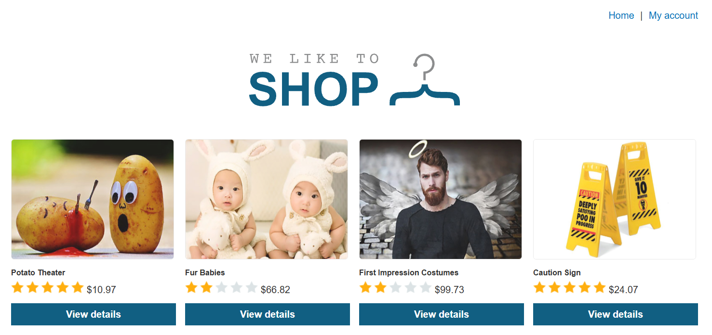

Đăng nhập tài khoản với thông tin đăng nhập được cung cấp `wiener:peter`. Sau khi đăng nhập thành công, giao diện hiển thị thông tin trang cá nhân:

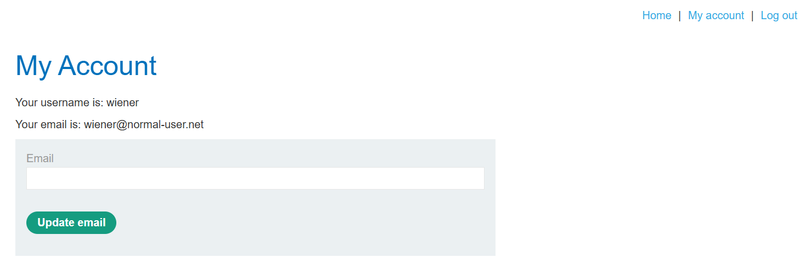

Sử dụng Burp Suite để phân tích lịch sử các yêu cầu HTTP sau khi đăng nhập và thực hiện thay đổi địa chỉ email trên trang cá nhân để xem cấu trúc dữ liệu truyền đi.

Yêu cầu HTTP POST khi cập nhật địa chỉ email:

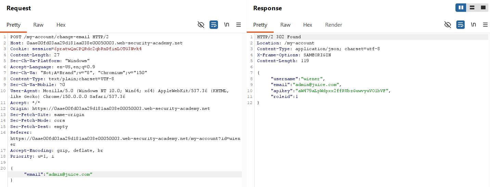

Cấu trúc yêu cầu gửi lên máy chủ dạng JSON:

```json
{"email":"test@gmail.com"}
```

Chuyển yêu cầu HTTP POST sang tab Repeater của Burp Suite, thêm giá trị của tham số thành `"roleid": 2` để nâng quyền hạn và gửi đi:

```json
{"email":"test@gmail.com","roleid":2}
```

Phản hồi trả về từ máy chủ xác nhận giá trị `roleid` đã được cập nhật thành `2` thành công:

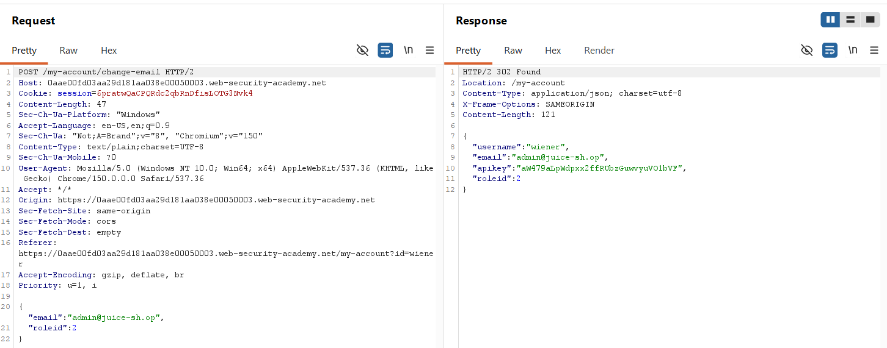

Tải lại giao diện trang cá nhân trên trình duyệt. Nhận thấy liên kết Admin panel đã xuất hiện trên thanh trình đơn do tài khoản đã được nâng cấp quyền quản trị:

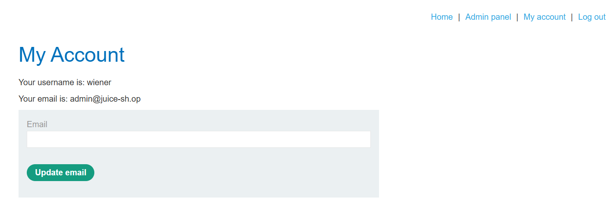

Nhấp chọn Admin panel để truy cập giao diện quản trị `/admin`:

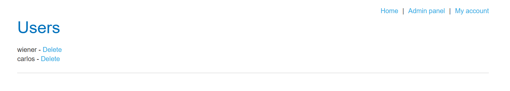

Nhấp chọn liên kết xóa tài khoản carlos để hoàn thành bài thực hành:

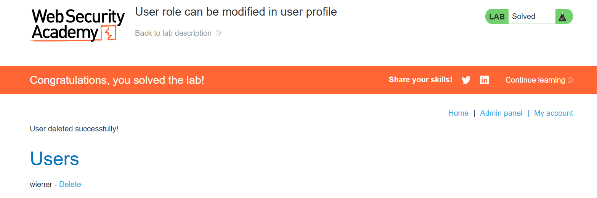

### Phân tích cơ chế hoạt động của payload

Cấu trúc dữ liệu JSON gửi lên máy chủ: `{"roleid": 2}`

Giải thích hoạt động chi tiết:

* Ứng dụng sử dụng cơ chế liên kết dữ liệu tự động (Auto-binding) mà không lọc bỏ hoặc cấm sửa đổi đối với các thuộc tính kiểm soát vai trò người dùng. Máy chủ xử lý dữ liệu JSON gửi lên từ máy khách, thực hiện cập nhật toàn bộ các trường khớp với cơ sở dữ liệu của tài khoản.
* Sau khi giá trị `roleid` được cập nhật thành `2` trong cơ sở dữ liệu, các yêu cầu truy cập tiếp theo đến `/admin` được máy chủ xử lý hợp lệ vì hệ thống ghi nhận tài khoản hiện tại sở hữu vai trò quản trị viên.

## Bài tập 4: Định danh người dùng được kiểm soát qua tham số yêu cầu

### Yêu cầu bài tập

Bài thực hành chứa một lỗ hổng phân quyền theo chiều ngang tại trang thông tin tài khoản người dùng. Để hoàn thành bài thực hành, cần thực hiện truy cập tài khoản của người dùng carlos để lấy mã API key và nộp kết quả. Thông tin đăng nhập được cung cấp là `wiener:peter`.

### Phân tích lỗ hổng

Đây là lỗ hổng phân quyền theo chiều ngang cơ bản (Horizontal Privilege Escalation), hay còn gọi là IDOR (Insecure Direct Object Reference) / BOLA. Lỗ hổng phát sinh do ứng dụng sử dụng cơ chế tham chiếu đối tượng trực tiếp (tham số id trên URL) để xác định trang tài khoản hiển thị cho người dùng, nhưng máy chủ lại hoàn toàn tin cậy vào tham số này mà không thực hiện kiểm tra quyền sở hữu đối với phiên làm việc hiện tại (Cookie).

Do đó, người kiểm thử sau khi đăng nhập bằng tài khoản thông thường chỉ cần thay đổi giá trị của tham số id trên đường dẫn URL thành tên tài khoản khác để truy cập trái phép toàn bộ dữ liệu nhạy cảm của tài khoản đó.

### Quy trình thực hiện chi tiết

Trang chủ của bài thực hành hiển thị danh sách sản phẩm:


Thực hiện đăng nhập tại trang My account với thông tin tài khoản được cung cấp `wiener:peter`:

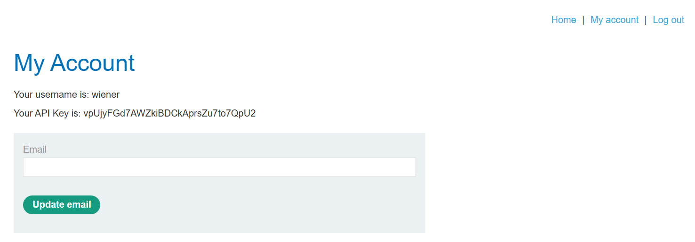

Sau khi đăng nhập thành công, giao diện hiển thị thông tin trang cá nhân của wiener bao gồm mã API key.

Sử dụng Burp Suite để kiểm tra lịch sử các yêu cầu HTTP. Quan sát thấy yêu cầu lấy thông tin tài khoản cá nhân sau khi đăng nhập:

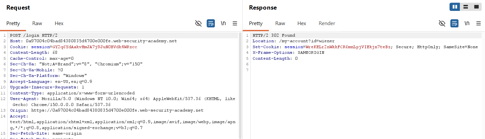

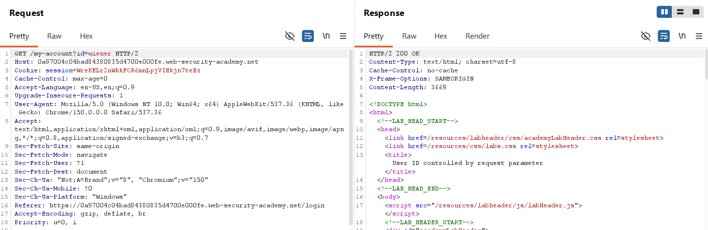

Yêu cầu HTTP GET sử dụng tham số id để xác định tài khoản hiển thị:

```http
GET /my-account?id=wiener HTTP/1.1
```

Gửi yêu cầu này sang tab Repeater, thay đổi giá trị của tham số `id` từ `wiener` thành `carlos` và gửi đi:

```http
GET /my-account?id=carlos HTTP/1.1
```

Phản hồi trả về chứa giao diện trang cá nhân và mã API key của carlos:

```text
AIpqULvKa2FYR0nV1WKCbg5xqpK8IufW
```

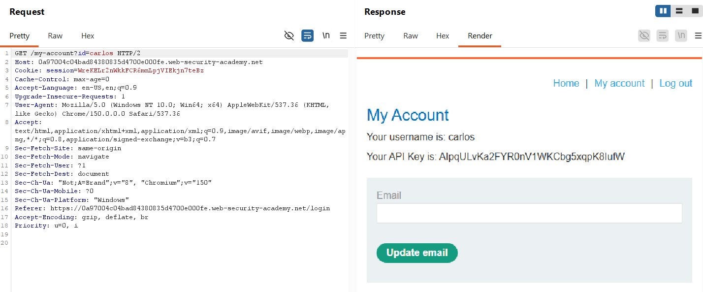

Thực hiện sao chép mã API key này, nộp trên giao diện để hoàn thành bài thực hành:

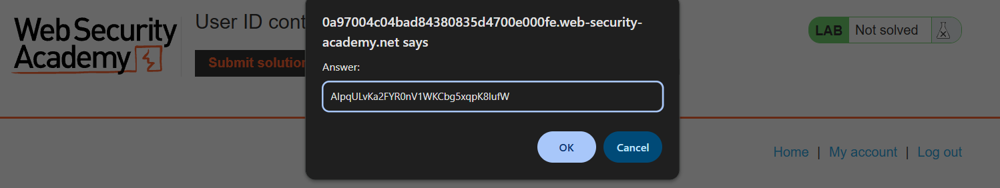

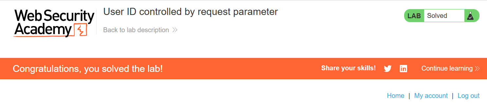

### Phân tích cơ chế hoạt động của payload

Đường dẫn yêu cầu chỉnh sửa được sử dụng: `/my-account?id=carlos`

Giải thích hoạt động chi tiết:

* Máy chủ web tiếp nhận tham số `id=carlos` từ yêu cầu GET của trình duyệt máy khách.
* Máy chủ tiến hành truy vấn cơ sở dữ liệu để lấy thông tin tài khoản tương ứng với định danh carlos và kết xuất giao diện HTML phản hồi.
* Do máy chủ bỏ qua bước xác thực phân quyền giữa Cookie phiên làm việc của tài khoản đang đăng nhập (wiener) và tham số định danh tài khoản được yêu cầu (carlos), người dùng thường có thể dễ dàng đọc trộm dữ liệu nhạy cảm của tài khoản khác.

## Bài tập 5: Vượt qua cơ chế kiểm soát truy cập dựa trên URL

### Yêu cầu bài tập

Bài thực hành cung cấp một trang quản trị Admin panel không yêu cầu xác thực tại địa chỉ `/admin`. Tuy nhiên, hệ thống Front-end đã được cấu hình để chặn tất cả các yêu cầu từ bên ngoài truy cập vào đường dẫn này. Ứng dụng Backend được xây dựng trên một framework hỗ trợ đọc tiêu đề `X-Original-URL`. Để hoàn thành bài thực hành, cần thực hiện vượt qua cơ chế kiểm soát truy cập này, truy cập vào giao diện quản trị và thực hiện xóa tài khoản người dùng carlos.

### Phân tích lỗ hổng

Lỗ hổng xảy ra do sự bất đồng bộ trong cách xử lý và diễn giải đường dẫn yêu cầu HTTP giữa hệ thống Front-end (như Reverse Proxy hoặc WAF) và ứng dụng Backend.

Hệ thống Front-end đóng vai trò chốt chặn kiểm soát truy cập, chỉ phân tích đường dẫn URL trong dòng yêu cầu gốc (Request Line) để chặn các yêu cầu chứa cụm từ `/admin`. Tuy nhiên, máy chủ Backend lại sử dụng một framework hỗ trợ đọc tiêu đề `X-Original-URL` để thực hiện cơ chế ghi đè đường dẫn (Override) trực tiếp ngay từ đầu, thay thế hoàn toàn đường dẫn yêu cầu gốc.

Cơ chế này hoàn toàn khác biệt với cơ chế dự phòng (Fallback) khi đường dẫn gốc không tồn tại. Máy chủ Backend thực hiện ghi đè giá trị đường dẫn xử lý thực tế bằng giá trị của tiêu đề `X-Original-URL` mà không cần xác nhận sự tồn tại của đường dẫn gốc trên dòng yêu cầu. Do đó, kẻ tấn công gửi yêu cầu tới đường dẫn gốc `/`, nhưng Backend lại xử lý yêu cầu đó tại trang quản trị `/admin`, giúp vượt qua chốt chặn của Front-end.

### Quy trình thực hiện chi tiết

Trang chủ của bài thực hành hiển thị danh sách sản phẩm:


Khi cố gắng truy cập trực tiếp trang quản trị thông qua đường dẫn `/admin`, Front-end phát hiện đường dẫn bị cấm và trả về thông báo lỗi từ chối truy cập Access denied:

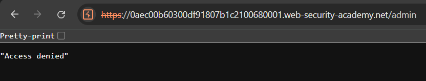

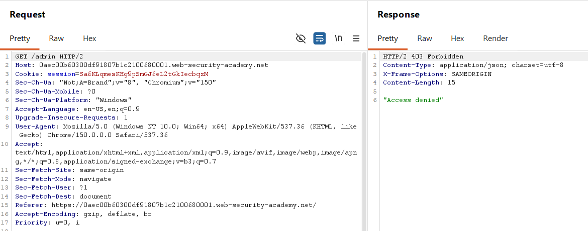

Sử dụng Burp Suite để chỉnh sửa yêu cầu. Gửi yêu cầu GET đến đường dẫn gốc `/`, đồng thời chèn thêm tiêu đề `X-Original-URL: /admin` để thực hiện kiểm thử:

```http
GET / HTTP/1.1
Host: lab-id.web-security-academy.net
X-Original-URL: /admin
```

Phản hồi trả về hiển thị thành công giao diện quản trị Admin panel:

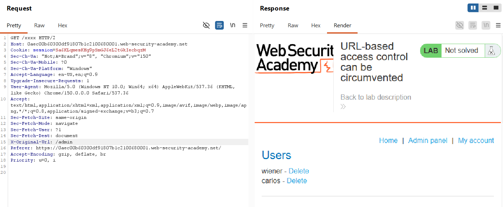

Phân tích mã nguồn HTML phản hồi để tìm kiếm chức năng xóa người dùng carlos:

```html
<a href="/admin/delete?username=carlos">Delete</a>
```

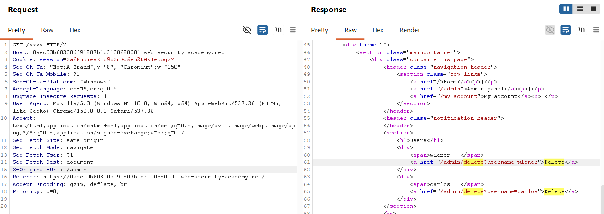

Nếu gửi trực tiếp yêu cầu `GET /admin/delete?username=carlos`, Front-end sẽ chặn lại ngay lập tức vì đường dẫn chứa `/admin`. Do đó, cần tiếp tục sử dụng tiêu đề `X-Original-URL` để ghi đè đường dẫn.

Nếu cấu hình tiêu đề `X-Original-URL: /admin/delete?username=carlos` và dòng yêu cầu gốc `GET /`, máy chủ Backend sẽ báo lỗi thiếu tham số username (Missing parameter 'username') do backend chỉ đọc đường dẫn từ tiêu đề và bỏ qua các tham số truy vấn đi kèm trong tiêu đề.

Thiết lập yêu cầu chính xác bằng cách truyền tham số truy vấn trên dòng yêu cầu gốc `GET /?username=carlos`, đồng thời cấu hình tiêu đề `X-Original-URL: /admin/delete`:

```http
GET /?username=carlos HTTP/1.1
Host: lab-id.web-security-academy.net
X-Original-URL: /admin/delete
```

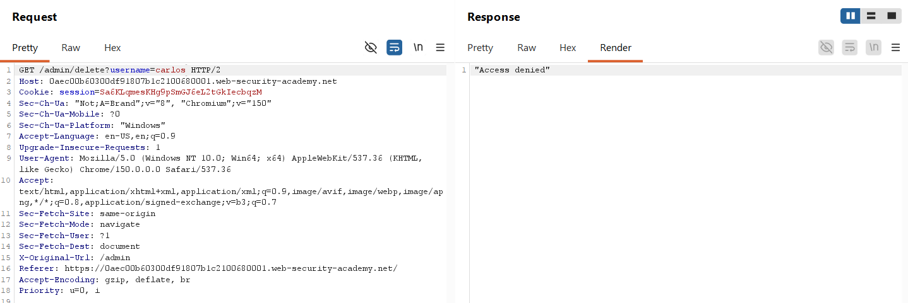

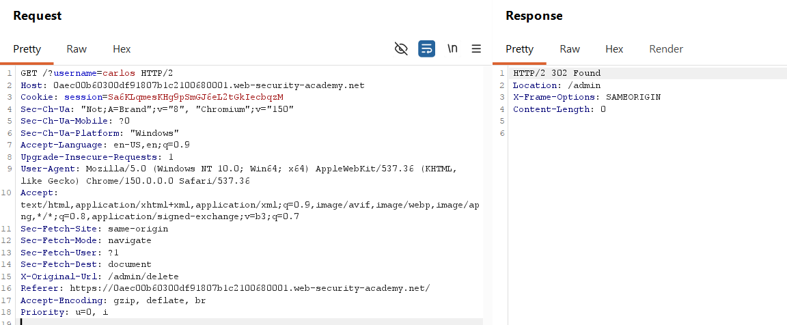

Phản hồi nhận về mã trạng thái HTTP 302 Found điều hướng, cho thấy tài khoản carlos đã bị xóa thành công và bài thực hành được hoàn thành:

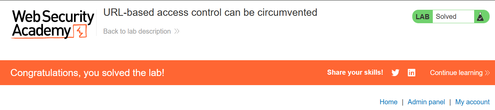

### Phân tích cơ chế hoạt động của payload

Đường dẫn và tiêu đề được sử dụng:

* Dòng yêu cầu gốc: `GET /?username=carlos HTTP/1.1`
* Tiêu đề HTTP: `X-Original-URL: /admin/delete`

Giải thích hoạt động chi tiết:

* **Bước 1. Phân tích tại Front-end:** Front-end kiểm tra dòng yêu cầu gốc. Do đường dẫn gốc `/` là đường dẫn công khai, Front-end cho phép yêu cầu đi qua và chuyển tiếp tới máy chủ Backend. Tiêu đề `X-Original-URL` bị bỏ qua ở lớp này.
* **Bước 2. Ghi đè đường dẫn tại Backend:** Khi Backend nhận yêu cầu, framework phát hiện tiêu đề `X-Original-URL` và ngay lập tức thực hiện ghi đè thuộc tính đường dẫn xử lý thực tế thành giá trị của tiêu đề là `/admin/delete` (không phải cơ chế fallback thử tìm đường dẫn gốc trước).
* **Bước 3. Xử lý tham số truy vấn (Query String):** Do đường dẫn URL trong HTTP được chia làm hai phần độc lập là đường dẫn (Path) và tham số (Query), framework chỉ ghi đè thuộc tính đường dẫn xử lý và giữ nguyên giá trị thuộc tính tham số truy vấn được trích xuất từ dòng yêu cầu gốc (`username=carlos`).

Đoạn mã giả lập (Pseudo-code) minh họa cơ chế định tuyến của máy chủ Backend:

```python
path = request.path
query = request.query

# Framework tu dong ghi de duong dan neu ton tai tieu de
if "X-Original-URL" in headers:
    path = headers["X-Original-URL"]

# Thuc hien dinh tuyen va xu ly yeu cau
route(path, query)
```

Điều này lý giải vì sao yêu cầu gửi đi:

```http
GET /?username=carlos HTTP/1.1
X-Original-URL: /admin/delete
```

Sẽ được Backend diễn giải và thực thi tương đương với yêu cầu:
`GET /admin/delete?username=carlos`

* **Cách thức kiểm chứng thực tế:** Để xác nhận đây là cơ chế ghi đè (Override) trực tiếp chứ không phải cơ chế dự phòng (Fallback), người kiểm thử có thể gửi yêu cầu đến một đường dẫn tồn tại hợp lệ (như đường dẫn gốc `/`) nhưng cấu hình tiêu đề `X-Original-URL: /this-path-does-not-exist`. Nếu cơ chế là dự phòng, máy chủ sẽ trả về trang gốc 200 OK. Tuy nhiên, phản hồi thực tế trả về lỗi `404 Not Found` đối với đường dẫn `/this-path-does-not-exist`, chứng minh máy chủ đã áp dụng ghi đè đường dẫn ngay lập tức.

## Bài tập 6: Vượt qua cơ chế kiểm soát truy cập dựa trên phương thức yêu cầu HTTP

### Yêu cầu bài tập

Bài thực hành cấu hình cơ chế kiểm soát truy cập phân quyền dựa trên phương thức của yêu cầu HTTP (HTTP Method). Có thể đăng nhập bằng tài khoản quản trị viên `administrator:admin` để làm quen với giao diện và các chức năng Admin panel. Để hoàn thành bài thực hành, cần đăng nhập bằng tài khoản thường `wiener:peter`, khai thác lỗ hổng kiểm soát truy cập bị lỗi để tự nâng cấp tài khoản của bản thân thành quản trị viên.

### Phân tích lỗ hổng

Lỗ hổng phân quyền phát sinh do máy chủ chỉ cấu hình bộ lọc phân quyền chặt chẽ trên một phương thức yêu cầu HTTP cụ thể (phương thức `POST` gửi đến endpoint `/admin-roles` để cập nhật vai trò người dùng). Tuy nhiên, máy chủ ứng dụng hoặc framework backend lại chấp nhận xử lý hành động này thông qua các phương thức yêu cầu khác (phương thức `GET`) mà không áp dụng bộ lọc kiểm tra quyền tương ứng.

Người kiểm thử có thể thay đổi phương thức yêu cầu HTTP từ `POST` sang `GET`, chuyển các tham số trong phần thân của yêu cầu POST lên thành các tham số truy vấn (Query string) trên URL. Máy chủ backend sẽ định tuyến và thực thi yêu cầu cập nhật quyền hạn bình thường mà không thực hiện kiểm tra quyền hạn của Cookie gửi kèm, dẫn tới leo thang đặc quyền theo chiều dọc (Vertical Privilege Escalation).

### Quy trình thực hiện chi tiết

Trang chủ của bài thực hành hiển thị danh sách sản phẩm:


Thực hiện đăng nhập với tài khoản quản trị viên `administrator:admin` để khảo sát chức năng. Khi đăng nhập thành công với vai trò admin, giao diện xuất hiện tab Admin panel:

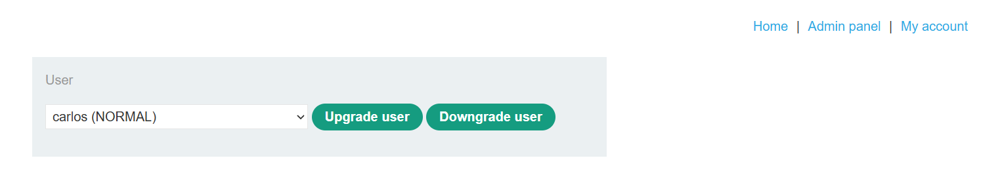

Thực hiện nâng cấp người dùng carlos lên Admin trên giao diện để ghi lại yêu cầu HTTP POST trong lịch sử của Burp Suite:

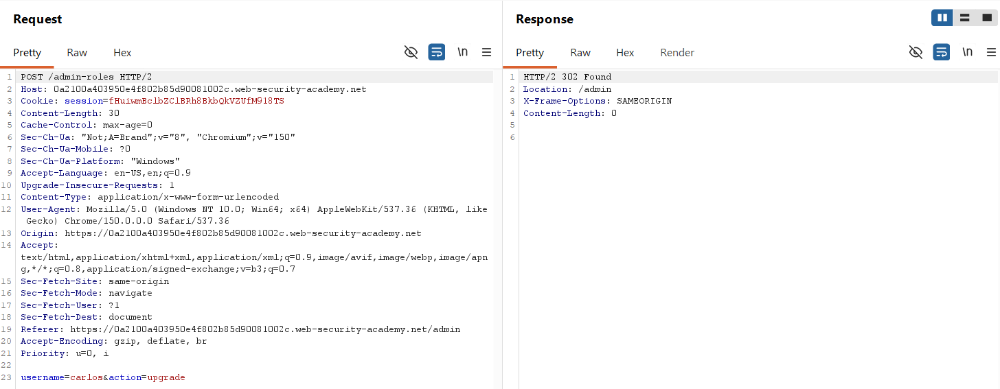

Cấu trúc yêu cầu HTTP POST ban đầu:

```http
POST /admin-roles HTTP/1.1
Content-Type: application/x-www-form-urlencoded

username=carlos&action=upgrade
```

Đăng xuất tài khoản quản trị viên, tiến hành đăng nhập lại với tài khoản người dùng thường `wiener:peter`:

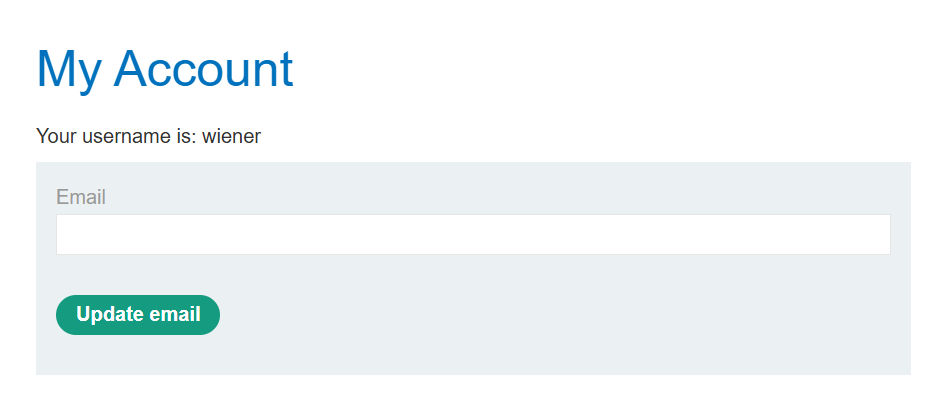

Giao diện tài khoản thường chỉ hiển thị chức năng cập nhật email:

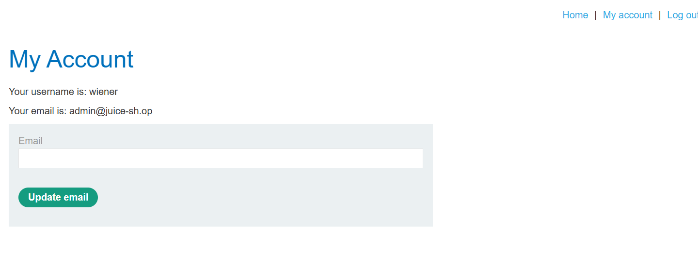

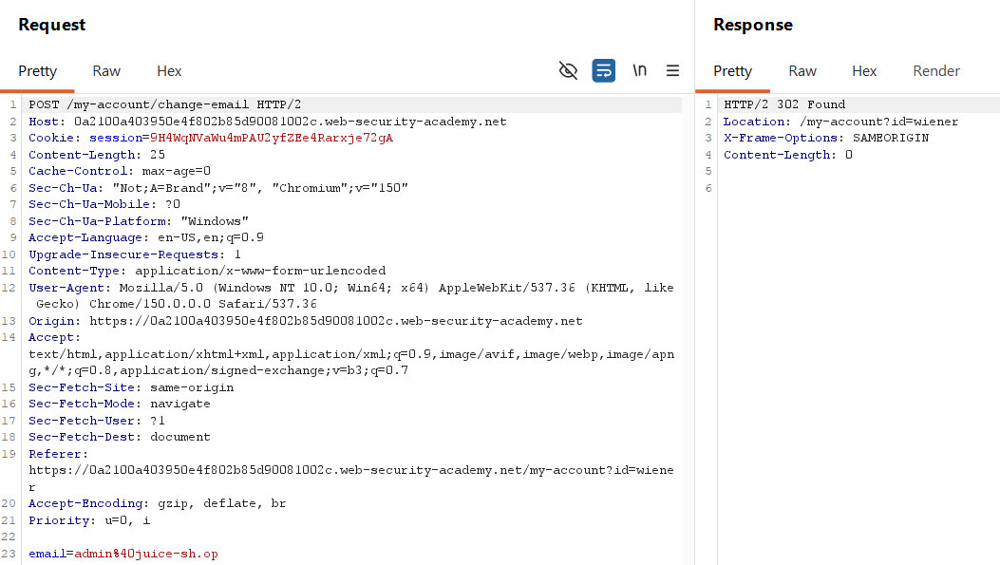

Chuyển yêu cầu cập nhật vai trò Admin ghi nhận được ở trên sang tab Repeater. Giữ nguyên Cookie của tài khoản thường wiener và gửi yêu cầu đi. Kết quả nhận lời nhắn lỗi từ chối truy cập do tài khoản không có quyền:

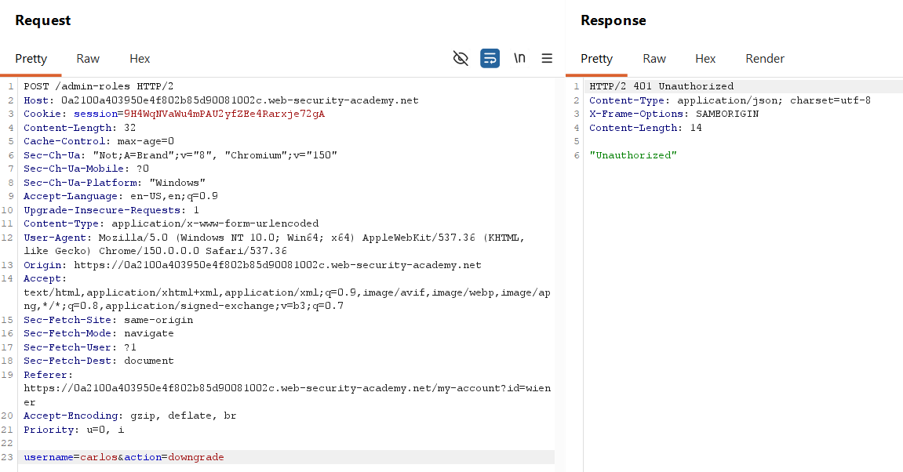

Thực hiện nhấp chuột phải vào yêu cầu trong Repeater và chọn Change request method để đổi phương thức từ `POST` sang `GET`:

```http
GET /admin-roles?username=carlos&action=upgrade HTTP/1.1
```

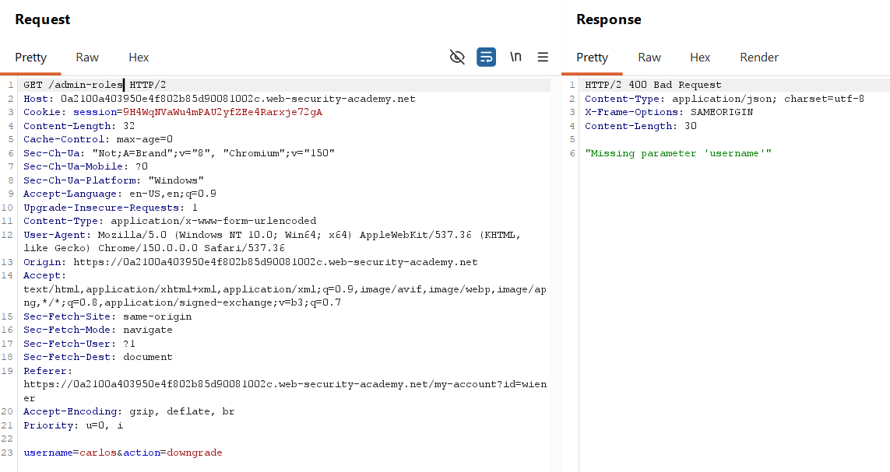

Khi gửi yêu cầu GET này, phản hồi của máy chủ báo lỗi thiếu tham số username (Missing parameter 'username') chứ không chặn quyền truy cập. Điều này cho biết bộ lọc chặn phân quyền đã bị bỏ qua khi thay đổi phương thức.

Chỉnh sửa tham số `username` trên URL từ `carlos` thành `wiener` để thực hiện nâng quyền cho tài khoản hiện tại:

```http
GET /admin-roles?username=wiener&action=upgrade HTTP/1.1
```

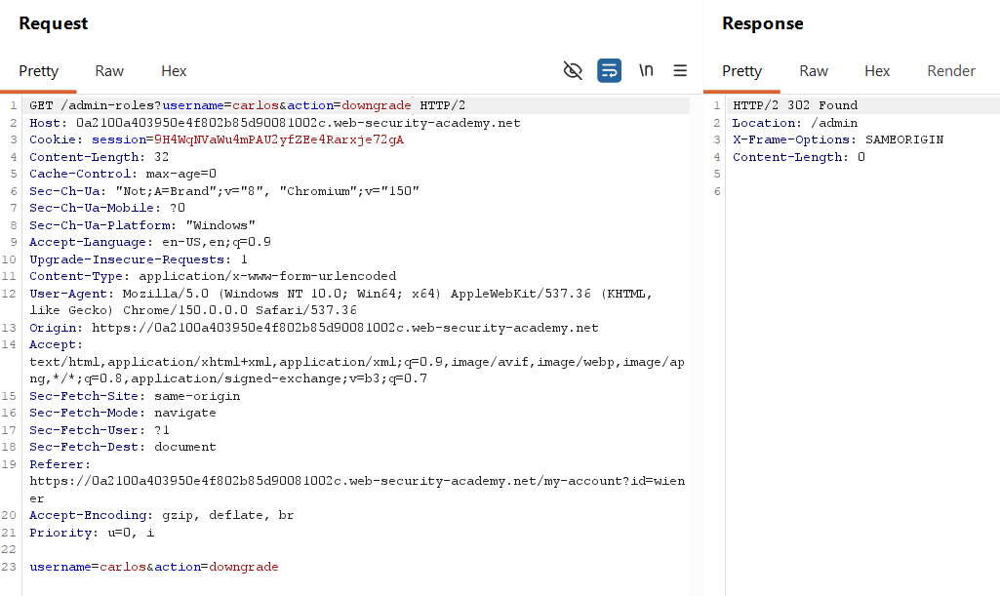

Gửi yêu cầu đi. Phản hồi nhận về mã trạng thái HTTP 302 Found điều hướng, cho thấy yêu cầu thực thi thành công:

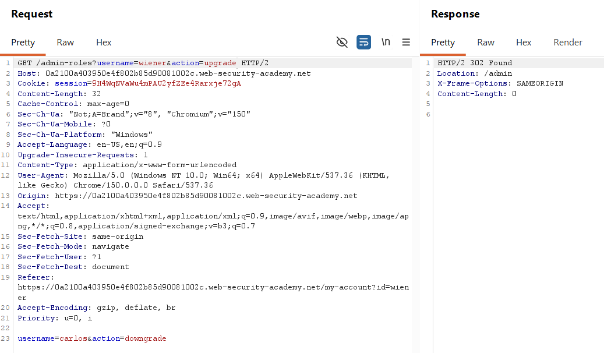

Tải lại giao diện trên trình duyệt web, hệ thống xác nhận tài khoản wiener đã được nâng cấp quyền quản trị và hoàn thành bài thực hành:

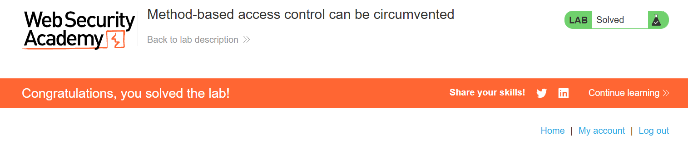

### Phân tích cơ chế hoạt động của payload

Yêu cầu HTTP sử dụng: `GET /admin-roles?username=wiener&action=upgrade HTTP/1.1`

Giải thích hoạt động chi tiết:

* Cơ chế kiểm soát phân quyền của ứng dụng (như WAF hoặc cấu hình Middleware định tuyến) chỉ được áp dụng trên phương thức `POST`. Khi yêu cầu gửi lên sử dụng phương thức `GET`, chốt chặn phân quyền này bị bỏ qua hoàn toàn.
* Tại backend máy chủ, mã nguồn ứng dụng sử dụng các hàm nhận dữ liệu chung (ví dụ như `request.params` hoặc `$_REQUEST` trong PHP đọc cả dữ liệu từ POST body và GET query string). Do đó, backend vẫn phân tích cú pháp được các tham số `username=wiener` và `action=upgrade` trên URL để thực hiện nâng quyền bình thường.

## Bài tập 7: Quy trình đa bước không cấu hình kiểm soát truy cập tại một bước

### Yêu cầu bài tập

Bài thực hành thiết lập một giao diện quản trị Admin panel với quy trình thay đổi vai trò người dùng gồm nhiều bước bị lỗi phân quyền. Có thể đăng nhập bằng tài khoản quản trị viên `administrator:admin` để khảo sát quy trình. Để hoàn thành bài thực hành, cần đăng nhập bằng tài khoản thường `wiener:peter`, khai thác lỗ hổng kiểm soát truy cập trên quy trình đa bước để tự nâng cấp tài khoản của bản thân thành quản trị viên.

### Phân tích lỗ hổng

Lỗ hổng kiểm soát truy cập bị phá vỡ trên quy trình đa bước (Multi-step process access control). Ứng dụng triển khai quy trình gồm hai bước để cập nhật quyền người dùng:

* Bước 1: Gửi yêu cầu cập nhật vai trò (ví dụ: `action=upgrade`). Máy chủ kiểm tra quyền hạn của phiên làm việc (phải là Admin) và trả về giao diện xác nhận (Yes/No).
* Bước 2: Gửi yêu cầu xác nhận thực thi hành động (có thêm tham số `confirmed=true`).

Mặc dù máy chủ thực hiện kiểm tra vai trò quản trị viên rất chặt chẽ ở Bước 1, lập trình viên lại bỏ quên hoàn toàn việc xác thực quyền hạn của người dùng gửi yêu cầu ở Bước 2. Máy chủ Backend tin tưởng hoàn toàn vào yêu cầu có chứa tham số xác nhận `confirmed=true` mà không đối chiếu xem phiên đăng nhập gửi yêu cầu đó có phải là Admin hay không. Kẻ tấn công có thể bỏ qua Bước 1, gửi trực tiếp yêu cầu xác nhận của Bước 2 với Cookie của tài khoản người dùng thường để tự nâng quyền thành công.

### Quy trình thực hiện chi tiết

Trang chủ của bài thực hành hiển thị danh sách các sản phẩm:

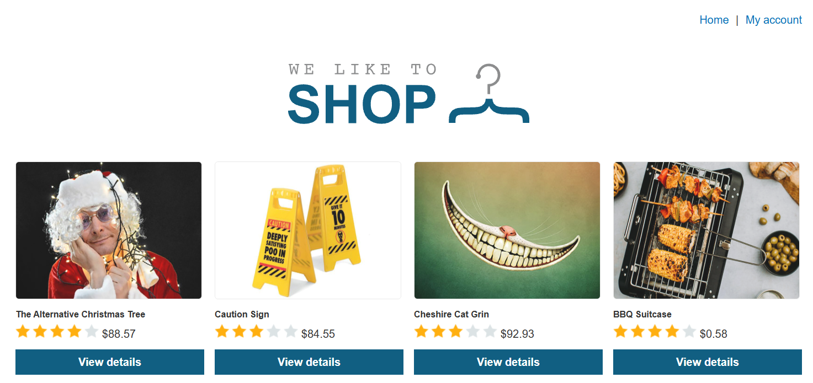

Đăng nhập tài khoản quản trị viên `administrator:admin` để khảo sát chức năng thay đổi quyền người dùng trong Admin panel:

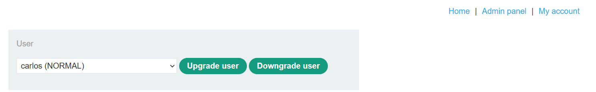

Thực hiện nâng cấp tài khoản carlos lên Admin. Giao diện xuất hiện hộp thoại yêu cầu xác thực hành động nâng quyền:

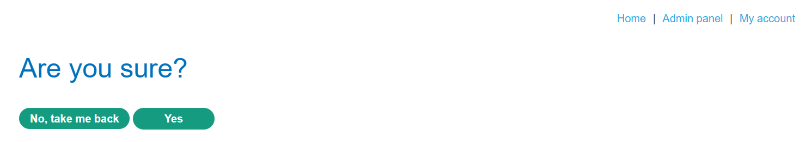


Bấm chọn Yes để hoàn tất quy trình nâng quyền.

Sử dụng Burp Suite để phân tích lịch sử các yêu cầu HTTP. Nhận thấy hệ thống gửi đi hai yêu cầu HTTP POST liên tiếp đến cùng một endpoint `/admin-roles` (hoặc `/change-roles` tùy thực tế phiên làm việc):

Yêu cầu thứ nhất (Bước 1):

```http
POST /admin-roles HTTP/1.1
Content-Type: application/x-www-form-urlencoded

username=carlos&action=upgrade
```

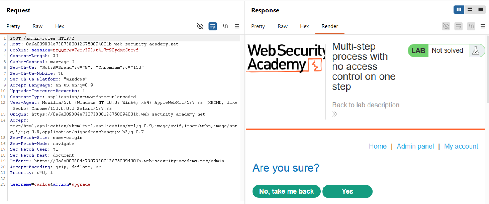

Yêu cầu thứ hai (Bước 2 - Xác nhận):

```http
POST /admin-roles HTTP/1.1
Content-Type: application/x-www-form-urlencoded

username=carlos&action=upgrade&confirmed=true
```

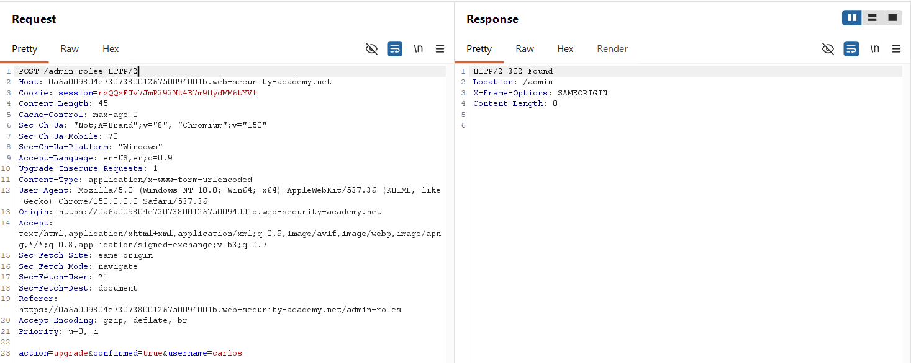

Đăng xuất tài khoản quản trị viên, tiến hành đăng nhập lại bằng tài khoản thường `wiener:peter`:

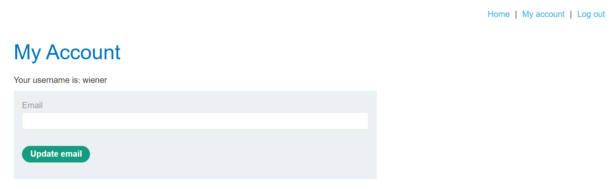

Chuyển yêu cầu cập nhật email của tài khoản thường wiener sang tab Repeater để lấy thông tin Cookie phiên làm việc.

Đồng thời đưa yêu cầu HTTP POST của Bước 2 (Xác nhận) sang tab Repeater. Tiến hành chỉnh sửa yêu cầu: Giữ nguyên Session Cookie của tài khoản thường wiener, thay đổi giá trị tham số `username` từ `carlos` thành `wiener` và gửi yêu cầu đi:

```http
POST /admin-roles HTTP/1.1
Content-Type: application/x-www-form-urlencoded

username=wiener&action=upgrade&confirmed=true
```

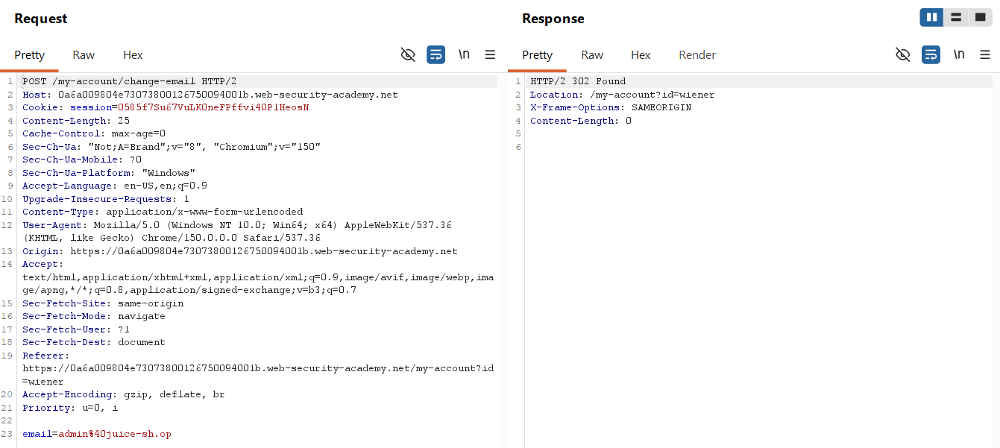

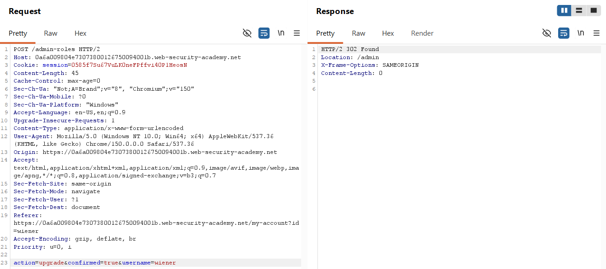

Phản hồi nhận về mã trạng thái HTTP 302 Found điều hướng, cho thấy yêu cầu xác nhận nâng quyền đã được máy chủ thực thi thành công:

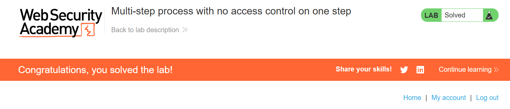

Tải lại giao diện trang cá nhân trên trình duyệt web, hệ thống ghi nhận hoàn thành bài thực hành.

### Phân tích cơ chế hoạt động của payload

Yêu cầu HTTP sử dụng: `POST /admin-roles` với tham số `username=wiener&action=upgrade&confirmed=true`

Giải thích hoạt động chi tiết:

* Quy trình đa bước được thiết kế không an toàn khi ứng dụng tin cậy vào việc hệ thống đã kiểm soát quyền hạn ở bước đầu tiên, dẫn đến việc bỏ quên hoàn toàn cơ chế xác thực phân quyền (Authorization check) ở bước tiếp theo tại máy chủ Backend.
* Khi nhận yêu cầu POST chứa tham số `confirmed=true`, mã nguồn backend của ứng dụng bỏ qua bước kiểm tra vai trò quản trị viên của Cookie phiên làm việc gửi kèm, tự động thực thi cập nhật quyền của người dùng wiener thành quản trị viên trong cơ sở dữ liệu.

## Bài tập 8: Vượt qua cơ chế kiểm soát truy cập dựa trên tiêu đề Referer

### Yêu cầu bài tập

Bài thực hành cấu hình cơ chế phân quyền kiểm soát một số chức năng Admin dựa trên tiêu đề `Referer` của yêu cầu HTTP. Có thể đăng nhập bằng tài khoản quản trị viên `administrator:admin` để khảo sát chức năng. Để hoàn thành bài thực hành, cần đăng nhập bằng tài khoản thường `wiener:peter`, khai thác lỗ hổng kiểm soát truy cập dựa trên tiêu đề Referer để tự nâng cấp tài khoản của bản thân thành quản trị viên.

### Phân tích lỗ hổng

Lỗ hổng phân quyền phát sinh do máy chủ tin tưởng hoàn toàn vào tiêu đề `Referer` do máy khách (trình duyệt) gửi lên để quyết định quyền thực thi chức năng quản trị nhạy cảm.

Cụ thể, khi nhận yêu cầu nâng cấp vai trò người dùng gửi đến `/admin-roles?username=wiener&action=upgrade`, máy chủ kiểm tra xem tiêu đề `Referer` có chứa đường dẫn của trang quản trị `/admin` hay không. Nếu có, máy chủ cho rằng yêu cầu xuất phát từ giao diện quản trị Admin panel và tự động thực thi hành động mà không kiểm tra xem tài khoản thực hiện yêu cầu (trong Cookie) có thực sự có vai trò Admin hay không.

Do tiêu đề `Referer` là một trường dữ liệu nằm ở phía máy khách, người kiểm thử có thể sử dụng Burp Suite để chỉnh sửa giá trị này thành đường dẫn chứa `/admin` nhằm đánh lừa máy chủ và thực hiện leo thang đặc quyền thành công.

### Quy trình thực hiện chi tiết

Trang chủ của bài thực hành hiển thị danh sách sản phẩm:

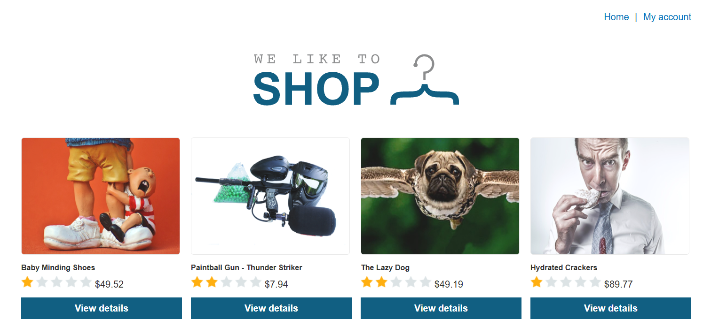

Thực hiện đăng nhập bằng tài khoản quản trị viên `administrator:admin` để khảo sát chức năng nâng cấp quyền người dùng. Ghi lại yêu cầu HTTP GET tương ứng trong Burp Suite. Yêu cầu này truyền các tham số trực tiếp trên URL:

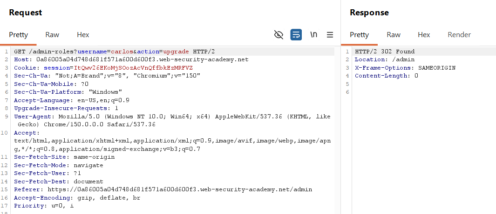

Đăng xuất tài khoản quản trị viên, tiến hành đăng nhập lại bằng tài khoản thường `wiener:peter`:


Thực hiện chức năng cập nhật email trên giao diện trang cá nhân và ghi lại yêu cầu trong Burp Suite. Sao chép giá trị Cookie phiên làm việc của tài khoản wiener từ yêu cầu này:

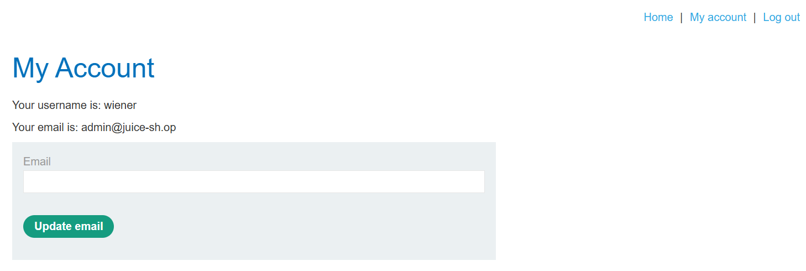

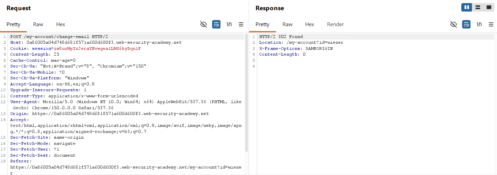

Đưa yêu cầu nâng cấp quyền của Admin ghi nhận được ở trên sang tab Repeater. Thay thế Cookie của Admin bằng Cookie của tài khoản wiener, đồng thời thay đổi giá trị tham số `username` thành `wiener`.

**Trường hợp thử nghiệm 1 (Bypass thành công):** Nếu giữ nguyên tiêu đề `Referer: https://lab-id.web-security-academy.net/admin` và gửi yêu cầu đi, máy chủ xử lý thành công và trả về mã phản hồi HTTP 302 Found điều hướng, tài khoản wiener được nâng cấp lên Admin thành công:

```http
GET /admin-roles?username=wiener&action=upgrade HTTP/1.1
Host: lab-id.web-security-academy.net
Cookie: session=wiener-session-id
Referer: https://lab-id.web-security-academy.net/admin
```

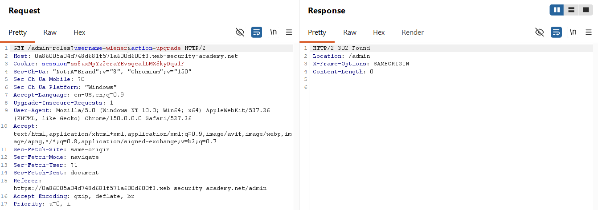

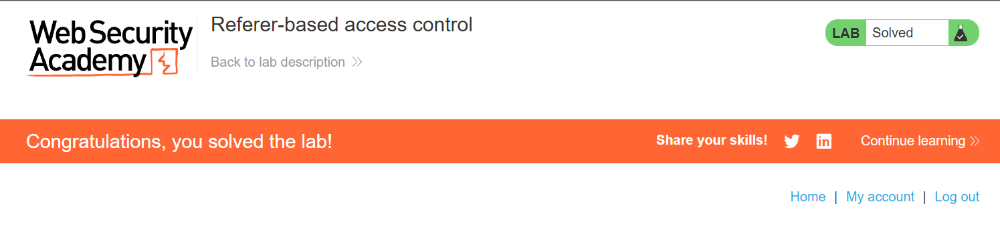

**Trường hợp thử nghiệm 2 (Bypass thất bại):** Nếu thay đổi tiêu đề `Referer` thành đường dẫn trang cá nhân `/my-account?id=wiener` (hoặc gửi yêu cầu trực tiếp từ trang cá nhân) và gửi đi, máy chủ sẽ chặn lại và trả về lỗi từ chối truy cập Access denied:

```http
GET /admin-roles?username=wiener&action=upgrade HTTP/1.1
Host: lab-id.web-security-academy.net
Cookie: session=wiener-session-id
Referer: https://lab-id.web-security-academy.net/my-account?id=wiener
```

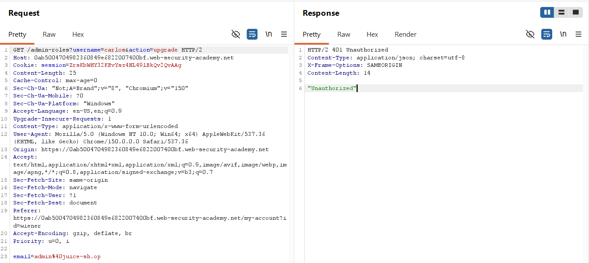

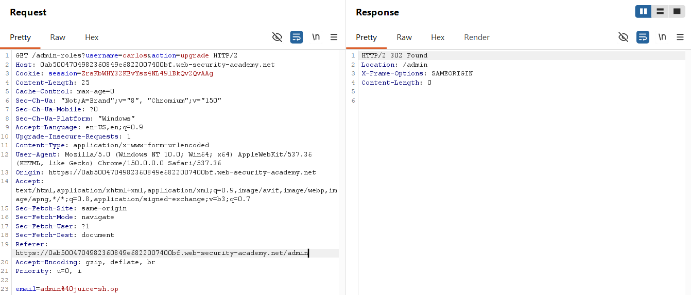

Điều này chứng minh máy chủ ứng dụng thực hiện xác thực phân quyền dựa trên giá trị tiêu đề Referer.

### Phân tích cơ chế hoạt động của payload

Tiêu đề HTTP sử dụng: `Referer: https://lab-id.web-security-academy.net/admin`

Giải thích hoạt động chi tiết:

* Máy chủ ứng dụng kiểm soát phân quyền lỏng lẻo bằng cách kiểm tra thuộc tính nguồn gốc yêu cầu thông qua tiêu đề Referer do trình duyệt gửi lên.
* Nếu tiêu đề Referer khớp với đường dẫn trang quản trị `/admin`, máy chủ tự động giả định yêu cầu là hợp lệ và bỏ qua việc kiểm tra thực tế vai trò của phiên làm việc hiện tại trong Cookie. Do người kiểm thử có thể tự ý thay đổi giá trị tiêu đề Referer trong Burp Suite, chốt chặn bảo mật này bị vô hiệu hóa hoàn toàn.

