# PortSwigger: OS Command Injection

## Bố cục nội dung

```
PortSwigger: OS Command Injection
│
├── Bài tập 1: Khai thác lỗ hổng chèn lệnh hệ điều hành trường hợp đơn giản
│   ├── Yêu cầu bài tập
│   ├── Phân tích lỗ hổng bảo mật
│   ├── Quy trình thực hiện chi tiết
│   └── Phân tích cơ chế hoạt động của payload
│
├── Bài tập 2: Khai thác lỗi chèn lệnh gián tiếp bằng kỹ thuật độ trễ thời gian
│   ├── Yêu cầu bài tập
│   ├── Phân tích lỗ hổng bảo mật
│   ├── Quy trình thực hiện chi tiết
│   └── Phân tích cơ chế hoạt động của payload
│
└── Bài tập 3: Khai thác lỗi chèn lệnh gián tiếp bằng phương pháp ghi tệp tin
    ├── Yêu cầu bài tập
    ├── Phân tích lỗ hổng bảo mật
    └── Quy trình thực hiện chi tiết
```

## Bài tập 1: Khai thác lỗ hổng chèn lệnh hệ điều hành trường hợp đơn giản

### Yêu cầu bài tập

Hệ thống ứng dụng web chứa lỗi bảo mật chèn lệnh hệ điều hành trong chức năng kiểm tra hàng tồn kho của sản phẩm.

Ứng dụng web thực thi một lệnh hệ thống chứa thông tin mã sản phẩm và mã cửa hàng do trình duyệt gửi lên.

Kết quả thực thi lệnh được trả về trực tiếp trong nội dung phản hồi.

Mục tiêu cần đạt được là chèn thêm lệnh `whoami` để xác định tên của người dùng hiện tại đang vận hành tiến trình.

### Phân tích lỗ hổng bảo mật

Lỗ hổng xuất hiện tại điểm tiếp nhận dữ liệu đầu vào của chức năng kiểm tra kho hàng.

Do ứng dụng web không thực hiện xác thực hoặc làm sạch các tham số sản phẩm và cửa hàng trước khi đưa vào shell hệ thống.

Kẻ tấn công có thể chèn các toán tử đặc biệt của shell như dấu chấm phẩy để ngắt câu lệnh gốc và bắt đầu một lệnh mới tùy ý.

### Quy trình thực hiện chi tiết

* Bước 1: Khởi động bài thực hành và truy cập vào giao diện trang chủ của ứng dụng web.


* Bước 2: Lựa chọn một sản phẩm bất kỳ để chuyển hướng đến trang thông tin chi tiết. Cuối trang thông tin sản phẩm sẽ xuất hiện khu vực dành cho chức năng kiểm tra số lượng hàng tồn kho tại từng cửa hàng cụ thể.

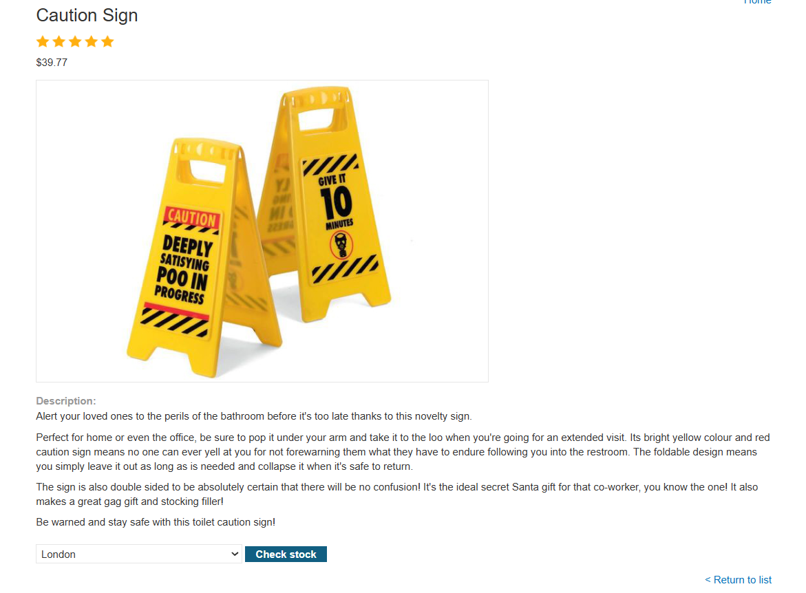

* Bước 3: Kích hoạt tính năng chặn yêu cầu Interceptor trên công cụ Burp Suite. Sau đó quay lại trình duyệt bấm nút kiểm tra kho hàng để bắt được yêu cầu HTTP gửi lên máy chủ.

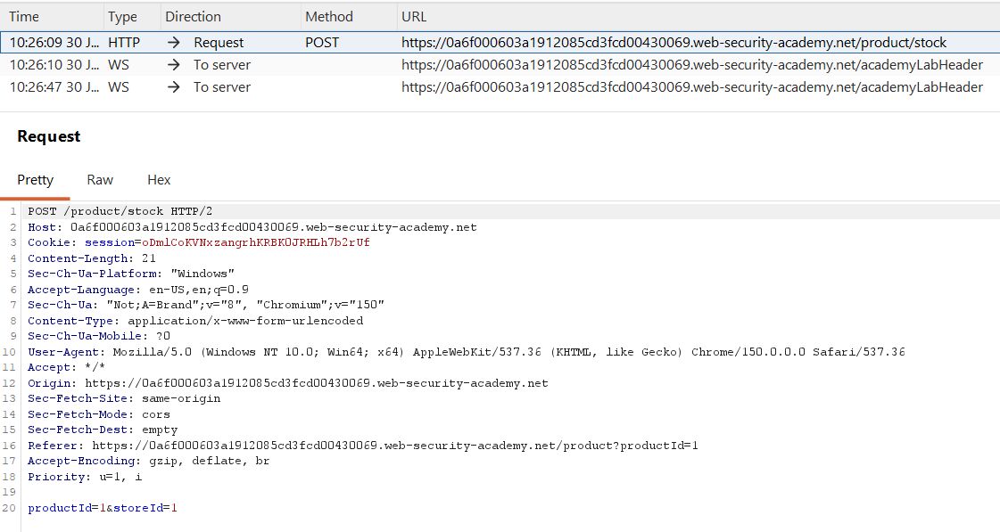

* Bước 4: Chuyển tiếp yêu cầu HTTP bắt được sang tab Repeater của Burp Suite để thuận tiện cho việc phân tích và chỉnh sửa cấu trúc dữ liệu.

Yêu cầu này sử dụng phương thức POST và truyền hai trường dữ liệu trong phần thân là `productId` và `storeId`.

* Bước 5: Tiến hành chỉnh sửa nội dung yêu cầu bằng cách chèn thêm lệnh độc hại vào cuối tham số cửa hàng như sau:

`productId=1&storeId=1; whoami`

* Bước 6: Gửi yêu cầu HTTP đã chỉnh sửa và theo dõi kết quả trả về trực tiếp trong phần thân của phản hồi từ máy chủ.

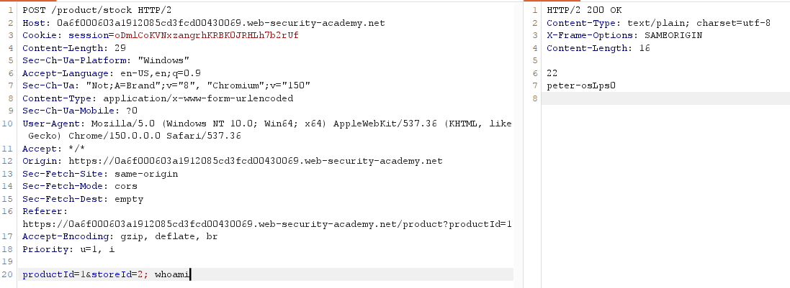

Kết quả hiển thị chuỗi tên người dùng là `peter-osLps0`, xác nhận quá trình khai thác lỗi chèn lệnh trực tiếp thành công.

### Phân tích cơ chế hoạt động của payload

Khi người dùng kiểm tra kho hàng, máy chủ web sẽ thực thi một câu lệnh shell nội bộ có cấu trúc tương tự như sau:

`stockcheck.sh [productId] [storeId]`

Khi kẻ tấn công truyền giá trị của tham số cửa hàng chứa toán tử chấm phẩy và lệnh kiểm tra quyền hạn, chuỗi lệnh hoàn chỉnh được chuyển giao cho shell xử lý sẽ trở thành:

`stockcheck.sh 1 1; whoami`

Shell hệ thống phân tích dấu chấm phẩy như một ký hiệu phân tách lệnh.

Hệ thống sẽ chạy chương trình kiểm tra kho hàng trước, sau đó tiếp tục thực thi lệnh hiển thị thông tin người dùng và đưa kết quả trả về trình duyệt.

## Bài tập 2: Khai thác lỗi chèn lệnh gián tiếp bằng kỹ thuật độ trễ thời gian

### Yêu cầu bài tập

Ứng dụng web chứa lỗ hổng chèn lệnh hệ điều hành trong chức năng phản hồi ý kiến của khách hàng.

Ứng dụng thực hiện gọi lệnh gửi thư điện tử dưới nền hệ điều hành và không trả lại bất kỳ kết quả thực thi nào ra màn hình ứng dụng.

Mục tiêu cần đạt được là chèn lệnh hệ thống để kích hoạt độ trễ thời gian 10 giây trên máy chủ nhằm xác nhận sự tồn tại của lỗ hổng.

### Phân tích lỗ hổng bảo mật

Vì ứng dụng không hiển thị kết quả trả về của câu lệnh, người kiểm thử không thể sử dụng kỹ thuật chèn lệnh thông thường để đọc thông tin trực tiếp.

Lỗ hổng này được gọi là chèn lệnh gián tiếp (Blind Command Injection).

Để xác định lỗ hổng, người kiểm thử cần đưa vào các câu lệnh điều khiển hệ thống tạm dừng hoạt động trong một khoảng thời gian cụ thể và theo dõi sự thay đổi về thời gian phản hồi của ứng dụng.

### Quy trình thực hiện chi tiết

* Bước 1: Khởi động bài thực hành và truy cập vào giao diện trang chủ của ứng dụng web. Quan sát liên kết gửi ý kiến phản hồi nằm ở góc trên cùng bên phải.


* Bước 2: Truy cập trang gửi phản hồi và điền đầy đủ các thông tin cần thiết vào biểu mẫu nhập liệu bao gồm tên, địa chỉ email, tiêu đề và nội dung tin nhắn.

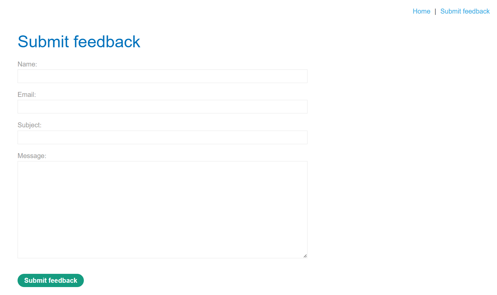

* Bước 3: Thử nghiệm gửi phản hồi thành công trên giao diện web để xác minh tính năng hoạt động bình thường. Hệ thống hiển thị thông báo cảm ơn sau khi gửi.

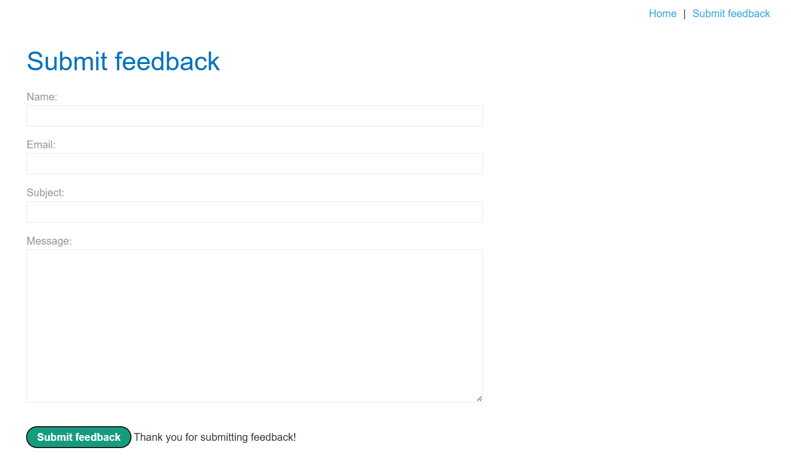

* Bước 4: Kích hoạt tính năng chặn yêu cầu Interceptor trên công cụ Burp Suite, thực hiện lại thao tác gửi phản hồi để bắt được yêu cầu HTTP POST gửi lên đường dẫn `/feedback/submit`.

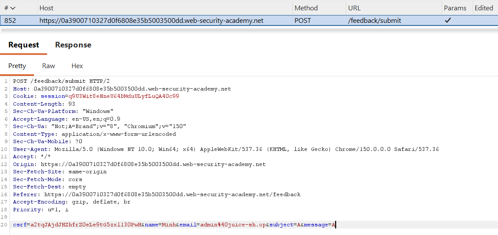

* Bước 5: Chuyển yêu cầu bắt được sang tab Repeater. Thử nghiệm chèn lệnh hiển thị thông tin trực tiếp bằng dấu chấm phẩy như sau: `message=A;whoami`.

Kết quả phản hồi trả về mã trạng thái 200 nhưng nội dung trống rỗng, xác nhận kết quả không hiển thị trực tiếp ra màn hình.

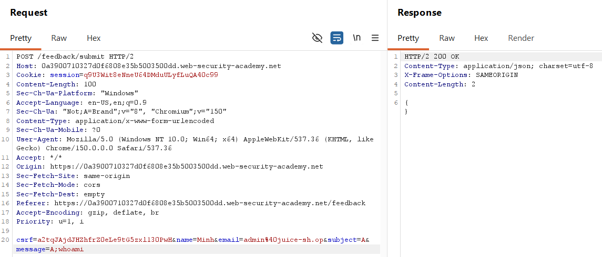

* Bước 6: Tiến hành thử nghiệm các trường nhập liệu khác và các toán tử phân tách khác nhau để kích hoạt độ trễ thời gian.

Thử nghiệm chèn lệnh ping hoặc sleep vào tham số tên và email.

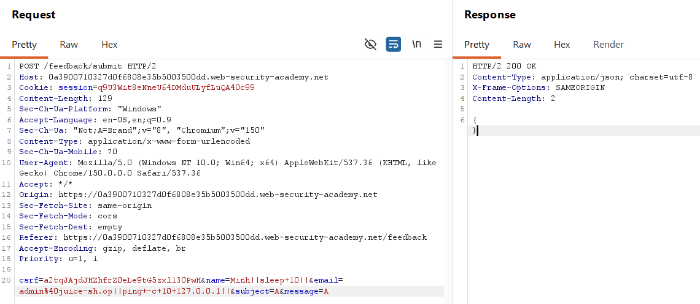

* Bước 7: Sửa đổi giá trị của tham số email trong phần thân của yêu cầu thành chuỗi câu lệnh gây trễ như sau:

`email=admin%40juice-sh.op||sleep+10||`

Gửi yêu cầu HTTP và theo dõi thời gian máy chủ xử lý. Phản hồi trả về mất khoảng hơn 10 giây, xác nhận lỗi chèn lệnh gián tiếp tồn tại.

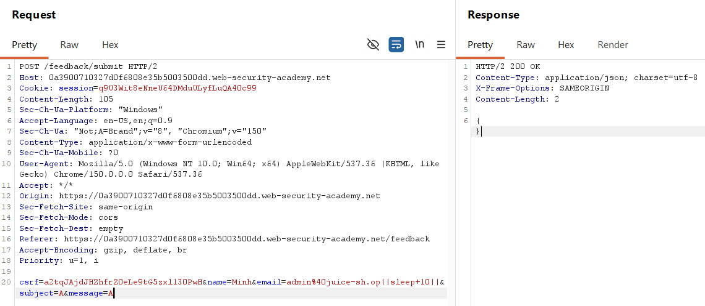

* Bước 8: Thử nghiệm chèn lệnh sử dụng toán tử dấu chấm phẩy thông thường thay vì toán tử song song như sau: `email=admin%40juice-sh.op;sleep+10`.

Hệ thống trả về mã lỗi 500 kèm thông báo không thể lưu dữ liệu, cho thấy máy chủ đã thực hiện kiểm tra định dạng email hoặc lỗi cú pháp khi thực thi lệnh gốc với dấu chấm phẩy.

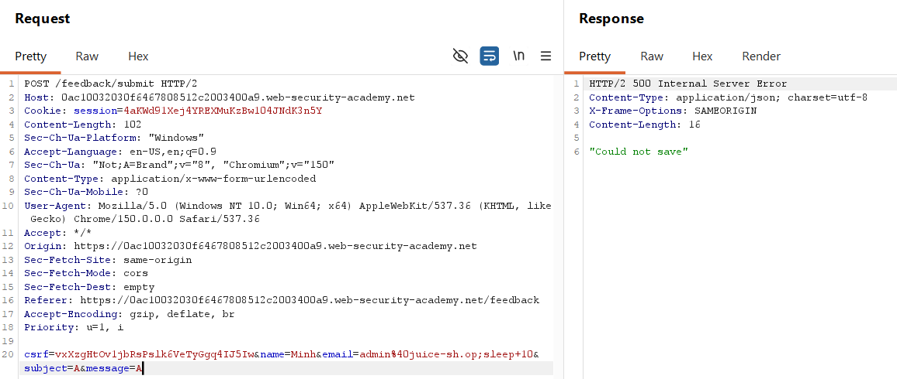

### Phân tích cơ chế hoạt động của payload

Chức năng gửi ý kiến phản hồi sẽ gọi một tiến trình hệ thống gửi thư điện tử dưới nền với cấu trúc câu lệnh giả định:

`sendmail.sh -to [email] -msg [message]`

Khi kẻ tấn công sử dụng dấu chấm phẩy, lệnh thực thi bị ngắt quãng và phần email không hợp lệ sẽ làm chương trình gửi thư gặp lỗi hoặc bị bộ lọc của ứng dụng ngăn chặn, dẫn đến lỗi hệ thống.

Bằng cách sử dụng toán tử song song song song `||` (chỉ chạy lệnh sau nếu lệnh trước thất bại), câu lệnh thực tế trở thành:

`sendmail.sh -to admin@juice-sh.op || sleep 10 || -msg A`

Khi câu lệnh gửi thư đầu tiên bị lỗi do cấu trúc tham số phía sau bị ngắt quãng, shell hệ thống sẽ tiếp tục thực hiện câu lệnh thứ hai là `sleep 10` để tạm dừng tiến trình trong 10 giây, giúp xác nhận thành công lỗ hổng bảo mật.

## Bài tập 3: Khai thác lỗi chèn lệnh gián tiếp bằng phương pháp ghi tệp tin (Blind OS command injection with output redirection)

### Yêu cầu bài tập

Ứng dụng web chứa lỗi bảo mật chèn lệnh hệ điều hành gián tiếp (Blind OS Command Injection) trong chức năng gửi phản hồi ý kiến của khách hàng.

Ứng dụng thực hiện gọi lệnh shell hệ thống dưới nền chứa các thông tin do người dùng cung cấp. Kết quả của câu lệnh không được hiển thị trực tiếp trong nội dung phản hồi.

Mục tiêu cần đạt được là thực thi câu lệnh `whoami` và chuyển hướng kết quả đầu ra vào một tệp tin có đường dẫn `/var/www/images/output.txt` trong thư mục hình ảnh của máy chủ.

Sau đó sử dụng đường dẫn tải hình ảnh của trang web để đọc nội dung tệp tin này nhằm lấy thông tin tên người dùng hiện tại và hoàn thành bài thực hành.

### Phân tích lỗ hổng bảo mật

Lỗ hổng chèn lệnh xuất hiện gián tiếp vì máy chủ web không trả về kết quả trực tiếp của câu lệnh ra màn hình giao diện.

Để khai thác, người kiểm thử tận dụng cơ chế ghi tệp tin của shell hệ thống thông qua toán tử chuyển hướng đầu ra `>` hoặc `>>`.

Bằng cách ghi kết quả vào một tệp tin tĩnh đặt trong thư mục công khai của máy chủ web (ở đây là thư mục chứa hình ảnh sản phẩm có quyền ghi), kẻ tấn công có thể truy cập tệp tin này qua giao thức HTTP bằng đường dẫn tĩnh của ứng dụng để xem kết quả.

### Quy trình thực hiện chi tiết

* Bước 1: Khởi động bài thực hành và truy cập giao diện trang web. Quan sát và ghi nhận cấu trúc của yêu cầu tải ảnh trong ứng dụng.

Khi hiển thị thông tin sản phẩm, ứng dụng sẽ gọi đường dẫn `/image?filename=2.jpg` để lấy tệp tin ảnh từ máy chủ.

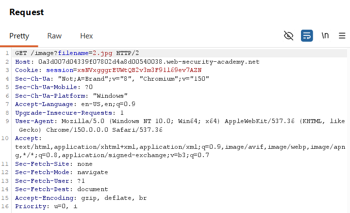

* Bước 2: Kích hoạt tính năng chặn yêu cầu Interceptor trên Burp Suite. Thực hiện lại thao tác gửi phản hồi để bắt được yêu cầu HTTP POST gửi lên đường dẫn `/feedback/submit`.
* Bước 3: Chuyển tiếp yêu cầu bắt được sang tab Repeater. Thực hiện sửa đổi giá trị của tham số email trong phần thân của yêu cầu thành chuỗi câu lệnh chèn lệnh và chuyển hướng kết xuất đầu ra như sau:

`email=admin%40juice-sh.op||whoami+>+/var/www/images/output.txt||`

Gửi yêu cầu này và kiểm tra phản hồi từ máy chủ trả về mã trạng thái 200 thông báo thành công.

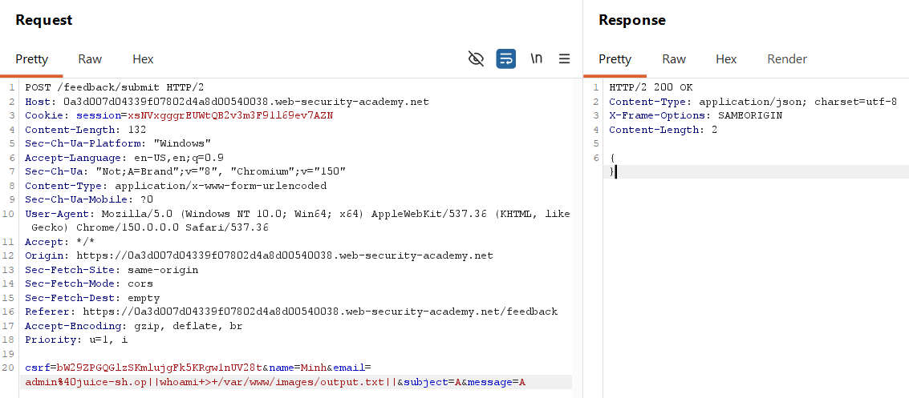

* Bước 4: Sử dụng trình duyệt truy cập đường dẫn tải ảnh tĩnh của ứng dụng để đọc nội dung tệp tin đã ghi theo định dạng đã phân tích ở Bước 1:

`https://[url lab].web-security-academy.net/image?filename=output.txt`

Kết quả trả về tên của người dùng đang vận hành là `peter-IYR9ZS`, hoàn thành bài thực hành khai thác thành công.

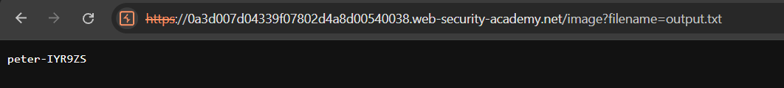

### Phân tích cơ chế hoạt động của payload

Chức năng gửi ý kiến phản hồi sẽ gọi một tiến trình hệ thống gửi thư điện tử dưới nền với cấu trúc câu lệnh giả định:

`sendmail.sh -to [email] -msg [message]`

Việc chèn toán tử `||` và chuyển hướng đầu ra `>` giúp ngắt lệnh và ghi đè kết quả của lệnh `whoami` vào tệp tin tĩnh `output.txt` đặt tại `/var/www/images/` (thư mục chứa ảnh sản phẩm của máy chủ web).

Cấu trúc lệnh đầy đủ chạy trên máy chủ khi khai thác:

`sendmail.sh -to admin@juice-sh.op || whoami > /var/www/images/output.txt || -msg A`

Do ứng dụng có chức năng đọc ảnh từ thư mục `/var/www/images/` thông qua tham số `filename` mà không kiểm tra định dạng tệp tin, người kiểm thử có thể lợi dụng chức năng này để đọc trực tiếp nội dung của tệp tin `output.txt` vừa ghi qua giao thức HTTP.

## Bài tập 4: Khai thác lỗi chèn lệnh gián tiếp bằng phương pháp tương tác ngoài băng thông

### Yêu cầu bài tập

To solve the lab, exploit the blind OS command injection vulnerability to issue a DNS lookup to Burp Collaborator.

This lab contains a blind OS command injection vulnerability in the feedback function.

The application executes a shell command containing the user-supplied details. The command is executed asynchronously and has no effect on the application's response. It is not possible to redirect output into a location that you can access. However, you can trigger out-of-band interactions with an external domain.

To prevent the Academy platform being used to attack third parties, our firewall blocks interactions between the labs and arbitrary external systems. To solve the lab, you must use Burp Collaborator's default public server.

### Phân tích lỗ hổng bảo mật

### Quy trinh thực hiện chi tiết

### Phân tích cơ chế hoạt động của payload
