# PortSwigger: SSRF

## Bài tập 1: SSRF cơ bản tấn công server cục bộ

### Yêu cầu bài tập

Bài thực hành cung cấp một chức năng kiểm tra số lượng hàng tồn kho có nhiệm vụ lấy dữ liệu từ một hệ thống nội bộ.

Để giải quyết bài thực hành, cần thay đổi đường dẫn URL kiểm tra hàng tồn kho nhằm truy cập vào giao diện quản trị tại địa chỉ `http://localhost/admin` và thực hiện hành động xóa người dùng `carlos`.

### Phân tích lỗ hổng

Lỗ hổng SSRF xuất hiện tại chức năng kiểm tra số lượng hàng tồn kho của sản phẩm.

Khi người dùng thực hiện yêu cầu tra cứu, ứng dụng web sẽ gửi một yêu cầu HTTP POST chứa tham số stockApi mang giá trị là một đường dẫn URL. Máy chủ web sau đó trực tiếp thực hiện một yêu cầu HTTP GET tới đường dẫn này để lấy dữ liệu mà không thực hiện kiểm tra hoặc giới hạn địa chỉ đích.

Bằng cách thay thế giá trị của tham số stockApi thành địa chỉ cục bộ http://localhost/admin, kẻ tấn công có thể ép máy chủ web tự gửi yêu cầu truy cập vào giao diện quản trị nội bộ của chính nó. Do yêu cầu xuất phát từ chính địa chỉ localhost, hệ thống quản trị sẽ tin tưởng và cho phép thực thi các quyền hạn cấu hình như xóa người dùng.

### Quy trình thực hiện chi tiết

Trang chủ hiển thị danh sách các sản phẩm:


Truy cập vào một sản phẩm bất kỳ để mở trang chi tiết sản phẩm. Ở cuối trang có chức năng kiểm tra số lượng hàng tồn kho của sản phẩm theo từng chi nhánh cửa hàng:

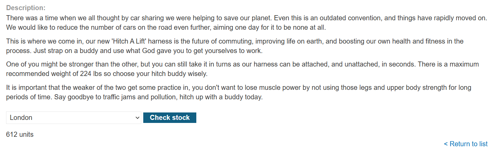

Kích hoạt chế độ chặn bắt yêu cầu Intercept của công cụ Burp Suite, sau đó nhấn nút kiểm tra số lượng hàng tồn kho để ghi lại yêu cầu HTTP:

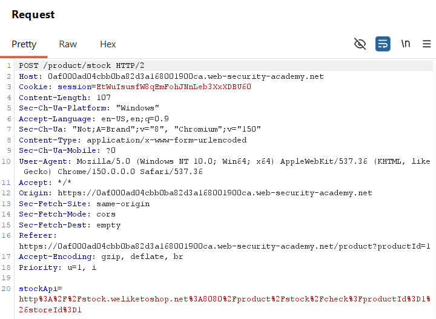

Yêu cầu HTTP POST được gửi tới endpoint sau:

```
/product/stock
```

Yêu cầu này mang theo tham số dữ liệu:

```
stockApi=http%3A%2F%2Fstock.weliketoshop.net%3A8080%2Fproduct%2Fstock%2Fcheck%3FproductId%3D1%26storeId%3D1
```

Đường dẫn URL đích ban đầu của hệ thống kiểm tra tồn kho:

```
http://stock.weliketoshop.net:8080/product/stock/check?productId=1&storeId=1
```

Để truy cập vào giao diện quản trị, thực hiện thay đổi giá trị tham số stockApi thành dạng mã hóa URL của địa chỉ `http://localhost/admin là http%3A%2F%2Flocalhost%2Fadmin` và gửi yêu cầu đi:

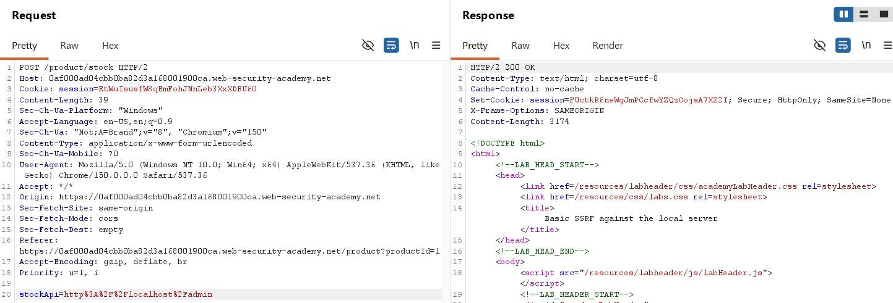

Mã nguồn HTML của giao diện quản trị cục bộ được trả về trực tiếp trong phần phản hồi HTTP Response của ứng dụng:

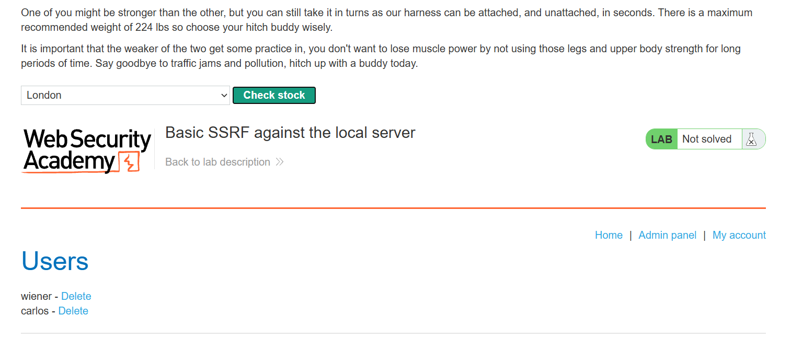

Phân tích mã nguồn HTML nhận được để xác định liên kết thực hiện hành động xóa người dùng carlos. Đường dẫn API được tìm thấy là:

```
/admin/delete?username=carlos
```

Nếu thực hiện gửi yêu cầu truy cập trực tiếp đường dẫn này từ trình duyệt của người dùng ngoài Internet, hệ thống sẽ trả về thông báo lỗi truy cập bị từ chối do yêu cầu không xuất phát từ máy cục bộ hoặc thiếu quyền quản trị:

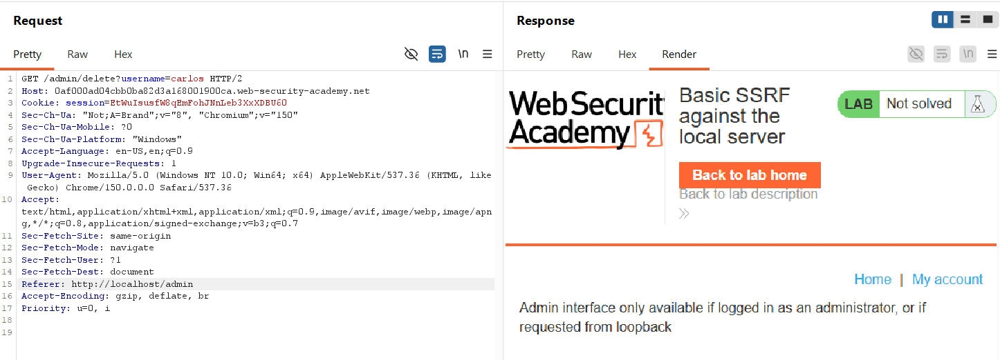

Để thực hiện thành công hành động xóa, cần sử dụng lỗ hổng SSRF để máy chủ tự gửi yêu cầu này. Thay đổi giá trị tham số stockApi thành đường dẫn xóa người dùng tương ứng:

```
stockApi=http%3A%2F%2Flocalhost%2Fadmin%2Fdelete%3Fusername%3Dcarlos
```

Đường dẫn URL sau khi giải mã:

```
http://localhost/admin/delete?username=carlos
```

Gửi yêu cầu HTTP đã chỉnh sửa bằng công cụ Burp Suite:

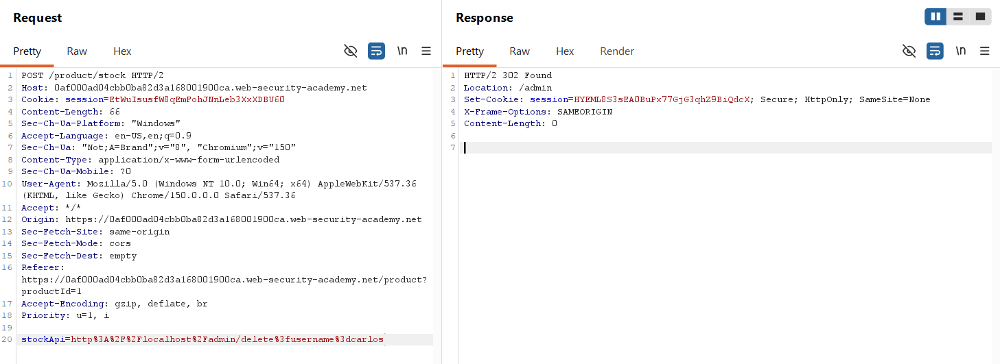

Phản hồi HTTP Response trả về mã trạng thái 302 Found điều hướng về trang quản trị, cho biết yêu cầu thực thi thành công.

Tải lại trang chi tiết sản phẩm hoặc truy cập lại giao diện quản trị để xác nhận người dùng `carlos` đã bị xóa khỏi hệ thống, hoàn thành bài thực hành:

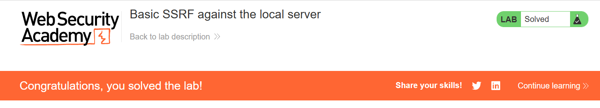

### Phân tích cơ chế hoạt động của payload

Payload sử dụng trong bài thực hành:

```
stockApi=http%3A%2F%2Flocalhost%2Fadmin%2Fdelete%3Fusername%3Dcarlos
```

Sau khi giải mã URL sẽ trở thành:

```
stockApi=http://localhost/admin/delete?username=carlos
```

Cơ chế khai thác dựa trên việc ứng dụng kiểm tra hàng tồn kho có chức năng gửi HTTP request tới một URL được cung cấp thông qua tham số stockApi.

Luồng hoạt động ban đầu của chức năng này khi chưa bị tấn công:

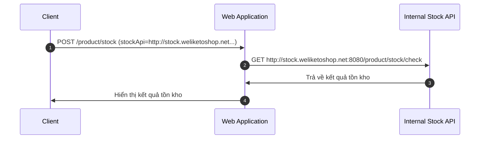

Ứng dụng tin tưởng giá trị URL trong tham số stockApi và không thực hiện kiểm tra kiểm soát tên miền hợp lệ. Do đó, kẻ tấn công có thể thay đổi giá trị này để điều hướng yêu cầu của máy chủ tới các tài nguyên nội bộ khác.

Luồng hoạt động sau khi thay đổi payload:

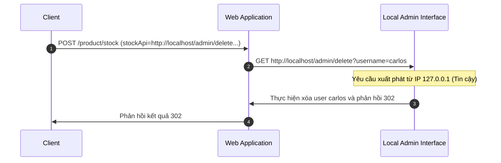

Điểm cốt lõi là yêu cầu HTTP GET tới đường dẫn xóa người dùng không được gửi trực tiếp từ máy khách của kẻ tấn công, mà do chính máy chủ ứng dụng web thực hiện ở phía sau. Do yêu cầu đến từ giao diện mạng cục bộ localhost, ứng dụng quản trị sẽ coi đây là hành động hợp lệ và thực thi lệnh.

### Tại sao truy cập trực tiếp từ máy khách không thành công?

Khi thực hiện yêu cầu trực tiếp từ trình duyệt bên ngoài:

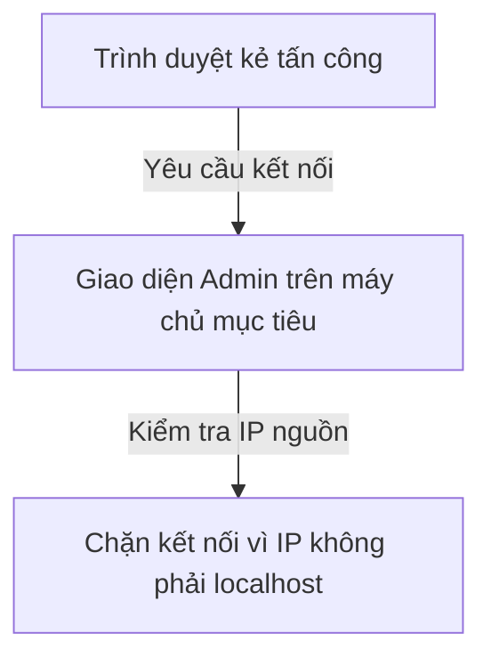

Khi sử dụng kỹ thuật tấn công SSRF:

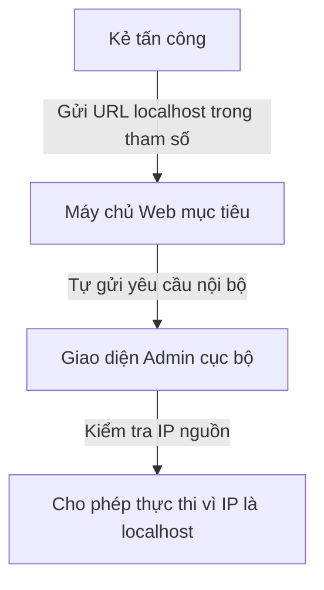

Yêu cầu gửi đi từ hệ thống quản trị admin được bảo vệ bằng cách cấu hình chỉ cho phép các kết nối đến từ máy cục bộ. SSRF đã giúp vượt qua chốt chặn an ninh này bằng cách lợi dụng quyền hạn nội bộ của máy chủ web mục tiêu.

## Bài tập 2: SSRF cơ bản tấn công backend server khác

### Yêu cầu bài tập

Bài thực hành cung cấp một chức năng kiểm tra số lượng hàng tồn kho có nhiệm vụ lấy dữ liệu từ một hệ thống nội bộ.

Để giải quyết bài thực hành, cần quét dải mạng nội bộ 192.168.0.0/24 trên cổng 8080 để tìm ra máy chủ quản trị nội bộ. Sau đó, thay đổi đường dẫn URL kiểm tra hàng tồn kho nhằm truy cập vào giao diện quản trị này và thực hiện hành động xóa người dùng carlos.

### Phân tích lỗ hổng

Lỗ hổng SSRF nằm ở tham số stockApi của chức năng kiểm tra số lượng hàng tồn kho. Ứng dụng web chấp nhận các đường dẫn URL trỏ tới hệ thống mạng nội bộ. Kẻ tấn công có thể lợi dụng máy chủ web làm bàn đạp để thực hiện các yêu cầu HTTP tới các dải địa chỉ IP private khác trong cùng mạng nội bộ mà thông thường không thể truy cập từ bên ngoài Internet.

### Quy trình thực hiện chi tiết

Trang chủ hiển thị danh sách sản phẩm:


Truy cập vào trang chi tiết sản phẩm bất kỳ. Ở cuối trang có chức năng kiểm tra số lượng hàng tồn kho:

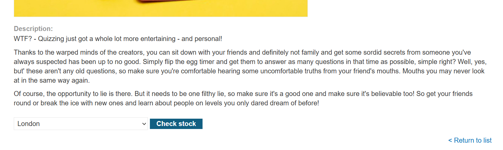

Kích hoạt chế độ chặn bắt yêu cầu Intercept của công cụ Burp Suite, sau đó nhấn nút kiểm tra số lượng hàng tồn kho để ghi lại yêu cầu HTTP.

Do chưa xác định được chính xác địa chỉ IP của máy chủ quản trị nội bộ mà chỉ biết dải mạng nội bộ là 192.168.0.X và cổng dịch vụ là 8080, cần xây dựng một kịch bản tự động gửi yêu cầu để dò quét các địa chỉ IP từ 192.168.0.1 đến 192.168.0.255.

Sử dụng ngôn ngữ Python và các thư viện requests cùng ThreadPoolExecutor để thực hiện quét đa luồng nhanh chóng:

```python
import requests
from concurrent.futures import ThreadPoolExecutor

host = "0aba00730430d00380e51cd5008500ae.web-security-academy.net"
api = "/product/stock"

cookies = {
    "session" : "UzTxRssyKBJzmwPimpMIoth0x1TO0Ndf"
}

target_ip_head = "192.168.0."
target_port = 8080
target_api = "/admin"

def make_request(target_ip_tail):
    request_url = f"https://{host}{api}"
    target_ip = f"{target_ip_head}{target_ip_tail}"
    target_url = f"http://{target_ip}:{target_port}{target_api}"

    response = requests.post(
        url=request_url,
        cookies=cookies,
        data={
            "stockApi": target_url
        },
        timeout=10
    )

    print(f"Tail: {target_ip_tail} | Status code: {response.status_code}")
    return target_ip_tail, response

target_ip_tails = [i for i in range(1, 256)]

with ThreadPoolExecutor(max_workers=10) as executor:
    scanning_results = list(executor.map(make_request, target_ip_tails))

# Lọc ra IP trả về status code 200 OK
active_ips = [tail for tail, response in scanning_results if response.status_code == 200]
print(f"Exact IP tail = {active_ips}")
```

Thư viện requests thực hiện gửi yêu cầu HTTP POST đến endpoint kiểm tra hàng tồn kho của ứng dụng web, truyền URL mục tiêu cần dò quét qua tham số stockApi.

* Thư viện concurrent.futures với ThreadPoolExecutor cho phép thiết lập 10 luồng xử lý đồng thời nhằm tối ưu tốc độ gửi yêu cầu.
* Hàm make_request nhận tham số target_ip_tail để xây dựng địa chỉ IP tương ứng trong dải 192.168.0.0/24 và gửi yêu cầu kiểm tra.
* Vòng lặp dải range(1, 256) tạo danh sách các giá trị đuôi IP cần dò quét từ 1 đến 255.
* Cơ chế lọc active_ips tiến hành duyệt qua kết quả phản hồi của toàn bộ yêu cầu gửi đi và chỉ giữ lại địa chỉ IP nhận được mã trạng thái phản hồi HTTP 200 OK.

Địa chỉ IP của máy chủ quản trị nội bộ được xác định là `192.168.0.116`.

Thực hiện gửi lại yêu cầu kiểm tra hàng tồn kho trong Burp Suite, chỉnh sửa giá trị tham số stockApi thành đường dẫn quản trị của máy chủ nội bộ 192.168.0.116 trên cổng 8080:

```
stockApi=http%3A%2F%2F192.168.0.116%3A8080%2Fadmin
```

Yêu cầu HTTP gửi đi thành công và trả về giao diện trang quản trị nội bộ:

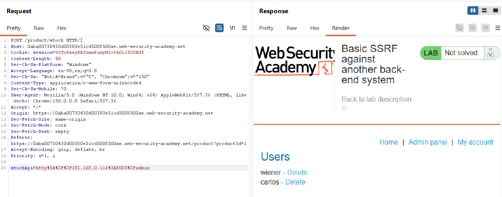

Phân tích phản hồi HTML trong Burp Suite để lấy đường dẫn API thực hiện hành động xóa người dùng carlos:

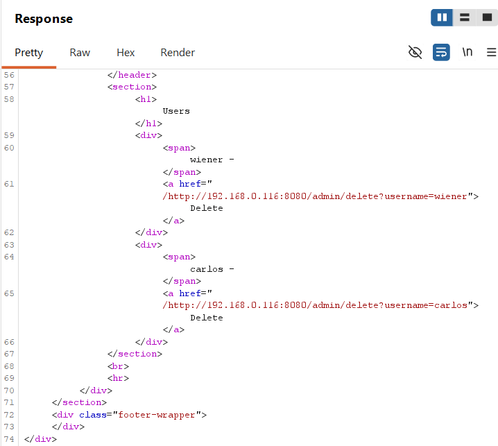

Đường dẫn API xóa người dùng được tìm thấy:

```
/admin/delete?username=carlos
```

Thay đổi tham số stockApi thành liên kết xóa người dùng trên máy chủ nội bộ 192.168.0.116:

```
stockApi=http%3A%2F%2F192.168.0.116%3A8080%2Fadmin%2Fdelete%3Fusername%3Dcarlos
```

Gửi yêu cầu đã chỉnh sửa đi:

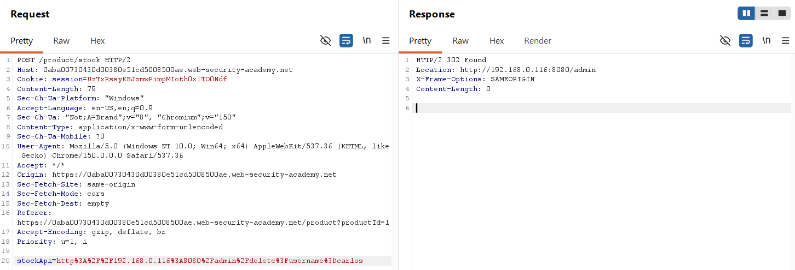

Tải lại trang chi tiết sản phẩm hoặc truy cập lại giao diện quản trị để xác nhận người dùng carlos đã bị xóa khỏi hệ thống, hoàn thành bài thực hành:

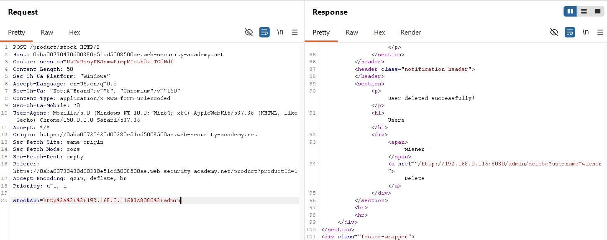

Sau khi kiểm tra lại, xác nhận người dùng carlos đã bị xóa khỏi hệ thống => Hoàn thành bài thực hành:

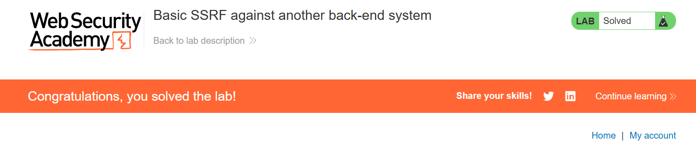

### Phân tích cơ chế hoạt động của payload

Payload sử dụng trong bài thực hành:

```
stockApi=http%3A%2F%2F192.168.0.116%3A8080%2Fadmin%2Fdelete%3Fusername%3Dcarlos
```

Sau khi giải mã URL sẽ trở thành:

```
stockApi=http://192.168.0.116:8080/admin/delete?username=carlos
```

Tương tự như Bài tập 1, cơ chế khai thác dựa trên việc ứng dụng kiểm tra hàng tồn kho gửi HTTP request tới URL được cung cấp qua tham số stockApi. Tuy nhiên, thay vì gửi yêu cầu đến máy chủ nội bộ localhost, ứng dụng web gửi yêu cầu đến một máy chủ quản trị nội bộ khác nằm trong cùng mạng LAN có địa chỉ IP 192.168.0.116 trên cổng 8080.

Luồng hoạt động của quá trình khai thác:

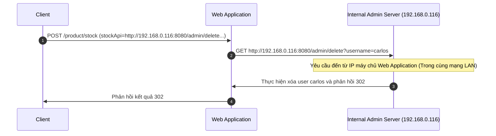

Sự thiếu sót trong việc kiểm tra tính hợp lệ của tham số stockApi cho phép kẻ tấn công biến máy chủ web ứng dụng thành một Proxy để dò quét và tương tác trực tiếp với các máy chủ dịch vụ khác nằm sâu trong mạng nội bộ. Các dịch vụ nội bộ này thường không cấu hình cơ chế xác thực mạnh vì tin tưởng rằng ranh giới mạng nội bộ đã an toàn, tạo điều kiện cho hành vi truy cập trái phép qua SSRF.

## Bài tập 3: SSRF có bộ lọc danh sách đen

### Yêu cầu bài tập

Bài thực hành cung cấp một chức năng kiểm tra số lượng hàng tồn kho có nhiệm vụ lấy dữ liệu từ một hệ thống nội bộ.

Để giải quyết bài thực hành này, cần thay đổi URL kiểm tra hàng tồn kho nhằm truy cập vào giao diện quản trị tại địa chỉ `http://localhost/admin` và thực hiện hành động xóa người dùng `carlos`. Trong kịch bản này, hệ thống áp dụng cơ chế lọc để chặn các yêu cầu độc hại hướng tới các địa chỉ nhạy cảm.

### Phân tích lỗ hổng

Lỗ hổng SSRF vẫn nằm tại tham số stockApi của chức năng kiểm tra số lượng hàng tồn kho. Tuy nhiên, hệ thống đã triển khai một cơ chế phòng thủ dựa trên danh sách đen (Blacklist Filtering).

Cơ chế phòng thủ này thực hiện kiểm tra dữ liệu đầu vào của tham số stockApi dựa trên hai quy tắc:

* Chặn các yêu cầu chứa tên miền hoặc địa chỉ IP cục bộ như localhost hoặc 127.0.0.1.
* Chặn các yêu cầu chứa đường dẫn có từ khóa nhạy cảm như admin.

Để khai thác thành công, cần áp dụng các kỹ thuật bypass để vượt qua hai chốt chặn này:

1. Bypass bộ lọc IP/Tên miền cục bộ: Sử dụng cách biểu diễn địa chỉ IP thay thế như 127.1 thay cho 127.0.0.1 hoặc localhost. Hệ thống phân giải địa chỉ sẽ dịch chuyển 127.1 thành 127.0.0.1 nhưng bộ lọc dạng chuỗi đơn giản có thể bỏ qua định dạng này.
2. Bypass bộ lọc đường dẫn: Sử dụng kỹ thuật mã hóa URL hai lần (Double URL Encoding) đối với các ký tự nhạy cảm. Khi bộ lọc kiểm tra dữ liệu sau lượt giải mã thứ nhất, chuỗi ký tự vẫn ở dạng mã hóa nên không khớp với từ khóa admin trong danh sách đen. Khi máy chủ web xử lý yêu cầu và thực hiện giải mã lần thứ hai, đường dẫn chính xác mới được khôi phục để truy cập tài nguyên.

### Quy trình thực hiện chi tiết

Trang chủ ứng dụng hiển thị danh sách sản phẩm:


Truy cập vào trang chi tiết sản phẩm bất kỳ để tìm chức năng kiểm tra hàng tồn kho:

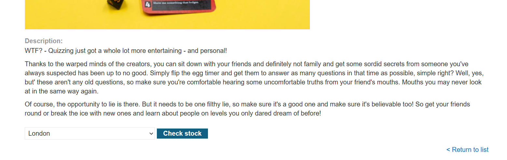

Bật chế độ Intercept của Burp Suite, thực hiện bấm nút kiểm tra hàng tồn kho để bắt yêu cầu HTTP:

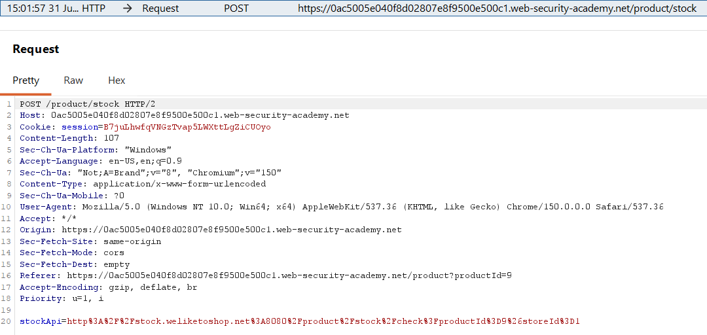

Thử nghiệm thay đổi tham số stockApi thành đường dẫn quản trị cục bộ ban đầu:

```
stockApi=http%3A%2F%2Flocalhost%2Fadmin
```

Gửi yêu cầu đi và quan sát phản hồi từ hệ thống:

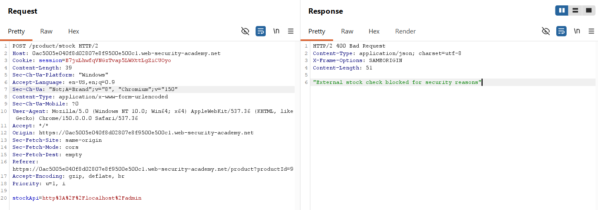

Hệ thống phản hồi lỗi Bad Request kèm thông báo lỗi cho thấy yêu cầu đã bị chặn bởi bộ lọc.

Thực hiện bypass chốt chặn thứ nhất bằng cách thay thế localhost bằng địa chỉ viết tắt 127.1:

```
stockApi=http%3A%2F%2F127.1
```

Gửi yêu cầu đi:

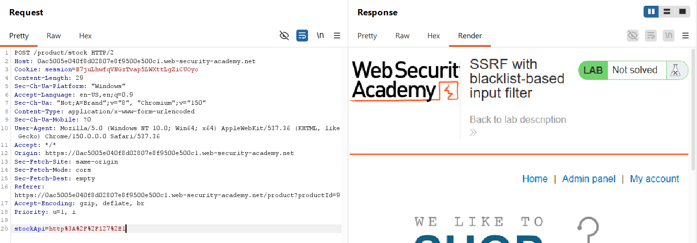

Phản hồi HTTP trả về mã trạng thái 200 OK, xác nhận địa chỉ IP 127.1 đã vượt qua bộ lọc thành công.

Tiếp tục thử nghiệm thêm đường dẫn /admin vào địa chỉ IP trên:

```
stockApi=http%3A%2F%2F127.1%2Fadmin
```

Yêu cầu gửi đi tiếp tục bị chặn, chứng tỏ từ khóa admin nằm trong danh sách đen.

Thực hiện mã hóa URL hai lần ký tự a (mã hex là 61) trong từ khóa admin thành %2561. Payload sau khi chỉnh sửa:

```
stockApi=http%3A%2F%2F127.1%2F%2561dmin
```

Gửi yêu cầu HTTP đã chỉnh sửa:

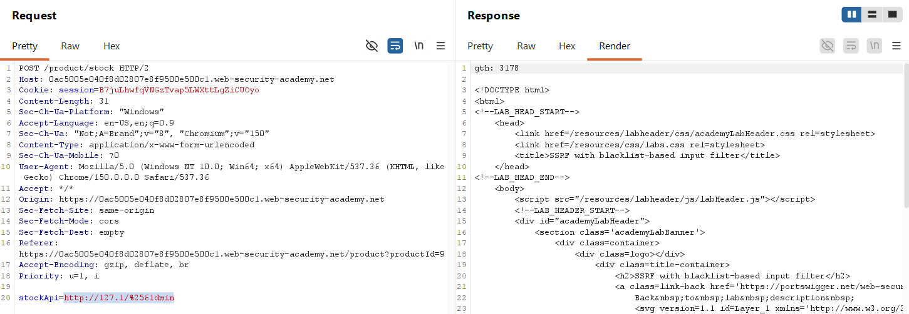

Yêu cầu vượt qua bộ lọc thành công và trả về mã nguồn HTML giao diện quản trị cục bộ, hiển thị chức năng xóa người dùng.

Để thực hiện hành động xóa người dùng carlos, thay đổi tham số stockApi thành liên kết xóa người dùng sử dụng kỹ thuật bypass tương tự:

```
stockApi=http%3A%2F%2F127.1%2F%2561dmin%2Fdelete%3Fusername%3Dcarlos
```

Gửi yêu cầu đi:

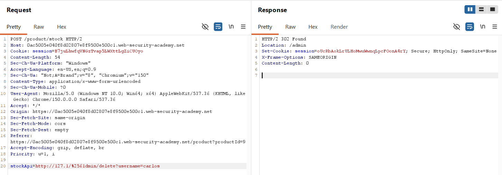

Phản hồi trả về mã trạng thái 302 Found điều hướng, cho biết yêu cầu xóa đã được thực thi.

Gửi lại yêu cầu truy cập giao diện quản trị để kiểm tra trạng thái người dùng carlos:

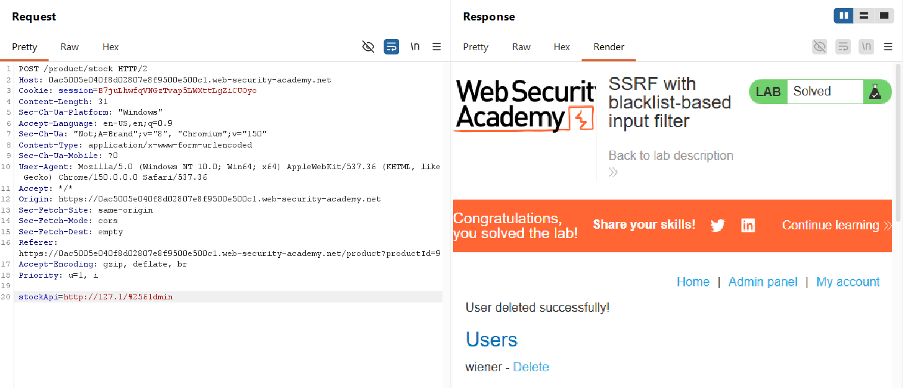

Hệ thống thông báo tài khoản carlos đã bị xóa khỏi danh sách người dùng, hoàn thành bài thực hành.

### Phân tích cơ chế hoạt động của payload

Payload hoàn chỉnh được sử dụng để khai thác:

```
stockApi=http://127.1/%2561dmin/delete?username=carlos
```

Cơ chế bypass bộ lọc diễn ra theo sơ đồ sau:

```text
[Payload: http://127.1/%2561dmin/delete...]
                 │
                 ▼
     [IP có phải localhost?] ──(Không)──> [Đường dẫn chứa admin?]
                                                │
                                             (Không, do chuỗi là %61dmin)
                                                │
                                                ▼
                               [Máy chủ Web gửi yêu cầu HTTP GET]
                                                │
                                       (Giải mã lần 2 thành admin)
                                                │
                                                ▼
                                  [Thực thi hành động xóa carlos]
```

1. Vượt qua bộ lọc IP: Bộ lọc so khớp chuỗi (String Matching) để tìm localhost hoặc 127.0.0.1. Chuỗi 127.1 không khớp với các từ khóa này nên được cho qua. Khi thư viện HTTP của máy chủ thực hiện phân giải tên miền (DNS Resolution), hệ điều hành tự động hiểu 127.1 là địa chỉ loopback 127.0.0.1.
2. Vượt qua bộ lọc đường dẫn bằng Double Encoding:
   * Chuỗi ban đầu gửi lên: `%2561dmin`
   * Khi ứng dụng nhận tham số, máy chủ tự động giải mã URL lần thứ nhất: `%25` giải mã thành `%`, chuỗi trở thành `%61dmin`.
   * Bộ lọc an ninh kiểm tra chuỗi `%61dmin` này. Do chuỗi chứa ký tự đại diện `%61` chứ không phải chữ `a`, bộ lọc không phát hiện thấy từ khóa `admin` và cho phép yêu cầu đi qua.
   * Khi ứng dụng thực hiện chức năng gửi request HTTP đi, thư viện gửi yêu cầu (như HttpClient) thực hiện giải mã URL lần thứ hai để lấy đường dẫn thực tế để gửi. Lúc này `%61` được giải mã thành ký tự `a`, tạo thành đường dẫn hợp lệ `/admin/delete?username=carlos` trên hệ thống đích.

### Tại sao cần sử dụng mã hóa URL hai lần (Double URL Encoding)?

Nếu chỉ thực hiện mã hóa URL một lần (Single URL Encoding), ký tự `a` sẽ được biến đổi thành `%61`, dẫn tới tham số truyền lên có dạng `%61dmin`.

Tuy nhiên, trong vòng đời xử lý yêu cầu HTTP của các ứng dụng web thông thường:

1. Khi máy chủ web (như Tomcat, IIS, Nginx) nhận được yêu cầu HTTP POST, máy chủ sẽ tự động giải mã URL đầu vào một lần trước khi bàn giao dữ liệu cho mã nguồn ứng dụng xử lý. Lúc này, chuỗi `%61dmin` lập tức bị giải mã ngược lại thành `admin`.
2. Khi mã nguồn ứng dụng chạy bộ lọc an ninh để kiểm tra giá trị tham số, bộ lọc sẽ nhìn thấy trực tiếp chuỗi `admin`. Do chuỗi này trùng khớp với từ khóa trong danh sách đen, yêu cầu sẽ bị chặn ngay lập tức.

Bằng cách mã hóa URL hai lần:

1. Ký tự `%` trong chuỗi mã hóa lần một (`%61`) được mã hóa tiếp lần hai thành `%25`, tạo thành chuỗi `%2561dmin`.
2. Khi máy chủ web nhận yêu cầu và tự động giải mã lần thứ nhất, chuỗi `%2561dmin` chỉ biến đổi thành `%61dmin`.
3. Bộ lọc an ninh của ứng dụng kiểm tra chuỗi `%61dmin`. Vì không chứa từ khóa `admin` ở dạng tường minh, yêu cầu được xác thực là hợp lệ và đi qua bộ lọc.
4. Sau khi vượt qua bộ lọc, ứng dụng web sử dụng thư viện HTTP nội bộ để thực hiện gửi yêu cầu tiếp theo đến backend API. Thư viện này tiến hành giải mã URL lần thứ hai để thiết lập đường dẫn gửi đi chính xác, khôi phục lại ký tự `%61` thành chữ `a`, chuyển đổi thành công đường dẫn truy cập thành `/admin`.

Kỹ thuật mã hóa URL hai lần lợi dụng sự không đồng nhất về số lần giải mã URL giữa chốt chặn kiểm tra an ninh (chỉ giải mã một lần) và thành phần thực thi yêu cầu HTTP backend (giải mã thêm một lần trước khi gửi hoặc nhận dữ liệu thực tế).
